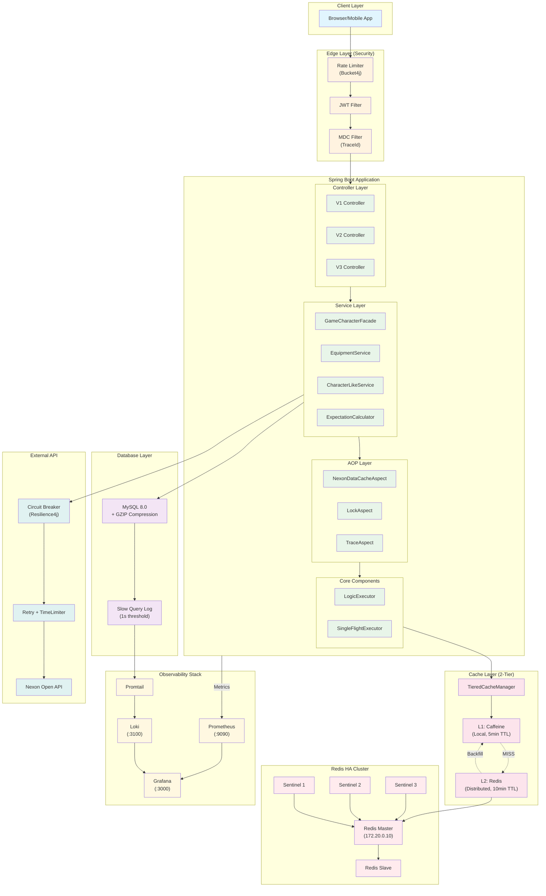

# MapleExpectation Backend Architecture

> **상위 문서:** [CLAUDE.md](../CLAUDE.md)
>
> **5-Agent Council 승인:** Blue, Green, Yellow, Purple, Red

---

## 1. System Architecture Overview



---

## 2. Data Flow Diagram


---

## 3. Cache Architecture (TieredCache)


### Cache Configuration

| Cache Name | L1 TTL | L1 Max | L2 TTL | Purpose |
|------------|--------|--------|--------|---------|
| `equipment` | 5 min | 5,000 | 10 min | Nexon API 장비 데이터 |
| `cubeTrials` | 10 min | 5,000 | 20 min | Cube 확률 계산 |
| `ocidCache` | 30 min | 5,000 | 60 min | OCID 매핑 |
| `totalExpectation` | 5 min | 10,000 | 10 min | 기대값 계산 결과 |
| `negativeCache` | 5 min | 1,000 | - | 존재하지 않는 캐릭터 |

---

## 4. Redis HA Architecture


### Redis Usage

| Feature | Redis Structure | Purpose |
|---------|-----------------|---------|
| L2 Cache | `String` | Equipment, OCID, Expectation 캐싱 |
| Like Buffer | `Sorted Set` | 좋아요 버퍼 (timestamp 정렬) |
| Distributed Lock | `RLock` | 분산 락 |
| Leader Latch | `RCountDownLatch` | SingleFlight Leader/Follower |
| Rate Limit | `RBucket` | 사용자별 요청 제한 |

---

## 5. Resilience Architecture


### Exception Hierarchy


---

## 6. GZIP Compression Flow


### Compression Stats

| Metric | Before | After | Reduction |
|--------|--------|-------|-----------|
| JSON Size | 350 KB | 35 KB | **90%** |
| DB Storage | 1 GB / 3000 chars | 100 MB / 3000 chars | **90%** |
| Network Transfer | 350 KB | 35 KB | **90%** |

---

## 7. Observability Stack


### Metrics Collected

| Category | Metrics | Source |
|----------|---------|--------|
| JVM | Memory, GC, Threads | Micrometer + Actuator |
| HTTP | Request Rate, Latency (p50/p95/p99) | Spring MVC |
| Cache | Hit Rate, Eviction | Caffeine + Redis |
| Circuit Breaker | State, Failure Rate | Resilience4j |
| DB | Connection Pool, Slow Query Count | HikariCP + MySQL |

---

## 8. Security Architecture


### Access Control Rules

| Endpoint | Access | Rate Limit |
|----------|--------|------------|
| `/api/public/**` | permitAll | IP-based |
| `/api/v2/characters/{ign}` | permitAll | IP-based |
| `/api/v2/characters/*/like` | authenticated | User-based |
| `/api/admin/**` | hasRole(ADMIN) | User-based |
| `/actuator/prometheus` | Internal IP only | None |

---

## 9. Deployment Architecture


---

## 10. Technology Stack Summary

```
┌─────────────────────────────────────────────────────────────────┐
│                     MapleExpectation Stack                       │
├─────────────────────────────────────────────────────────────────┤
│  Frontend    │  React (별도 프로젝트)                             │
├─────────────────────────────────────────────────────────────────┤
│  Backend     │  Java 17, Spring Boot 3.5.4, Spring Data JPA     │
├─────────────────────────────────────────────────────────────────┤
│  Security    │  Spring Security 6.x, JWT, Bucket4j Rate Limit   │
├─────────────────────────────────────────────────────────────────┤
│  Cache       │  Caffeine (L1), Redis/Redisson 3.27.0 (L2)       │
├─────────────────────────────────────────────────────────────────┤
│  Database    │  MySQL 8.0 + GZIP Compression                     │
├─────────────────────────────────────────────────────────────────┤
│  Redis HA    │  Master-Slave + Sentinel x3 (Quorum 2/3)         │
├─────────────────────────────────────────────────────────────────┤
│  Resilience  │  Resilience4j 2.2.0 (CB, Retry, TimeLimiter)     │
├─────────────────────────────────────────────────────────────────┤
│  Observ.     │  Prometheus, Loki, Promtail, Grafana             │
├─────────────────────────────────────────────────────────────────┤
│  External    │  Nexon Open API (장비 데이터)                      │
├─────────────────────────────────────────────────────────────────┤
│  Infra       │  AWS t3.small, Docker Compose                     │
├─────────────────────────────────────────────────────────────────┤
│  Performance │  240 RPS, 1,000+ concurrent users                 │
└─────────────────────────────────────────────────────────────────┘
```

---

## 11. 5-Agent Council 검증 결과

| Agent | Role | Verification |
|-------|------|--------------|
| 🟦 Blue | Architect | SOLID 준수, 계층 분리, Design Pattern 적용 ✅ |
| 🟩 Green | Performance | 2-Tier Cache, GZIP 90% 절감, SingleFlight ✅ |
| 🟨 Yellow | QA | 다이어그램 정확성 검증 ✅ |
| 🟪 Purple | Auditor | 보안 계층, Circuit Breaker 분류 ✅ |
| 🟥 Red | SRE | Redis HA, Observability, Resilience ✅ |

---

*Last Updated: 2026-01-18*
*Generated by 5-Agent Council*
