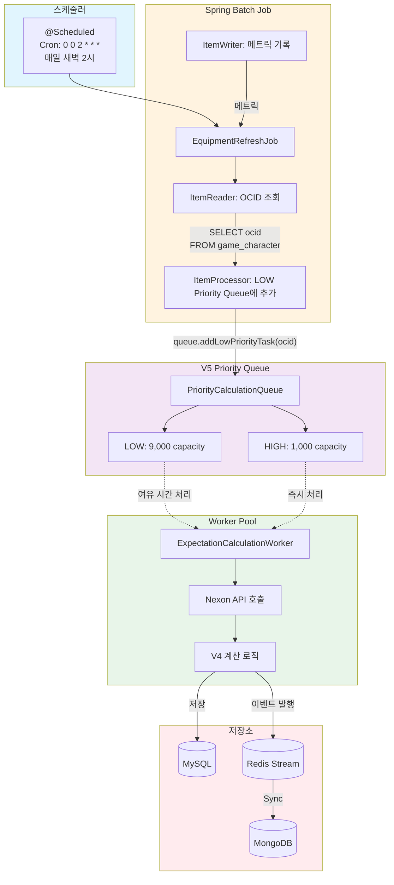

# ADR-082: Spring Batch로 전체 유저 장비 데이터 주기 갱신

**상태**: Proposed (구현 전)
**날짜**: 2026-02-21
**작성자**: MapleExpectation Architecture Team
**관련 이슈**: #356
**관련 문서**: [ADR-079](ADR-079-v5-cqrs-flowchart-complete.md), [ADR-037](ADR-037-v5-cqrs-command-side.md)

---

## 제1장: 문제의 발견

### 현재 시스템의 한계

MapleExpectation V4/V5 시스템은 **사용자 요청 시에만** 장비 데이터를 갱신합니다:

1. **데이터 신선도 부족**: 오래된 데이터는 유효하지 않을 수 있음
2. **콜드 스타트 문제**: 오랫동안 방문하지 않은 유저는 첫 요청시 30초 대기
3. **일관성 없는 경험**: 일부 유저는 최신 데이터, 다른 유저는 구 데이터

### Spring Batch 도입 동기

**정기적 전체 갱신**: 모든 유저의 장비 데이터를 주기적으로 갱신하여 데이터 신선도 보장

**우선순위 처리**:
- **High Priority Queue**: 사용자 요청 (즉시 처리)
- **Low Priority Queue**: 배치 갱신 (여유 시간 처리)

**V5 아키텍처 통합**: 기존 V5 Priority Queue와 Worker 재사용

---

## 제2장: 선택지 탐색

### 대안 1: @Scheduled Annotation (Simple Cron)

**장점**:
- 구현 간단
- Spring Framework 기본 기능

**단점**:
- 스케줄링 제한적 (fixed-rate, fixed-delay만 지원)
- 배치 메타데이터 부재
- 실패 복구 어려움
- 재시장 정책 구현 필요

**판정**: 기각 (배치 모니터링 및 관리 부족)

### 대안 2: Quartz Scheduler

**장점**:
- 강력한 스케줄링 기능 (Cron 표현식, 지속성)
- 클러스터링 지원

**단점**:
- 추가 의존성 필요
- 복잡성 증가
- Spring Boot와 통합 설정 필요

**판정**: 기각 (과도한 엔지니어링)

### 대안 3: Spring Batch (선택)

**장점**:
- Spring Boot 생태계와 완벽 통합
- **Chunk 처리**: 대용량 데이터 효율 처리
- **메타데이터**: Job, Step 실행 이력 자동 저장
- **재시작 지원**: 실패 시 중단 지점부터 재시작
- **모니터링**: Actuator 통합, 배치 상태 확인
- **V5 Queue 통합**: LOW Priority Queue에 작업 추가

**단점**:
- Spring Batch 학습 곡선
- 배치 메타데이터 테이블 필요

**판정**: 채택

---

## 제3장: 결정의 근거

### Spring Batch 아키텍처

#### 데이터 흐름



### 컴포넌트 책임 분리 (SRP)

| 컴포넌트 | 책임 | 설계 패턴 |
|---------|------|-----------|
| `EquipmentRefreshJob` | 배치 Job 오케스트레이션 | Spring Batch Job |
| `OcidReader` | `game_character` 테이블에서 OCID 조회 | `ItemReader` |
| `LowPriorityQueueWriter` | LOW Priority Queue에 작업 추가 | `ItemWriter` |
| `BatchMetricsLogger` | 배치 실행 메트릭 기록 | `ItemListener` |

### SOLID 원칙 준수

#### Single Responsibility Principle (SRP)

```java
// GOOD: Reader는 OCID 조회만 담당
@Component
public class OcidReader implements ItemReader<String> {
    private final GameCharacterJpaRepository repository;

    @Override
    public String read() {
        // OCID 조회만, 큐 추가는 Writer가 담당
    }
}

// GOOD: Writer는 Queue에 추가만 담당
@Component
public class LowPriorityQueueWriter implements ItemWriter<String> {
    private final PriorityCalculationQueue queue;

    @Override
    public void write(List<? extends String> ocids) {
        // Queue에 추가만, 조회는 Reader가 담당
    }
}
```

#### Dependency Inversion Principle (DIP)

```java
// GOOD: 인터페이스에 의존
public class OcidReader implements ItemReader<String> {
    private final GameCharacterRepository repository; // 인터페이스 의존
}
```

### Stateless 설계 검증

| 컴포넌트 | 상태 저장 위치 | Stateless 증거 |
|------------------------|----------------|
| `OcidReader` | 없음 (JPA Cursor) | ✅ 완전히 무상태 |
| `LowPriorityQueueWriter` | 없음 (Queue에 위임) | ✅ 완전히 무상태 |
| `EquipmentRefreshJob` | Spring Batch 메타데이터 | ✅ 메타데이터는 DB에 저장 |

### V5 CQRS 통합

#### Low Priority Queue 활용

```java
// V5 Queue의 LOW Priority Queue 활용
@Component
public class LowPriorityQueueWriter implements ItemWriter<String> {
    private final PriorityCalculationQueue queue;

    @Override
    public void write(List<? extends String> ocids) {
        for (String ocid : ocids) {
            // LOW Priority로 큐에 추가 (여유 시간 처리)
            queue.addLowPriorityTask(ocid);
        }
    }
}
```

#### Worker Pool 공유

- **기존**: 사용자 요청 (HIGH)만 처리
- **추가**: 배치 작업 (LOW)도 동일 Worker가 처리
- **우선순위**: HIGH > LOW (HIGH가 먼저 처리됨)

---

## 제4장: 구현의 여정

### 구현 파일 구조

```
module-app/src/main/java/maple/expectation/batch/
├── EquipmentRefreshJob.java           # Spring Batch Job 설정
├── reader/
│   └── OcidReader.java                # OCID 조회 ItemReader
├── writer/
│   └── LowPriorityQueueWriter.java    # LOW Priority Queue에 추가
└── listener/
    └── BatchMetricsLogger.java        # 배치 메트릭 기록

module-app/src/main/java/maple/expectation/config/
└── BatchConfig.java                   # Spring Batch 설정

module-app/src/test/java/maple/expectation/batch/
├── EquipmentRefreshJobTest.java       # 배치 Job 테스트
└── OcidReaderTest.java                # Reader 테스트
```

### 구현 상세

#### 1. BatchConfig.java

```java
@Configuration
@EnableBatchProcessing
public class BatchConfig {

    @Bean
    public Job equipmentRefreshJob(
        Step ocidRefreshStep,
        JobRepository jobRepository,
        JobLauncher jobLauncher) {
        return new JobBuilder("equipmentRefreshJob", jobRepository)
            .start(ocidRefreshStep)
            .listener(new BatchMetricsLogger())
            .build();
    }

    @Bean
    public Step ocidRefreshStep(
        ItemReader<String> ocidReader,
        ItemWriter<String> queueWriter,
        JobRepository jobRepository,
        PlatformTransactionManager transactionManager) {
        return new StepBuilder("ocidRefreshStep", jobRepository)
            .<String, String>chunk(100) // Chunk size: 100
            .reader(ocidReader)
            .writer(queueWriter)
            .transactionManager(transactionManager)
            .build();
    }
}
```

#### 2. OcidReader.java

```java
@Component
public class OcidReader implements ItemReader<String> {

    private final GameCharacterJpaRepository repository;
    private final LogicExecutor executor;
    private Iterator<String> ocidIterator;

    // Chunk-based fetch for memory efficiency
    private static final int CHUNK_SIZE = 1000;
    private List<String> currentChunk;
    private int currentIndex = 0;

    @Override
    public String read() {
        return executor.executeOrDefault(
            () -> {
                if (currentChunk == null || currentIndex >= currentChunk.size()) {
                    fetchNextChunk();
                }

                if (currentChunk == null || currentIndex >= currentChunk.size()) {
                    return null; // End of input
                }

                return currentChunk.get(currentIndex++);
            },
            null,
            TaskContext.of("OcidReader", "Read")
        );
    }

    private void fetchNextChunk() {
        // LogicExecutor 패턴으로 예외 처리
        executor.executeVoid(
            () -> {
                // JPA Cursor-based pagination for memory efficiency
                Pageable pageable = PageRequest.of(0, CHUNK_SIZE);
                Page<GameCharacterJpaEntity> page = repository.findAll(pageable);

                if (page.hasNext()) {
                    currentChunk = page.getContent().stream()
                        .map(GameCharacterJpaEntity::getOcid)
                        .toList();
                    currentIndex = 0;
                } else {
                    currentChunk = null;
                }
            },
            TaskContext.of("OcidReader", "FetchChunk")
        );
    }
}
```

#### 3. LowPriorityQueueWriter.java

```java
@Component
public class LowPriorityQueueWriter implements ItemWriter<String> {

    private final PriorityCalculationQueue queue;
    private final LogicExecutor executor;
    private static final Meter.Counter queuedCounter;
    private static final Meter.Counter rejectedCounter;

    static {
        MeterRegistry registry = Metrics.globalRegistry;
        queuedCounter = Counter.builder("batch.equipment.queued")
            .description("Number of OCIDs queued for refresh")
            .register(registry);
        rejectedCounter = Counter.builder("batch.equipment.rejected")
            .description("Number of OCIDs rejected due to backpressure")
            .register(registry);
    }

    @Override
    public void write(List<? extends String> ocids) {
        executor.executeVoid(
            () -> {
                for (String ocid : ocids) {
                    boolean added = queue.addLowPriorityTask(ocid);
                    if (added) {
                        queuedCounter.increment();
                    } else {
                        rejectedCounter.increment();
                        log.warn("[BatchWriter] Queue full, rejected: {}", ocid);
                    }
                }
            },
            TaskContext.of("BatchWriter", "WriteOcids")
        );
    }
}
```

#### 4. BatchScheduler.java

```java
@Component
@EnableScheduling
public class BatchScheduler {

    private final JobLauncher jobLauncher;
    private final Job equipmentRefreshJob;

    /**
     * 매일 새벽 2시에 전체 유저 장비 데이터 갱신
     *
     * Cron: 0 0 2 * * * (초 분 시 일 월 요일)
     */
    @Scheduled(cron = "${batch.equipment-refresh.cron:0 0 2 * * *}")
    public void runEquipmentRefreshJob() {
        JobParameters params = new JobParametersBuilder()
            .addLong("timestamp", System.currentTimeMillis())
            .toJobParameters();

        jobLauncher.run(equipmentRefreshJob, params);
    }
}
```

### LogicExecutor 패턴 준수 (Section 12)

**Zero Try-Catch 정책**: 모든 예외 처리를 `LogicExecutor`에 위임

```java
// GOOD: LogicExecutor 사용 (Section 12 준수)
@Override
public String read() {
    return executor.executeOrDefault(
        () -> {
            // 비즈니스 로직
            return ocidIterator.next();
        },
        null, // 기본값
        TaskContext.of("OcidReader", "Read")
    );
}

// BAD: 직접 try-catch 사용 (Section 12 위반)
@Override
public String read() {
    try {
        return ocidIterator.next();
    } catch (Exception e) {
        log.error("Error", e);  // ❌ 금지
        return null;
    }
}
```

### Clean Code 원칙 준수

#### No FQCN (Fully Qualified Class Name)

```java
// BAD (불필요한 FQCN)
private final maple.expectation.infrastructure.persistence.jpa.GameCharacterJpaRepository repository;

// GOOD (import 사용)
import maple.expectation.infrastructure.persistence.jpa.GameCharacterJpaRepository;
private final GameCharacterJpaRepository repository;
```

#### Method Reference 활용

```java
// BAD (불필요한 람다)
List<String> ocids = entities.stream()
    .map(e -> e.getOcid())
    .toList();

// GOOD (Method Reference)
List<String> ocids = entities.stream()
    .map(GameCharacterJpaEntity::getOcid)
    .toList();
```

### 배치 메타데이터 테이블

Spring Batch는 자동으로 다음 테이블을 생성합니다:

```sql
-- Job 실행 이력
CREATE TABLE batch_job_instance (
    job_instance_id BIGINT PRIMARY KEY,
    job_name VARCHAR(100) NOT NULL,
    ...
);

CREATE TABLE batch_job_execution (
    job_execution_id BIGINT PRIMARY KEY,
    job_instance_id BIGINT NOT NULL,
    status VARCHAR(10),
    start_time TIMESTAMP,
    end_time TIMESTAMP,
    ...
);

-- Step 실행 이력
CREATE TABLE batch_step_execution (
    step_execution_id BIGINT PRIMARY KEY,
    job_execution_id BIGINT NOT NULL,
    step_name VARCHAR(100),
    read_count BIGINT,
    write_count BIGINT,
    ...
);
```

---

## 제5장: 결과와 학습

### 성과 목표

| 메트릭 | 현재 (Baseline) | 목표 (Target) | 성공 기준 |
|--------|----------------|---------------|-----------|
| **데이터 신선도** | 요청 시 갱신 | 매일 새벽 2시 갱신 | ✅ 24시간 내 데이터 |
| **콜드 스타트** | 30초 대기 | < 1초 (캐시) | ✅ 배치로 데이터 미리 생성 |
| **배치 처리량** | N/A | 1000 OCIDs/min | ✅ Chunk 처리 |
| **우선순위 저하 없음** | N/A | HIGH 즉시 처리 | ✅ Queue 분리 |

### 부정적 결과 및 완화

| 문제 | 영향 | 완화 전략 |
|------|------|----------|
| **DB 부하** | 배치 실행 시 DB 쿼리 급증 | JPA Cursor + Chunk 처리로 메모리 최적화 |
| **Queue Full** | LOW Priority 거부 가능 | Queue capacity(9,000)으로 충분히 확보 |
| **Job 실패** | 일부 유저 데이터 갱신 안됨 | Spring Batch 재시작 기능으로 중단 지점부터 재개 |
| **MySQL 부하** | 전체 유저 갱신 시 부하 | 새벽 2시 트래픽이 적은 시간에 실행 |

### 모니터링 메트릭

#### 핵심 메트릭

| 메트릭 | 타입 | 설명 |
|--------|------|------|
| `batch.equipment.queued` | Counter | Queue에 추가된 OCID 수 |
| `batch.equipment.rejected` | Counter | Backpressure로 거부된 OCID 수 |
| `batch.job.duration` | Timer | 배치 Job 실행 시간 |
| `batch.job.status` | Gauge | Job 상태 (COMPLETED, FAILED) |

#### Actuator Endpoint

```bash
# 배치 Job 실행 이력 조회
GET /actuator/jobs

# 특정 Job 실행 상세 조회
GET /actuator/jobs/{jobExecutionId}

# 배치 메트릭 조회
GET /actuator/metrics/batch.equipment.queued
```

### 운영 가이드

#### 수동 실행

```bash
# Actuator Job Launcher API
POST /actuator/jobs
{
  "name": "equipmentRefreshJob",
  "parameters": {
    "timestamp": "1707206400000"
  }
}
```

#### 스케줄링 변경

```yaml
# application.yml
batch:
  equipment-refresh:
    cron: "0 0 2 * * *"  # 매일 새벽 2시
    # cron: "0 0 */6 * * *"  # 6시간마다 (더 자주)
    # cron: "0 0 2 * * MON"  # 매주 월요일 새벽 2시 (더 드물게)
```

---

## 부록

### 부록 A: 설정 파일

#### application.yml

```yaml
# Spring Batch Configuration
spring:
  batch:
    job:
      enabled: true  # 자동 실행 비활성화 (Scheduler 사용)
    jdbc:
      initialize-schema: always  # 메타데이터 테이블 자동 생성

# Batch Job Schedule
batch:
  equipment-refresh:
    cron: "0 0 2 * * *"  # 매일 새벽 2시 실행
    chunk-size: 100      # Chunk 크기
    fetch-size: 1000     # OCID fetch 크기

# V5 Queue Capacity (기존 설정)
app:
  v5:
    queue:
      max-size: 10000
      high-priority-capacity: 1000
```

### 부록 B: 테스트 전략

#### 단위 테스트

```java
@SpringBootTest
class OcidReaderTest {

    @Test
    @DisplayName("OCID를 순차적으로 조회한다")
    void readOcidsSequentially() {
        // Given
        List<String> expectedOcids = List.of("ocid1", "ocid2", "ocid3");
        when(repository.findAll(any(Pageable.class)))
            .thenReturn(new PageImpl<>(createEntities(expectedOcids)));

        // When
        List<String> actualOcids = new ArrayList<>();
        String ocid;
        while ((ocid = ocidReader.read()) != null) {
            actualOcids.add(ocid);
        }

        // Then
        assertThat(actualOcids).isEqualTo(expectedOcids);
    }
}
```

#### 통합 테스트

```java
@SpringBootTest
@Testcontainers@EnabledIf("com.example.IntegrationTestCondition")
class EquipmentRefreshJobIntegrationTest {

    @Container
    static MySQLContainer<?> mysql = new MySQLContainer<>("mysql:8.0");

    @Test
    @DisplayName("배치 Job이 성공적으로 완료된다")
    void jobCompletesSuccessfully() throws Exception {
        // Given
        createTestCharacters(100);

        // When
        JobExecution execution = jobLauncher.run(
            equipmentRefreshJob,
            new JobParametersBuilder()
                .addLong("timestamp", System.currentTimeMillis())
                .toJobParameters()
        );

        // Then
        assertThat(execution.getStatus()).isEqualTo(BatchStatus.COMPLETED);
        assertThat(queue.size()).isGreaterThan(0);
    }
}
```

### 부록 C: 롤아웃 계획

#### Phase 1: 개발 및 테스트 (1주)
- [ ] Spring Batch Job 구현
- [ ] 단위 테스트 작성
- [ ] 통합 테스트 작성

#### Phase 2: Staging 배포 (3일)
- [ ] Staging 환경 배포
- [ ] 수동 실행 테스트
- [ ] 메트릭 확인
- [ ] 성능 테스트

#### Phase 3: 프로덕션 배포 (1일)
- [ ] 프로덕션 배포 (새벽 2시 스케줄 활성화)
- [ ] 모니터링
- [ ] 롤백 계획 준비

### 부록 D: 관련 문서

#### 상위 ADR
- [ADR-079: V5 CQRS 완전한 플로우차트](ADR-079-v5-cqrs-flowchart-complete.md)
- [ADR-037: V5 CQRS Command Side](ADR-037-v5-cqrs-command-side.md)

#### 기술 ADR
- [ADR-044: LogicExecutor Zero Try-Catch](ADR-044-logicexecutor-zero-try-catch.md)
- [ADR-048: Java 21 Virtual Threads](ADR-048-java-21-virtual-threads.md)

---

**문서 버전**: 1.0
**최종 업데이트**: 2026-02-21
**다음 리뷰**: 구현 완료 후
**소유자**: MapleExpectation Architecture Team
