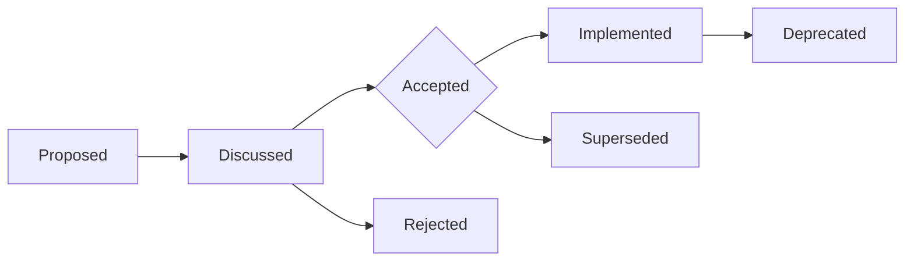

# Architecture Decision Records (ADRs)

## Overview

This directory contains Architecture Decision Records (ADRs) for the MapleExpectation project. ADRs document significant architectural decisions, their context, alternatives considered, and consequences.

**Template:** [ADR-014](ADR-014-multi-module-cross-cutting-concerns.md) serves as the template for 30-point documentation integrity.

---

## ADR Index

### Strategic Architecture (Roadmap & Vision)

| ADR | Title | Status | Date | Impact |
|-----|-------|--------|------|--------|
| [ADR-012](ADR-012-stateless-scalability-roadmap.md) | Stateless 아키텍처 전환 로드맵 | Accepted | 2026-02-05 | Scale-out 전략 |
| [ADR-013](ADR-013-high-throughput-event-pipeline.md) | 대규모 트래픽 처리를 위한 비동기 이벤트 파이프라인 | Accepted | 2026-02-05 | 240 RPS → 1000+ RPS |
| [ADR-014](ADR-014-multi-module-cross-cutting-concerns.md) | 멀티 모듈 전환 - 횡단 관심사 분리 | Proposed | 2026-02-05 | CQRS 선행 작업 |

### Performance & Optimization

| ADR | Title | Status | Date | Impact |
|-----|-------|--------|------|--------|
| [ADR-003](ADR-003-tiered-cache-singleflight.md) | Tiered Cache + SingleFlight 패턴 도입 | Accepted | 2026-02-05 | 캐시 스탬프드 해결 |
| [ADR-004](ADR-004-logicexecutor-policy-pipeline.md) | LogicExecutor & Policy 파이프라인 | Accepted | 2026-02-05 | 예외 처리 표준화 |
| [ADR-011](ADR-011-controller-v4-optimization.md) | V4 컨트롤러 최적화 | Accepted | 2026-02-05 | RPS 965 달성 |

### Resilience & Reliability

| ADR | Title | Status | Date | Impact |
|-----|-------|--------|------|--------|
| [ADR-005](ADR-005-resilience4j-scenario-abc.md) | Resilience4j 시나리오 A/B/C 전략 | Accepted | 2026-02-05 | 장애 격리 |
| [ADR-006](ADR-006-redis-lock-lease-timeout-ha.md) | Redis Lock Lease & Timeout HA | Accepted | 2026-02-05 | 분산락 안정성 |
| [ADR-008](ADR-008-durability-graceful-shutdown.md) | Durability & Graceful Shutdown | Accepted | 2026-02-05 | 안전 종료 4단계 |
| [ADR-010](ADR-010-outbox-pattern.md) | Outbox Pattern (트리플 안전망) | Accepted | 2026-02-05 | 중복 전송 방지 |

### Domain & Logic

| ADR | Title | Status | Date | Impact |
|-----|-------|--------|------|--------|
| [ADR-009](ADR-009-cube-dp-calculator-probability.md) | 큐브 DP 계산기 확률 캡슐화 | Accepted | 2026-02-05 | Kahan Summation 적용 |
| [ADR-015](ADR-015-like-endpoint-p1-acceptance.md) | Like 엔드포인트 P1 수용 기준 | Accepted | 2026-02-05 | P0 우회로 해결 |
| [ADR-016](ADR-016-nexon-api-outbox-pattern.md) | Nexon API Outbox Pattern | Accepted | 2026-02-05 | API 장애 복구 |

### Infrastructure & Integration

| ADR | Title | Status | Date | Impact |
|-----|-------|--------|------|--------|
| [ADR-001](ADR-001-streaming-parser.md) | Streaming Parser 도입 | Accepted | 2026-02-05 | 메모리 효율화 |
| [ADR-007](ADR-007-aop-async-cache-integration.md) | AOP & Async Cache 통합 | Accepted | 2026-02-05 | 횡단 관심사 분리 |

### Refactoring (Clean Architecture)

| ADR | Title | Status | Date | Impact |
|-----|-------|--------|------|--------|
| [ADR-017](ADR-017-domain-extraction-clean-architecture.md) | Domain Extraction - Clean Architecture Migration | Proposed | 2026-02-07 | SOLID 위반 79% 해결 |

### Chaos Engineering

| ADR | Title | Status | Date | Impact |
|-----|-------|--------|------|--------|
| [ADR-310](ADR-310-redis-lock-migration.md) | Redis Lock 마이그레이션 | Accepted | 2026-02-06 | Redlock → Spinlock |
| [ADR-312](ADR-312-signal-deduplication-evidence-evaluation.md) | Signal 중복 제거 증거 평가 | Accepted | 2026-02-06 | 중복 제거 로직 검증 |

---

## ADR Lifecycle



### States

- **Proposed**: Initial proposal, under review
- **Discussed**: 5-Agent Council review in progress
- **Accepted**: Decision made, implementation planned/in progress
- **Rejected**: Alternative chosen, rationale documented
- **Superseded**: Replaced by newer ADR (link to replacement)
- **Deprecated**: No longer applicable (retained for historical context)

---

## Documentation Integrity Standards

All ADRs must meet the **30-Question Self-Assessment** criteria:

| Category | Questions | Threshold |
|----------|-----------|-----------|
| Purpose & Context | 1-6 | 100% |
| Evidence & Data | 7-14 | 100% |
| Analysis & Trade-offs | 15-19 | 100% |
| Documentation Quality | 20-25 | 100% |
| Verification | 26-30 | 100% |

**Total Score**: 30/30 (Top-Tier)

Reference: [ADR-014 Section 1](ADR-014-multi-module-cross-cutting-concerns.md#documentation-integrity-checklist)

---

## 5-Agent Council Review Process

### Review Phases

1. **@Blue (Architect)**: Proposal generation, architectural alignment
2. **@Green (Performance)**: Performance impact analysis
3. **@Yellow (QA)**: Testing strategy, quality gates
4. **@Purple (Auditor)**: Audit trail, exception handling consistency
5. **@Red (SRE)**: Operational readiness, rollback strategy

### Approval Criteria

- ✅ All 5 agents provide feedback
- ✅ Trade-off analysis with 3+ alternatives
- ✅ Evidence-based decision (code, metrics, benchmarks)
- ✅ Fail-if-Wrong conditions defined
- ✅ Verification commands provided

---

## Creating New ADRs

### Template

Use [ADR-014](ADR-014-multi-module-cross-cutting-concerns.md) as the template.

### Naming Convention

```
ADR-XXX-{short-description}.md
```

- `XXX`: Sequential number (010, 011, 012, ...)
- `short-description`: kebab-case summary

### Numbering

- **001-099**: Strategic Architecture (Roadmap, Vision)
- **100-199**: Performance & Optimization
- **200-299**: Resilience & Reliability
- **300-399**: Domain & Logic
- **400-499**: Infrastructure & Integration
- **500-599**: Refactoring (Clean Architecture)
- **900-999**: Chaos Engineering

### Required Sections

1. Status (Proposed/Accepted/Rejected/Superseded/Deprecated)
2. Documentation Integrity Checklist (30 questions)
3. Fail If Wrong (Validation criteria)
4. Prerequisites (Blocking dependencies)
5. Context (Problem statement)
6. Alternatives Considered (3+ options with trade-offs)
7. Decision (Chosen alternative with rationale)
8. 5-Agent Council Feedback
9. Consequences (Positive & Negative)
10. Verification Commands (How to validate)

---

## Related Documentation

### Strategic
- [docs/00_Start_Here/ROADMAP.md](../00_Start_Here/ROADMAP.md) - Project roadmap
- [docs/00_Start_Here/architecture.md](../00_Start_Here/architecture.md) - System architecture

### Technical
- [docs/02_Technical_Guides/infrastructure.md](../02_Technical_Guides/infrastructure.md) - Infrastructure guide
- [docs/02_Technical_Guides/async-concurrency.md](../02_Technical_Guides/async-concurrency.md) - Async & concurrency
- [docs/02_Technical_Guides/testing-guide.md](../02_Technical_Guides/testing-guide.md) - Testing guide

### Refactoring
- [docs/refactor/REFACTOR_PLAN.md](../refactor/REFACTOR_PLAN.md) - Refactoring roadmap
- [docs/refactor/TARGET_STRUCTURE.md](../refactor/TARGET_STRUCTURE.md) - Target architecture
- [docs/refactor/SOLID_VIOLATIONS.md](../refactor/SOLID_VIOLATIONS.md) - SOLID violations

### Chaos Engineering
- [docs/01_Chaos_Engineering/00_Overview/TEST_STRATEGY.md](../01_Chaos_Engineering/00_Overview/TEST_STRATEGY.md) - Test strategy
- [docs/01_Chaos_Engineering/06_Nightmare/](../01_Chaos_Engineering/06_Nightmare/) - Nightmare scenarios

---

## Quick Reference

### High-Impact ADRs (Must Read)

1. **[ADR-012](ADR-012-stateless-scalability-roadmap.md)**: Stateless scale-out roadmap
2. **[ADR-013](ADR-013-high-throughput-event-pipeline.md)**: Async event pipeline (1000+ RPS)
3. **[ADR-014](ADR-014-multi-module-cross-cutting-concerns.md)**: Multi-module separation (CQRS prerequisite)
4. **[ADR-017](ADR-017-domain-extraction-clean-architecture.md)**: Clean Architecture migration

### Performance Critical

1. **[ADR-003](ADR-003-tiered-cache-singleflight.md)**: Tiered cache (stampede prevention)
2. **[ADR-011](ADR-011-controller-v4-optimization.md)**: V4 optimization (965 RPS)
3. **[ADR-009](ADR-009-cube-dp-calculator-probability.md)**: Kahan summation (precision)

### Resilience Patterns

1. **[ADR-005](ADR-005-resilience4j-scenario-abc.md)**: Circuit breaker strategy
2. **[ADR-010](ADR-010-outbox-pattern.md)**: Outbox pattern (triple safety net)
3. **[ADR-008](ADR-008-durability-graceful-shutdown.md)**: Graceful shutdown (4-phase)

---

## Maintenance

### Update Policy

- ADRs are **living documents**
- When implementation deviates from ADR, update the ADR
- Mark superseded ADRs with link to replacement
- Never delete ADRs (retain historical context)

### Review Frequency

- **Accepted ADRs**: Review quarterly for relevance
- **Proposed ADRs**: Review within 1 week of creation
- **Superseded ADRs**: Archive after 1 year

---

*Generated by 5-Agent Council*
*Last Updated: 2026-02-07*
*Total ADRs: 19 (Accepted: 15, Proposed: 4)*
