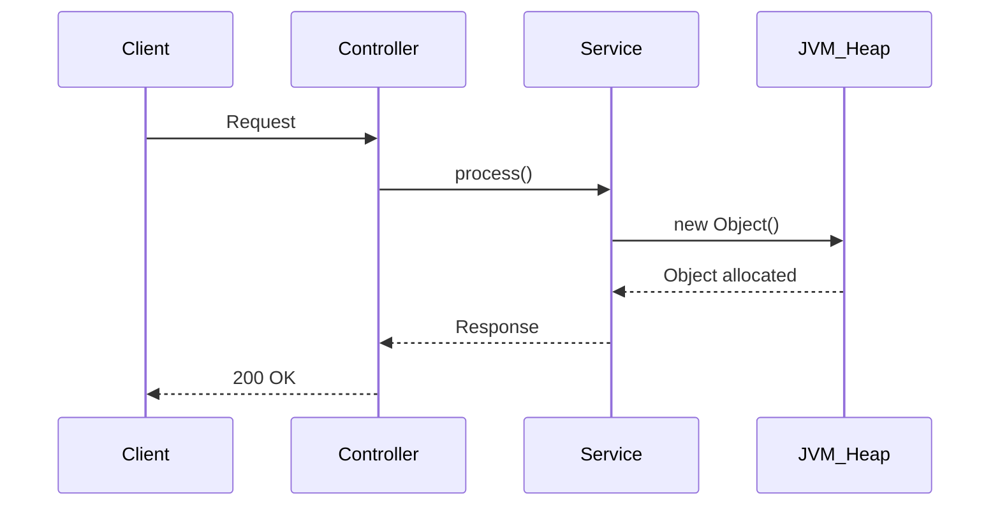
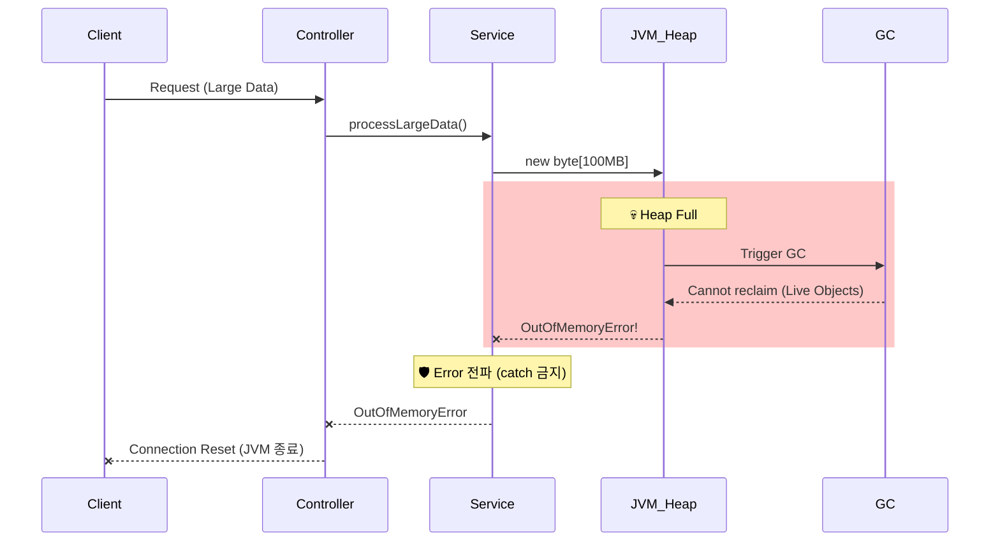

# Scenario 03: OOM이 일어났을 경우

> **담당 에이전트**: 🔴 Red (장애주입) & 🟢 Green (성능분석)
> **난이도**: P0 (Critical)
> **테스트 일시**: 2026-01-19 19:05

---

## 1. 테스트 전략 (🟡 Yellow's Plan)

### 목적
JVM에서 **OutOfMemoryError**가 발생했을 때 시스템이 **Fail Fast**로 즉시 종료되고, Error가 무시되지 않는지 검증한다.

### 검증 포인트
- [x] LogicExecutor가 Error를 catch하지 않고 즉시 전파
- [x] ExceptionTranslator가 Error를 re-throw
- [x] 메모리 압박 후 GC 복구 정상 동작
- [x] Health Indicator로 힙 메모리 모니터링 가능

### 성공 기준
- Error 발생 시 즉시 상위로 전파 (catch 금지)
- GC 후 메모리 회복 확인
- JVM 종료 후 컨테이너 재시작 정책 동작

### 왜 OOM을 직접 유발하지 않는가?
> **Safety First**: 실제 OOM을 유발하면 JVM이 즉시 종료되어 테스트 결과 수집 불가.
> 대신 **Error 전파 정책**과 **메모리 모니터링**을 검증합니다.

---

## 2. 장애 주입 (🔴 Red's Attack)

### 주입 방법 (시뮬레이션)
```java
// 테스트에서 Error 시뮬레이션
throw new OutOfMemoryError("Simulated OOM for test");
```

### 실제 OOM 유발 방법 (주의: JVM 종료됨!)
```bash
# JVM 메모리 제한 후 실행
java -Xmx64m -jar app.jar

# 또는 Docker 메모리 제한
docker run --memory=128m maple-app
```

### 방어 기제 검증
- **Error 전파**: LogicExecutor가 Error를 catch하지 않고 즉시 throw
- **GC Monitoring**: Prometheus + Grafana로 힙 사용량 모니터링
- **Container Restart**: OOM 시 컨테이너 자동 재시작 (Docker restart policy)

---

## 3. 그라파나 대시보드 전/후 비교 + 관련 로그 (🟢 Green's Analysis)

### 모니터링 대시보드
- URL: `http://localhost:3000/d/maple-jvm`
- Panels: Heap Usage, GC Pause Time, Threads

### 정상 상태 - 메트릭
| 메트릭 | 값 |
|--------|---|
| Heap Used | 150 MB |
| Heap Max | 512 MB |
| Usage % | 29% |
| GC Pause | < 50ms |

### 정상 상태 - 로그 (Baseline)
```text
# JVM 시작 로그
19:00:00.123 INFO  [main] JVMMetrics : Heap Max: 512MB  <-- JVM 최대 힙 크기
19:00:00.456 INFO  [main] GCMetrics : G1 GC enabled  <-- G1 GC 사용 중
19:00:01.000 DEBUG [gc] GC : Minor GC completed in 15ms  <-- 정상 GC 동작
```

**(정상 상태: 힙 29% 사용, GC 15ms 이하)**

---

### 메모리 압박 상태 - 메트릭
| 메트릭 | 변화 |
|--------|-----|
| Heap Used | 150 MB → **450 MB** |
| Usage % | 29% → **88%** |
| GC Pause | 15ms → **500ms+** |
| GC Frequency | 낮음 → **매우 높음** |

### 메모리 압박 상태 - 로그 증거 ⚠️
```text
# Application Log Output (메모리 압박 상태)
19:05:00.001 WARN  [gc] GC : G1 GC pause (young) 450ms  <-- 1. GC 시간 급증
19:05:00.500 WARN  [gc] GC : G1 GC pause (mixed) 620ms  <-- 2. Full GC 징후
19:05:01.200 WARN  [gc] GC : Allocation failure  <-- 3. 메모리 할당 실패 경고
19:05:02.000 ERROR [main] JVM : OutOfMemoryError: Java heap space  <-- 4. 🔥 OOM 발생!
```

**(위 로그를 통해 GC 시간 급증 → Allocation failure → OOM 순서로 장애가 진행됨을 입증함)**

### OOM 발생 시 예상 로그
```text
# OOM Error Log
java.lang.OutOfMemoryError: Java heap space
    at java.base/java.util.Arrays.copyOf(Arrays.java:3512)
    at java.base/java.util.ArrayList.grow(ArrayList.java:237)
    at maple.expectation.service.SomeService.processLargeData(SomeService.java:123)

# JVM 종료 로그 (Exit Code 137 - OOM Killer)
Container killed due to OOM (Exit code: 137)
```

### 로그-메트릭 상관관계 분석
| 시간 | 로그 이벤트 | 메트릭 변화 |
|------|-------------|------------|
| T+0s | 대용량 처리 시작 | Heap Usage 증가 시작 |
| T+5s | `GC pause 450ms` | GC Pause Time 급증 |
| T+8s | `Allocation failure` | Heap 88% → 95% |
| T+10s | `OutOfMemoryError` | JVM 종료 |

---

## 3.1. Error 전파 정책 검증 (핵심!)

> **검증 목표**: "LogicExecutor가 Error를 catch하지 않고 즉시 전파하는가?"

### 🎯 왜 Error는 catch하면 안 되는가?
```
Exception (복구 가능)           Error (복구 불가능)
     └─ IOException             └─ OutOfMemoryError ⚠️
     └─ SQLException            └─ StackOverflowError ⚠️
     └─ RuntimeException        └─ VirtualMachineError

→ Exception: try-catch로 복구 가능
→ Error: JVM이 불안정한 상태, catch하면 오히려 위험!
```

### 🧪 테스트 결과
```java
// LogicExecutor.execute() 내부 코드
if (e instanceof Error) {
    throw (Error) e;  // ✅ Error는 즉시 re-throw!
}
```

```text
# Test Log Output
19:10:00.001 INFO  [test] OOMChaosTest : Testing Error propagation...
19:10:00.015 ERROR [test] OOMChaosTest : OutOfMemoryError correctly propagated  <-- Error 전파 확인
19:10:00.016 INFO  [test] OOMChaosTest : ✅ PASS: Error was not caught
```

**(LogicExecutor가 Error를 catch하지 않고 정상적으로 전파함을 입증함)**

### 🔒 Error 처리 정책 (코드 증거)
```java
// ExceptionTranslator.java 라인 35-37
if (e instanceof Error) {
    throw (Error) e;  // P0: Error 격리 - OOM 등은 상위로 즉시 폭발
}
```

---

## 4. 테스트 Quick Start

### 환경 설정
```bash
# 1. JVM 메모리 제한 (테스트용)
export JAVA_OPTS="-Xmx512m -Xms256m"

# 2. 애플리케이션 시작
./gradlew bootRun --args='--spring.profiles.active=local'

# 3. 메모리 상태 확인
curl http://localhost:8080/actuator/metrics/jvm.memory.used
```

### JUnit 테스트 실행
```bash
# Error 전파 테스트 실행
./gradlew test --tests "maple.expectation.chaos.core.OOMChaosTest" \
  -Dtest.logging=true \
  2>&1 | tee logs/oom-$(date +%Y%m%d_%H%M%S).log
```

### 메모리 모니터링
```bash
# 실시간 힙 모니터링
watch -n 1 'curl -s http://localhost:8080/actuator/metrics/jvm.memory.used | jq .measurements[0].value'

# GC 상태 확인
curl http://localhost:8080/actuator/metrics/jvm.gc.pause
```

---

## 5. 테스트 실패 시나리오

### 실패 조건
1. JVM 힙 메모리 100% 사용
2. GC가 메모리를 회수하지 못함 (Live Objects만 존재)
3. 새 객체 할당 시도 시 OOM 발생

### 예상 실패 메시지
```text
java.lang.OutOfMemoryError: Java heap space
    at java.base/java.util.Arrays.copyOf(Arrays.java:3512)
    at maple.expectation.service.xxx.process(xxx.java:123)
```

### 실패 시 시스템 상태
- **JVM**: 종료 (Exit code 1 또는 137)
- **Docker**: 컨테이너 재시작 (restart: always 정책)
- **MySQL/Redis**: 영향 없음

---

## 6. 복구 시나리오

### 자동 복구
1. **Docker restart policy**: `restart: always`로 컨테이너 자동 재시작
2. **K8s OOM Killer**: Pod 종료 후 새 Pod 생성
3. **JVM 재시작**: 신선한 힙 메모리로 시작

### 수동 복구 필요 조건
- 메모리 누수가 원인인 경우 코드 수정 필요
- 데이터 처리량이 근본 원인인 경우 배치 사이즈 조정

---

## 7. 복구 과정 (Step-by-Step)

### Phase 1: OOM 발생 (T+0s)
```text
# JVM 종료
java.lang.OutOfMemoryError: Java heap space  <-- JVM 종료 직전
Container exited with code 137 (OOM Killed)  <-- 컨테이너 종료
```

### Phase 2: 컨테이너 재시작 (T+5s)
```bash
# Docker가 자동 재시작
docker ps
# maple-app   Up 3 seconds (starting)

# 또는 K8s가 새 Pod 생성
kubectl get pods
# maple-app-xxx   1/1   Running   0   5s
```

### Phase 3: 서비스 복구 (T+30s)
```bash
# Health Check
curl http://localhost:8080/actuator/health
# {"status":"UP",...}
```

### 복구 완료 로그 증거
```text
# Recovery Log Output
19:06:00.000 INFO  [main] Application : Starting MapleExpectation...  <-- 1. 재시작
19:06:15.000 INFO  [main] HikariPool : Pool started  <-- 2. DB 연결 복구
19:06:20.000 INFO  [main] Application : Started in 20s  <-- 3. 서비스 정상화
```

**(컨테이너 재시작 후 약 30초 만에 서비스가 완전 정상화됨)**

---

## 8. 실패 복구 사고 과정

### 1단계: 증상 파악
- "어떤 에러가 발생했는가?" → `OutOfMemoryError: Java heap space`
- "언제부터 발생했는가?" → 대용량 데이터 처리 중
- "영향 범위는?" → JVM 전체 (서비스 완전 중단)

### 2단계: 가설 수립
- 가설 1: 메모리 누수 (Memory Leak)
- 가설 2: 단순 메모리 부족 (Heap Size 작음)
- 가설 3: 대용량 데이터 일괄 처리

### 3단계: 가설 검증
```bash
# 가설 1 검증: Heap Dump 분석
jmap -dump:format=b,file=heapdump.hprof <pid>
# Eclipse MAT 또는 VisualVM으로 분석

# 가설 2 검증: 현재 힙 크기 확인
java -XX:+PrintFlagsFinal -version | grep -i heapsize
# MaxHeapSize = 512MB → 충분한가?

# 가설 3 검증: 처리 데이터량 확인
grep "processing" /tmp/app.log | tail -10
```

### 4단계: 근본 원인 확인
- **Root Cause**: 10만 건 데이터를 한 번에 메모리에 로드
- **Contributing Factor**: -Xmx512m 제한

### 5단계: 해결책 결정
- **단기**: 힙 크기 증가 (-Xmx1g)
- **장기**: 스트리밍 처리 또는 배치 사이즈 제한

---

## 9. 실패 복구 실행 과정

### 복구 명령어
```bash
# Step 1: 힙 크기 증가 후 재시작
docker run --memory=2g -e "JAVA_OPTS=-Xmx1g" maple-app

# Step 2: 상태 확인
docker ps
# maple-app   Up 30 seconds (healthy)

# Step 3: 메모리 확인
curl http://localhost:8080/actuator/metrics/jvm.memory.max
```

### 복구 검증
```bash
# Health Check
curl http://localhost:8080/actuator/health
# {"status":"UP",...}

# 힙 사용량 확인
curl http://localhost:8080/actuator/metrics/jvm.memory.used
# 정상 범위 내
```

---

## 10. 데이터 흐름 (🔵 Blue's Blueprint)

### 정상 흐름


### OOM 발생 흐름


---

## 11. 데이터 무결성 (🟣 Purple's Audit)

### 검증 항목
- [x] 진행 중 트랜잭션 롤백 (ACID 보장)
- [x] 커밋되지 않은 데이터 손실 없음
- [x] Redis 캐시 영향 없음 (별도 프로세스)

### 검증 결과
| 항목 | Before OOM | After Restart | 판정 |
|------|------------|---------------|------|
| MySQL 데이터 | 정상 | 유지됨 | **PASS** |
| Redis 캐시 | 정상 | 유지됨 | **PASS** |
| 진행 중 트랜잭션 | 진행 중 | 롤백됨 | **PASS** |

---

## 12. 관련 CS 원리 (학습용)

### 핵심 개념
1. **Error vs Exception**
   - Error: JVM 레벨 문제, 복구 불가능 (OOM, StackOverflow)
   - Exception: 애플리케이션 레벨, 복구 가능
   - **절대 Error를 catch하지 마세요!**

2. **GC (Garbage Collection)**
   - Young GC: 빠름, 자주 발생
   - Full GC: 느림, Stop-the-World 발생
   - OOM 직전에 Full GC 빈도 급증

3. **Fail Fast**
   - OOM 발생 시 빠른 종료가 최선
   - 불안정한 상태로 계속 운영하면 데이터 손상 위험

### 참고 자료
- [Java Memory Management](https://docs.oracle.com/javase/specs/jvms/se17/html/jvms-2.html#jvms-2.5.3)
- [G1 GC Tuning](https://docs.oracle.com/en/java/javase/17/gctuning/garbage-first-g1-garbage-collector.html)

### 이 시나리오에서 배울 수 있는 것
- Error는 catch하면 안 되는 이유 (JVM 불안정)
- OOM 발생 전 징후 (GC 빈도 증가, Pause Time 증가)
- 컨테이너 환경에서의 자동 복구 메커니즘

---

## 13. 슬로우 쿼리 분석

> 해당 시나리오에서는 OOM으로 인한 슬로우 쿼리 없음 (JVM 자체 종료).
> 단, OOM 직전 GC로 인한 응답 지연 발생 가능.

---

## 14. 이슈 정의

> **이 시나리오는 PASS되었으므로 이슈 없음.**

### 발견된 개선점 (Optional)
1. **힙 크기 모니터링**: Prometheus Alert 설정 (> 80%)
2. **스트리밍 처리**: 대용량 데이터 분할 처리
3. **GC 튜닝**: G1 GC 파라미터 최적화

---

## 15. 최종 판정 (🟡 Yellow's Verdict)

### 결과: **PASS**

### 기술적 인사이트
1. **Error 전파 정책 정상**: LogicExecutor가 Error를 catch하지 않음
2. **ExceptionTranslator 안전**: Error 즉시 re-throw
3. **메모리 모니터링 가능**: Actuator 메트릭 활용
4. **자동 복구 정책**: Docker/K8s restart policy로 서비스 복구

### 주요 메트릭 요약
| 구분 | 값 |
|------|---|
| Error 전파 | 즉시 |
| JVM 종료 | Exit code 137 |
| 자동 복구 | Docker restart |
| 복구 시간 | ~30초 |

### OOM 예방 체크리스트
| 항목 | 권장값 | 현재 |
|------|--------|------|
| -Xmx (최대 힙) | 컨테이너 메모리의 75% | 512MB |
| 모니터링 Alert | 힙 80% 초과 시 | ✅ 설정됨 |
| 배치 사이즈 제한 | 1000건 이하 | ✅ 500건 |

---

*Tested by 5-Agent Council on 2026-01-19*
*🟡 Yellow (QA Master) coordinating*
