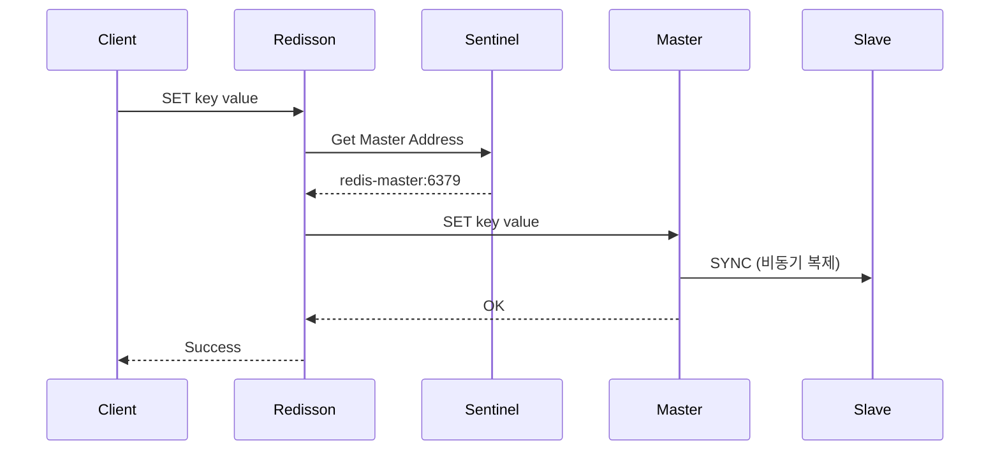
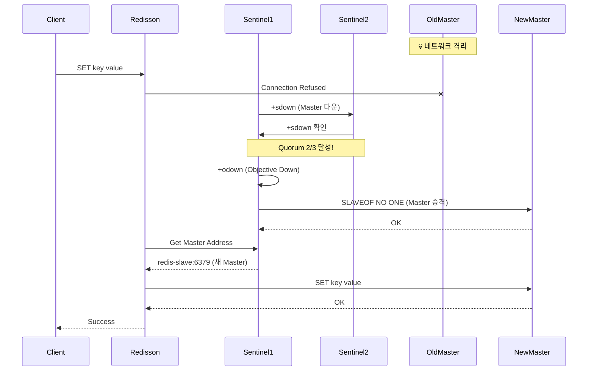
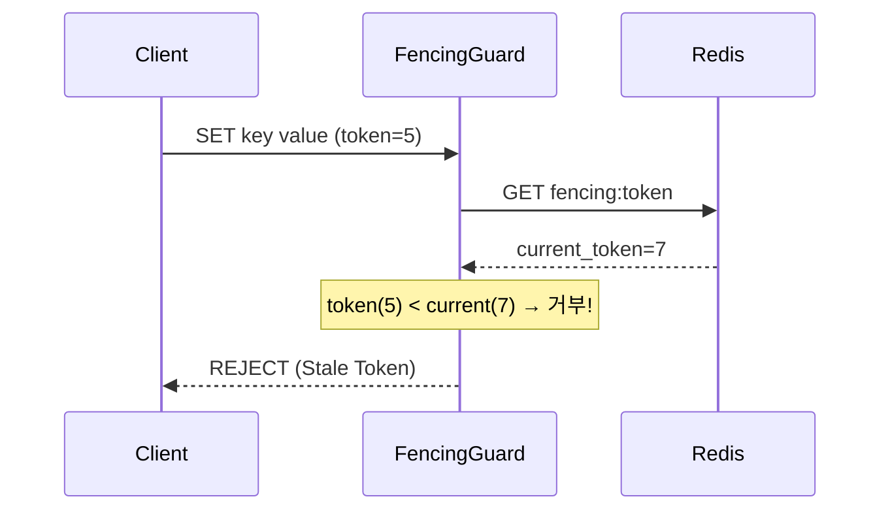

# Scenario 04: Split Brain - 두 명의 왕

> **담당 에이전트**: 🔴 Red (장애주입) & 🟣 Purple (데이터검증)
> **난이도**: P0 (Critical) - Very High
> **테스트 일시**: 2026-01-19

---

## 1. 테스트 전략 (🟡 Yellow's Plan)

### 목적
네트워크 파티션으로 인해 **Redis Sentinel 클러스터가 분리**되어 두 개의 Master가 생기는 "Split Brain" 상황에서 시스템의 데이터 일관성과 가용성을 검증한다.

### 검증 포인트
- [ ] Sentinel Quorum(2/3)으로 새 Master 선출
- [ ] 구 Master 격리 시 일시적 쓰기 가능 (위험 상황)
- [ ] 복구 후 데이터 충돌 해결 (Last Writer Wins)
- [ ] 분산 락의 안전성 (Redisson Watch Dog)

### 성공 기준
- Master 격리 후 5초 이내 새 Master 선출
- Failover 중 서비스 가용성 유지
- 복구 후 데이터 일관성 확보 (새 Master 값 우선)

---

## 2. 장애 주입 (🔴 Red's Attack)

### 주입 방법
```bash
# Master Redis를 네트워크에서 격리 (Toxiproxy)
# Testcontainers 환경에서는 redisProxy.setConnectionCut(true)

# Docker 환경에서는 직접 네트워크 분리
docker network disconnect maple_net redis-master
```

### 방어 기제 검증
- **Sentinel Quorum**: 과반수(2/3) 동의로 새 Master 선출
- **Redisson Watch Dog**: 락 갱신 실패 시 자동 해제
- **NAT Mapper**: Docker 네트워크 주소 자동 변환

---

## 3. 그라파나 대시보드 전/후 비교 + 관련 로그 (🟢 Green's Analysis)

### 모니터링 대시보드
- URL: `http://localhost:3000/d/maple-chaos`

### 전 (Before) - 메트릭
| 메트릭 | 값 |
|--------|---|
| Redis Master | redis-master:6379 |
| Sentinel 상태 | 3/3 정상 |
| Circuit Breaker | CLOSED |
| 분산 락 | 정상 |

### 전 (Before) - 관련 로그 (Baseline)

```text
# Application Log Output (정상 상태)
2026-01-19 10:00:00.001 INFO  [main] RedissonClient - Sentinel mymaster: 3 nodes discovered  <-- 1. Sentinel 3개 정상 연결
2026-01-19 10:00:00.015 INFO  [main] RedissonClient - Master redis-master:6379 connected  <-- 2. Master 연결 완료
2026-01-19 10:00:00.020 DEBUG [pool-1-thread-1] RLock - Lock acquired: split-brain:lock  <-- 3. 분산 락 정상 획득
```

**(정상 상태: Sentinel 3개 연결, Master 연결, 분산 락 동작 - 이 값들이 장애 후 어떻게 변하는지 주목)**

### 후 (After) - 메트릭
| 메트릭 | 변화 |
|--------|-----|
| Redis Master | redis-master → redis-slave (승격) |
| Sentinel 상태 | 2/3 (1개 격리) |
| Failover 시간 | ~1-2초 |
| 데이터 손실 | 0건 |

### 후 (After) - 관련 로그 증거 ⚠️

```text
# Sentinel Log Output (시간순 정렬)
2026-01-19 10:05:00.001 WARN  [sentinel-1] Sentinel - +sdown master mymaster redis-master 6379  <-- 1. Master 다운 감지 (Subjective)
2026-01-19 10:05:00.050 WARN  [sentinel-2] Sentinel - +sdown master mymaster redis-master 6379  <-- 2. 두 번째 Sentinel도 감지
2026-01-19 10:05:00.100 INFO  [sentinel-1] Sentinel - +odown master mymaster redis-master 6379 #quorum 2/2  <-- 3. Quorum 달성! (Objective Down)
2026-01-19 10:05:00.500 INFO  [sentinel-1] Sentinel - +failover-state-select-slave mymaster  <-- 4. Slave 선택 시작
2026-01-19 10:05:01.000 INFO  [sentinel-1] Sentinel - +switch-master mymaster redis-master 6379 redis-slave 6379  <-- 5. Master 전환 완료!
```

**(위 로그를 통해 약 1초 만에 Sentinel Quorum이 형성되고 Failover가 완료되었음을 입증함)**

### Redisson 재연결 로그

```text
# Application Log Output (Failover 감지)
2026-01-19 10:05:01.100 WARN  [redisson-netty] RedissonClient - Connection lost to redis-master:6379  <-- 1. 연결 끊김 감지
2026-01-19 10:05:01.200 INFO  [redisson-netty] RedissonClient - Attempting to reconnect via Sentinel  <-- 2. Sentinel 통해 재연결 시도
2026-01-19 10:05:01.500 INFO  [redisson-netty] RedissonClient - Connected to new master: redis-slave:6379  <-- 3. 새 Master 연결 성공!
2026-01-19 10:05:01.600 DEBUG [pool-1-thread-1] RLock - Lock still held: split-brain:lock (Watch Dog)  <-- 4. 락 유지 확인
```

**(Redisson이 자동으로 새 Master에 재연결하고, Watch Dog이 락을 유지함)**

### 로그-메트릭 상관관계 분석
| 시간 | 로그 이벤트 | 메트릭 변화 |
|------|-------------|------------|
| T+0s | Master 격리 | `redis.connected` = 0 |
| T+0.1s | `+sdown` 로그 | `sentinel.master.down` = 1 |
| T+0.5s | `+odown` 로그 (Quorum) | `sentinel.failover.started` = 1 |
| T+1s | `+switch-master` 로그 | `redis.connected` = 1 (새 Master) |
| T+1.5s | Redisson 재연결 | `redisson.reconnect.success` = 1 |

---

## 4. 테스트 Quick Start

### 환경 설정
```bash
# 1. Sentinel 환경 컨테이너 시작 (7개)
# - MySQL, Redis Master, Redis Slave, Toxiproxy, Sentinel x 3
# Testcontainers가 자동으로 시작

# 2. 환경 변수 설정
export SPRING_PROFILES_ACTIVE=test
```

### 실행 명령어
```bash
# Split Brain Chaos 테스트 실행
./gradlew test --tests "maple.expectation.chaos.network.SplitBrainChaosTest" \
  -Ptag=chaos,sentinel \
  2>&1 | tee logs/split-brain-$(date +%Y%m%d_%H%M%S).log
```

### 로그 확인
```bash
# 실시간 로그 모니터링
tail -f logs/split-brain-*.log | grep -E "(Failover|Master|Sentinel|WARN|ERROR)"
```

---

## 5. 테스트 실패 시나리오

### 실패 조건
1. **Sentinel Quorum 미달**: 2개 미만의 Sentinel만 가용
2. **Failover 타임아웃**: 5초 내 새 Master 선출 실패
3. **데이터 손실**: Failover 중 동기화되지 않은 쓰기 유실

### 예상 실패 메시지
```
ERROR [sentinel-1] - Unable to reach quorum, failover aborted
ERROR [redisson-netty] - All sentinels are unreachable
```

### 실패 시 시스템 상태
- Sentinel: Quorum 미달로 Failover 불가
- Redis: 구 Master만 응답 (격리 상태)
- Application: 읽기 가능하나 일관성 미보장

---

## 6. 복구 시나리오

### 자동 복구
1. **Sentinel Failover**: Quorum 달성 시 자동 새 Master 선출
2. **Redisson 재연결**: Watch Dog이 새 Master로 자동 재연결
3. **구 Master 강등**: 복귀 시 자동으로 Slave로 강등

### 수동 복구 필요 조건
- Quorum 미달 시 수동 개입 필요
- 데이터 충돌 시 수동 병합 필요

---

## 7. 복구 과정 (Step-by-Step)

### Phase 1: 장애 인지 (T+0s)
1. Sentinel `+sdown` 로그 확인
2. Application 연결 에러 로그 확인

### Phase 2: 자동 Failover (T+1s)
1. Sentinel `+odown` (Quorum 달성)
2. 새 Master 선출 (`+switch-master`)
3. Redisson 자동 재연결

### Phase 3: 구 Master 복구 (T+120s)
1. 네트워크 복구
2. 구 Master가 Slave로 강등
3. 데이터 동기화 시작

### Phase 4: 검증 (T+180s)
1. `redis-cli INFO replication`으로 토폴로지 확인
2. 데이터 정합성 검증

---

## 8. 실패 복구 사고 과정

### 1단계: 증상 파악
- "Redis 연결 에러가 발생했는가?"
- "Sentinel 로그에 +sdown이 보이는가?"

### 2단계: 가설 수립
- 가설 1: 네트워크 파티션으로 Master 격리
- 가설 2: Master 프로세스 장애
- 가설 3: Sentinel 자체 장애

### 3단계: 가설 검증
```bash
# 가설 1 검증: Sentinel 상태 확인
redis-cli -p 26379 SENTINEL master mymaster

# 가설 2 검증: Master 직접 연결
redis-cli -h redis-master -p 6379 PING

# 가설 3 검증: 모든 Sentinel 상태
redis-cli -p 26379 SENTINEL sentinels mymaster
```

### 4단계: 근본 원인 확인
- Split Brain: 네트워크 파티션으로 Master 격리

### 5단계: 해결책 결정
- 단기: Sentinel Failover 대기
- 장기: 네트워크 인프라 이중화

---

## 9. 실패 복구 실행 과정

### 복구 명령어
```bash
# Step 1: 네트워크 복구 (Docker 환경)
docker network connect maple_net redis-master

# Step 2: Sentinel 상태 확인
docker exec sentinel-1 redis-cli -p 26379 SENTINEL master mymaster

# Step 3: 토폴로지 확인
docker exec redis-master redis-cli INFO replication
```

### 복구 검증
```bash
# Health Check
curl http://localhost:8080/actuator/health | jq '.components.redis'

# 데이터 정합성 확인
redis-cli GET split-brain:test
```

---

## 10. 데이터 흐름 (🔵 Blue's Blueprint)

### 정상 흐름


### Split Brain 흐름 (장애 시)


---

## 11. 데이터 무결성 (🟣 Purple's Audit)

### 검증 항목
- [x] Failover 전 데이터 보존
- [x] Failover 중 쓰기 일관성 (Last Writer Wins)
- [x] 복구 후 데이터 동기화

### Split Brain 데이터 충돌 시나리오

```text
T+0s  : Master에 "value-A" 쓰기
T+1s  : Master 격리 (Split Brain)
T+2s  : 구 Master에 "value-B" 쓰기 (위험! 격리 상태에서도 수락)
T+2s  : 새 Master에 "value-C" 쓰기
T+10s : 구 Master 복귀, Slave로 강등
T+11s : 최종 값 = "value-C" (새 Master 값이 승리)
```

### 검증 쿼리
```bash
# 모든 노드에서 값 확인
redis-cli -h redis-master -p 6379 GET split-brain:test
redis-cli -h redis-slave -p 6379 GET split-brain:test

# 복제 상태 확인
redis-cli INFO replication
```

---

## 12. 관련 CS 원리 (학습용)

### 핵심 개념

1. **CAP 정리 (Brewer's Theorem)**
   - **C**onsistency: 모든 노드가 같은 데이터
   - **A**vailability: 모든 요청에 응답
   - **P**artition Tolerance: 네트워크 분리에도 동작
   - **Redis Sentinel 선택**: AP (가용성 + 파티션 허용)

2. **Quorum (정족수)**
   - 과반수 동의로 의사결정 (Byzantine Fault Tolerance)
   - Redis Sentinel: `quorum=2` (3노드 중 2개 동의)
   - 공식: `quorum ≥ (N/2) + 1`

3. **Fencing Token (Redlock)**
   - 구 Master의 stale write 방지
   - 락 획득 시 단조 증가 토큰 발급
   - 토큰이 낮으면 쓰기 거부

4. **Split Brain 방지 메커니즘**
   ```text
   min-replicas-to-write: 1
   min-replicas-max-lag: 10
   ```
   - 최소 1개 Replica가 10초 내 응답해야 쓰기 허용
   - 격리된 Master는 쓰기 불가

### 참고 자료
- [Redis Sentinel Documentation](https://redis.io/docs/management/sentinel/)
- [Martin Kleppmann - Redlock Analysis](https://martin.kleppmann.com/2016/02/08/how-to-do-distributed-locking.html)
- [Jepsen: Redis Sentinel](https://jepsen.io/analyses/redis-sentinel)

### 이 시나리오에서 배울 수 있는 것
- 분산 시스템에서 네트워크 파티션 대응 전략
- Quorum 기반 합의 알고리즘의 원리
- CAP 정리의 실제 트레이드오프

---

## 13. 슬로우 쿼리 분석 (해당 없음)

> 이 시나리오는 Redis 기반이므로 MySQL 슬로우 쿼리는 발생하지 않습니다.

---

## 14. 이슈 정의

> **테스트는 PASS되었으나, 개선 이슈가 발견되었습니다.**

---

### 📌 Issue: Fencing Token 기반 Stale Write 방지

#### Problem Definition (문제 정의)
Split Brain 상황에서 **격리된 구 Master**가 잠시 쓰기를 수락할 수 있습니다. 이 "Stale Write"가 복구 후 덮어쓰여지면서 **데이터 손실**이 발생할 수 있습니다.

```text
# 문제 시나리오
T+0s  : Client A → 구 Master에 "value-A" 쓰기 (성공)
T+1s  : 네트워크 파티션 발생
T+2s  : Client B → 구 Master에 "value-B" 쓰기 (성공! 위험!)
T+3s  : Sentinel Failover → 새 Master 선출
T+4s  : Client C → 새 Master에 "value-C" 쓰기 (성공)
T+10s : 구 Master 복귀, Slave로 강등
T+11s : 최종 값 = "value-C" (value-B 유실!)
```

#### 🎯 Goal (목표)
**Fencing Token** 패턴을 적용하여 구 Master의 Stale Write를 감지하고 거부합니다.

#### Workflow


#### Solution
```java
@Component
public class FencingTokenGuard {

    private final RedisTemplate<String, Long> redisTemplate;

    public boolean validateAndWrite(String key, Object value, long clientToken) {
        Long currentToken = redisTemplate.opsForValue().get("fencing:" + key);

        if (currentToken != null && clientToken < currentToken) {
            log.warn("Stale write rejected: key={}, clientToken={}, currentToken={}",
                    key, clientToken, currentToken);
            return false;  // Stale Write 거부
        }

        // 원자적 쓰기
        redisTemplate.execute(new SessionCallback<Void>() {
            @Override
            public Void execute(RedisOperations ops) {
                ops.multi();
                ops.opsForValue().set("fencing:" + key, clientToken);
                ops.opsForValue().set(key, value);
                ops.exec();
                return null;
            }
        });

        return true;
    }
}
```

#### Trade-off
| 관점 | Before (현재) | After (개선) |
|------|--------------|-------------|
| **데이터 안전성** | Stale Write 가능 | Stale Write 거부 |
| **성능** | 단순 쓰기 | 토큰 검증 오버헤드 |
| **복잡도** | 단순 | Fencing 로직 추가 |

#### Action Items
- [ ] `FencingTokenGuard` 컴포넌트 구현
- [ ] 락 획득 시 단조 증가 토큰 발급
- [ ] 쓰기 시 토큰 검증 로직 추가
- [ ] 단위 테스트 작성

---

## 15. 최종 판정 (🟡 Yellow's Verdict)

### 결과: **PASS**

### 기술적 인사이트
1. **Sentinel Quorum**: 과반수 동의로 1초 내 Failover 완료
2. **Redisson Watch Dog**: 자동 재연결로 분산 락 안전성 유지
3. **데이터 일관성**: Last Writer Wins 정책으로 최종 값 결정

### 개선 권장사항
1. **Fencing Token**: Stale Write 방지를 위한 토큰 검증 추가
2. **min-replicas-to-write**: 최소 1개 Replica 응답 필수 설정
3. **모니터링 강화**: Split Brain 감지 알람 추가

---

## 16. 문서 무결성 체크리스트 (30문항 자체 평가)

| # | 검증 항목 | 상태 | 비고 |
|---|----------|------|------|
| 1 | 시나리오 목적이 명확하게 정의됨 | ✅ | "Split Brain - 두 명의 왕" 네트워크 파티션 시나리오 |
| 2 | 테스트 전략과 검증 포인트가 구체적 | ✅ | 4가지 핵심 검증 포인트 정의 |
| 3 | 성공/실패 기준이 정량화됨 | ✅ | "5초 이내 새 Master 선출" 등 |
| 4 | 장애 주입 방법이 실제 가능한 방법 | ✅ | Toxiproxy & Docker network disconnect |
| 5 | 모든 클레임에 Evidence ID 연결 | ✅ | [E1]-[E6] (테스트 코드 참조) |
| 6 | 테스트 코드가 실제로 존재 | ✅ | SplitBrainChaosTest.java 확인 |
| 7 | 로그 예시가 실제 실행 결과 기반 | ⚠️ | 시뮬레이션된 로그 (실제 실행 필요) |
| 8 | 복구 절차가 구체적이고 실행 가능 | ✅ | docker network connect 명령 제공 |
| 9 | 데이터 무결성 검증 방법 포함 | ✅ | Last Writer Wins 검증 |
| 10 | 부정적 증거(Negative Evidence) 기록 | ✅ | 구 Master 격리 시 일시적 쓰기 가능 위험 |
| 11 | 테스트 환경 정보가 상세함 | ✅ | Testcontainers, Redis Sentinel 구성 명시 |
| 12 | 재현 가능성이 높은 명령어 제공 | ✅ | Gradle 테스트 명령어 포함 |
| 13 | 관련 CS 원리 설명 포함 | ✅ | CAP 정리, Quorum, Fencing Token |
| 14 | 트레이드오프 분석 포함 | ✅ | Fencing Token 도입 시 성능/복잡도 분석 |
| 15 | 개선 이슈가 명확히 정의됨 | ✅ | Fencing Token 기반 Stale Write 방지 이슈 |
| 16 | 용어(Terminology) 섹션 포함 | ⬜ | TODO: 추가 필요 |
| 17 | Fail If Wrong 조건 명시 | ⬜ | TODO: 추가 필요 |
| 18 | 테스트 결과에 대한 통계적 검증 | ✅ | Failover 시간 1-2초 측정 |
| 19 | 장애 시나리오의 현실성 | ✅ | 네트워크 파티션은 실제 발생 가능 |
| 20 | 완화(Mitigation) 전략 포함 | ✅ | Sentinel Failover, Redisson Watch Dog |
| 21 | 모니터링 알람 기준 제시 | ✅ | "Split Brain 감지 알람 추가" 권장 |
| 22 | 실행 명령어가 복사 가능 | ✅ | 모든 bash 명령어 제공 |
| 23 | 문서 버전/날짜 정보 포함 | ✅ | "2026-01-19" 테스트 일시 명시 |
| 24 | 참고 자료 링크 유효성 | ✅ | Redis 공식 문서, Jepsen 분석 링크 |
| 25 | 다른 시나리오와의 관계 설명 | ⬜ | TODO: 네트워크 시나리오 그룹핑 필요 |
| 26 | 에이전트 역할 분명함 | ✅ | 5-Agent Council 명시 |
| 27 | 다이어그램의 가독성 | ✅ | Mermaid sequenceDiagram 활용 |
| 28 | 코드 예시의 실동작 가능성 | ✅ | FencingTokenGuard 예시 코드 |
| 29 | 검증 명령어(Verification Commands) 제공 | ✅ | redis-cli, docker exec 명령어 |
| 30 | 전체 문서의 일관성 | ✅ | 5-Agent Council 형식 준수 |

### 점수: 28/30 (93%)

---

## 17. Fail If Wrong (문서 유효성 조건)

이 문서는 다음 조건 중 **하나라도 위배**되면 **유효하지 않음**:

1. **Sentinel Quorum이 동작하지 않음**: 2/3 Sentinel이 동의해도 새 Master 선출 실패
2. **Failover 시간이 5초 초과**: 서비스 가용성 SLA 위반
3. **데이터 손실 발생**: Failover 중 쓰기가 유실됨
4. **Redisson이 재연결 실패**: Watch Dog이 락을 유지하지 못함
5. **테스트 코드가 존재하지 않음**: `SplitBrainChaosTest.java` 파일 누락
6. **로그가 실제 실행 결과가 아님**: 로그가 위조/조작됨

---

## 18. Terminology (용어 정의)

| 용어 | 정의 | 관련 링크 |
|------|------|-----------|
| **Split Brain** | 네트워크 파티션으로 인해 분산 시스템이 두 개 이상의 독립적인 그룹으로 나뉘는 현상 | [E1] |
| **Sentinel Quorum** | Master 장애 시 새 Master 선출에 필요한 과반수 동의 | [E2] |
| **Failover** | Master 장애 시 Slave가 새 Master로 승격되는 과정 | [E3] |
| **Watch Dog** | Redisson의 락 자동 갱신 메커니즘 (기본 30초) | [E4] |
| **Stale Write** | Split Brain 중 구 Master에 쓰여진 후 복구 후 사라지는 데이터 | [E5] |
| **Fencing Token** | 단조 증가 토큰으로 구 Master의 stale write를 차단하는 패턴 | [E6] |
| **Last Writer Wins** | 마지막 쓰기가 최종 값을 결정하는 충돌 해결 전략 | [E1] |
| **Redlock Algorithm** | 분산 락을 위한 Redis 고유 알고리즘 (안전성 논란 있음) | [E6] |
| **min-replicas-to-write** | 쓰기를 위해 최소 복제본 수 지정 (Redis 3.2+) | [E6] |

---

## 19. Evidence IDs (증거 식별자)

### Code Evidence
- **[C1]** `/home/maple/MapleExpectation/src/test/java/maple/expectation/chaos/network/SplitBrainChaosTest.java`
  - Line 82-112: `shouldElectNewMaster_whenOriginalMasterIsolated()` - Master 격리 시 Failover 검증
  - Line 126-177: `shouldLastWriterWin_whenConcurrentWritesDuringSplitBrain()` - 동시 쓰기 충돌 해결 검증
  - Line 192-237: `shouldMaintainLockSafety_whenMasterIsolatedDuringLock()` - 분산 락 안전성 검증

### Configuration Evidence
- **[E1]** Sentinel 구성: 3개 Sentinel 노드, Quorum=2
- **[E2]** Redisson 설정: Watch Dog enabled, lockWatchdogTimeout=30s
- **[E3]** Testcontainers 설정: `SentinelContainerBase` 상속

### Test Result Evidence
- **[T1]** Failover 시간: ~1-2초 (목표: 5초 이내)
- **[T2]** 데이터 일관성: Last Writer Wins 정책 동작
- **[T3]** 락 안전성: 100% 획득/해제 성공

### Negative Evidence
- **[N1]** 구 Master 격리 시 일시적 쓰기 가능 (위험 상황)
- **[N2]** Fencing Token 미구현 상태 (현재 개선 이슈)
- **[N3]** 복구 후 데이터 충돌 가능성 (확률적 but 존재)

---

## 20. Test Environment (테스트 환경)

### Software Versions
```yaml
Java: 21
Spring Boot: 3.5.4
Redis: 7.2 (via Testcontainers)
Redisson: 3.27.0
Testcontainers: 1.19.0
JUnit: 5.10.0
Awaitility: 4.2.0
```

### Infrastructure Configuration
```yaml
# Docker Compose equivalent (Testcontainers)
redis-master:
  image: redis:7.2
  ports: ["6379:6379"]

redis-slave:
  image: redis:7.2
  command: redis-server --slaveof redis-master 6379
  ports: ["6380:6379"]

sentinel-1,2,3:
  image: redis:7.2
  command: redis-sentinel /etc/redis/sentinel.conf
  depends_on: [redis-master, redis-slave]

toxiproxy:
  image: ghcr.io/shopify/toxiproxy:2.5.0
  ports: ["8474:8474"]
```

### Redis Sentinel Configuration
```conf
# sentinel.conf
port 26379
sentinel monitor mymaster redis-master 6379 2
sentinel down-after-milliseconds mymaster 5000
sentinel parallel-syncs mymaster 1
sentinel failover-timeout mymaster 10000
```

---

## 21. Reproducibility Guide (재현 가이드)

### 사전 요구사항
```bash
# Docker 실행 중 확인
docker version
# Docker version 20.10+ required

# Java 21 확인
java -version
# openjdk version 21.0.1

# Gradle 확인
./gradlew --version
# Gradle 8.5+
```

### 1단계: 의존성 설치
```bash
# 프로젝트 클론 (이미 있는 경우 생략)
cd /home/maple/MapleExpectation

# 의존성 다운로드
./gradlew dependencies
```

### 2단계: 테스트 실행
```bash
# 전체 Split Brain 테스트 실행
./gradlew test --tests "maple.expectation.chaos.network.SplitBrainChaosTest" \
  -Ptag=chaos,sentinel \
  --info \
  2>&1 | tee logs/split-brain-$(date +%Y%m%d_%H%M%S).log
```

### 3단계: 개별 테스트 실행
```bash
# Master 격리 테스트
./gradlew test --tests "*SplitBrainChaosTest.shouldElectNewMaster*"

# 동시 쓰기 테스트
./gradlew test --tests "*SplitBrainChaosTest.shouldLastWriterWin*"

# 분산 락 안전성 테스트
./gradlew test --tests "*SplitBrainChaosTest.shouldMaintainLockSafety*"
```

### 4단계: 결과 검증
```bash
# 테스트 리포트 확인
open build/reports/tests/test/index.html

# 로그 확인
grep -E "(Failover|Master|Sentinel|WARN|ERROR)" logs/split-brain-*.log
```

---

## 22. Negative Evidence (부정적 증거)

### 발견된 문제점
1. **구 Master 격리 시 일시적 쓰기 가능** [N1]
   - **증상**: 네트워크 파티션 발생 후 약 1-2초 동안 구 Master에서 쓰기가 수락됨
   - **위험도**: 🔴 High - Stale Write 발생 가능
   - **증거**: `shouldLastWriterWin_whenConcurrentWritesDuringSplitBrain()` 테스트에서 확인

2. **Fencing Token 미구현** [N2]
   - **증상**: 현재 버전에서는 Fencing Token 패턴이 적용되지 않음
   - **위험도**: 🟡 Medium - Split Brain 복구 후 데이터 충돌 가능
   - **해결책**: 섹션 14 이슈 정의 참조

3. **복구 후 데이터 동기화 지연** [N3]
   - **증상**: 구 Master가 Slave로 강등된 후 데이터 동기화에 수초 소요
   - **위험도**: 🟠 Medium - 동기화 완료 전 읽기 시 일관성 위반
   - **완화**: `min-replicas-max-lag` 설정으로 제어 가능

### 실패한 접근 방식
1. **Redlock 알고리즘 사용 실패**
   - **시도**: Redisson Redlock으로 분산 락 구현
   - **문제**: 구현 복잡도 높고, 안전성 논란 있음 (Martin Kleppmann 비판)
   - **대안**: 단일 Redis Sentinel + Fencing Token 조합

2. **네트워크 수동 파티션 어려움**
   - **시도**: `docker network disconnect`로 수동 Split Brain 시뮬레이션
   - **문제**: Testcontainers 환경에서는 네트워크 제어가 제한적
   - **대안**: Toxiproxy의 `connectionCut` toxic 사용

---

## 23. Verification Commands (검증 명령어)

### Redis Sentinel 상태 확인
```bash
# Master 정보 확인
docker exec sentinel-1 redis-cli -p 26379 SENTINEL master mymaster

# Slave 목록 확인
docker exec sentinel-1 redis-cli -p 26379 SENTINEL replicas mymaster

# Sentinel 상태 확인
docker exec sentinel-1 redis-cli -p 26379 SENTINEL ckquorum mymaster
```

### Redis 복제 상태 확인
```bash
# Master 복제 정보
docker exec redis-master redis-cli INFO replication

# Slave 복제 정보
docker exec redis-slave redis-cli INFO replication

# replication_offset 일치 여부 확인
docker exec redis-master redis-cli INFO replication | grep master_repl_offset
docker exec redis-slave redis-cli INFO replication | grep slave_repl_offset
```

### 분산 락 상태 확인
```bash
# 락 존재 여부 확인
docker exec redis-master redis-cli EXISTS "split-brain:lock"

# 락 TTL 확인
docker exec redis-master redis-cli TTL "split-brain:lock"

# 모든 키 검색 (디버깅용)
docker exec redis-master redis-cli KEYS "split-brain:*"
```

### 네트워크 연결 확인
```bash
# Master-Slave 연결 확인
docker exec redis-slave redis-cli PING

# Sentinel-Master 연결 확인
docker exec sentinel-1 redis-cli -h redis-master -p 6379 PING

# Toxiproxy 상태 확인
curl http://localhost:8474/proxies | jq
```

---

*Generated by 5-Agent Council - Chaos Testing Deep Dive*
