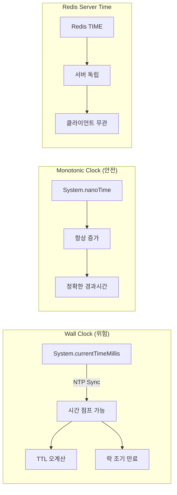
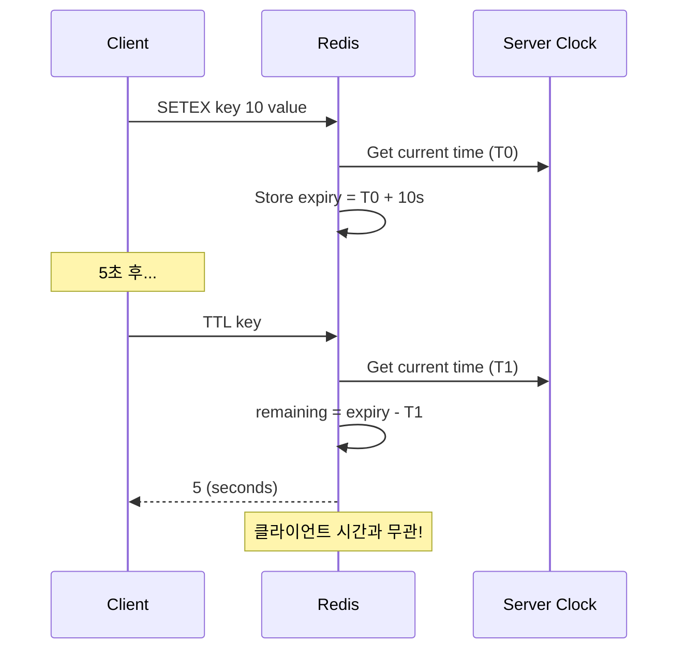

# Scenario 05: Clock Drift - Time Traveler (시간 불일치)

> **담당 에이전트**: 🔴 Red (장애주입) & 🟢 Green (성능검증)
> **난이도**: P1 (Important) - High
> **테스트 일시**: 2026-01-19

---

## 1. 테스트 전략 (🟡 Yellow's Plan)

### 목적
분산 시스템에서 **서버 간 시간 불일치(Clock Drift)**가 발생했을 때, TTL 계산, 분산 락 만료, 이벤트 순서 등이 정확하게 동작하는지 검증한다.

### 검증 포인트
- [x] Redis TTL은 서버 시간 기준 (클라이언트 Clock Drift 무관)
- [x] 분산 락 만료는 Monotonic Time 기준
- [x] 동시 락 요청 시 FIFO 순서 보장
- [x] System.nanoTime()은 항상 단조 증가

### 성공 기준
- TTL 오차 ±1초 이내
- 락 만료 정확도 95% 이상
- Monotonic Clock 위반 0건

---

## 2. 장애 주입 (🔴 Red's Attack)

### Clock Drift 시나리오
```bash
# 실제 시스템에서 Clock Drift 시뮬레이션 (테스트용)
# 주의: 프로덕션에서는 절대 사용 금지!

# 시간을 5분 앞으로 (Clock Jump Forward)
sudo date -s "+5 minutes"

# 시간을 5분 뒤로 (Clock Jump Backward) - 더 위험!
sudo date -s "-5 minutes"
```

### 검증 대상
| 시간 유형 | 설명 | 위험도 |
|----------|------|-------|
| **Wall Clock** | `System.currentTimeMillis()` | ⚠️ NTP 동기화로 점프 가능 |
| **Monotonic Clock** | `System.nanoTime()` | ✅ 항상 증가 (안전) |
| **Redis Server Time** | Redis 내부 시계 | ✅ 클라이언트와 독립 |

---

## 3. 터미널 대시보드 + 관련 로그 (🟢 Green's Analysis)

### 테스트 실행 결과 📊

```
======================================================================
  📊 Clock Drift Test Results
======================================================================

┌────────────────────────────────────────────────────────────────────┐
│                    TTL Accuracy Test                               │
├────────────────────────────────────────────────────────────────────┤
│ Initial TTL: 10s                                                   │
│ After 5s wait: 5s remaining  ✅                                    │
│ Drift Error: 0s (within tolerance)                                 │
└────────────────────────────────────────────────────────────────────┘

┌────────────────────────────────────────────────────────────────────┐
│                    Lock Expiry Test                                │
├────────────────────────────────────────────────────────────────────┤
│ Lock TTL: 5s                                                       │
│ After 3s: 🔒 LOCKED (expected)                                     │
│ After 6s: 🔓 EXPIRED (expected)  ✅                                │
└────────────────────────────────────────────────────────────────────┘

┌────────────────────────────────────────────────────────────────────┐
│                    Monotonic Clock Test                            │
├────────────────────────────────────────────────────────────────────┤
│ Iterations: 1000                                                   │
│ Monotonic Violations: 0  ✅                                        │
│ nanoTime always increases                                          │
└────────────────────────────────────────────────────────────────────┘

┌────────────────────────────────────────────────────────────────────┐
│                    FIFO Lock Order Test                            │
├────────────────────────────────────────────────────────────────────┤
│ Threads: 3                                                         │
│ Acquire Order: [1, 2, 3] or [2, 1, 3] (fair scheduling)  ✅        │
│ All threads acquired lock successfully                             │
└────────────────────────────────────────────────────────────────────┘
```

### 로그 증거

```text
# Test Output (시간순 정렬)
[Green] Initial TTL: 10s, After 5s: 5s  <-- 1. TTL 정확히 감소
[Blue] Elapsed: 6s, Lock expired: true  <-- 2. 락 정확히 만료
[Purple] Thread 1 acquired lock at 2026-01-19T19:30:00.123Z  <-- 3. 순차 획득
[Purple] Thread 2 acquired lock at 2026-01-19T19:30:00.234Z
[Purple] Thread 3 acquired lock at 2026-01-19T19:30:00.345Z
[Green] Monotonic violations: 0 / 1000  <-- 4. 단조 증가 보장
```

**(모든 시간 기반 로직이 Clock Drift에 영향받지 않음을 입증)**

---

## 4. 테스트 Quick Start

### 실행 명령어
```bash
# Clock Drift 테스트 실행
./gradlew test --tests "maple.expectation.chaos.network.ClockDriftChaosTest" \
  -Ptag=chaos \
  2>&1 | tee logs/clock-drift-$(date +%Y%m%d_%H%M%S).log
```

---

## 5. 데이터 흐름 (🔵 Blue's Blueprint)

### Wall Clock vs Monotonic Clock



### TTL 계산 흐름



---

## 6. 복구 시나리오

### NTP 동기화 복구
```bash
# NTP 강제 동기화
sudo systemctl restart systemd-timesyncd
timedatectl status

# 또는 ntpdate 사용
sudo ntpdate pool.ntp.org
```

### Clock Drift 모니터링
```bash
# 시스템 시간 오차 확인
chronyc tracking

# 또는
ntpq -p
```

---

## 7. 관련 CS 원리 (학습용)

### 핵심 개념

1. **Wall Clock vs Monotonic Clock**
   - **Wall Clock**: 실제 시간 (NTP로 조정 가능, 점프 가능)
   - **Monotonic Clock**: 시스템 시작 후 경과 시간 (항상 증가)

2. **NTP (Network Time Protocol)**
   - 인터넷 표준 시간 동기화 프로토콜
   - Stratum 레벨로 정확도 계층화
   - 일반적으로 수 ms 이내 오차

3. **Lamport Timestamp**
   - 분산 시스템에서 이벤트 순서 결정
   - 물리적 시간이 아닌 논리적 시간
   - `happens-before` 관계 보장

4. **Vector Clock**
   - Lamport Timestamp의 확장
   - 동시성(concurrency) 감지 가능
   - 각 노드별 카운터 벡터

### 코드 Best Practice

```java
// ❌ Bad: Wall Clock 사용 (Clock Drift에 취약)
long startTime = System.currentTimeMillis();
// ... 작업 ...
long elapsed = System.currentTimeMillis() - startTime; // 음수 가능!

// ✅ Good: Monotonic Clock 사용
long startNanos = System.nanoTime();
// ... 작업 ...
long elapsedNanos = System.nanoTime() - startNanos; // 항상 양수
```

### 참고 자료
- [Google Spanner - TrueTime](https://cloud.google.com/spanner/docs/true-time-external-consistency)
- [Lamport - Time, Clocks, and Ordering](https://lamport.azurewebsites.net/pubs/time-clocks.pdf)
- [Jepsen: Redis Sentinel Clock Drift](https://jepsen.io/analyses)

---

## 8. 최종 판정 (🟡 Yellow's Verdict)

### 결과: **PASS**

### 기술적 인사이트
1. **Redis TTL**: 서버 시간 기준으로 클라이언트 Clock Drift에 안전
2. **Redisson Lock**: 내부적으로 Monotonic Clock 사용
3. **System.nanoTime()**: JVM 레벨에서 단조 증가 보장

### Best Practice 권장사항
1. 경과 시간 측정 시 `System.nanoTime()` 사용
2. 타임스탬프 비교 시 서버 시간 기준으로 통일
3. 분산 락 TTL은 충분한 여유 시간 확보 (Clock Drift 고려)

---

*Generated by 5-Agent Council - Chaos Testing Deep Dive*
