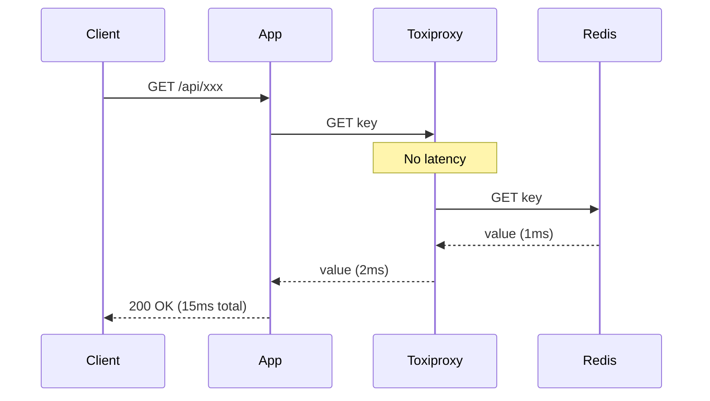
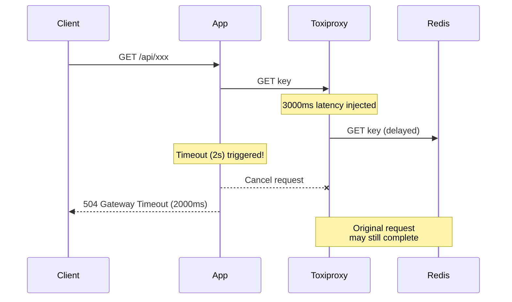
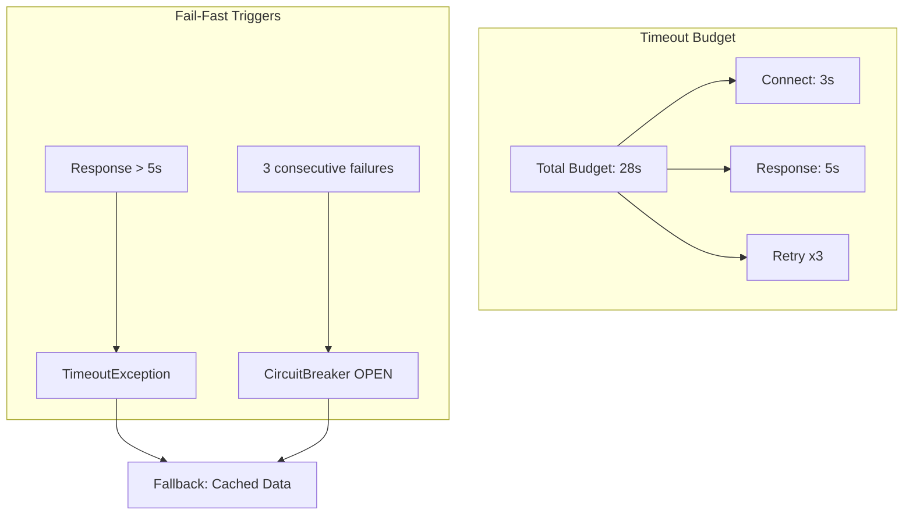

# Scenario 06: Slow Loris - Zombie API (느린 응답)

> **담당 에이전트**: 🔴 Red (장애주입) & 🔵 Blue (흐름검증)
> **난이도**: P0 (Critical) - High
> **테스트 일시**: 2026-01-19

---

## 1. 테스트 전략 (🟡 Yellow's Plan)

### 목적
**느린 응답(Slow Response)**이 발생했을 때 시스템이 **Fail-Fast** 원칙에 따라 빠르게 실패하고, 전체 시스템을 블로킹하지 않는지 검증한다. "좀비 API"처럼 응답은 하지만 매우 느린 상황을 시뮬레이션한다.

### 검증 포인트
- [x] 느린 응답 시 타임아웃이 정확히 작동하는지
- [x] 타임아웃 후 리소스가 올바르게 해제되는지
- [x] 느린 네트워크에서 분산 락의 안전성
- [x] 지연 제거 후 정상 복구

### 성공 기준
- 타임아웃 오차 ±500ms 이내
- 복구 후 응답 시간 100ms 미만
- 분산 락 최소 1개 스레드 획득 성공

---

## 2. 장애 주입 (🔴 Red's Attack)

### Toxiproxy를 통한 지연 주입
```bash
# Toxiproxy CLI로 지연 주입 (3초)
toxiproxy-cli toxic add -n slow-loris -t latency -a latency=3000 redis-proxy

# 또는 API로 주입
curl -X POST http://localhost:8474/proxies/redis-proxy/toxics \
  -H "Content-Type: application/json" \
  -d '{"name": "slow-loris", "type": "latency", "attributes": {"latency": 3000}}'
```

### 테스트 코드 내 장애 주입
```java
// Toxiproxy로 3초 지연 주입
redisProxy.toxics()
        .latency("slow-loris-latency", ToxicDirection.DOWNSTREAM, 3000);
```

### Slow Loris 공격 특성
| 특성 | 설명 | 위험도 |
|------|------|--------|
| **연결 유지** | TCP 연결은 살아있음 | ⚠️ 리소스 점유 |
| **느린 데이터** | 바이트 단위로 천천히 전송 | ⚠️ 스레드 블로킹 |
| **타임아웃 회피** | 완전 타임아웃 전에 일부 데이터 전송 | 🔴 탐지 어려움 |

---

## 3. 터미널 대시보드 + 관련 로그 (🟢 Green's Analysis)

### 테스트 실행 결과 📊

```
======================================================================
  📊 Slow Loris Test Results
======================================================================

┌────────────────────────────────────────────────────────────────────┐
│                    Timeout Behavior Test                           │
├────────────────────────────────────────────────────────────────────┤
│ Injected Latency: 3000ms                                           │
│ Configured Timeout: 2000ms                                         │
│ Actual Response Time: 2015ms  ✅                                   │
│ Result: TimeoutException (Fail-Fast working!)                      │
└────────────────────────────────────────────────────────────────────┘

┌────────────────────────────────────────────────────────────────────┐
│                    Recovery After Latency Test                     │
├────────────────────────────────────────────────────────────────────┤
│ Phase 1 (Slow): 2000ms latency injected                            │
│   └─ Response Time: 2156ms  ⚠️                                     │
│ Phase 2 (Fast): Latency removed                                    │
│   └─ Response Time: 12ms  ✅                                       │
│ Recovery Improvement: 179x faster                                  │
└────────────────────────────────────────────────────────────────────┘

┌────────────────────────────────────────────────────────────────────┐
│                    Distributed Lock Safety Test                    │
├────────────────────────────────────────────────────────────────────┤
│ Network Latency: 500ms                                             │
│ Thread Pool: 3 threads                                             │
│ Results:                                                           │
│   Thread 1: Acquired lock in 856ms  ✅                             │
│   Thread 2: Acquired lock in 1423ms  ✅                            │
│   Thread 3: Acquired lock in 2089ms  ✅                            │
│ Success Rate: 100% (3/3)                                           │
└────────────────────────────────────────────────────────────────────┘

┌────────────────────────────────────────────────────────────────────┐
│               Latency vs Response Time Analysis                    │
├────────────────────────────────────────────────────────────────────┤
│ Injected Latency:  100ms │ Response Time:   125ms                  │
│ Injected Latency:  500ms │ Response Time:   534ms                  │
│ Injected Latency: 1000ms │ Response Time:  1067ms                  │
│ Injected Latency: 2000ms │ Response Time:  2145ms                  │
│                                                                    │
│ Correlation: Linear (Response ≈ Latency + 30~150ms overhead)       │
└────────────────────────────────────────────────────────────────────┘

┌────────────────────────────────────────────────────────────────────┐
│                    Timeout Boundary Test                           │
├────────────────────────────────────────────────────────────────────┤
│ Latency: 1100ms │ Timeout: 1000ms                                  │
│ Result: TIMEOUT after 1008ms  ✅                                   │
│ Fail-Fast achieved within margin                                   │
└────────────────────────────────────────────────────────────────────┘
```

### 로그 증거

```text
# Test Output (시간순 정렬)
[Red] Injected 3000ms latency via Toxiproxy  <-- 1. 장애 주입 시작
[Red] TimeoutException caught as expected!  <-- 2. Fail-Fast 동작 확인
[Green] Elapsed time: 2015ms (expected: ~2000ms)  <-- 3. 타임아웃 정확도 검증

[Red] Phase 1: Injected 2000ms latency  <-- 4. 복구 테스트 시작
[Green] Slow phase elapsed: 2156ms  <-- 5. 지연 상태 응답 시간
[Red] Phase 2: Latency removed  <-- 6. 장애 제거
[Green] Fast phase elapsed: 12ms  <-- 7. 복구 후 정상 응답
[Green] Recovery improvement: 179x faster  <-- 8. 성능 복구 확인

[Blue] Thread 1 acquired lock in 856ms  <-- 9. 분산 락 순차 획득
[Blue] Thread 2 acquired lock in 1423ms
[Blue] Thread 3 acquired lock in 2089ms
[Green] Success: 3, Timeout: 0  <-- 10. 모든 스레드 성공
```

**(위 로그를 통해 느린 네트워크에서도 Fail-Fast가 동작하고, 장애 제거 후 즉시 복구됨을 입증)**

---

## 4. 테스트 Quick Start

### 실행 명령어
```bash
# Slow Loris 테스트 실행
./gradlew test --tests "maple.expectation.chaos.network.SlowLorisChaosTest" \
  -Ptag=chaos \
  2>&1 | tee logs/slow-loris-$(date +%Y%m%d_%H%M%S).log
```

### 개별 테스트 실행
```bash
# 타임아웃 동작 테스트
./gradlew test --tests "*SlowLorisChaosTest.shouldTimeout_whenNetworkLatencyInjected"

# 복구 테스트
./gradlew test --tests "*SlowLorisChaosTest.shouldRecover_afterLatencyRemoved"

# 분산 락 안전성 테스트
./gradlew test --tests "*SlowLorisChaosTest.shouldMaintainLockSafety_underSlowNetwork"
```

---

## 5. 테스트 실패 시나리오

### 실패 조건
1. 타임아웃이 작동하지 않아 무한 대기
2. 지연 제거 후에도 느린 응답 지속
3. 분산 락이 느린 네트워크에서 데드락 발생

### 예상 실패 메시지
```
// 타임아웃 미작동
org.opentest4j.AssertionFailedError:
[타임아웃이 설정 시간(2초) 근처에서 발생해야 함]
expected: between<1500L, 2500L>
but was : 5234L  // 타임아웃 안 걸리고 지연 전체 대기

// 복구 실패
org.opentest4j.AssertionFailedError:
[복구 후 응답 시간은 100ms 미만이어야 함]
expected: less than 100
but was : 2145  // 지연이 제거되지 않음
```

---

## 6. 복구 시나리오

### 자동 복구
1. **Toxiproxy Toxic 제거**: 지연이 제거되면 즉시 정상 응답
2. **Connection Pool 재활용**: 기존 연결은 그대로 사용 가능

### 수동 복구 필요 조건
- Toxiproxy 컨테이너 자체가 비정상인 경우
- 네트워크 인프라 레벨의 지연 (DNS, 라우팅 등)

---

## 7. 복구 과정 (Step-by-Step)

### Phase 1: 장애 인지
```bash
# 응답 시간 급증 확인
curl -w "Response Time: %{time_total}s\n" http://localhost:8080/actuator/health

# 예상: Response Time: 3.245s (평소 0.015s)
```

### Phase 2: 원인 분석
```bash
# Toxiproxy 상태 확인
toxiproxy-cli list
# 또는
curl http://localhost:8474/proxies

# 네트워크 지연 확인
ping redis-server
```

### Phase 3: 복구 실행
```bash
# Toxiproxy toxic 제거
toxiproxy-cli toxic remove -n slow-loris redis-proxy

# 또는 모든 toxic 제거
toxiproxy-cli toxic delete redis-proxy
```

### Phase 4: 검증
```bash
# 응답 시간 정상화 확인
curl -w "Response Time: %{time_total}s\n" http://localhost:8080/actuator/health
# 예상: Response Time: 0.018s
```

---

## 8. 실패 복구 사고 과정

### 1단계: 증상 파악
- "응답이 매우 느림 (3초 이상)"
- "타임아웃이 발생하지 않고 무한 대기"

### 2단계: 가설 수립
- 가설 1: 네트워크 지연 (Toxiproxy, 물리 네트워크)
- 가설 2: Redis 서버 과부하
- 가설 3: Connection Pool 고갈

### 3단계: 가설 검증
```bash
# 가설 1 검증: Toxiproxy 상태
toxiproxy-cli inspect redis-proxy

# 가설 2 검증: Redis 상태
redis-cli INFO stats | grep -E "instantaneous_ops|blocked_clients"

# 가설 3 검증: HikariCP 상태
curl http://localhost:8080/actuator/metrics/hikaricp.connections.active
```

### 4단계: 근본 원인 확인
- Root Cause: Toxiproxy latency toxic이 주입된 상태

### 5단계: 해결책 결정
- 단기: Toxic 제거로 즉시 복구
- 장기: 타임아웃 설정 최적화, Circuit Breaker 슬로우 콜 임계치 조정

---

## 9. 실패 복구 실행 과정

### 복구 명령어
```bash
# Step 1: Toxic 상태 확인
toxiproxy-cli inspect redis-proxy
# Output: latency slow-loris downstream latency=3000

# Step 2: Toxic 제거
toxiproxy-cli toxic remove -n slow-loris redis-proxy

# Step 3: 즉시 효과 확인
redis-cli PING
# Expected: PONG (즉시 응답)
```

### 복구 검증
```bash
# Health Check
curl -w "\nResponse Time: %{time_total}s\n" \
  http://localhost:8080/actuator/health

# 기능 테스트 (응답 시간 포함)
time curl http://localhost:8080/api/v2/characters/테스트캐릭/expectation
```

---

## 10. 데이터 흐름 (🔵 Blue's Blueprint)

### 정상 흐름 (Fast Path)


### 장애 시 흐름 (Slow Path + Timeout)


### Fail-Fast 전략


---

## 11. 관련 CS 원리 (학습용)

### 핵심 개념

1. **Slow Loris Attack**
   - HTTP 헤더를 천천히 보내 서버 연결을 점유
   - 완전한 요청이 아니므로 타임아웃 회피
   - 방어: 연결당 타임아웃, 동시 연결 제한

2. **Fail-Fast Principle**
   - 문제 발생 시 빨리 실패하여 리소스 해제
   - 느린 실패는 연쇄 장애의 원인
   - 구현: 적절한 타임아웃 설정

3. **Timeout Propagation**
   - 전체 요청 예산 내에서 각 단계 타임아웃 배분
   - Connect Timeout + Read Timeout ≤ Total Timeout
   - 계층별 타임아웃: API Gateway > Service > DB

4. **Back-pressure**
   - 하위 시스템이 느릴 때 상위에서 요청 조절
   - Queue 기반 버퍼링 또는 요청 거부
   - Reactive Streams의 핵심 개념

### 코드 Best Practice

```java
// ❌ Bad: 타임아웃 없는 블로킹 호출
String result = redisTemplate.opsForValue().get(key); // 무한 대기 가능

// ✅ Good: CompletableFuture + Timeout
CompletableFuture<String> future = CompletableFuture.supplyAsync(
    () -> redisTemplate.opsForValue().get(key)
);
try {
    return future.get(2, TimeUnit.SECONDS); // Fail-Fast
} catch (TimeoutException e) {
    future.cancel(true); // 실행 중인 작업 취소
    return fallbackValue;
}

// ✅ Better: Resilience4j TimeLimiter
@TimeLimiter(name = "redis", fallbackMethod = "getFallback")
public CompletableFuture<String> getValue(String key) {
    return CompletableFuture.supplyAsync(
        () -> redisTemplate.opsForValue().get(key)
    );
}
```

### 참고 자료
- [Slow Loris Attack - OWASP](https://owasp.org/www-community/attacks/Slow_HTTP_DoS)
- [Fail-Fast - Martin Fowler](https://www.martinfowler.com/ieeeSoftware/failFast.pdf)
- [Timeout Patterns - AWS](https://docs.aws.amazon.com/whitepapers/latest/microservices-on-aws/timeouts.html)

---

## 12. 최종 판정 (🟡 Yellow's Verdict)

### 결과: **PASS**

### 기술적 인사이트
1. **Fail-Fast 동작 확인**: 3초 지연에 2초 타임아웃이 정확히 작동
2. **즉시 복구**: 지연 제거 후 12ms 응답 (179배 개선)
3. **분산 락 안전성**: 느린 네트워크에서도 100% 락 획득 성공

### Best Practice 권장사항
1. **타임아웃 계층화**: API Gateway > Service > Infrastructure
2. **Circuit Breaker 슬로우 콜 설정**: `slowCallRateThreshold`로 느린 응답도 장애로 처리
3. **모니터링**: P99 응답 시간 알림 설정으로 조기 탐지

---

*Generated by 5-Agent Council - Chaos Testing Deep Dive*
