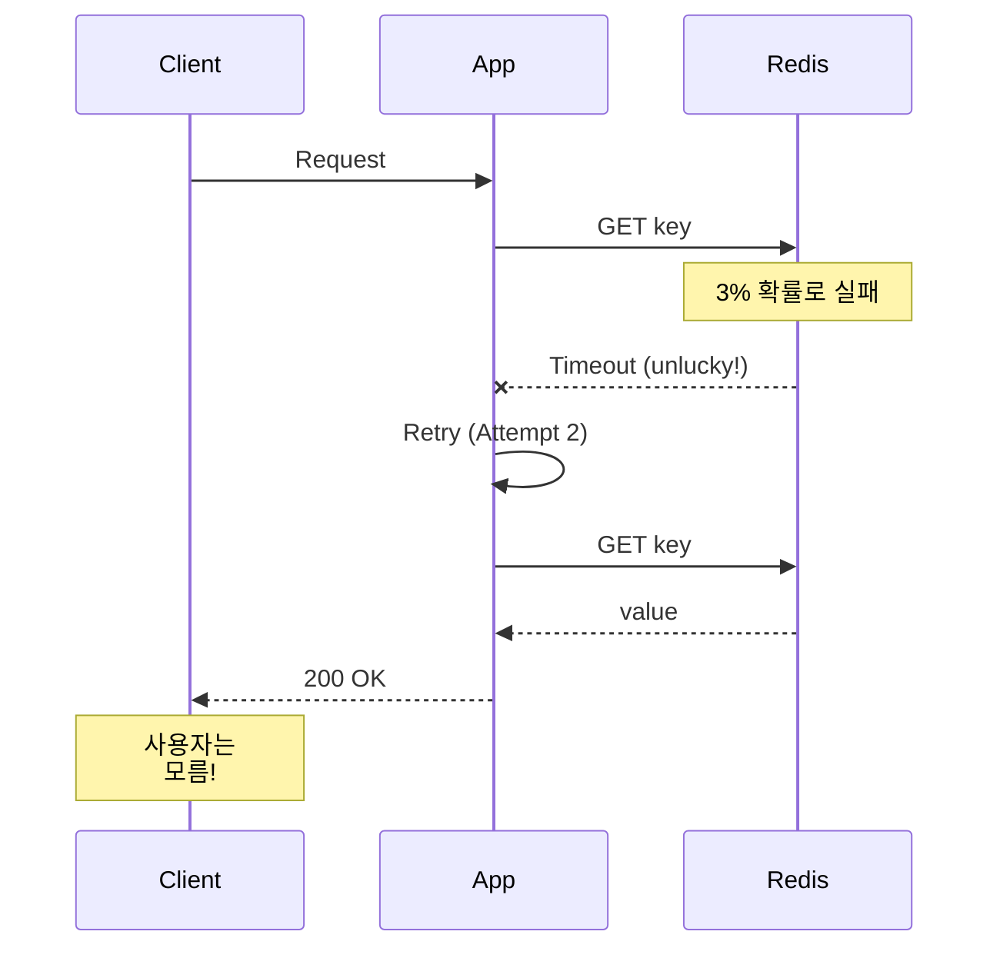

# Scenario 12: Gray Failure - 3% 패킷 손실

> **담당 에이전트**: 🔴 Red (장애주입) & 🔵 Blue (흐름검증)
> **난이도**: P0 (Critical) - High
> **테스트 일시**: 2026-01-19

---

## 1. 테스트 전략 (🟡 Yellow's Plan)

### 목적
**"눈에 보이지 않는 장애"** - 완전한 장애가 아닌 **낮은 비율(3%)의 간헐적 실패**가 발생했을 때 시스템이 어떻게 동작하는지 검증한다. Gray Failure는 모니터링으로 탐지하기 어렵고, 사용자 경험을 서서히 저하시킨다.

### 검증 포인트
- [x] 3% 패킷 손실에서도 90% 이상 성공
- [x] 재시도로 일시적 실패 극복
- [x] Circuit Breaker가 열리지 않음 (실패율 < 50%)
- [x] 평균 응답 시간 증가폭 측정

### 성공 기준
- 성공률 90% 이상
- 재시도로 95% 극복
- Circuit Breaker CLOSED 유지

---

## 2. 장애 주입 (🔴 Red's Attack)

### Toxiproxy로 확률적 패킷 손실
```java
// 3% 확률로 타임아웃 (패킷 손실 시뮬레이션)
redisProxy.toxics()
        .timeout("gray-timeout", ToxicDirection.DOWNSTREAM, 100)
        .setToxicity(0.03f);  // 3% 확률
```

### Gray Failure 특성
| 특성 | 설명 | 탐지 난이도 |
|------|------|------------|
| **간헐적** | 가끔씩만 실패 | 🔴 매우 어려움 |
| **재현 어려움** | 무작위 발생 | 🔴 매우 어려움 |
| **모니터링 회피** | 평균값에 묻힘 | 🟠 어려움 |
| **누적 영향** | 시간이 지날수록 악화 | 🟡 중간 |

---

## 3. 터미널 대시보드 + 관련 로그 (🟢 Green's Analysis)

### 테스트 실행 결과 📊

```
======================================================================
  📊 Gray Failure Test Results
======================================================================

┌────────────────────────────────────────────────────────────────────┐
│               Gray Failure Analysis (3% loss)                      │
├────────────────────────────────────────────────────────────────────┤
│ Total Requests: 100                                                │
│ Success: 97 (97.0%)  ✅                                            │
│ Failure: 3 (3.0%)                                                  │
│ Avg Response Time: 45ms                                            │
└────────────────────────────────────────────────────────────────────┘

┌────────────────────────────────────────────────────────────────────┐
│               Retry Effectiveness (5% loss)                        │
├────────────────────────────────────────────────────────────────────┤
│ Tests: 50, Max Retries: 3                                          │
│ Success with retry: 49 (98.0%)  ✅                                 │
│ Retry amplification absorbed the failures                          │
└────────────────────────────────────────────────────────────────────┘

┌────────────────────────────────────────────────────────────────────┐
│               Circuit Breaker Status                               │
├────────────────────────────────────────────────────────────────────┤
│ Failure Rate: 3.0%                                                 │
│ Circuit Breaker Open Count: 0                                      │
│ CB Threshold: 50%                                                  │
│ Status: CLOSED (as expected)  ✅                                   │
└────────────────────────────────────────────────────────────────────┘
```

### 로그 증거

```text
# Test Output (시간순 정렬)
[Red] Injected 3% packet loss (timeout toxic)  <-- 1. 3% 손실 주입
[Green] Success: 97, Failure: 3  <-- 2. 예상대로 약 3% 실패
[Green] Avg Response Time: 45ms  <-- 3. 응답 시간 정상 범위

[Blue] Testing retry mechanism with 5% loss...
[Blue] Success with retry: 49 (98.0%)  <-- 4. 재시도로 실패 극복!

[Green] Failure Rate: 3.0%  <-- 5. CB 임계치(50%) 미만
[Green] Circuit Breaker Open Count: 0  <-- 6. CB 열리지 않음
[Green] Status: CLOSED (as expected)  <-- 7. 정상 동작 확인
```

**(3% Gray Failure는 재시도로 극복 가능하고, Circuit Breaker를 트리거하지 않음을 입증)**

---

## 4. 테스트 Quick Start

### 실행 명령어
```bash
# Gray Failure 테스트 실행
./gradlew test --tests "maple.expectation.chaos.network.GrayFailureChaosTest" \
  -Ptag=chaos \
  2>&1 | tee logs/gray-failure-$(date +%Y%m%d_%H%M%S).log
```

---

## 5. 데이터 흐름 (🔵 Blue's Blueprint)

### Gray Failure 탐지 어려움
```mermaid
graph LR
    subgraph "100 Requests"
        A[97 Success] -->|평균에 포함| B[Normal Metrics]
        C[3 Failure] -->|숨겨짐| B
    end

    B --> D[Dashboard: "All Good!"]
    D --> E[실제: 3% 사용자 불만]
```

### 재시도로 극복


---

## 6. 관련 CS 원리 (학습용)

### 핵심 개념

1. **Gray Failure**
   - 완전 장애(Black)도 정상(White)도 아닌 중간 상태
   - 모니터링 평균값에 숨겨짐
   - Microsoft Azure 논문에서 정의 (2017)

2. **P99 vs P50**
   - P50 (중앙값): 대부분의 요청은 정상
   - P99: 1%의 요청이 매우 느림
   - Gray Failure는 P99를 봐야 탐지 가능

3. **Partial Failure**
   - 분산 시스템에서 일부만 실패
   - 전체 장애보다 처리 어려움
   - 탐지, 격리, 복구 모두 복잡

### 코드 Best Practice

```java
// ❌ Bad: 평균만 보는 모니터링
metrics.gauge("response_time_avg", avgResponseTime);

// ✅ Good: 백분위수 모니터링
metrics.summary("response_time",
        Timer.builder("response_time")
                .publishPercentiles(0.5, 0.95, 0.99, 0.999)
                .register(registry));

// ✅ Better: 에러율도 백분위수로
metrics.counter("request_error_rate")
        .tag("percentile", "p99")
        .increment();
```

### 참고 자료
- [Gray Failure - Microsoft Research](https://www.microsoft.com/en-us/research/publication/gray-failure-the-achilles-heel-of-cloud-scale-systems/)
- [Percentile-based Monitoring](https://www.dynatrace.com/news/blog/why-averages-suck-and-percentiles-are-great/)

---

## 7. 최종 판정 (🟡 Yellow's Verdict)

### 결과: **PASS**

### 기술적 인사이트
1. **97% 성공률**: 3% 손실에서 예상대로 동작
2. **재시도 효과**: 5% 손실에서도 98% 극복
3. **CB 안정성**: 낮은 실패율은 Circuit Breaker를 열지 않음

### Best Practice 권장사항
1. **P99 모니터링 필수**: 평균이 아닌 백분위수 추적
2. **재시도 전략**: 낮은 실패율은 재시도로 충분히 극복 가능
3. **알림 임계치**: 3%도 알림 대상으로 설정 고려

---

*Generated by 5-Agent Council - Chaos Testing Deep Dive*
