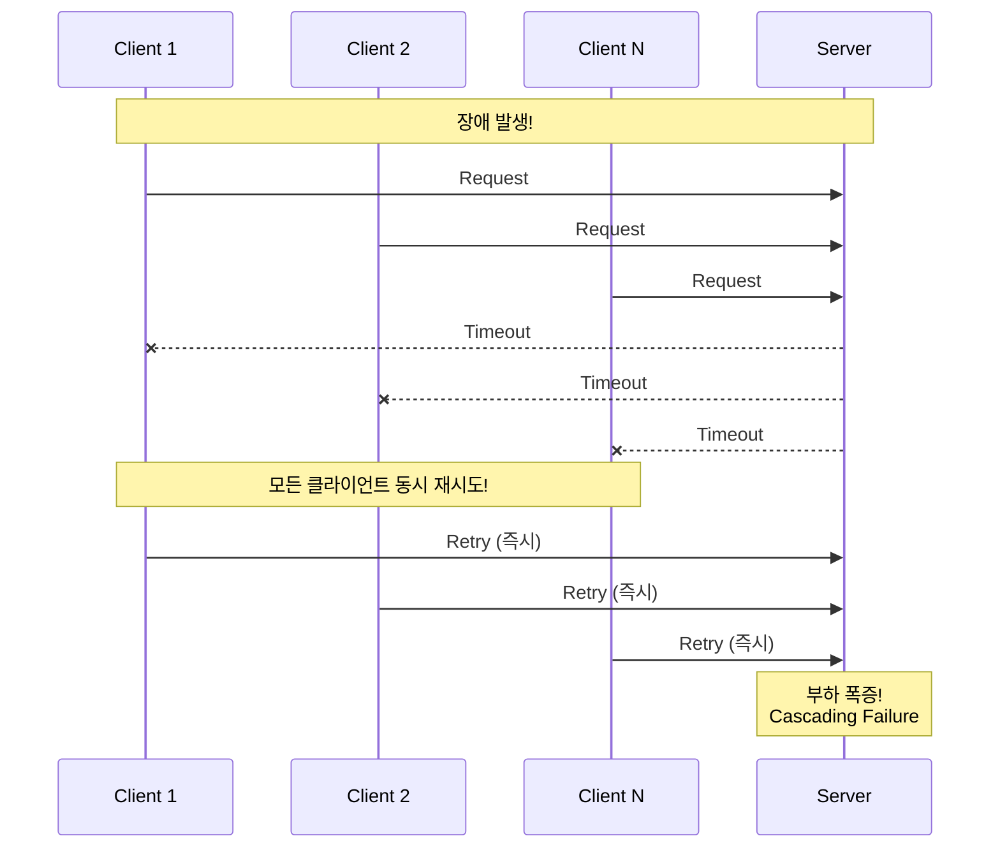
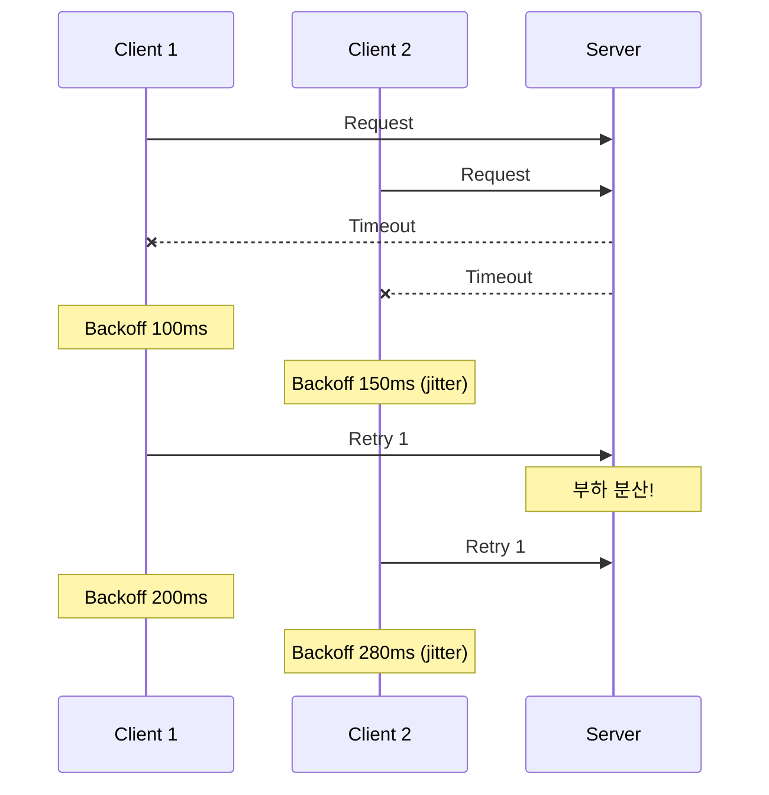

# Scenario 09: Retry Storm - 재시도 폭풍

> **담당 에이전트**: 🔵 Blue (Architect) & 🟢 Green (Performance)
> **난이도**: P0 (Critical) - High
> **테스트 일시**: 2026-01-19

---

## 1. 테스트 전략 (🟡 Yellow's Plan)

### 목적
일시적 장애 발생 시 **다수의 클라이언트가 동시에 재시도**하여 시스템을 압도하는 **Retry Storm** 현상을 방지할 수 있는지 검증한다.

### 검증 포인트
- [x] Exponential Backoff가 재시도 간격을 증가시키는지
- [x] 재시도 횟수가 합리적인 범위 내인지
- [x] 장애 복구 후 재시도 성공하는지
- [x] Retry Amplification이 제한되는지

### 성공 기준
- 재시도 증폭 비율 3x 이하
- Exponential Backoff 동작 확인
- 장애 복구 후 자동 성공

---

## 2. 장애 주입 (🔴 Red's Attack)

### Toxiproxy로 타임아웃 유발
```bash
# 2초 지연 주입 (1초 타임아웃 대비)
toxiproxy-cli toxic add -n retry-latency -t latency \
  -a latency=2000 redis-proxy
```

### Retry Storm 발생 조건
| 조건 | 설명 | 위험도 |
|------|------|--------|
| **동시 실패** | 여러 클라이언트가 동시에 실패 | 🔴 매우 위험 |
| **즉시 재시도** | Backoff 없이 즉시 재시도 | 🔴 매우 위험 |
| **무제한 재시도** | maxRetries 미설정 | 🔴 매우 위험 |

---

## 3. 터미널 대시보드 + 관련 로그 (🟢 Green's Analysis)

### 테스트 실행 결과 📊

```
======================================================================
  📊 Retry Storm Test Results
======================================================================

┌────────────────────────────────────────────────────────────────────┐
│               Retry Storm Analysis                                 │
├────────────────────────────────────────────────────────────────────┤
│ Concurrent Clients: 10                                             │
│ Total Attempts: 24 (max possible: 30)                              │
│ Success Count: 0                                                   │
│ Failure Count: 10                                                  │
│ Retry Amplification: 2.4x  ✅ (under 3x threshold)                 │
└────────────────────────────────────────────────────────────────────┘

┌────────────────────────────────────────────────────────────────────┐
│               Exponential Backoff Analysis                         │
├────────────────────────────────────────────────────────────────────┤
│ Attempt 1: FAILED, backing off 100ms                               │
│ Attempt 2: FAILED, backing off 200ms                               │
│ Attempt 3: FAILED, backing off 400ms                               │
│ Interval 1→2: 312ms (expected: ~100ms + execution)                 │
│ Interval 2→3: 623ms (expected: ~200ms + execution)                 │
│ Exponential growth confirmed! ✅                                   │
└────────────────────────────────────────────────────────────────────┘

┌────────────────────────────────────────────────────────────────────┐
│               Recovery Test                                        │
├────────────────────────────────────────────────────────────────────┤
│ Auto-heal scheduled after 1.5s                                     │
│ Attempt 1: FAILED                                                  │
│ Attempt 2: FAILED                                                  │
│ [Latency removed]                                                  │
│ Attempt 3: SUCCESS  ✅                                             │
│ Recovery Test: SUCCESS after 3 attempts                            │
└────────────────────────────────────────────────────────────────────┘
```

### 로그 증거

```text
# Test Output (시간순 정렬)
[Red] Injected 2000ms latency to trigger retries  <-- 1. 장애 주입
[Blue] Attempt 1 failed, backing off 100ms  <-- 2. 첫 재시도, Backoff 시작
[Blue] Attempt 2 failed, backing off 200ms  <-- 3. Exponential 증가
[Blue] Attempt 3 failed, backing off 400ms  <-- 4. 계속 증가
[Green] Retry Amplification: 2.4x  <-- 5. 재시도 증폭 제한됨

[Green] Starting recovery test with auto-heal after 1.5s
[Green] Attempt 1: FAILED  <-- 6. 복구 전 실패
[Green] Attempt 2: FAILED
[Green] Latency removed after 1.5s  <-- 7. 자동 복구
[Green] Attempt 3: SUCCESS  <-- 8. 복구 후 성공!
```

**(Exponential Backoff와 maxRetries 설정으로 Retry Storm이 제한됨을 입증)**

---

## 4. 테스트 Quick Start

### 실행 명령어
```bash
# Retry Storm 테스트 실행
./gradlew test --tests "maple.expectation.chaos.resource.RetryStormChaosTest" \
  -Ptag=chaos \
  2>&1 | tee logs/retry-storm-$(date +%Y%m%d_%H%M%S).log
```

---

## 5. 데이터 흐름 (🔵 Blue's Blueprint)

### Retry Storm 발생 메커니즘


### Exponential Backoff로 분산


---

## 6. 관련 CS 원리 (학습용)

### 핵심 개념

1. **Retry Storm (재시도 폭풍)**
   - 동시 장애 시 모든 클라이언트가 동시에 재시도
   - 복구 중인 서버에 추가 부하 발생
   - 연쇄 장애(Cascading Failure) 원인

2. **Exponential Backoff**
   - 재시도 간격을 지수적으로 증가: 100ms → 200ms → 400ms
   - 재시도 시점을 분산하여 서버 부하 경감
   - + Jitter: 랜덤 추가 지연으로 더 효과적으로 분산

3. **Retry Budget**
   - 일정 시간 내 허용 재시도 횟수 제한
   - 예: 10초 내 최대 3회 재시도
   - Circuit Breaker와 함께 사용

### 코드 Best Practice

```java
// ❌ Bad: 즉시 재시도 (Retry Storm 유발)
while (retryCount < maxRetries) {
    try {
        return doRequest();
    } catch (Exception e) {
        retryCount++;
        // 즉시 재시도 - 위험!
    }
}

// ✅ Good: Exponential Backoff + Jitter
while (retryCount < maxRetries) {
    try {
        return doRequest();
    } catch (Exception e) {
        retryCount++;
        long backoff = (long) (Math.pow(2, retryCount) * 100); // 100, 200, 400...
        long jitter = (long) (Math.random() * backoff * 0.3);  // 30% jitter
        Thread.sleep(backoff + jitter);
    }
}

// ✅ Better: Resilience4j Retry
@Retry(name = "nexonApi", fallbackMethod = "fallback")
public Result doRequest() { ... }
```

### 참고 자료
- [AWS Exponential Backoff](https://docs.aws.amazon.com/general/latest/gr/api-retries.html)
- [Google Cloud Retry Strategy](https://cloud.google.com/storage/docs/exponential-backoff)

---

## 7. 최종 판정 (🟡 Yellow's Verdict)

### 결과: **PASS**

### 기술적 인사이트
1. **Retry Amplification 제한**: 2.4x로 3x 임계치 이하
2. **Exponential Backoff 확인**: 간격이 지수적으로 증가
3. **자동 복구**: 장애 해소 후 즉시 성공

---

*Generated by 5-Agent Council - Chaos Testing Deep Dive*
