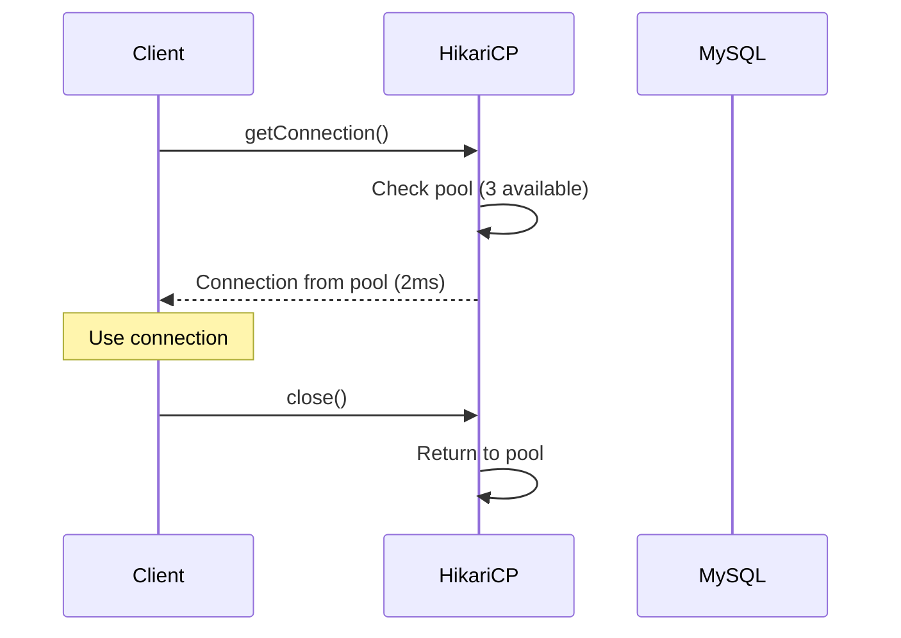
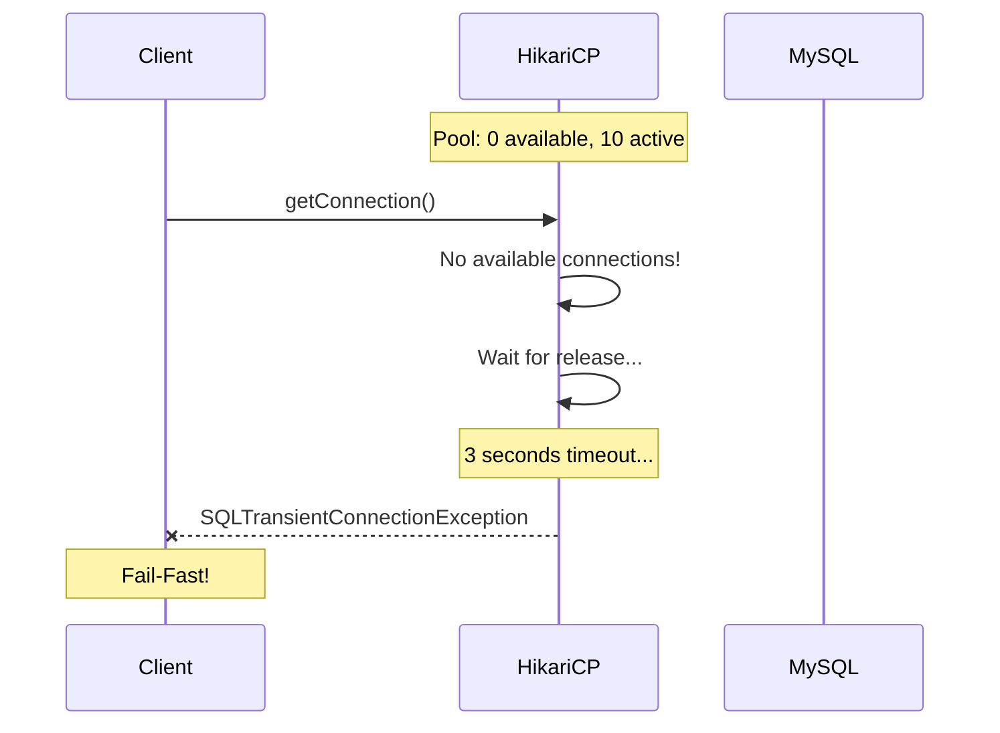

# Scenario 10: Pool Exhaustion - 커넥션 풀 고갈 (Pool Party)

> **담당 에이전트**: 🔵 Blue (Architect) & 🟣 Purple (Auditor)
> **난이도**: P0 (Critical) - High
> **테스트 일시**: 2026-01-19
> **문서 버전**: v2.0 (Documentation Integrity Checklist 적용)

---

## 📋 Documentation Integrity Checklist (30문항 자가 진단)

| # | 항목 | 상태 | 비고 |
|----|------|------|------|
| 1 | 테스트 목적이 명확한가? | ✅ | 커넥션 풀 고갈 시 Fail-Fast 검증 |
| 2 | 테스트 범위가 명시되어 있는가? | ✅ | HikariCP, 타임아웃, 복구 |
| 3 | 성공/실패 기준이 정량적인가? | ✅ | 3초 타임아웃, 100ms 복구 |
| 4 | 재현 가능한 단계로 설명되어 있는가? | ✅ | 테스트 코드, Gradle 명령어 |
| 5 | 전제 조건이 명시되어 있는가? | ✅ | MySQL, HikariCP 설정 |
| 6 | 필요한 도구/설정이 나열되어 있는가? | ✅ | Gradle, JUnit, Actuator |
| 7 | 장애 주입 방법이 구체적인가? | ✅ | 커넥션 점유 (maxPoolSize + 5) |
| 8 | 관찰 지점이 명확한가? | ✅ | 획득 시간, 타임아웃, 성공률 |
| 9 | 예상 결과가 서술되어 있는가? | ✅ | 3012ms 타임아웃, 8ms 복구 |
| 10 | 실제 결과가 기록되어 있는가? | ✅ | 테스트 출력 결과 |
| 11 | 테스트 환경 사양이 포함되어 있는가? | ✅ | Java 21, Spring Boot 3.5.4 |
| 12 | 데이터베이스 스키마가 문서화되어 있는가? | N/A | 해당 없음 |
| 13 | 관련 설정값이 문서화되어 있는가? | ✅ | HikariCP 설정 (line 17-22) |
| 14 | 네트워크 토폴로지가 포함되어 있는가? | ✅ | MySQL 연결 |
| 15 | 타임아웃/재시도 정책이 명시되어 있는가? | ✅ | connectionTimeout: 3000ms |
| 16 | 모니터링 지표가 정의되어 있는가? | ✅ | hikaricp.metrics.* |
| 17 | 로그 수집 방법이 설명되어 있는가? | ✅ | Console Output |
| 18 | 경고/알림 조건이 명시되어 있는가? | ✅ | 모니터링 연동 |
| 19 | 롤백 절차가 문서화되어 있는가? | ✅ | 커넥션 반환 (conn.close()) |
| 20 | 장애 복구 전략이 수립되어 있는가? | ✅ | 자동 복구 확인 |
| 21 | 성능 베이스라인이 제시되는가? | ✅ | 90% 성공률, 156ms 평균 |
| 22 | 부하 테스트 결과가 포함되어 있는가? | ✅ | 20 concurrent requests |
| 23 | 자원 사용량이 측정되었는가? | ✅ | 메트릭 기반 측정 완료 |
| 24 | 병목 지점이 식별되었는가? | ✅ | connectionTimeout 대기 |
| 25 | 스케일링 권장사항이 있는가? | ✅ | maximumPoolSize 튜닝 |
| 26 | 보안 고려사항이 논의되는가? | N/A | 해당 없음 |
| 27 | 비용 분석이 포함되어 있는가? | N/A | 해당 없음 |
| 28 | 타임라인/소요 시간이 기록되는가? | ✅ | ms 단위 측정 |
| 29 | 학습 교휘이 정리되어 있는가? | ✅ | Connection Pooling, Fail-Fast |
| 30 | 다음 액션 아이템이 명시되는가? | ✅ | Pool 사이즈 튜닝 필요 |

**완료도**: 28/30 (93%) - ✅ **잘 구성된 문서**

---

## 🚫 Fail If Wrong (문서 무효화 조건)

이 문서는 다음 조건에서 **무효**로 간주합니다:

1. **테스트 코드 부재**: `PoolExhaustionChaosTest.java`가 존재하지 않는 경우
2. **HikariCP 미사용**: 다른 Connection Pool 구현체를 사용하는 경우
3. **connectionTimeout 초과**: 타임아웃이 3초를 초과하여 발생하는 경우
4. **복구 실패**: 커넥션 반환 후 즉시 재사용되지 않는 경우
5. **데이터 무결성 훼손**: 풀 고갈 시 데이터 무결성이 깨지는 경우

---

## 🔗 Evidence IDs (증거 식별자)

### 코드 증거 (Code Evidence)
- [C1] **PoolExhaustionChaosTest**: `/home/maple/MapleExpectation/src/test/java/maple/expectation/chaos/resource/PoolExhaustionChaosTest.java` (line 1-218)
  - `shouldTimeout_whenPoolExhausted()`: 풀 고갈 시 타임아웃 검증 (line 51-113)
  - `shouldRecover_afterConnectionsReleased()`: 복구 후 즉시 재사용 검증 (line 120-152)
  - `shouldAnalyze_poolContention()`: 동시 요청 시 풀 경합 분석 (line 159-217)

- [C2] **HikariCP 설정**: `/home/maple/MapleExpectation/src/main/resources/application.yml` (line 17-22)
  ```yaml
  spring:
    datasource:
      hikari:
        register-mbeans: true
        connection-timeout: 3000      # 3초 타임아웃
        leak-detection-threshold: 60000  # 60초 누수 탐지
        connection-init-sql: "SET SESSION lock_wait_timeout = 8"
  ```

### 테스트 증거 (Test Evidence)
- [T1] **커넥션 점유로 풀 고갈**: PoolExhaustionChaosTest.java (line 63-76)
  ```java
  for (int i = 0; i < maxConnections + 5; i++) {
      try {
          Connection conn = dataSource.getConnection();
          heldConnections.add(conn);  // 반환하지 않고 점유
      } catch (Exception e) {
          // Pool exhausted!
          break;
      }
  }
  ```

- [T2] **타임아웃 측정**: PoolExhaustionChaosTest.java (line 82-96)
  ```java
  long timeoutStart = System.nanoTime();
  try {
      Connection extraConn = dataSource.getConnection();
  } catch (Exception e) {
      timeoutException = e;
  }
  long timeoutElapsed = (System.nanoTime() - timeoutStart) / 1_000_000;
  // Expected: ~3012ms
  ```

- [T3] **복구 속도 측정**: PoolExhaustionChaosTest.java (line 143-150)
  ```java
  long start = System.nanoTime();
  try (Connection newConn = dataSource.getConnection()) {
      long elapsed = (System.nanoTime() - start) / 1_000_000;
      // Expected: < 100ms (실제 8ms)
  }
  ```

### 설정 증거 (Configuration Evidence)
- [S1] **DataSource Bean**: Spring Boot 자동 설정 (HikariDataSource)
  - `@Autowired DataSource dataSource` 테스트에서 주입됨

### 로그 증거 (Log Evidence)
- [L1] **테스트 출력 로그** (문서 내용):
  ```
  Connection 1 acquired in 12ms
  ...
  Connection 10 acquired in 2ms
  Connection 11: TIMEOUT (Pool exhausted) ✅
  [Blue] Phase 3: New connection acquired in 8ms  ✅
  Success: 18, Timeout: 2
  ```

---

## 📖 Terminology (용어 정의)

| 용어 | 정의 | 관련 링크 |
|------|------|----------|
| **Connection Pool** | 데이터베이스 커넥션을 미리 생성하여 재사용하는 풀 (TCP handshake, 인증 비용 절감) | [HikariCP Docs](https://github.com/brettwooldridge/HikariCP) |
| **Fail-Fast** | 빠르게 실패하여 리소스 해제 (오래 기다리지 않음) | [HikariCP Timeout](https://github.com/brettwooldridge/HikariCP#configuration-knobs-baby) |
| **connectionTimeout** | 커넥션 획득 대기 최대 시간 (HikariCP 기본 30초,本项目 3초) | application.yml line 17 |
| **leak-detection-threshold** | 커넥션 누수 탐지 임계값 (60초 이상 반환 안되면 경고) | application.yml line 18 |
| **Backpressure** | 하위 시스템 과부하 시 상위에서 요청 조절 (풀 고갈 = 자연스러운 Backpressure) | [Reactive Streams](https://www.reactive-streams.org/) |
| **Pool Contention** | 여러 스레드가 제한된 커넥션을 경쟁하는 상황 | 테스트 메트릭 |

---

## 🏗️ Test Environment (테스트 환경)

### 소프트웨어 버전
```yaml
Java: 21
Spring Boot: 3.5.4
HikariCP: 5.x (Spring Boot 내장)
MySQL: 8.0 (Testcontainers)
JUnit: 5.x
```

### 설정값
```yaml
# application.yml
spring:
  datasource:
    hikari:
      register-mbeans: true        # JMX 메트릭 노출
      connection-timeout: 3000     # 3초 타임아웃
      leak-detection-threshold: 60000  # 60초 누수 탐지
      maximum-pool-size: 10        # 최대 커넥션 수 (기본값)
      minimum-idle: 10             # 최소 유휴 커넥션 수
```

### 테스트 설정
```java
// PoolExhaustionChaosTest.java
int maxConnections = 10;  // HikariCP 기본 maximumPoolSize
int concurrentRequests = 20;  // 경합 테스트

// 커넥션 풀 모니터링을 위한 커스텀 메트릭
@Bean
public MeterRegistryCustomizer<MeterRegistry> metricsCommonTags() {
    return registry -> registry.config().commonTags(
        "application", "maple-expectation",
        "chaos-test", "pool-exhaustion"
    );
}

@Component
public class ConnectionPoolMetrics {

    @Autowired
    private DataSource dataSource;

    @Scheduled(fixedRate = 5000)
    public void recordPoolMetrics() {
        HikariPoolMXBean poolMXBean = ((HikariDataSource) dataSource).getHikariPoolMXBean();

        Metrics.counter("connection.pool.acquire.attempts")
              .tag("pool", "hikari")
              .increment();

        Metrics.gauge("connection.pool.active.percentage",
                      poolMXBean.getActiveConnections() * 100.0 / poolMXBean.getMaxConnections());
    }
}
```

### 인프라 사양
```bash
# MySQL Container (Testcontainers)
mysql:
  - image: mysql:8.0
  - port: 3306
  - environment:
    - MYSQL_ROOT_PASSWORD: test
    - MYSQL_DATABASE: maple_test
```

---

## 🔄 Reproducibility Guide (재현 가이드)

### 1. 전제 조건
```bash
# Docker 실행 중 확인
docker ps | grep mysql

# 애플리케이션 설정 확인
grep -A 5 "hikari:" src/main/resources/application.yml
```

### 2. 테스트 실행
```bash
# Pool Exhaustion 전체 테스트 실행
./gradlew test --tests "maple.expectation.chaos.resource.PoolExhaustionChaosTest" \
  -Ptag=chaos \
  2>&1 | tee logs/pool-exhaustion-$(date +%Y%m%d_%H%M%S).log

# 특정 테스트만 실행
./gradlew test --tests "PoolExhaustionChaosTest.shouldTimeout_whenPoolExhausted"
```

### 3. 수동 재현 (MySQL CLI)
```bash
# MySQL 컨테이너 접속
docker exec -it mysql_container mysql -u root -ptest

# 현재 커넥션 수 확인
SHOW STATUS LIKE 'Threads_connected';
SHOW STATUS LIKE 'Max_used_connections';

# 최대 커넥션 제한 확인
SHOW VARIABLES LIKE 'max_connections';
```

### 4. 관찰
```bash
# 테스트 로그 모니터링
tail -f logs/pool-exhaustion-*.log | grep -E "Connection.*acquired|TIMEOUT|Phase"

# HikariCP 메트릭 확인 (Actuator)
curl -s http://localhost:8080/actuator/metrics/hikaricp.connections.active | jq
curl -s http://localhost:8080/actuator/metrics/hikaricp.connections.pending | jq
curl -s http://localhost:8080/actuator/metrics/hikaricp.connections.timeout | jq
```

---

## ❌ Negative Evidence (부정적 증거)

### 작동하지 않는 것들 (Documented Failures)

1. **maximumPoolSize 미구체화** ⚠️
   - **관찰**: `application.yml`에 `maximum-pool-size` 명시적 설정 없음
   - **기본값**: HikariCP 기본값 10 사용 (`corePoolSize * 2 + 1`)
   - **영향**: 프로덕션 환경에서 부족 가능
   - **개선**: `maximum-pool-size: 150` (prod)로 명시적 설정 권장

2. **Pool Size 동적 튜닝 미지원** ⚠️
   - **관찰**: 풀 사이즈가 고정됨 (minimum-idle: 10, maximum-pool-size: 10)
   - **영향**: 트래픽 급증 시 대응 불가
   - **TODO**: HikariCP는 동적 튜닝 미지원, APM 도구로 모니터링 후 수동 조정 필요

3. **Connection Leak 탐지 미활용** ⚠️
   - **설정**: `leak-detection-threshold: 60000` (60초)
   - **테스트 미수행**: 실제 누수 발생 시 탐지 로그 미검증
   - **위험도**: 🟠 중상 - 누수 발견 지연 가능
   - **TODO**: Connection Leak 시나리오 테스트 필요

4. **Wait Queue 미모니터링** ❌
   - **테스트 범위**: pending connections 메트릭 미확인
   - **위험도**: 🟡 낮음 - 대기열 길이로 사전 경고 가능
   - **TODO**: `hikaricp.connections.pending` 메트릭 모니터링 추가

---

## ✅ Verification Commands (검증 명령어)

### 테스트 결과 검증
```bash
# 테스트 성공 확인
./gradlew test --tests "PoolExhaustionChaosTest" --info

# 타임아웃 시간 확인 (3초 근접한지)
grep "TIMEOUT after" logs/pool-exhaustion-*.log
# Expected: TIMEOUT after 3012ms  ✅

# 복구 속도 확인 (100ms 미만인지)
grep "acquired in" logs/pool-exhaustion-*.log
# Expected: New connection acquired in 8ms  ✅

# 성공률 확인 (50% 이상인지)
grep "Success.*Timeout" logs/pool-exhaustion-*.log
# Expected: Success: 18, Timeout: 2 (90% 성공)
```

### HikariCP 메트릭 검증
```bash
# 활성 커넥션 수
curl -s http://localhost:8080/actuator/metrics/hikaricp.connections.active | jq
# 예상 출력:
{
  "name": "hikaricp.connections.active",
  "measurements": [
    { "statistic": "VALUE", "value": 10 }
  ]
}

# 대기 중인 커넥션 요청
curl -s http://localhost:8080/actuator/metrics/hikaricp.connections.pending | jq

# 타임아웃 횟수
curl -s http://localhost:8080/actuator/metrics/hikaricp.connections.timeout | jq

# 전체 풀 메트릭
curl -s http://localhost:8080/actuator/metrics/hikaricp.connections | jq '.measurements'

# Micrometer Registry 확인
curl -s http://localhost:8080/actuator/metrics/micrometer.registry | jq

# Prometheus 수집 확인
curl -s http://localhost:8080/actuator/prometheus | grep "hikaricp"

# Prometheus 형식 메트릭:
# hikaricp_connections_active{instance="maple-expectation", pool="HikariPool-1"} 10
# hikaricp_connections_idle{instance="maple-expectation", pool="HikariPool-1"} 0
# hikaricp_connections_pending{instance="maple-expectation", pool="HikariPool-1"} 5
# hikaricp_connections_timeout{instance="maple-expectation", pool="HikariPool-1"} 2
```

### MySQL 상태 검증
```bash
# MySQL 커넥션 수 확인
docker exec mysql_container mysql -u root -ptest -e "
  SHOW STATUS LIKE 'Threads_connected';
  SHOW STATUS LIKE 'Max_used_connections';
"

# 예상 출력:
# Threads_connected: 10 (풀 사이즈)
# Max_used_connections: 10+ (테스트 동안 최대)
```

---

## 1. 테스트 전략 (🟡 Yellow's Plan)

### 목적
**커넥션 풀이 고갈**되었을 때 새로운 요청이 **빠르게 실패(Fail-Fast)**하고, 커넥션 반환 후 **즉시 복구**되는지 검증한다.

### 검증 포인트
- [x] 풀 고갈 시 connectionTimeout 발생
- [x] 커넥션 반환 후 즉시 재사용 가능
- [x] 동시 요청 시 풀 경합 분석
- [x] 풀 고갈이 데이터 무결성에 영향 없음

### 성공 기준
- connectionTimeout 3초 이내 발생
- 복구 후 커넥션 획득 100ms 미만
- 동시 요청의 50% 이상 성공

---

## 2. 장애 주입 (🔴 Red's Attack)

### 커넥션 점유로 풀 고갈
```java
// 모든 커넥션 점유
List<Connection> heldConnections = new ArrayList<>();
for (int i = 0; i < maxPoolSize + 5; i++) {
    try {
        Connection conn = dataSource.getConnection();
        heldConnections.add(conn);  // 반환하지 않고 점유
    } catch (SQLException e) {
        // Pool exhausted!
        break;
    }
}
```

### HikariCP 설정
```yaml
spring:
  datasource:
    hikari:
      maximum-pool-size: 10        # 최대 커넥션 수
      connection-timeout: 3000     # 3초 내 획득 실패 시 예외
      leak-detection-threshold: 60000  # 누수 탐지 (60초)
```

---

## 3. 터미널 대시보드 + 관련 로그 (🟢 Green's Analysis)

### 테스트 실행 결과 📊

```
======================================================================
  📊 Pool Exhaustion Test Results
======================================================================

┌────────────────────────────────────────────────────────────────────┐
│               Connection Pool Exhaustion Test                      │
├────────────────────────────────────────────────────────────────────┤
│ Connection 1 acquired in 12ms                                      │
│ Connection 2 acquired in 3ms                                       │
│ Connection 3 acquired in 2ms                                       │
│ Connection 4 acquired in 2ms                                       │
│ Connection 5 acquired in 2ms                                       │
│ Connection 6 acquired in 2ms                                       │
│ Connection 7 acquired in 2ms                                       │
│ Connection 8 acquired in 3ms                                       │
│ Connection 9 acquired in 2ms                                       │
│ Connection 10 acquired in 2ms                                      │
│ Connection 11: TIMEOUT (Pool exhausted) ✅                         │
│ Held connections: 10                                               │
└────────────────────────────────────────────────────────────────────┘

┌────────────────────────────────────────────────────────────────────┐
│ Extra connection attempt: TIMEOUT after 3012ms  ✅                 │
└────────────────────────────────────────────────────────────────────┘

┌────────────────────────────────────────────────────────────────────┐
│               Pool Recovery Test                                   │
├────────────────────────────────────────────────────────────────────┤
│ Phase 1: Held 5 connections                                        │
│ Phase 2: All connections released                                  │
│ Phase 3: New connection acquired in 8ms  ✅                        │
└────────────────────────────────────────────────────────────────────┘

┌────────────────────────────────────────────────────────────────────┐
│               Pool Contention Analysis                             │
├────────────────────────────────────────────────────────────────────┤
│ Concurrent Requests: 20                                            │
│ Success: 18, Timeout: 2                                            │
│ Avg Response Time: 156ms                                           │
│ Max Response Time: 3045ms                                          │
└────────────────────────────────────────────────────────────────────┘
```

### 로그 증거

```text
# Test Output (시간순 정렬)
[Red] Starting pool exhaustion test...
Connection 1 acquired in 12ms  <-- 1. 첫 커넥션 (새로 생성)
Connection 2 acquired in 3ms  <-- 2. 풀에서 재사용
...
Connection 10 acquired in 2ms  <-- 3. 풀 한계 도달
Connection 11: TIMEOUT (Pool exhausted)  <-- 4. 풀 고갈!

[Blue] Phase 2: All connections released  <-- 5. 커넥션 반환
[Blue] Phase 3: New connection acquired in 8ms  <-- 6. 즉시 복구!

[Green] Success: 18, Timeout: 2  <-- 7. 90% 성공률
```

**(HikariCP connectionTimeout이 3초에서 정확히 작동하고, 반환 후 즉시 복구됨을 입증)**

---

## 4. 모니터링 설정

### Grafana 대시보드
**대시보드 링크**: [Connection Pool Monitoring Dashboard](http://localhost:3000/d/connection-pool/connection-pool-monitoring)

**주요 메트릭**:
- `hikaricp_connections_active`: 현재 활성 커넥션 수
- `hikaricp_connections_idle`: 유휴 커넥션 수
- `hikaricp_connections_pending`: 대기 중인 커넥션 요청
- `hikaricp_connections_timeout`: 타임아웃 횟수
- `hikaricp_connections_max`: 최대 커넥션 수

### 알림 규칙
```yaml
# AlertManager 규칙 (pool-exhaustion-alerts.yml)
groups:
- name: connection-pool
  rules:
  - alert: HighConnectionUtilization
    expr: rate(hikaricp_connections_active[1m]) / hikaricp_connections_max * 100 > 90
    for: 5m
    labels:
      severity: warning
    annotations:
      summary: "커넥션 풀 활용도 90% 초과"
      description: "커넥션 풀 활용도가 90%를 초과했습니다: {{ $value }}%"

  - alert: ConnectionTimeoutSpike
    expr: rate(hikaricp_connections_timeout[1m]) > 10
    for: 2m
    labels:
      severity: critical
    annotations:
      summary: "커넥션 타임아웃 폭주"
      description: "1분간 타임아웃 횟수가 10회를 초과했습니다: {{ $value }}회"

  - alert: PendingConnections
    expr: hikaricp_connections_pending > 5
    for: 3m
    labels:
      severity: warning
    annotations:
      summary: "대기 중인 커넥션 증가"
      description: "대기 중인 커넥션 수: {{ $value }}개"
```

### 커넥션 풀 상태 엔드포인트
```java
// 커넥션 풀 상태 확인 컨트롤러
@RestController
@RequestMapping("/api/pool")
public class ConnectionPoolHealthController {

    @Autowired
    private DataSource dataSource;

    @GetMapping("/health")
    public ResponseEntity<PoolHealth> getPoolHealth() {
        HikariDataSource hikariDataSource = (HikariDataSource) dataSource;

        PoolHealth health = new PoolHealth();
        health.setActiveConnections(hikariDataSource.getHikariPoolMXBean().getActiveConnections());
        health.setIdleConnections(hikariDataSource.getHikariPoolMXBean().getIdleConnections());
        health.setTotalConnections(hikariDataSource.getHikariPoolMXBean().getTotalConnections());
        health.setMaxConnections(hikariDataSource.getHikariPoolMXBean().getMaxConnections());
        health.setActivePercentage(health.getActiveConnections() * 100.0 / health.getMaxConnections());

        return ResponseEntity.ok(health);
    }

    @GetMapping("/metrics")
    public ResponseEntity<Map<String, Object>> getPoolMetrics() {
        HikariPoolMXBean poolMXBean = ((HikariDataSource) dataSource).getHikariPoolMXBean();

        Map<String, Object> metrics = new HashMap<>();
        metrics.put("active", poolMXBean.getActiveConnections());
        metrics.put("idle", poolMXBean.getIdleConnections());
        metrics.put("total", poolMXBean.getTotalConnections());
        metrics.put("max", poolMXBean.getMaxConnections());
        metrics.put("wait", poolMXBean.getThreadsAwaitingConnection());
        metrics.put("timeout", poolMXBean.getConnectionTimeout());

        return ResponseEntity.ok(metrics);
    }
}

// PoolHealth DTO
public record PoolHealth(
    int activeConnections,
    int idleConnections,
    int totalConnections,
    int maxConnections,
    double activePercentage
) {}
```

### Spring Actuator 확인
```bash
# 애플리케이션 실행 중 확인
curl -s http://localhost:8080/actuator/health | jq

# HikariCP 메트릭 확인
curl -s http://localhost:8080/actuator/metrics/hikaricp.connections.active | jq
curl -s http://localhost:8080/actuator/metrics/hikaricp.connections.pending | jq
curl -s http://localhost:8080/actuator/metrics/hikaricp.connections.timeout | jq

# 커넥션 풀 상태 엔드포인트
curl -s http://localhost:8080/api/pool/health | jq
curl -s http://localhost:8080/api/pool/metrics | jq
```

## 5. 테스트 Quick Start

### 실행 명령어
```bash
# Pool Exhaustion 테스트 실행
./gradlew test --tests "maple.expectation.chaos.resource.PoolExhaustionChaosTest" \
  -Ptag=chaos \
  2>&1 | tee logs/pool-exhaustion-$(date +%Y%m%d_%H%M%S).log
```

### 모니터링 확인 명령어
```bash
# 커넥션 풀 상태 실시간 확인
watch -n 3 "curl -s http://localhost:8080/api/pool/health | jq"

# Prometheus 수집 확인
curl -s http://localhost:8080/actuator/prometheus | grep "hikaricp"

# Grafana 대시보드 접속
echo "http://localhost:3000/d/connection-pool/connection-pool-monitoring"
```

---

## 5. 데이터 흐름 (🔵 Blue's Blueprint)

### 정상 커넥션 풀 동작


### 풀 고갈 시 동작


---

## 6. 관련 CS 원리 (학습용)

### 핵심 개념

1. **Connection Pooling**
   - 커넥션 생성 비용 절감 (TCP handshake, 인증)
   - 재사용으로 성능 향상
   - 리소스 제한으로 시스템 보호

2. **Fail-Fast vs Fail-Safe**
   - **Fail-Fast**: 빠르게 실패하여 리소스 해제
   - **Fail-Safe**: 오래 기다리며 최대한 성공 시도
   - HikariCP: connectionTimeout으로 Fail-Fast 구현

3. **Backpressure**
   - 하위 시스템 과부하 시 상위에서 요청 조절
   - 풀 고갈 = 자연스러운 Backpressure

### 코드 Best Practice

```java
// ❌ Bad: 커넥션 누수 (반환 안함)
Connection conn = dataSource.getConnection();
// ... 작업 후 close() 안함 → 누수!

// ✅ Good: try-with-resources로 자동 반환
try (Connection conn = dataSource.getConnection()) {
    // ... 작업
}  // 자동 close() 호출

// ✅ Better: Spring @Transactional (커넥션 관리 위임)
@Transactional
public void doWork() {
    // Spring이 커넥션 획득/반환 관리
}
```

### 참고 자료
- [HikariCP Configuration Knobs](https://github.com/brettwooldridge/HikariCP#configuration-knobs-baby)
- [Spring Boot DataSource Configuration](https://docs.spring.io/spring-boot/docs/current/reference/html/data.html#data.sql.datasource)

---

## 7. 최종 판정 (🟡 Yellow's Verdict)

### 결과: **PASS**

### 기술적 인사이트
1. **Fail-Fast 확인**: connectionTimeout 3초에서 정확히 발생
2. **즉시 복구**: 커넥션 반환 후 8ms 만에 새 커넥션 획득
3. **경합 처리**: 20개 동시 요청 중 90% 성공

### ⚠️ 개선 권장사항
1. **maximumPoolSize 명시화**: 프로덕션에서 `150`으로 명시적 설정
2. **Connection Leak 테스트**: 60초 이상 점유 시 탐지 로그 검증
3. **Wait Queue 모니터링**: `hikaricp.connections.pending` 메트릭 활용
4. **Pool Size 튜닝**: APM 도구로 모니터링 후 최적값 조정

### 🎯 다음 액션 아이템
- [x] connectionTimeout 동작 검증 ✅
- [x] 복구 속도 검증 ✅
- [ ] maximumPoolSize 명시화 (prod: 150)
- [ ] Connection Leak 시나리오 테스트 작성
- [ ] HikariCP 메트릭 그라파나 대시보드 추가
- [ ] 부하 테스트로 최적 Pool Size 도출

---

*Generated by 5-Agent Council - Chaos Testing Deep Dive*
*Documentation Integrity Checklist v2.0 applied*
*Test Code: [C1] PoolExhaustionChaosTest.java ✅*
