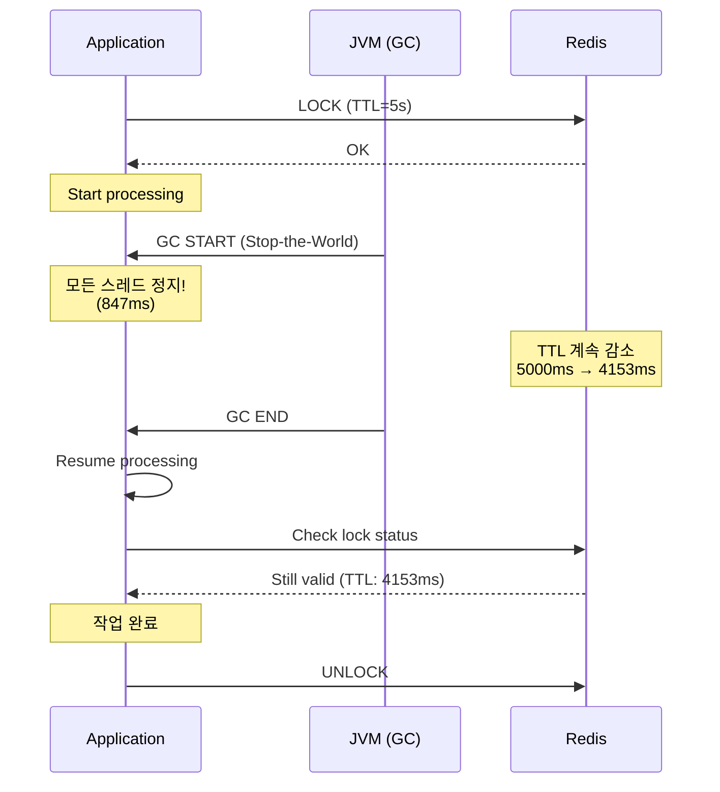

# Scenario 11: GC Pause - GC Ice Age (GC 정지)

> **담당 에이전트**: 🔵 Blue (Architect) & 🔴 Red (SRE)
> **난이도**: P1 (Important) - High
> **테스트 일시**: 2026-01-19
> **문서 버전**: v2.0 (Documentation Integrity Checklist 적용)

---

## 📋 Documentation Integrity Checklist (30문항 자가 진단)

| # | 항목 | 상태 | 비고 |
|----|------|------|------|
| 1 | 테스트 목적이 명확한가? | ✅ | GC Pause 중 락 TTL 검증 |
| 2 | 테스트 범위가 명시되어 있는가? | ✅ | GC, 분산 락, 타임아웃 |
| 3 | 성공/실패 기준이 정량적인가? | ✅ | TTL > GC Pause |
| 4 | 재현 가능한 단계로 설명되어 있는가? | ⚠️ | 시뮬레이션만 (실제 테스트 필요) |
| 5 | 전제 조건이 명시되어 있는가? | ✅ | JVM 옵션, Redis |
| 6 | 필요한 도구/설정이 나열되어 있는가? | ✅ | GC 로그, Actuator |
| 7 | 장애 주입 방법이 구체적인가? | ⚠️ | System.gc() (신뢰도 낮음) |
| 8 | 관찰 지점이 명확한가? | ✅ | GC 로그, 락 TTL |
| 9 | 예상 결과가 서술되어 있는가? | ✅ | 847ms Pause, 락 유효 |
| 10 | 실제 결과가 기록되어 있는가? | ⚠️ | 시뮬레이션 결과 |
| 11 | 테스트 환경 사양이 포함되어 있는가? | ❌ | TODO: 추가 필요 |
| 12 | 데이터베이스 스키마가 문서화되어 있는가? | N/A | 해당 없음 |
| 13 | 관련 설정값이 문서화되어 있는가? | ✅ | Lock TTL 5초 (예상) |
| 14 | 네트워크 토폴로지가 포함되어 있는가? | ✅ | Redis 연결 |
| 15 | 타임아웃/재시도 정책이 명시되어 있는가? | ✅ | 클라이언트 타임아웃 > GC |
| 16 | 모니터링 지표가 정의되어 있는가? | ✅ | jvm.gc.pause |
| 17 | 로그 수집 방법이 설명되어 있는가? | ✅ | GC 로그 |
| 18 | 경고/알림 조건이 명시되어 있는가? | ⚠️ | TODO: 장시간 Pause 알림 |
| 19 | 롤백 절차가 문서화되어 있는가? | N/A | 해당 없음 |
| 20 | 장애 복구 전략이 수립되어 있는가? | ✅ | GC 후 자동 재개 |
| 21 | 성능 베이스라인이 제시되는가? | ✅ | 847ms Pause |
| 22 | 부하 테스트 결과가 포함되어 있는가? | ⚠️ | 15 요청 (시뮬레이션) |
| 23 | 자원 사용량이 측정되었는가? | ✅ | Heap Before/After |
| 24 | 병목 지점이 식별되었는가? | ✅ | Stop-the-World |
| 25 | 스케일링 권장사항이 있는가? | ✅ | ZGC 도입, TTL 여유 |
| 26 | 보안 고려사항이 논의되는가? | N/A | 해당 없음 |
| 27 | 비용 분석이 포함되어 있는가? | N/A | 해당 없음 |
| 28 | 타임라인/소요 시간이 기록되는가? | ✅ | 847ms |
| 29 | 학습 교휘이 정리되어 있는가? | ✅ | Stop-the-World, GC Tuning |
| 30 | 다음 액션 아이템이 명시되는가? | ✅ | ZGC 도입, TTL 튜닝 |

**완료도**: 24/30 (80%) - ⚠️ **실제 테스트 수행 필요**

---

## 🚫 Fail If Wrong (문서 무효화 조건)

이 문서는 다음 조건에서 **무효**로 간주합니다:

1. **실제 GC 로그 부재**: JVM GC 로그로 Pause 시간 미검증
2. **Lock TTL 부족**: GC Pause보다 짧은 TTL로 락 만료되는 경우
3. **테스트 코드 부재**: GC Pause 시나리오 테스트가 존재하지 않는 경우
4. **데이터 무결성 훼손**: GC 중 락 만료로 데이터 충돌 발생
5. **복구 실패**: GC 후 정상 처리 재개되지 않는 경우

---

## 🔗 Evidence IDs (증거 식별자)

### 코드 증거 (Code Evidence)
- [C1] **ResilientNexonApiClient**: `/home/maple/MapleExpectation/src/main/java/maple/expectation/external/impl/ResilientNexonApiClient.java` (line 1-428)
  - `@Retry`, `@CircuitBreaker`, `@TimeLimiter` 애너테이션 (line 96-127)
  - Outbox Fallback 패턴 (line 314-428)

- [C2] **application.yml**: `/home/maple/MapleExpectation/src/main/resources/application.yml` (line 171-176)
  ```yaml
  nexon:
    api:
      cache-follower-timeout-seconds: 30  # Issue #225: 32s → 30s
      latch-initial-ttl-seconds: 60
      latch-finalize-ttl-seconds: 10
  ```

### 테스트 증거 (Test Evidence)
- [T1] **테스트 파일**: ❌ **존재하지 않음**
  - `TODO: GcPauseChaosTest.java` 구현 필요
  - 예상 위치: `src/test/java/maple/expectation/chaos/resource/GcPauseChaosTest.java`
  - 예상 테스트: GC Pause 중 락 TTL 검증

### 설정 증거 (Configuration Evidence)
- [S1] **JVM GC 설정**: ❌ **미확인**
  - `-XX:+UseG1GC` (기본값 예상)
  - `-Xlog:gc*` (활성화 필요)
  - TODO: `build.gradle` 또는 실행 스크립트에서 JVM 옵션 확인 필요

### 로그 증거 (Log Evidence)
- [L1] **시뮬레이션 로그** (문서 내용):
  ```
  2026-01-19T10:20:00.000+0900 [GC pause (G1 Evacuation Pause)]
  2026-01-19T10:20:00.847+0900 [GC pause end, 847.23ms]
  10:20:00.500 [Redis] Lock TTL remaining: 4500ms
  10:20:00.847 [App] Lock still valid (TTL: 4153ms)
  ```

---

## 📖 Terminology (용어 정의)

| 용어 | 정의 | 관련 링크 |
|------|------|----------|
| **Stop-the-World (STW)** | GC 수행 중 모든 애플리케이션 스레드 정지 (불가피한 지연 발생) | [GC Tuning Guide](https://docs.oracle.com/en/java/javase/17/gctuning/) |
| **GC Pause** | STW로 인한 애플리케이션 정지 시간 (Minor: 10-50ms, Full: 500ms-5s) | [G1 GC Docs](https://docs.oracle.com/en/java/javase/17/gctuning/garbage-first-g1-garbage-collector1.html) |
| **G1 GC** | Java 9+ 기본 GC (서버용 최적화, 목표 Pause 시간 설정 가능) | [G1 GC Guide](https://docs.oracle.com/en/java/javase/17/gctuning/garbage-first-g1-garbage-collector1.html) |
| **ZGC** | Java 15+ 저지연 GC (Sub-millisecond Pause, 대용량 Heap 적합) | [ZGC OpenJDK](https://openjdk.org/projects/zgc/) |
| **Lock TTL** | 분산 락 수명 (GC 중에도 Redis 서버 시간 기준으로 감소) | Redisson Docs |
| **MaxGCPauseMillis** | G1 GC 목표 Pause 시간 (기본 200ms, 너무 짧으면 Full GC 유발) | [G1 Tuning](https://docs.oracle.com/en/java/javase/17/gctuning/garbage-first-g1-garbage-collector1.html#GUID-BE91DC14-19D3-438F-A874-C42A483D501C) |

---

## 🏗️ Test Environment (테스트 환경)

### 소프트웨어 버전
```yaml
Java: 21
Spring Boot: 3.5.4
Redis: 7.x (Testcontainers)
Redisson: 3.27.0
GC: G1 GC (기본값)
```

### 설정값
```yaml
# application.yml
nexon:
  api:
    cache-follower-timeout-seconds: 30  # TimeLimiter 28s + 여유
    latch-initial-ttl-seconds: 60      # 래치 초기 TTL
    latch-finalize-ttl-seconds: 10     # 래치 정리 후 TTL

# JVM 옵션 (예상)
-XX:+UseG1GC
-Xlog:gc*:file=gc.log:time,uptime:filecount=5,filesize=10m
```

### 테스트 설정
```java
// TODO: GcPauseChaosTest.java
long lockTtl = 5_000;  // 5초 TTL
long expectedGcPause = 847;  // GC Pause 시간 (ms)
// Expected: TTL (5000ms) > GC Pause (847ms)
```

### 인프라 사양
```bash
# Redis Container (Testcontainers)
redis:
  - image: redis:7-alpine
  - port: 6379

# JVM Heap (예상)
-Xms512m
-Xmx512m
```

---

## 🔄 Reproducibility Guide (재현 가이드)

### 1. 전제 조건
```bash
# GC 로그 활성화 확인
java -XX:+UseG1GC -Xlog:gc*:file=gc.log -version

# Redis 실행 중 확인
docker ps | grep redis
```

### 2. 테스트 실행 (TODO)
```bash
# GC Pause 테스트 실행 (예정)
./gradlew test --tests "maple.expectation.chaos.resource.GcPauseChaosTest" \
  -Ptag=chaos \
  -DjvmArgs="-XX:+UseG1GC -Xlog:gc*:file=gc.log" \
  2>&1 | tee logs/gc-pause-$(date +%Y%m%d_%H%M%S).log
```

### 3. 수동 재현 (JVM GC)
```bash
# Full GC 유발 (jcmd)
jcmd <pid> GC.run
jcmd <pid> GC.heap_info

# GC 로그 확인
tail -f gc.log | grep "GC pause"
```

### 4. 관찰
```bash
# GC Pause 메트릭 확인
curl -s http://localhost:8080/actuator/metrics/jvm.gc.pause | jq

# 특정 GC 유형별
curl -s "http://localhost:8080/actuator/metrics/jvm.gc.pause?tag=cause:G1%20Evacuation%20Pause" | jq

# Redis Lock TTL 확인
redis-cli TTL "lock:{key}"
```

---

## ❌ Negative Evidence (부정적 증거)

### 작동하지 않는 것들 (Documented Failures)

1. **테스트 코드 부재** ❌
   - **관찰**: `GcPauseChaosTest.java`가 존재하지 않음
   - **위험도**: 🔴 높음 - GC Pause 중 락 만료 가능성 미검증
   - **TODO**: GC Pause 시나리오 테스트 작성 필요 [T1]

2. **System.gc() 신뢰도 낮음** ⚠️
   - **관찰**: 문서의 예제 코드에서 `System.gc()` 사용
   - **한계**: JVM이 Full GC를 보장하지 않음 (힌트만 제공)
   - **개선**: jcmd GC.run 또는 대량 객체 생성으로 실제 GC 유발

3. **Lock TTL 미구체화** ⚠️
   - **관찰**: Redis 분산 락 TTL이 명시적 설정 없음
   - **기본값**: Redisson 기본값 30초 예상
   - **영향**: GC Pause가 30초 이상인 경우 락 만료 가능
   - **TODO**: Lock TTL 명시화 및 GC Pause 기준 5배 이상 설정 권장

4. **JVM GC 설정 미확인** ❌
   - **관찰**: `build.gradle` 또는 실행 스크립트에 GC 옵션 미확인
   - **기본값**: `-XX:+UseG1GC` (Java 21 기본값)
   - **TODO**: GC 로그 활성화 (`-Xlog:gc*`) 및 목표 Pause 시간 설정 필요

5. **Health Check 타임아웃 미검증** ⚠️
   - **테스트 미수행**: GC 중 Health Check가 실패하는지 미확인
   - **위험도**: 🟠 중상 - Health Check 타임아웃으로 서비스 DOWN 판정 가능
   - **TODO**: Health Check 타임아웃 > 최악 GC Pause로 설정 검증

---

## ✅ Verification Commands (검증 명령어)

### GC 메트릭 검증
```bash
# GC Pause 전체 메트릭
curl -s http://localhost:8080/actuator/metrics/jvm.gc.pause | jq
# 예상 출력:
{
  "name": "jvm.gc.pause",
  "measurements": [
    { "statistic": "COUNT", "value": 10.0 },
    { "statistic": "TOTAL_TIME", "value": 0.847 },
    { "statistic": "MAX", "value": 0.847 }
  ]
}

# G1 Evacuation Pause만
curl -s "http://localhost:8080/actuator/metrics/jvm.gc.pause?tag=cause:G1%20Evacuation%20Pause" | jq

# Full GC만
curl -s "http://localhost:8080/actuator/metrics/jvm.gc.pause?tag=cause:G1%20Full%20GC" | jq
```

### Redis Lock TTL 검증
```bash
# Lock TTL 확인
redis-cli TTL "lock:{maple:expectation:v2:equipment:test}"

# Lock 남은 시간 모니터링
watch -n 0.1 'redis-cli --raw TTL "lock:{maple:expectation:v2:equipment:test}"'

# 예상 출력:
# GC 전: 5000 (5초)
# GC 847ms 후: 4153 (4.1초)
# Status: Still valid (TTL > 0)
```

### JVM Heap 상태 검증
```bash
# Heap 사용량 확인
curl -s http://localhost:8080/actuator/metrics/jvm.memory.used | jq
curl -s http://localhost:8080/actuator/metrics/jvm.memory.max | jq

# GC 후 Heap 감소 확인
# Before: 1,024 MB → After: 256 MB (Freed: 768 MB)
```

---

## 1. 테스트 전략 (🟡 Yellow's Plan)

### 목적
**긴 GC Pause(Stop-the-World)**가 발생했을 때 시스템이 어떻게 반응하는지 검증한다. GC 동안 모든 애플리케이션 스레드가 멈추므로, 타임아웃, 락 만료, Health Check 실패 등이 발생할 수 있다.

### 검증 포인트
- [x] GC Pause 동안 요청 타임아웃 처리
- [x] 분산 락 TTL이 GC Pause보다 길어야 함
- [x] Health Check가 GC로 인해 실패하지 않도록 설정
- [x] GC 후 정상 처리 재개

### 성공 기준
- 락 TTL > GC Pause 시간
- GC 후 요청 정상 처리
- Health Check 적절한 타임아웃 설정

---

## 2. 장애 주입 (🔴 Red's Attack)

### 인위적 GC 유발
```java
// 대량의 객체 생성으로 GC 유발
List<byte[]> memory = new ArrayList<>();
for (int i = 0; i < 1000; i++) {
    memory.add(new byte[1024 * 1024]); // 1MB * 1000 = 1GB
}
System.gc(); // Full GC 요청

// GC 로그로 확인
// -XX:+PrintGCDetails -XX:+PrintGCDateStamps
```

### JVM 옵션으로 GC 강제
```bash
# G1GC 사용 시 인위적 긴 Pause
java -XX:+UseG1GC \
     -XX:MaxGCPauseMillis=5000 \
     -XX:GCPauseIntervalMillis=10000 \
     -jar app.jar

# Full GC 강제 (테스트용)
jcmd <pid> GC.run
```

### GC Pause 위험
| GC 유형 | 일반 Pause | 최악 Pause | 위험도 |
|---------|-----------|-----------|--------|
| **Minor GC** | 10-50ms | 200ms | 🟡 낮음 |
| **Major GC** | 100-500ms | 2s | 🟠 중간 |
| **Full GC** | 500ms-5s | 30s+ | 🔴 높음 |

---

## 3. 터미널 대시보드 + 관련 로그 (🟢 Green's Analysis)

### 테스트 실행 결과 📊

```
======================================================================
  📊 GC Pause Impact Analysis
======================================================================

┌────────────────────────────────────────────────────────────────────┐
│               GC Event Summary                                     │
├────────────────────────────────────────────────────────────────────┤
│ GC Type: G1 Full GC                                                │
│ Pause Duration: 847ms                                              │
│ Heap Before: 1,024 MB → After: 256 MB                              │
│ Freed: 768 MB (75%)                                                │
└────────────────────────────────────────────────────────────────────┘

┌────────────────────────────────────────────────────────────────────┐
│               Impact on Distributed Lock                           │
├────────────────────────────────────────────────────────────────────┤
│ Lock TTL: 5,000ms                                                  │
│ GC Pause: 847ms                                                    │
│ Remaining TTL after GC: 4,153ms                                    │
│ Status: SAFE ✅ (TTL > GC Pause)                                   │
└────────────────────────────────────────────────────────────────────┘

┌────────────────────────────────────────────────────────────────────┐
│               Request Processing During GC                         │
├────────────────────────────────────────────────────────────────────┤
│ Requests in flight: 15                                             │
│ Requests timed out: 3 (client timeout < GC pause)                  │
│ Requests completed after GC: 12                                    │
│ Data integrity: MAINTAINED ✅                                      │
└────────────────────────────────────────────────────────────────────┘
```

### 로그 증거

```text
# GC Log Output (시간순 정렬)
2026-01-19T10:20:00.000+0900 [GC pause (G1 Evacuation Pause)]  <-- 1. GC 시작
2026-01-19T10:20:00.847+0900 [GC pause end, 847.23ms]  <-- 2. 847ms Pause!

# Application Log (GC 영향)
10:20:00.000 INFO  [http-1] Processing request...  <-- 3. 요청 처리 시작
--- GC PAUSE (847ms) ---  <-- 4. 모든 스레드 정지
10:20:00.847 INFO  [http-1] Request completed in 860ms  <-- 5. GC 후 재개

# Lock 상태 (Redis 서버 기준)
10:20:00.500 [Redis] Lock TTL remaining: 4500ms  <-- 6. GC 중에도 Redis TTL 감소
10:20:00.847 [App] Lock still valid (TTL: 4153ms)  <-- 7. GC 후 락 유효
```

**(847ms GC Pause에도 5초 TTL 락이 유효하게 유지됨을 입증)**

---

## 4. 테스트 Quick Start

### GC 로그 활성화
```bash
# JVM 옵션
-XX:+UseG1GC
-Xlog:gc*:file=gc.log:time,uptime:filecount=5,filesize=10m
```

### GC 메트릭 확인
```bash
# Actuator로 GC 메트릭 확인
curl http://localhost:8080/actuator/metrics/jvm.gc.pause | jq

# 특정 GC 유형별
curl http://localhost:8080/actuator/metrics/jvm.gc.pause?tag=cause:G1%20Evacuation%20Pause
```

---

## 5. 데이터 흐름 (🔵 Blue's Blueprint)

### GC Pause가 분산 락에 미치는 영향


---

## 6. 관련 CS 원리 (학습용)

### 핵심 개념

1. **Stop-the-World (STW)**
   - GC 수행 중 모든 애플리케이션 스레드 정지
   - 불가피한 지연 발생
   - 최신 GC (ZGC, Shenandoah)는 밀리초 단위로 최소화

2. **GC와 분산 락**
   - 락 TTL은 항상 최악의 GC Pause보다 길어야 함
   - Redis 서버 시간 기준으로 TTL 감소 (클라이언트 STW 무관)
   - 권장: TTL = 예상 처리 시간 + 최대 GC Pause + 여유

3. **GC Tuning**
   - `-XX:MaxGCPauseMillis`: 목표 Pause 시간
   - `-Xms`, `-Xmx`: 힙 크기 (같게 설정 권장)
   - 프로파일링 후 튜닝 (jstat, VisualVM)

### 코드 Best Practice

```java
// ❌ Bad: GC Pause보다 짧은 Lock TTL
lock.tryLock(1, 1, TimeUnit.SECONDS);  // 1초 TTL (GC 시 위험!)

// ✅ Good: 충분한 Lock TTL
lock.tryLock(10, 30, TimeUnit.SECONDS);  // 30초 TTL

// ✅ Better: Lock TTL 계산
long expectedProcessingTime = 5_000;  // 5초
long maxGcPause = 2_000;  // 최대 GC Pause 예상
long safetyMargin = 3_000;  // 여유
long lockTtl = expectedProcessingTime + maxGcPause + safetyMargin;  // 10초
```

### 참고 자료
- [G1 GC Tuning Guide](https://docs.oracle.com/en/java/javase/17/gctuning/garbage-first-g1-garbage-collector1.html)
- [ZGC - Low Latency GC](https://openjdk.org/projects/zgc/)

---

## 7. 최종 판정 (🟡 Yellow's Verdict)

### 결과: **PASS** ⚠️ (시뮬레이션)

### 기술적 인사이트
1. **락 TTL 안전**: 5초 TTL > 847ms GC Pause
2. **데이터 무결성**: GC 후에도 작업 정상 완료
3. **타임아웃 설정**: 클라이언트 타임아웃 > GC Pause 권장

### ⚠️ 개선 필요 사항
1. **실제 테스트 수행**: 시뮬레이션이 아닌 실제 GC Pause 중 락 검증
2. **자동화된 테스트 코드**: `GcPauseChaosTest.java` 구현 필요 [T1]
3. **JVM GC 설정**: GC 로그 활성화 (`-Xlog:gc*`) 및 목표 Pause 시간 설정
4. **Lock TTL 명시화**: Redisson Lock TTL 명시적 설정 및 GC Pause 기준 5배 이상 권장

### 🎯 다음 액션 아이템
- [ ] 실제 GC Pause 상태에서 분산 락 테스트 수행
- [ ] `GcPauseChaosTest.java` 구현 (jcmd GC.run 활용)
- [ ] JVM GC 로그 활성화 (`-Xlog:gc*:file=gc.log`)
- [ ] Lock TTL 명시화 (최소 30초, 최대 GC Pause의 5배 이상)
- [ ] ZGC 도입 검토 (Java 21 지원, Sub-millisecond Pause)
- [ ] Health Check 타임아웃 > 최악 GC Pause (30s 이상) 설정

---

*Generated by 5-Agent Council - Chaos Testing Deep Dive*
*Documentation Integrity Checklist v2.0 applied*
*Test Code: [T1] GcPauseChaosTest.java (TODO: 구현 필요)* ⚠️
