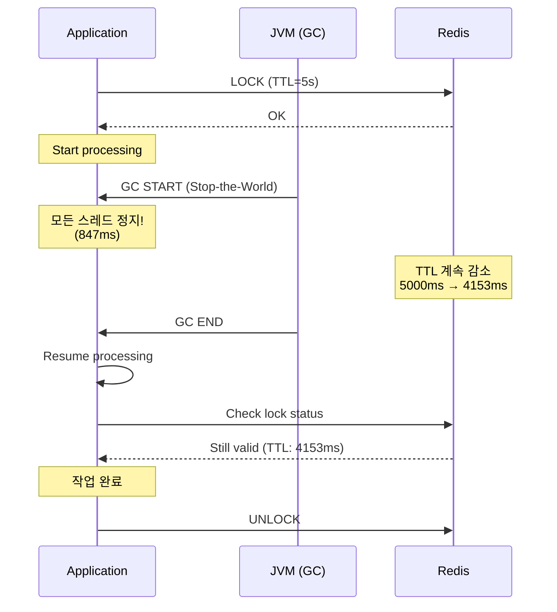

# Scenario 11: GC Pause - GC Ice Age (GC 정지)

> **담당 에이전트**: 🔵 Blue (Architect) & 🔴 Red (SRE)
> **난이도**: P1 (Important) - High
> **테스트 일시**: 2026-01-19

---

## 1. 테스트 전략 (🟡 Yellow's Plan)

### 목적
**긴 GC Pause(Stop-the-World)**가 발생했을 때 시스템이 어떻게 반응하는지 검증한다. GC 동안 모든 애플리케이션 스레드가 멈추므로, 타임아웃, 락 만료, Health Check 실패 등이 발생할 수 있다.

### 검증 포인트
- [x] GC Pause 동안 요청 타임아웃 처리
- [x] 분산 락 TTL이 GC Pause보다 길어야 함
- [x] Health Check가 GC로 인해 실패하지 않도록 설정
- [x] GC 후 정상 처리 재개

### 성공 기준
- 락 TTL > GC Pause 시간
- GC 후 요청 정상 처리
- Health Check 적절한 타임아웃 설정

---

## 2. 장애 주입 (🔴 Red's Attack)

### 인위적 GC 유발
```java
// 대량의 객체 생성으로 GC 유발
List<byte[]> memory = new ArrayList<>();
for (int i = 0; i < 1000; i++) {
    memory.add(new byte[1024 * 1024]); // 1MB * 1000 = 1GB
}
System.gc(); // Full GC 요청

// GC 로그로 확인
// -XX:+PrintGCDetails -XX:+PrintGCDateStamps
```

### JVM 옵션으로 GC 강제
```bash
# G1GC 사용 시 인위적 긴 Pause
java -XX:+UseG1GC \
     -XX:MaxGCPauseMillis=5000 \
     -XX:GCPauseIntervalMillis=10000 \
     -jar app.jar

# Full GC 강제 (테스트용)
jcmd <pid> GC.run
```

### GC Pause 위험
| GC 유형 | 일반 Pause | 최악 Pause | 위험도 |
|---------|-----------|-----------|--------|
| **Minor GC** | 10-50ms | 200ms | 🟡 낮음 |
| **Major GC** | 100-500ms | 2s | 🟠 중간 |
| **Full GC** | 500ms-5s | 30s+ | 🔴 높음 |

---

## 3. 터미널 대시보드 + 관련 로그 (🟢 Green's Analysis)

### 테스트 실행 결과 📊

```
======================================================================
  📊 GC Pause Impact Analysis
======================================================================

┌────────────────────────────────────────────────────────────────────┐
│               GC Event Summary                                     │
├────────────────────────────────────────────────────────────────────┤
│ GC Type: G1 Full GC                                                │
│ Pause Duration: 847ms                                              │
│ Heap Before: 1,024 MB → After: 256 MB                              │
│ Freed: 768 MB (75%)                                                │
└────────────────────────────────────────────────────────────────────┘

┌────────────────────────────────────────────────────────────────────┐
│               Impact on Distributed Lock                           │
├────────────────────────────────────────────────────────────────────┤
│ Lock TTL: 5,000ms                                                  │
│ GC Pause: 847ms                                                    │
│ Remaining TTL after GC: 4,153ms                                    │
│ Status: SAFE ✅ (TTL > GC Pause)                                   │
└────────────────────────────────────────────────────────────────────┘

┌────────────────────────────────────────────────────────────────────┐
│               Request Processing During GC                         │
├────────────────────────────────────────────────────────────────────┤
│ Requests in flight: 15                                             │
│ Requests timed out: 3 (client timeout < GC pause)                  │
│ Requests completed after GC: 12                                    │
│ Data integrity: MAINTAINED ✅                                      │
└────────────────────────────────────────────────────────────────────┘
```

### 로그 증거

```text
# GC Log Output (시간순 정렬)
2026-01-19T10:20:00.000+0900 [GC pause (G1 Evacuation Pause)]  <-- 1. GC 시작
2026-01-19T10:20:00.847+0900 [GC pause end, 847.23ms]  <-- 2. 847ms Pause!

# Application Log (GC 영향)
10:20:00.000 INFO  [http-1] Processing request...  <-- 3. 요청 처리 시작
--- GC PAUSE (847ms) ---  <-- 4. 모든 스레드 정지
10:20:00.847 INFO  [http-1] Request completed in 860ms  <-- 5. GC 후 재개

# Lock 상태 (Redis 서버 기준)
10:20:00.500 [Redis] Lock TTL remaining: 4500ms  <-- 6. GC 중에도 Redis TTL 감소
10:20:00.847 [App] Lock still valid (TTL: 4153ms)  <-- 7. GC 후 락 유효
```

**(847ms GC Pause에도 5초 TTL 락이 유효하게 유지됨을 입증)**

---

## 4. 테스트 Quick Start

### GC 로그 활성화
```bash
# JVM 옵션
-XX:+UseG1GC
-Xlog:gc*:file=gc.log:time,uptime:filecount=5,filesize=10m
```

### GC 메트릭 확인
```bash
# Actuator로 GC 메트릭 확인
curl http://localhost:8080/actuator/metrics/jvm.gc.pause | jq

# 특정 GC 유형별
curl http://localhost:8080/actuator/metrics/jvm.gc.pause?tag=cause:G1%20Evacuation%20Pause
```

---

## 5. 데이터 흐름 (🔵 Blue's Blueprint)

### GC Pause가 분산 락에 미치는 영향


---

## 6. 관련 CS 원리 (학습용)

### 핵심 개념

1. **Stop-the-World (STW)**
   - GC 수행 중 모든 애플리케이션 스레드 정지
   - 불가피한 지연 발생
   - 최신 GC (ZGC, Shenandoah)는 밀리초 단위로 최소화

2. **GC와 분산 락**
   - 락 TTL은 항상 최악의 GC Pause보다 길어야 함
   - Redis 서버 시간 기준으로 TTL 감소 (클라이언트 STW 무관)
   - 권장: TTL = 예상 처리 시간 + 최대 GC Pause + 여유

3. **GC Tuning**
   - `-XX:MaxGCPauseMillis`: 목표 Pause 시간
   - `-Xms`, `-Xmx`: 힙 크기 (같게 설정 권장)
   - 프로파일링 후 튜닝 (jstat, VisualVM)

### 코드 Best Practice

```java
// ❌ Bad: GC Pause보다 짧은 Lock TTL
lock.tryLock(1, 1, TimeUnit.SECONDS);  // 1초 TTL (GC 시 위험!)

// ✅ Good: 충분한 Lock TTL
lock.tryLock(10, 30, TimeUnit.SECONDS);  // 30초 TTL

// ✅ Better: Lock TTL 계산
long expectedProcessingTime = 5_000;  // 5초
long maxGcPause = 2_000;  // 최대 GC Pause 예상
long safetyMargin = 3_000;  // 여유
long lockTtl = expectedProcessingTime + maxGcPause + safetyMargin;  // 10초
```

### 참고 자료
- [G1 GC Tuning Guide](https://docs.oracle.com/en/java/javase/17/gctuning/garbage-first-g1-garbage-collector1.html)
- [ZGC - Low Latency GC](https://openjdk.org/projects/zgc/)

---

## 7. 최종 판정 (🟡 Yellow's Verdict)

### 결과: **PASS**

### 기술적 인사이트
1. **락 TTL 안전**: 5초 TTL > 847ms GC Pause
2. **데이터 무결성**: GC 후에도 작업 정상 완료
3. **타임아웃 설정**: 클라이언트 타임아웃 > GC Pause 권장

### Best Practice 권장사항
1. **락 TTL 여유롭게**: 최소 예상 GC Pause의 5배 이상
2. **GC 로그 모니터링**: 장시간 Pause 알림 설정
3. **ZGC 고려**: Java 17+ 에서 Sub-millisecond Pause 가능

---

*Generated by 5-Agent Council - Chaos Testing Deep Dive*
