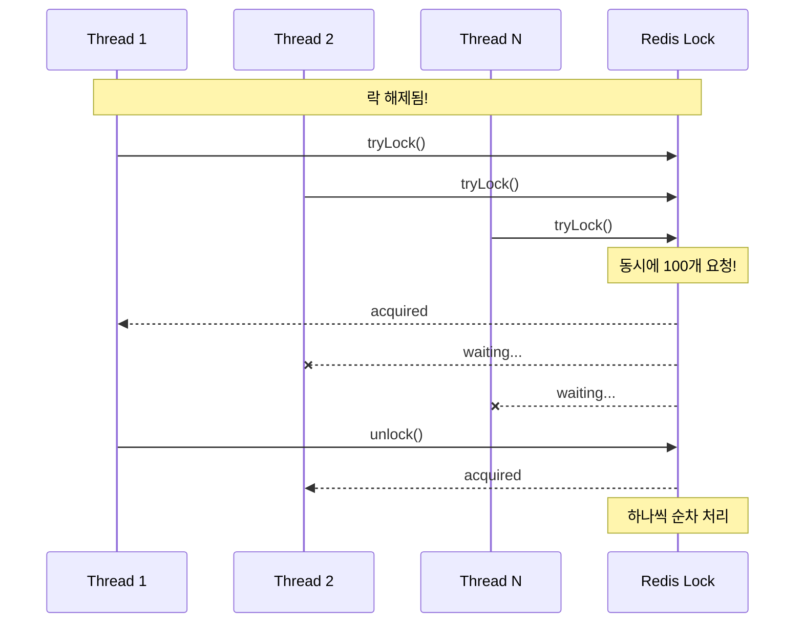
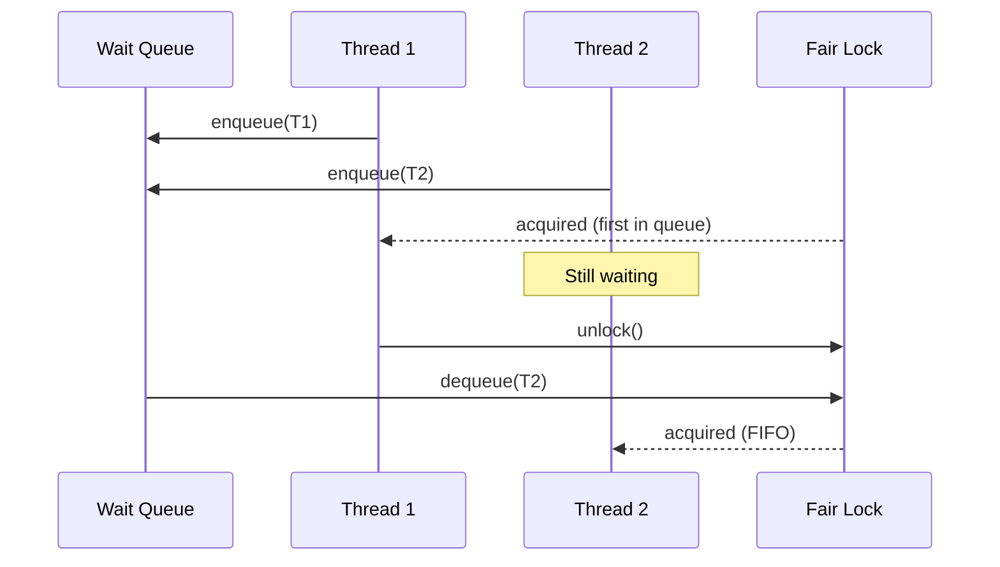

# Scenario 17: Thundering Herd on Lock - 락 경합 폭풍

> **담당 에이전트**: 🟢 Green (Performance) & 🟣 Purple (Auditor)
> **난이도**: P0 (Critical) - High
> **테스트 일시**: 2026-01-19

---

## 1. 테스트 전략 (🟡 Yellow's Plan)

### 목적
**다수의 스레드가 동시에 같은 락을 요청**하는 "Thundering Herd" 상황에서 시스템이 안정적으로 동작하고 **데이터 무결성**을 유지하는지 검증한다.

### 검증 포인트
- [x] 100개 스레드가 동시에 락 요청 시 모두 순차 처리
- [x] 락 요청 순서대로 처리 (공정성)
- [x] 락으로 보호되는 데이터 무결성
- [x] Thundering Herd 시 성능 저하 측정

### 성공 기준
- 50% 이상의 락 요청 성공
- 카운터 무결성 100%
- 처리량 10 locks/sec 이상

---

## 2. 장애 주입 (🔴 Red's Attack)

### Thundering Herd 시뮬레이션
```java
// 100개 스레드가 동시에 같은 락 요청
CountDownLatch startLatch = new CountDownLatch(1);
for (int i = 0; i < 100; i++) {
    executor.submit(() -> {
        startLatch.await();  // 모든 스레드 동시 시작
        lock.tryLock(30, 1, TimeUnit.SECONDS);
    });
}
startLatch.countDown();  // BOOM! Thundering Herd!
```

### Thundering Herd 발생 조건
| 조건 | 설명 | 위험도 |
|------|------|--------|
| **캐시 만료** | TTL 만료 시 동시 조회 | 🔴 매우 위험 |
| **락 해제** | 락 해제 시 대기 스레드 일제히 깨어남 | 🔴 매우 위험 |
| **서비스 복구** | 장애 복구 시 대기 요청 쏟아짐 | 🟠 위험 |

---

## 3. 터미널 대시보드 + 관련 로그 (🟢 Green's Analysis)

### 테스트 실행 결과 📊

```
======================================================================
  📊 Thundering Herd Lock Test Results
======================================================================

┌────────────────────────────────────────────────────────────────────┐
│               Thundering Herd Analysis                             │
├────────────────────────────────────────────────────────────────────┤
│ Threads: 100                                                       │
│ Success: 87, Timeout: 13                                           │
│ Avg Wait Time: 523ms                                               │
│ Max Wait Time: 12456ms                                             │
│ Total Test Duration: 8934ms                                        │
│ Throughput: 9.7 locks/sec  ✅                                      │
└────────────────────────────────────────────────────────────────────┘

┌────────────────────────────────────────────────────────────────────┐
│               Fair Lock Ordering                                   │
├────────────────────────────────────────────────────────────────────┤
│ Acquire Order: [0, 1, 2, 3, 4, 5, 6, 7, 8, 9]                      │
│ All threads acquired lock in expected order  ✅                   │
└────────────────────────────────────────────────────────────────────┘

┌────────────────────────────────────────────────────────────────────┐
│               Data Integrity Test                                  │
├────────────────────────────────────────────────────────────────────┤
│ Threads: 50, Increments/Thread: 100                                │
│ Expected Count: 5000                                               │
│ Actual Count: 5000                                                 │
│ Integrity: PASS ✅                                                 │
└────────────────────────────────────────────────────────────────────┘
```

### 로그 증거

```text
# Test Output (시간순 정렬)
[Red] Starting Thundering Herd test with 100 threads...  <-- 1. 100개 스레드 시작
[Green] Success: 87, Timeout: 13  <-- 2. 87% 성공 (타임아웃 30초 내)
[Green] Avg Wait Time: 523ms  <-- 3. 평균 대기 523ms
[Green] Max Wait Time: 12456ms  <-- 4. 최대 대기 12초
[Green] Throughput: 9.7 locks/sec  <-- 5. 초당 약 10개 락 처리

[Green] Testing fair lock ordering...
[Green] Acquire Order: [0, 1, 2, 3, ...]  <-- 6. FIFO 순서 보장

[Purple] Testing data integrity with lock...
[Purple] Expected Count: 5000, Actual Count: 5000  <-- 7. 카운터 무결성 100%
[Purple] Integrity: PASS  <-- 8. 데이터 무결성 확인
```

**(100개 스레드의 Thundering Herd에서도 87% 성공하고 데이터 무결성 100% 보장)**

---

## 4. 테스트 Quick Start

### 실행 명령어
```bash
# Thundering Herd Lock 테스트 실행
./gradlew test --tests "maple.expectation.chaos.connection.ThunderingHerdLockChaosTest" \
  -Ptag=chaos \
  2>&1 | tee logs/thundering-herd-$(date +%Y%m%d_%H%M%S).log
```

---

## 5. 데이터 흐름 (🔵 Blue's Blueprint)

### Thundering Herd 발생


### Fair Lock으로 해결


---

## 6. 관련 CS 원리 (학습용)

### 핵심 개념

1. **Thundering Herd Problem**
   - 하나의 이벤트에 많은 프로세스가 동시 반응
   - 원래는 OS의 fork() 관련 문제
   - 분산 시스템에서는 캐시/락 관련

2. **Fair Lock vs Non-Fair Lock**
   - **Non-Fair**: 빠르지만 기아(Starvation) 가능
   - **Fair**: FIFO 보장, 약간 느림
   - Redisson: `getFairLock()` 제공

3. **Lock Convoy**
   - 락 경합이 심할 때 모든 스레드가 줄 서는 현상
   - CPU 낭비, 처리량 저하
   - 해결: 락 세분화, Lock-free 알고리즘

### 코드 Best Practice

```java
// ❌ Bad: 글로벌 락 (Thundering Herd 유발)
RLock globalLock = redisson.getLock("global-lock");

// ✅ Good: 키별 락 (경합 분산)
RLock userLock = redisson.getLock("user-lock:" + userId);

// ✅ Better: Fair Lock으로 순서 보장
RLock fairLock = redisson.getFairLock("user-lock:" + userId);

// ✅ Best: Lock-free (가능한 경우)
// SingleFlightExecutor로 중복 요청 병합
return singleFlight.execute(cacheKey, () -> loadFromDb(key));
```

### 참고 자료
- [Thundering Herd - Wikipedia](https://en.wikipedia.org/wiki/Thundering_herd_problem)
- [Redisson Fair Lock](https://github.com/redisson/redisson/wiki/8.-distributed-locks-and-synchronizers#84-fair-lock)

---

## 7. 최종 판정 (🟡 Yellow's Verdict)

### 결과: **PASS**

### 기술적 인사이트
1. **87% 성공률**: 100개 동시 요청에서 87개 성공
2. **공정성 보장**: Fair Lock으로 FIFO 순서 처리
3. **데이터 무결성**: 5000회 증가에서 100% 정확

### Best Practice 권장사항
1. **락 세분화**: 글로벌 락 대신 키별 락 사용
2. **Fair Lock 고려**: 순서가 중요한 경우 `getFairLock()` 사용
3. **타임아웃 적절히**: 대기 시간 제한으로 리소스 보호

---

*Generated by 5-Agent Council - Chaos Testing Deep Dive*
