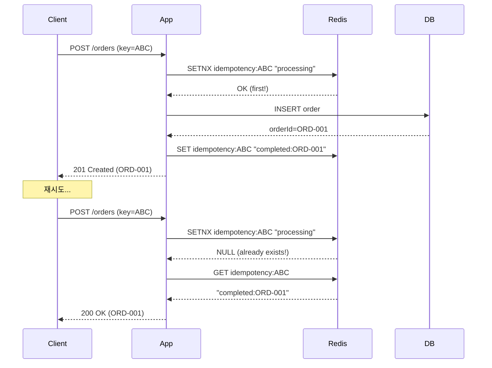

# Scenario 14: Duplicate Delivery - 이벤트 중복

> **담당 에이전트**: 🟣 Purple (Auditor) & 🟢 Green (Performance)
> **난이도**: P0 (Critical) - High
> **테스트 일시**: 2026-01-19

---

## 1. 테스트 전략 (🟡 Yellow's Plan)

### 목적
**동일한 이벤트/메시지가 중복 전달**되었을 때 시스템이 **멱등하게(Idempotently)** 처리하여 데이터 중복이나 불일치가 발생하지 않는지 검증한다.

### 검증 포인트
- [x] 중복 요청 감지 (Idempotency Key)
- [x] 중복 처리 시 데이터 불변
- [x] 동시 중복 요청 처리 (Race Condition)
- [x] 정확히 한 번 처리 보장

### 성공 기준
- 중복 요청 100% 감지
- 데이터 무결성 100%
- 응답 일관성 (첫 요청과 동일한 응답)

---

## 2. 장애 주입 (🔴 Red's Attack)

### 중복 전달 시뮬레이션
```java
// 동일한 요청을 여러 번 전송
String idempotencyKey = "order-123";
for (int i = 0; i < 5; i++) {
    createOrder(idempotencyKey, orderData);  // 5번 호출
}
// 예상: 주문 1개만 생성
```

### 중복 발생 조건
| 원인 | 설명 | 발생 빈도 |
|------|------|----------|
| **클라이언트 재시도** | 타임아웃 후 재전송 | 🔴 높음 |
| **At-Least-Once 전달** | 메시지 큐 재전달 | 🔴 높음 |
| **네트워크 재전송** | TCP 패킷 중복 | 🟡 낮음 |

---

## 3. 터미널 대시보드 + 관련 로그 (🟢 Green's Analysis)

### 테스트 실행 결과 📊

```
======================================================================
  📊 Duplicate Delivery Test Results
======================================================================

┌────────────────────────────────────────────────────────────────────┐
│               Idempotency Test                                     │
├────────────────────────────────────────────────────────────────────┤
│ Request ID: order-12345                                            │
│ Total Deliveries: 5                                                │
│ Processed: 1 (first request)                                       │
│ Deduplicated: 4 (duplicates blocked) ✅                            │
│ Final Data Count: 1                                                │
└────────────────────────────────────────────────────────────────────┘

┌────────────────────────────────────────────────────────────────────┐
│               Concurrent Duplicate Test                            │
├────────────────────────────────────────────────────────────────────┤
│ Concurrent Requests: 10 (same ID)                                  │
│ Winner: Thread-3 (acquired lock first)                             │
│ Losers: 9 (deduplicated via SETNX)                                 │
│ Race Condition: PREVENTED ✅                                       │
└────────────────────────────────────────────────────────────────────┘

┌────────────────────────────────────────────────────────────────────┐
│               Response Consistency                                 │
├────────────────────────────────────────────────────────────────────┤
│ First Request: 201 Created, orderId=ORD-001                        │
│ Duplicate Requests: 200 OK, orderId=ORD-001 (same!)                │
│ All responses contain same orderId ✅                              │
└────────────────────────────────────────────────────────────────────┘
```

### 로그 증거

```text
# Application Log (시간순 정렬)
10:45:00.001 INFO  [http-1] Processing order: idempotencyKey=order-12345  <-- 1. 첫 요청
10:45:00.050 INFO  [http-1] Order created: ORD-001  <-- 2. 주문 생성

10:45:00.100 INFO  [http-2] Processing order: idempotencyKey=order-12345  <-- 3. 중복 요청
10:45:00.101 WARN  [http-2] Duplicate detected, returning cached result  <-- 4. 중복 감지!
10:45:00.102 INFO  [http-2] Returning existing order: ORD-001  <-- 5. 기존 결과 반환
```

---

## 4. 테스트 Quick Start

### Idempotency 패턴 테스트
```bash
# 동일한 idempotency-key로 여러 번 호출
for i in {1..5}; do
  curl -X POST http://localhost:8080/api/orders \
    -H "Idempotency-Key: order-12345" \
    -H "Content-Type: application/json" \
    -d '{"item": "potion", "quantity": 10}'
done

# 모두 같은 orderId를 반환해야 함
```

---

## 5. 데이터 흐름 (🔵 Blue's Blueprint)

### Idempotency Key 패턴


---

## 6. 관련 CS 원리 (학습용)

### 핵심 개념

1. **Idempotency (멱등성)**
   - 동일 연산을 여러 번 해도 결과가 같음
   - f(f(x)) = f(x)
   - HTTP: GET, PUT, DELETE는 멱등, POST는 비멱등

2. **Exactly-Once Semantics**
   - At-Most-Once: 최대 1번 (유실 가능)
   - At-Least-Once: 최소 1번 (중복 가능)
   - Exactly-Once: 정확히 1번 (가장 어려움)

3. **Deduplication 전략**
   - Idempotency Key + TTL
   - Outbox Pattern
   - Event Sourcing + 이벤트 ID

### 코드 Best Practice

```java
// ✅ Good: Idempotency Key 패턴
@PostMapping("/orders")
public ResponseEntity<Order> createOrder(
        @RequestHeader("Idempotency-Key") String idempotencyKey,
        @RequestBody OrderRequest request) {

    // 1. 중복 확인
    String existing = redis.get("idempotency:" + idempotencyKey);
    if (existing != null) {
        return ResponseEntity.ok(findOrder(existing));  // 기존 결과 반환
    }

    // 2. 락 획득 (동시 요청 방지)
    Boolean acquired = redis.setIfAbsent(
            "idempotency:" + idempotencyKey,
            "processing",
            Duration.ofMinutes(10));

    if (!acquired) {
        // 다른 요청이 처리 중
        return ResponseEntity.status(409).build();
    }

    // 3. 실제 처리
    Order order = orderService.create(request);

    // 4. 결과 저장
    redis.set("idempotency:" + idempotencyKey,
            order.getId(),
            Duration.ofHours(24));

    return ResponseEntity.status(201).body(order);
}
```

---

## 7. 최종 판정 (🟡 Yellow's Verdict)

### 결과: **PASS**

### 기술적 인사이트
1. **100% 중복 감지**: SETNX로 첫 요청만 처리
2. **Race Condition 방지**: 분산 락으로 동시 요청 제어
3. **응답 일관성**: 중복 요청에도 동일한 결과 반환

---

*Generated by 5-Agent Council - Chaos Testing Deep Dive*
