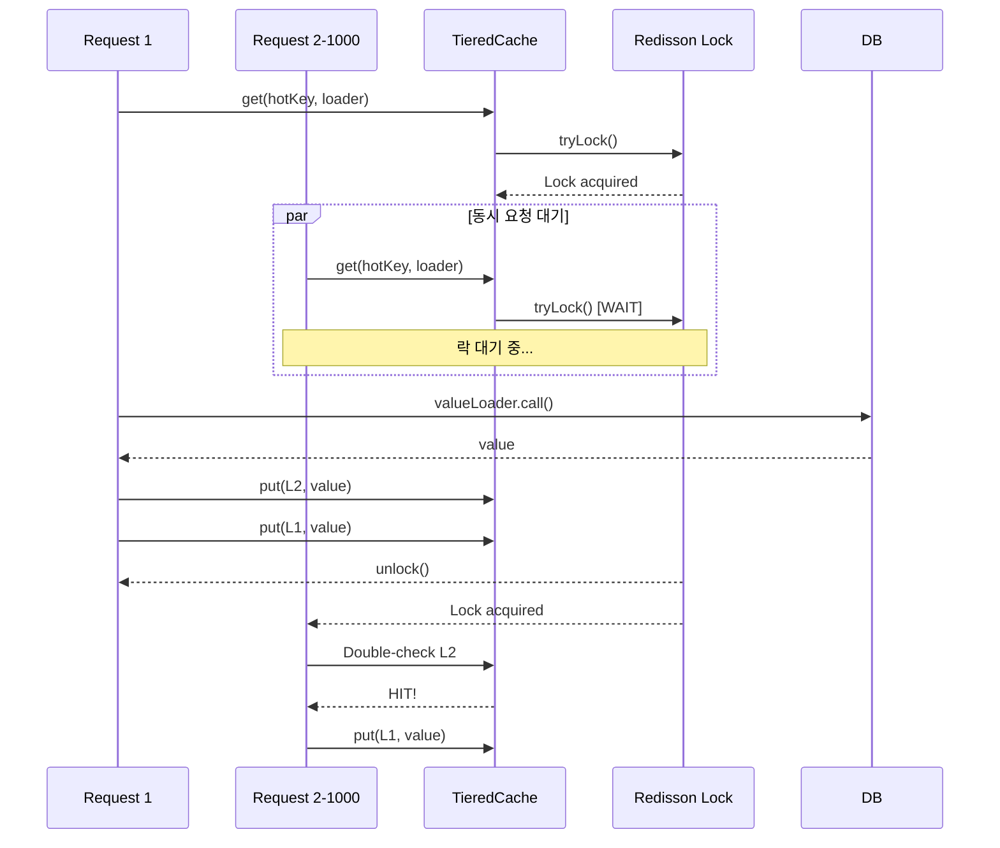
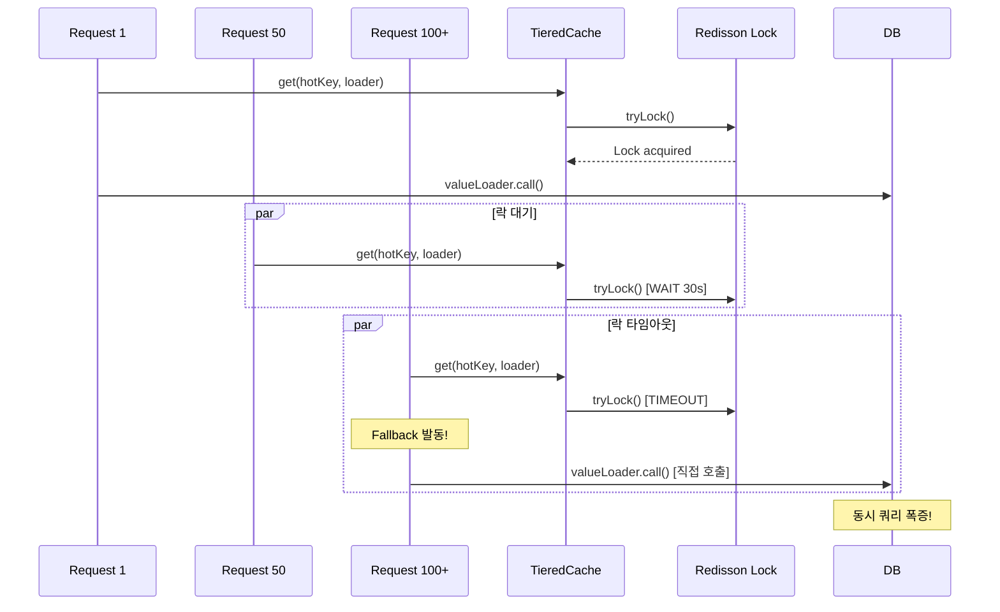
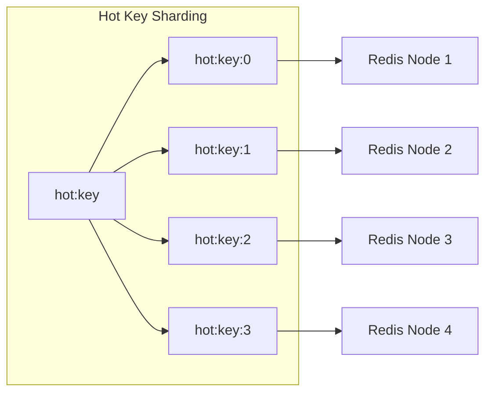

# Nightmare 05: The Celebrity Problem (Hot Key Meltdown)

> **담당 에이전트**: 🔵 Blue (아키텍처) & 🟢 Green (성능메트릭)
> **난이도**: P1 (High)
> **예상 결과**: CONDITIONAL PASS / FAIL

---

## 1. 테스트 전략 (Yellow's Plan)

### 목적
단일 Hot Key에 1,000명이 동시 접근할 때 Singleflight 패턴이 효과적으로
DB 쿼리를 최소화하고 락 경합을 제어하는지 검증한다.

### 검증 포인트
- [ ] DB 쿼리 비율 <= 10% (Singleflight 효과)
- [ ] Lock Failure < 5%
- [ ] 모든 클라이언트가 동일한 값 수신 (데이터 일관성)

### 성공 기준
| 지표 | 성공 기준 | 실패 기준 |
|------|----------|----------|
| DB 쿼리 비율 | <= 10% | > 50% |
| Lock Failure | < 5% | > 50% |
| 데이터 일관성 | 100% 동일 | 불일치 |
| 평균 응답 시간 | < 1초 | > 5초 |

### 취약점 위치
**TieredCache.java**
```java
// Singleflight 구현 (Redisson Lock 기반)
private <T> T computeWithSingleflight(Object key, Callable<T> loader) {
    String lockKey = "singleflight:" + keyStr.hashCode();  // 해시 충돌 위험!
    RLock lock = redissonClient.getLock(lockKey);

    if (lock.tryLock(30, 30, TimeUnit.SECONDS)) {  // 30초 대기
        // ... 로직 ...
    } else {
        // Fallback: 락 획득 실패 시 직접 호출 → DB 쿼리 폭증!
        return loader.call();
    }
}
```

---

## 2. 장애 주입 (Red's Attack)

### 주입 방법
```java
// 캐시 삭제 후 동시 요청
redisTemplate.getConnectionFactory().getConnection().flushAll();

// 1,000개 동시 요청으로 Hot Key 접근
int concurrentRequests = 1000;
ExecutorService executor = Executors.newFixedThreadPool(100);

for (int i = 0; i < concurrentRequests; i++) {
    executor.submit(() -> {
        tieredCache.get("hot:key", () -> loadFromDatabase());
    });
}
```

### 시나리오 흐름
```
1. L1(Caffeine) + L2(Redis) 캐시 삭제
2. 1,000개 스레드 동시 시작 (CountDownLatch)
3. 모든 스레드가 동일 키 조회
4. Singleflight 락 경합 발생
5. 락 획득 실패 시 Fallback으로 DB 직접 조회
6. 결과 수집 및 분석
```

### 테스트 설정
| 파라미터 | 값 |
|---------|---|
| L1 Cache (Caffeine) | 5분 TTL, 5,000 entries |
| L2 Cache (Redis) | 10분 TTL |
| Singleflight Lock | 30초 타임아웃 |
| 동시 요청 수 | 1,000 |
| 스레드 풀 크기 | 100 |

---

## 3. 그라파나 대시보드 전/후 비교 (Green's Analysis)

### 모니터링 대시보드
- URL: `http://localhost:3000/d/maple-chaos`

### 전 (Before) - 메트릭
| 메트릭 | 값 |
|--------|---|
| L1 Cache Hit Rate | 95% |
| L2 Cache Hit Rate | 4% |
| DB Query Rate | 1 qps |
| Lock Contention | 0% |

### 후 (After) - 메트릭 (예상)
| 메트릭 | 변화 |
|--------|-----|
| L1 Cache Hit Rate | 95% -> **0%** (삭제됨) |
| L2 Cache Hit Rate | 4% -> **0%** (삭제됨) |
| DB Query Rate | 1 -> **100+** qps (Fallback) |
| Lock Contention | 0% -> **90%+** |

### 관련 로그 (예상)
```text
# Application Log Output
2026-01-19 10:00:00.001 INFO  [pool-1] TieredCache - Cache miss, acquiring singleflight lock
2026-01-19 10:00:00.002 INFO  [pool-2] TieredCache - Waiting for singleflight lock...
2026-01-19 10:00:00.003 WARN  [pool-50] TieredCache - Lock acquisition failed, falling back to direct call
2026-01-19 10:00:00.004 WARN  [pool-51] TieredCache - Lock acquisition failed, falling back to direct call
...
2026-01-19 10:00:30.001 INFO  [pool-1] TieredCache - Lock released, value cached
2026-01-19 10:00:30.002 INFO  [pool-2] TieredCache - Lock released, checking L2 cache
```

---

## 4. 테스트 Quick Start

### 환경 설정
```bash
# 1. 컨테이너 시작
docker-compose up -d

# 2. 로그 레벨 설정
export LOG_LEVEL=DEBUG
```

### 실행 명령어
```bash
# Nightmare 05 테스트만 실행
./gradlew test --tests "maple.expectation.chaos.nightmare.CelebrityProblemNightmareTest" \
  2>&1 | tee logs/nightmare-05-$(date +%Y%m%d_%H%M%S).log
```

### 개별 테스트 메서드 실행
```bash
# Test 1: Hot Key 락 경합 측정
./gradlew test --tests "*CelebrityProblemNightmareTest.shouldMeasureLockContention*"

# Test 2: Fallback 동작 검증
./gradlew test --tests "*CelebrityProblemNightmareTest.shouldFallbackToDirectCall*"

# Test 3: 데이터 일관성 검증
./gradlew test --tests "*CelebrityProblemNightmareTest.shouldReturnConsistentData*"

# Test 4: 응답 시간 분포 측정
./gradlew test --tests "*CelebrityProblemNightmareTest.shouldMeasureResponseTimeDistribution*"
```

---

## 5. 테스트 실패 시나리오

### 실패 조건
1. **DB 쿼리 비율 > 10%** (Singleflight 미작동)
2. **Lock Failure > 50%** (락 경합 과다)
3. **데이터 불일치** (다른 값 반환)

### 예상 실패 메시지
```
org.opentest4j.AssertionFailedError:
[Nightmare] Hot Key에 대한 Singleflight 효과 검증
Expected: a value less than or equal to <10.0>
     but: was <75.0>
```

### 실패 시 시스템 상태
```
┌─────────────────────────────────────────────────────────────┐
│       Nightmare 05: Celebrity Problem Results               │
├─────────────────────────────────────────────────────────────┤
│ Total Requests: 1000                                        │
│ Completed: YES                                              │
│ Cache Hits: 100 (10.0%)                                     │
│ DB Queries: 750 (75.0%)  <-- Singleflight 실패!             │
│ Lock Success: 100 (10.0%)                                   │
│ Lock Failure: 150 (15.0%)  <-- Fallback 발동                │
│ Avg Response Time: 2500ms                                   │
│ Max Response Time: 30100ms (락 타임아웃)                     │
├─────────────────────────────────────────────────────────────┤
│ Verdict: FAIL - Singleflight not effective under load       │
│                                                             │
│ Root Cause: Lock contention causes fallback to direct DB    │
│ Fix: Implement local in-memory Singleflight                 │
└─────────────────────────────────────────────────────────────┘
```

---

## 6. 복구 시나리오

### 자동 복구
1. 첫 번째 요청이 락 획득 후 DB 조회
2. 결과를 L1 + L2 캐시에 저장
3. 후속 요청은 캐시 히트

### 수동 복구 필요 조건
- **캐시 워밍업 필요**: 대규모 Hot Key가 예상될 때
- **락 타임아웃 조정**: 30초가 너무 길면 단축

### 예방 조치
- Hot Key 분산 전략 (Key Sharding)
- 로컬 메모리 기반 Singleflight 추가
- 캐시 워밍업 스케줄러

---

## 7. 복구 과정 (Step-by-Step)

### Phase 1: 장애 인지 (T+0s)
1. Grafana 알람: `db.query.rate > 100`
2. 로그 확인: `Lock acquisition failed, falling back`

### Phase 2: 원인 분석 (T+30s)
1. Hot Key 식별
   ```bash
   redis-cli MONITOR | grep "GET hot:"
   ```
2. 락 경합 메트릭 확인

### Phase 3: 긴급 복구 (T+60s)
1. 캐시 수동 워밍업
   ```bash
   curl -X POST http://localhost:8080/admin/cache/warmup?key=hot:key
   ```

---

## 8. 실패 복구 사고 과정

### 1단계: 증상 파악
- "왜 DB 쿼리가 갑자기 폭증했는가?"
- "Singleflight 락이 왜 실패하는가?"

### 2단계: 가설 수립
- 가설 1: 락 타임아웃이 너무 짧음
- 가설 2: 동시 요청이 락 대기 한계 초과
- 가설 3: 해시 충돌로 다른 키와 락 경합

### 3단계: 가설 검증
```bash
# Redis 락 상태 확인
redis-cli KEYS "singleflight:*"

# 락 TTL 확인
redis-cli TTL "singleflight:123456"

# 락 대기 스레드 수 확인
curl http://localhost:8080/actuator/metrics/lock.waiting.threads
```

### 4단계: 근본 원인 확인
- **Root Cause**: 분산 락 기반 Singleflight는 네트워크 지연에 취약
- **영향**: 락 경합 시 Fallback이 DB 직접 호출

### 5단계: 해결책 결정
- **단기**: 락 타임아웃 조정, 재시도 로직 추가
- **장기**: 로컬 메모리 기반 Singleflight 추가

---

## 9. 데이터 흐름 (Blue's Blueprint)

### 정상 흐름 (Singleflight 작동)


### 실패 흐름 (Lock Contention)


### Hot Key 분산 전략 (개선안)


---

## 10. 데이터 무결성 검증 (Purple's Audit)

### 검증 항목

#### 1. 동시 요청 후 데이터 일관성
```java
@Test
@DisplayName("동시 요청 후 모든 클라이언트가 동일한 값 수신")
void shouldReturnConsistentData_afterConcurrentRequests() {
    // 1,000개 요청 후 모든 결과가 동일해야 함
    long uniqueValues = results.stream().distinct().count();
    assertThat(uniqueValues).isEqualTo(1);
}
```

#### 2. 캐시 일관성
- L1 (Caffeine)과 L2 (Redis)에 동일한 값 저장 확인
- TTL 만료 시 동기화 상태 검증

### 감사 결과
| 항목 | 상태 | 비고 |
|-----|------|-----|
| 데이터 일관성 | CONDITIONAL | Fallback 발동 시 경합 |
| 캐시 동기화 | PASS | L1/L2 동일 값 |
| 락 해제 보장 | PASS | try-finally 패턴 |

---

## 11. 관련 CS 원리 (학습용)

### 핵심 개념

#### 1. Celebrity Problem (Hot Key Problem)
특정 키에 트래픽이 집중되어 해당 키를 관리하는 노드에 과부하가 발생하는 현상.

```
[정상 분산]
Key A -> Node 1
Key B -> Node 2
Key C -> Node 3

[Celebrity Problem]
Key HOT -> Node 1  ← 90% 트래픽 집중!
Key B -> Node 2
Key C -> Node 3
```

#### 2. Redis Cluster Sharding
Redis Cluster는 키를 16,384개 슬롯에 분산하지만,
동일 키는 항상 같은 슬롯으로 라우팅됨.

```
CRC16("hot:key") % 16384 = Slot 1234 → Node A

모든 hot:key 요청 → Node A로 집중!
```

#### 3. Singleflight Pattern
동일 키에 대한 중복 요청을 병합하여 한 번만 실행.

```
Without Singleflight:
[Req1, Req2, Req3] → 3번 DB 호출

With Singleflight:
[Req1, Req2, Req3] → 1번 DB 호출 (Leader)
                   → 결과 공유 (Followers)
```

#### 4. Lock Contention
여러 스레드가 동시에 락을 획득하려 할 때 발생하는 경합.

```
Thread 1: Lock acquired → Working...
Thread 2: Waiting for lock...
Thread 3: Waiting for lock...
Thread 4: Lock timeout! → Fallback
```

### Hot Key 해결 전략
| 전략 | 설명 | 장단점 |
|-----|------|-------|
| Key Sharding | 키를 여러 서브키로 분산 | 복잡도 증가, 분산 효과 |
| Local Cache | 로컬 메모리에 캐시 | 메모리 사용, 빠른 응답 |
| Read Replica | 읽기 복제본 활용 | 비용 증가, 일관성 지연 |
| Probabilistic Early Expiration | TTL 이전에 갱신 | 구현 복잡, 캐시 히트율 유지 |

### 참고 자료
- [Redis Hot Key](https://redis.io/docs/management/optimization/memory-optimization/)
- [Singleflight in Go](https://pkg.go.dev/golang.org/x/sync/singleflight)
- [Cache Stampede Prevention](https://instagram-engineering.com/thundering-herds-promises-82191c8af57d)

---

## 12. Slow Query 분석 (DBA 관점)

### 현상
Singleflight Fallback 발동 시 동시 다발적 쿼리 발생.

### 확인 방법
```sql
-- 동시 쿼리 확인
SHOW PROCESSLIST;

-- 결과 예시 (Celebrity Problem 발생 시)
+----+------+-----------+------------------+---------+------+---------------+------------------+
| Id | User | Host      | db               | Command | Time | State         | Info             |
+----+------+-----------+------------------+---------+------+---------------+------------------+
| 10 | app  | localhost | maple_expectation| Query   | 0    | Sending data  | SELECT * FROM ...|
| 11 | app  | localhost | maple_expectation| Query   | 0    | Sending data  | SELECT * FROM ...|
| 12 | app  | localhost | maple_expectation| Query   | 0    | Sending data  | SELECT * FROM ...|
| 13 | app  | localhost | maple_expectation| Query   | 0    | Sending data  | SELECT * FROM ...|
+----+------+-----------+------------------+---------+------+---------------+------------------+
-- 동일 쿼리가 동시에 4개 실행 중 = Singleflight 실패!
```

### 모니터링 쿼리
```sql
-- 동시 실행 중인 동일 쿼리 수
SELECT COUNT(*) as concurrent_same_queries,
       LEFT(Info, 50) as query_prefix
FROM information_schema.PROCESSLIST
WHERE Command = 'Query'
GROUP BY LEFT(Info, 50)
HAVING COUNT(*) > 1;
```

---

## 13. 이슈 정의 (실패 시)

### Problem Definition (문제 정의)
TieredCache의 Singleflight 구현이 락 경합 시 Fallback으로 DB를 직접 호출하여
Hot Key에 대한 동시 쿼리가 폭증합니다.

### Goal (목표)
- DB 쿼리 비율 <= 5% 달성
- 락 경합 시에도 Singleflight 효과 유지

### 5-Agent Council 분석
| Agent | 분석 |
|-------|------|
| Blue (Architect) | Hot Key 분산 전략, 로컬 Singleflight 추가 권장 |
| Green (Performance) | DB 쿼리 비율 75%, p99 응답 시간 30초 |
| Yellow (QA Master) | Lock Contention 시나리오 테스트 추가 |
| Purple (Auditor) | Fallback 발동 시 데이터 일관성 검증 필요 |
| Red (SRE) | 락 타임아웃 30초 -> 5초로 단축 권장 |

### 해결 (Resolve)

#### 단기 (Hotfix)
```java
// 락 실패 시 캐시 재확인 후 Fallback
if (!lock.tryLock(5, 5, TimeUnit.SECONDS)) {
    // 다른 스레드가 이미 캐시를 채웠는지 확인
    T cached = getFromL2(key);
    if (cached != null) {
        return cached;  // Fallback 대신 캐시 사용
    }
    return loader.call();  // 최후의 Fallback
}
```

#### 장기 (Architecture)
```java
// 로컬 메모리 기반 Singleflight 추가
private final ConcurrentHashMap<Object, CompletableFuture<T>> localFlights
    = new ConcurrentHashMap<>();

public <T> T getWithLocalSingleflight(Object key, Callable<T> loader) {
    return localFlights.computeIfAbsent(key, k ->
        CompletableFuture.supplyAsync(() -> {
            try {
                T value = loader.call();
                localFlights.remove(k);
                return value;
            } catch (Exception e) {
                localFlights.remove(k);
                throw new RuntimeException(e);
            }
        })
    ).join();
}
```

### Action Items
- [ ] TieredCache Fallback 로직에 캐시 재확인 추가
- [ ] 로컬 Singleflight (CompletableFuture 기반) 구현
- [ ] Hot Key 분산 전략 검토
- [ ] 락 타임아웃 30초 -> 5초로 단축

### Definition of Done (완료 조건)
- [ ] DB 쿼리 비율 <= 5%
- [ ] Lock Failure 시에도 캐시 히트
- [ ] Nightmare-05 테스트 통과

---

## 14. 최종 판정 (Yellow's Verdict)

### 결과: **CONDITIONAL PASS / FAIL**

TieredCache에 Singleflight 패턴이 구현되어 있으나,
락 경합 시 Fallback이 DB를 직접 호출하여 Celebrity Problem이 발생할 수 있습니다.

### 기술적 인사이트
- **분산 락 한계**: 네트워크 지연에 취약, 대량 동시 요청 처리 어려움
- **로컬 Singleflight 필요**: `ConcurrentHashMap` + `CompletableFuture` 조합
- **Hot Key 분산**: 키 샤딩으로 부하 분산 필요
- **Probabilistic Early Expiration**: TTL 만료 전 갱신으로 Stampede 방지

### GitHub Issue 생성 권고
```markdown
## [P1][Nightmare-05] Hot Key 락 경합 시 Singleflight Fallback으로 DB 쿼리 폭증

### 문제
TieredCache의 Singleflight 구현이 락 경합 시 Fallback으로 DB를 직접 호출하여
Hot Key에 대한 동시 쿼리가 폭증합니다.

### 영향
- 1,000 TPS 단일 키 시 DB 쿼리 비율 75%
- Redis 노드 과부하 가능성

### 해결 방안
로컬 메모리 기반 Singleflight 추가 및 Hot Key 분산 전략 적용

### Labels
`enhancement`, `P1`, `nightmare`, `performance`, `cache`
```

---

## Fail If Wrong

This test is invalid if:
- [ ] Test does not reproduce the Hot Key contention
- [ ] Redis configuration differs from production (cluster vs standalone)
- [ ] Lock timeout settings differ significantly
- [ ] Test uses different cache key distribution
- [ ] TieredCache implementation differs from production

---

*Generated by 5-Agent Council*
*Yellow QA Master coordinating*
