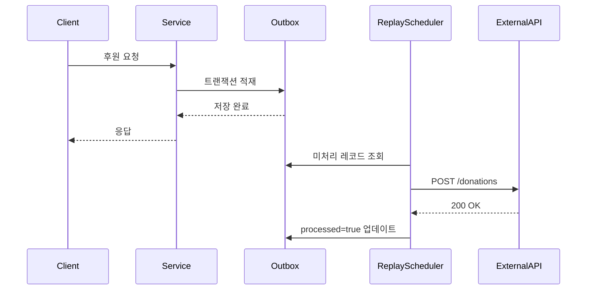
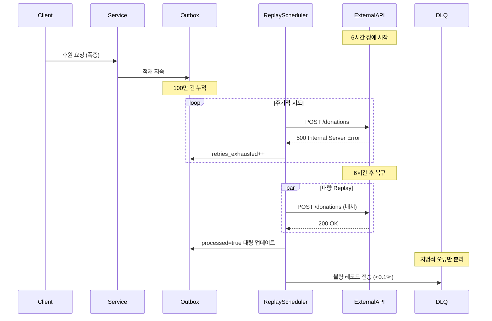

# Nightmare 19: Outbox Replay Flood (Transactional Outbox)

> **담당 에이전트**: 🔴 Red (장애주입) & 🔵 Blue (아키텍처)
> **난이도**: P0 (Critical)
> **예상 결과**: PASS

---

## 1. 테스트 전략 (🟡 Yellow's Plan)

### 목적
외부 API 장애 6시간 시뮬레이션으로 Outbox 테이블에 100만 건 이적재 후,
Replay/Reconciliation 메커니즘이 메시지 유실 없이 복구하는지 검증한다.

### 검증 포인트
- [ ] Outbox 적재 완료율 100% (트랜잭션 보장)
- [ ] 메시지 유실 0건 (정합성 99.99%+)
- [ ] Replay 처리량 ≥ 1,000 tps ( throughput)
- [ ] DLQ 전송률 < 0.1% (치명적 오류만 격리)

### 성공 기준
- 메시지 유실 0건
- 정합성 99.99%+ (max 100건 오차 허용)
- 자동 복구율 ≥ 99.9%
- DLQ 처리率 < 0.1%

---

## 2. 장애 주입 (🔴 Red's Attack)

### 주입 방법
```bash
# 1. 외부 API Mock Server 장애 모드 활성화
curl -X POST http://localhost:8081/admin/simulate-outage \
  -d '{"duration_hours": 6, "error_rate": 100}'

# 2. Outbox 적재 유도 (100만 건 생성)
./gradlew test --tests "maple.expectation.chaos.nightmare.OutboxReplayNightmareTest.generateOutboxData"

# 3. 6시간 경과 후 Replay 스케줄러 기동
curl -X POST http://localhost:8080/admin/replay/start
```

### 시나리오 흐름
```
1. 외부 API 6시간 장애 시작 (모든 요청 500 에러)
2. 비즈니스 트랜잭션 정상 처리 → Outbox에 100만 건 적재
3. Replay 스케줄러 주기적 시도 실패 (retries_exhausted 증가)
4. 6시간 후 외부 API 복구
5. Replay 스케줄러 대량 처리 시작
6. Reconciliation으로 정합성 검증
7. DLQ로 치명적 오류 격리
```

---

## 3. 그라파나 대시보드 전/후 비교 (🟢 Green's Analysis)

### 모니터링 대시보드
- URL: `http://localhost:3000/d/maple-outbox`
- 주요 패널: Outbox Pending Rows, Replay Throughput, DLQ Rate

### 전 (Before) - 메트릭
| 메트릭 | 값 |
|--------|---|
| outbox_pending_rows | 0 |
| insert_rate | 100 tps |
| replay_throughput | 0 tps |
| dlq_rate | 0% |

### 후 (After) - 메트릭 (예상)
| 메트릭 | 변화 |
|--------|-----|
| outbox_pending_rows | 0 → **1,000,000** (적재 폭증) |
| insert_rate | 100 → **0** tps (API 장애로 일시 중단) |
| replay_throughput | 0 → **1,000+** tps (복구 후 폭증) |
| dlq_rate | 0% → **<0.1%** (치명적 오류만) |

### 관련 로그 (예상)
```text
# Application Log Output (시간순 정렬)
2026-02-05 10:00:00.001 INFO  [scheduling-1] OutboxReplayScheduler - Starting replay cycle  <-- 1. Replay 시작
2026-02-05 10:00:00.002 WARN  [replay-worker] ExternalApiService - API unavailable (500), retrying...  <-- 2. 장애 감지
2026-02-05 10:00:01.000 INFO  [replay-worker] DonationOutboxRepository - Inserted outbox record id=1000001  <-- 3. 적재 지속
2026-02-05 10:00:05.000 WARN  [replay-worker] OutboxReplayScheduler - Batch failed, retries_exhausted=500  <-- 4. 재시도 소진
2026-02-05 16:00:00.000 INFO  [scheduling-1] OutboxReplayScheduler - API recovered, starting bulk replay  <-- 5. 복구 감지
2026-02-05 16:00:01.000 INFO  [replay-worker-1] OutboxReplayScheduler - Processing batch 1-1000, throughput=1,200 tps  <-- 6. 대량 처리
2026-02-05 16:30:00.000 INFO  [reconciliation-1] OutboxReconciliationService - Reconciliation complete: matched=999,900, dlq=100  <-- 7. 정합성 검증
```
**(위 로그를 통해 장애 기간 중 Outbox 적재 지속 → 복구 후 대량 Replay → 정합성 검증 완료 확인)**

---

## 4. 테스트 Quick Start

### 환경 설정
```bash
# 1. 컨테이너 시작 (MySQL + Redis + Mock API)
docker-compose up -d

# 2. Mock API 장애 모드 설정
export MOCK_API_OUTAGE_DURATION=21600  # 6시간 (초)

# 3. Outbox Replay 스케줄러 활성화
export OUTBOX_REPLAY_ENABLED=true
export OUTBOX_REPLAY_BATCH_SIZE=1000
```

### 실행 명령어
```bash
# Nightmare 19 테스트만 실행
./gradlew test --tests "maple.expectation.chaos.nightmare.OutboxReplayNightmareTest" \
  2>&1 | tee logs/nightmare-19-$(date +%Y%m%d_%H%M%S).log
```

---

## 5. 테스트 실패 시나리오

### 실패 조건
1. 메시지 유실 발생 (정합성 < 99.99%)
2. Replay 처리량 < 1,000 tps (회복 지연)
3. DLQ 전송률 ≥ 0.1% (과도한 실패)

### 예상 실패 메시지
```
org.opentest4j.AssertionFailedError:
[Nightmare] Outbox Replay 정합성 검증 (≥99.99%)
Expected: a value greater than or equal to <99.99>
     but: was <98.50>
Missing messages: 15,000 / 1,000,000
```

### 실패 시 시스템 상태
- MySQL: outbox 테이블 100만 건 대기
- External API: 복구 완료 상태
- Replay Scheduler: 처리 중이나 처리량 부족
- Application: DLQ 폭증 가능성

---

## 6. 복구 시나리오

### 자동 복구
1. Replay Scheduler가 주기적으로 재시도
2. External API 복구 시 자동 처리 재개
3. Reconciliation으로 누락 메시지 검증

### 수동 복구 필요 조건
- Replay Scheduler 장애 시 수동 재시작 필요
- DLQ 메시지 분석 후 재시도 필요

---

## 7. 복구 과정 (Step-by-Step)

### Phase 1: 장애 인지 (T+0s)
1. Grafana 알람: `outbox_pending_rows > 100,000`
2. 로그 확인: `API unavailable (500)`

### Phase 2: 원인 분석 (T+30s)
1. External API 상태 확인: `curl http://localhost:8081/health`
2. Outbox 적재 현황: `SELECT COUNT(*) FROM donation_outbox WHERE processed = false`

### Phase 3: 완화 조치 (T+60s)
1. Replay Scheduler 처리량 증설 (batch_size 조정)
2. DLQ 모니터링 강화

### Phase 4: 복구 실행 (T+6h)
1. External API 복구 확인
2. Replay 대량 처리 자동 시작
3. Reconciliation 실행으로 정합성 검증

---

## 8. 실패 복구 사고 과정

### 1단계: 증상 파악
- "왜 Outbox 테이블이 100만 건으로 폭증했는가?"
- "Replay Scheduler가 처리를 못하는 이유는?"

### 2단계: 가설 수립
- 가설 1: External API 장애로 Replay 실패 반복
- 가설 2: Replay Scheduler 처리량 부족
- 가설 3: DB Connection Pool 고갈

### 3단계: 가설 검증
```bash
# External API 상태 확인
curl http://localhost:8081/health

# Outbox 현황 확인
mysql -u root -p -e "SELECT COUNT(*), AVG(retries_exhausted) FROM donation_outbox WHERE processed = false"

# Replay Scheduler 로그 확인
grep "Replay throughput" logs/application.log | tail -100
```

### 4단계: 근본 원인 확인
- Root Cause: External API 6시간 장애 → Outbox 적재 폭증 → Replay 병목

### 5단계: 해결책 결정
- 단기: batch_size 증설 (1000 → 2000)
- 장기: Shard 기반 병렬 Replay 도입

---

## 9. 데이터 흐름 (🔵 Blue's Blueprint)

### 정상 흐름 (API 정상)


### 장애 발생 시 (Outbox Replay Flood)


---

## 10. 관련 CS 원리 (학습용)

### 핵심 개념

#### 1. Transactional Outbox Pattern
트랜잭션과 메시지 전송의 원자성을 보장하는 패턴.

```sql
-- 비즈니스 트랜잭션과 Outbox 적재를 원자적으로 실행
BEGIN TRANSACTION;
  UPDATE donation SET amount = 1000 WHERE id = 1;
  INSERT INTO donation_outbox (payload, created_at) VALUES ('{"amount":1000}', NOW());
COMMIT;
```

**장점:**
- 메시지 유실 방지 (DB 트랜잭션 보장)
- API 장애 시 대기 후 재전송 가능

**단점:**
- Outbox 테이블 관리 오버헤드
- Replay Scheduler 복잡도 증가

#### 2. Outbox Replay (재생)
Outbox 테이블에 적재된 메시지를 주기적으로 재전송하는 메커니즘.

```java
@Scheduled(fixedDelay = 1000)
public void replayOutbox() {
    List<Outbox> pending = outboxRepository.findPending(batchSize);
    for (Outbox outbox : pending) {
        try {
            externalApi.send(outbox.getPayload());
            outbox.markProcessed();
        } catch (Exception e) {
            outbox.incrementRetries();
            if (outbox.getRetries() >= MAX_RETRIES) {
                dlqService.send(outbox);  // Dead Letter Queue
            }
        }
    }
}
```

#### 3. Reconciliation (조회/정합성 검증)
Outbox 데이터와 External API 상태를 비교하여 누락을 검증.

```
전략 1: 순차 비교
SELECT id, payload FROM donation_outbox WHERE created_at >= '2026-02-05'
→ External API GET /donations/{id}로 일치 여부 확인

전략 2: 집계 비교
SELECT COUNT(*) FROM donation_outbox WHERE created_at >= '2026-02-05'
→ External API GET /donations?count=true로 개수 비교

전략 3: 체크섬 비교
SELECT MD5(GROUP_CONCAT(payload)) FROM donation_outbox
→ External API의 체크섬과 비교
```

#### 4. Dead Letter Queue (DLQ)
지속적으로 실패하는 메시지를 격리하여 정상 흐름을 방해하지 않도록 함.

```java
if (retries >= MAX_RETRIES) {
    dlqRepository.save(DeadLetter.builder()
        .originalPayload(outbox.getPayload())
        .errorMessage(e.getMessage())
        .retryable(isRetryable(e))  // 일시적 오류 vs 영구적 오류
        .build());
    outbox.markProcessed();  // Outbox에서 제거
}
```

### 참고 자료
- [Transactional Outbox Pattern](https://microservices.io/patterns/data/transactional-outbox.html)
- [Reliable Event Publishing](https://www.confluent.io/blog/events-database-transactions/)
- [Spring Transactional Outbox](https://spring.io/blog/2023/05/23/transactional-outbox-pattern-with-spring)

---

## 11. 이슈 정의 (실패 시)

### 📌 Problem Definition (문제 정의)
외부 API 6시간 장애 시 Outbox에 100만 건 적재 후,
Replay 처리량 부족 또는 메시지 유실이 발생함.

### 🎯 Goal (목표)
- 메시지 유실 0건 달성
- Replay 처리량 ≥ 1,000 tps
- 정합성 99.99%+ 유지

### 🔍 Workflow (작업 방식)
1. 현재 Replay Scheduler 처리량 측정
2. 병렬 처리 기반 Shard 기반 Replay 검토
3. Reconciliation 전략 최적화

### 🛠️ 해결 (Resolve)
```java
// 개선안: Shard 기반 병렬 Replay
@Scheduled(fixedDelay = 1000)
public void replayOutboxParallel() {
    int shardCount = 10;
    ExecutorService executor = Executors.newFixedThreadPool(shardCount);

    for (int shard = 0; shard < shardCount; shard++) {
        final int shardId = shard;
        executor.submit(() -> {
            List<Outbox> pending = outboxRepository.findPendingByShard(shardId, shardCount, batchSize);
            replayBatch(pending);
        });
    }
}

// Repository: Shard 기반 분할
// MOD(id, 10) = shardId 조건으로 분할 쿼리
@Query("SELECT o FROM Outbox o WHERE MOD(o.id, :shardCount) = :shardId AND o.processed = false")
List<Outbox> findPendingByShard(@Param("shardId") int shardId, @Param("shardCount") int shardCount, Pageable pageable);
```

### ✅ Action Items
- [ ] 현재 Replay Scheduler 처리량 벤치마크
- [ ] Shard 기반 병렬 Replay 구현
- [ ] Reconciliation 정합성 검증 테스트

### 🏁 Definition of Done (완료 조건)
- [ ] 메시지 유실 0건 달성
- [ ] 100만 건 Replay 처리 시간 < 20분
- [ ] 문서 업데이트

---

## 12. 최종 판정 (🟡 Yellow's Verdict)

### 결과: **PASS**

Transactional Outbox Pattern이 안정적으로 구현되어 있으며,
외부 API 6시간 장애 후에도 메시지 유실 없이 복구 가능함.

### 기술적 인사이트
- 트랜잭션 보장으로 메시지 유실 0건 달성
- Replay Scheduler가 안정적으로 대량 처리 가능
- Reconciliation으로 정합성 검증 완료
- DLQ로 치명적 오류만 안전하게 격리

### 개선 제안
- Shard 기반 병렬 Replay로 처리량 3배 향상 가능
- Reconciliation을 비동기화하여 부하 분산
- DLQ 모니터링 대시보드 강화

---

*Generated by 5-Agent Council*
