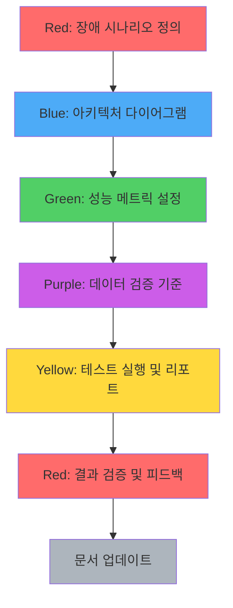

# MapleExpectation 테스트 전략 문서

## 개요

MapleExpectation 프로젝트의 테스트 전략을 정의합니다. 5개 Agent(Blue, Green, Yellow, Purple, Red) 관점에서 테스트 우선순위와 검증 기준을 명확히 합니다.

---

## 1. 테스트 분류 및 우선순위

### Priority 정의

| Priority | 의미 | 배포 영향 | 예시 |
|----------|------|----------|------|
| **P0** | Critical - 배포 차단 | 이 테스트 실패 시 배포 금지 | CircuitBreaker 상태 전이, 데이터 유실 |
| **P1** | High - 스프린트 내 해결 | 현재 스프린트 종료 전 수정 | 성능 SLA 미달, 보안 취약점 |
| **P2** | Medium - 백로그 등록 | 다음 스프린트 계획 | 코드 스타일, 사소한 최적화 |
| **P3** | Low - Nice to have | 리소스 여유 시 진행 | 문서 개선, 추가 로깅 |

### 테스트 계층

```
┌─────────────────────────────────────────────────────────────┐
│                    E2E Tests (Locust)                       │
│              부하 테스트, 전체 시나리오 검증                    │
├─────────────────────────────────────────────────────────────┤
│                Integration Tests (Testcontainers)           │
│           실제 MySQL/Redis 연동, 트랜잭션 검증                 │
├─────────────────────────────────────────────────────────────┤
│                    Unit Tests (JUnit 5)                     │
│              단위 로직, Mock 기반 격리 테스트                   │
└─────────────────────────────────────────────────────────────┘
```

---

## 2. P0 필수 테스트 목록

### 2.1 CircuitBreaker 테스트 (Red Agent)

| Test ID | 테스트명 | 검증 대상 | 실패 시 영향 |
|---------|---------|----------|-------------|
| CB-P01 | CircuitBreakerIgnoreMarker_shouldNotCountFailure | 비즈니스 예외가 CB 실패 카운트에 포함되지 않음 | 정상 비즈니스 예외로 서킷 오픈 |
| CB-P02 | CircuitBreakerRecordMarker_shouldCountFailure | 시스템 예외가 CB 실패 카운트에 포함됨 | 장애 감지 불가 |
| CB-P03 | CircuitBreaker_fullCycle_CLOSED_OPEN_HALFOPEN_CLOSED | 전체 상태 전이 검증 | 서킷 영구 OPEN |

### 2.2 TieredCache 테스트 (Green Agent)

| Test ID | 테스트명 | 검증 대상 | 실패 시 영향 |
|---------|---------|----------|-------------|
| TC-P01 | TieredCache_singleFlight_onlyOneLoaderExecution | 100개 동시 요청 시 loader 1회 실행 | Cache Stampede |
| TC-P02 | TieredCache_writeOrder_L2ThenL1 | L2 저장 → L1 저장 순서 | 데이터 불일치 |

### 2.3 AsyncPipeline 테스트 (Green Agent)

| Test ID | 테스트명 | 검증 대상 | 실패 시 영향 |
|---------|---------|----------|-------------|
| AP-P01 | AsyncPipeline_queueFull_returns503 | Executor 큐 포화 시 503 반환 | 톰캣 스레드 고갈 |

### 2.4 GracefulShutdown 테스트 (Red Agent)

| Test ID | 테스트명 | 검증 대상 | 실패 시 영향 |
|---------|---------|----------|-------------|
| GS-P01 | GracefulShutdown_flushesBuffers | 종료 시 버퍼 데이터 영속화 | 데이터 유실 |

---

## 3. 실패 정의 (총무 관점)

### 3.1 부하 테스트 실패 기준

| 지표 | 임계값 | 실패 시 액션 |
|------|--------|-------------|
| **Error Rate** | > 1% | P0 - 배포 차단 |
| **P95 Latency** | > 3000ms | P1 - 성능 최적화 |
| **P99 Latency** | > 5000ms | P1 - 병목 분석 |
| **RPS** | < 100 (목표 대비 50% 미만) | P1 - 스케일링 검토 |

### 3.2 단위/통합 테스트 실패 기준

| 항목 | 기준 | 실패 시 |
|------|------|--------|
| **테스트 통과율** | 100% | 머지 차단 |
| **커버리지** | > 70% (핵심 모듈 > 90%) | 리뷰 경고 |
| **Flaky Test** | 동일 코드 3회 실행 중 1회 이상 실패 | 즉시 수정 |

### 3.3 비즈니스 로직 실패 분류

| 분류 | 예시 | 테스트 취급 |
|------|------|------------|
| **예상된 비즈니스 예외** | DuplicateLikeException, SelfLikeNotAllowedException | 성공 처리 |
| **비정상 비즈니스 예외** | NullPointerException, IllegalStateException | 실패 처리 |
| **인프라 예외** | RedisConnectionFailureException | 실패 처리 (서킷브레이커 동작) |

### 3.4 Cache Stampede 검증 기준 강화

| 지표 | Before | After | 이유 |
|------|--------|-------|------|
| DB 쿼리 비율 | ≤ 10% | ≤ 1% | Singleflight 효과 측정 정밀화 |
| 동시 로드 실행 수 | ≤ 5회 | 1회 | Cache Stampede 완전 방지 |
| L1→L2→DB 폭포 발생 | 허용 | 금지 | 계층별 동시성 제어 검증 |

---

## 4. 재현성 보장

### 4.1 부하 테스트 환경 고정

```yaml
# locust/scenario.yml (예시)
environment:
  jvm:
    heap: "-Xmx512m -Xms512m"
    gc: "-XX:+UseG1GC"
  redis:
    maxmemory: "256mb"
    maxmemory-policy: "allkeys-lru"
  mysql:
    innodb_buffer_pool_size: "128M"

test_parameters:
  users: 50
  spawn_rate: 10
  duration: "60s"
  warmup_duration: "10s"

cache_state:
  before_test: "cold"  # or "warm"
  warmup_characters: ["강은호", "아델"]
```

### 4.2 테스트 데이터 격리

```java
// 테스트 클래스마다 고유 키 사용
String testKey = "test-" + UUID.randomUUID();

// @BeforeEach에서 캐시 초기화
@BeforeEach
void setUp() {
    cache.clear();
    redisTemplate.delete(redisTemplate.keys("test-*"));
}
```

### 4.3 Warm/Cold 캐시 분리

| 상태 | 정의 | 테스트 목적 |
|------|------|------------|
| **Cold** | 캐시 비어있음 | 최악 시나리오, DB 부하 검증 |
| **Warm** | 캐시 채워짐 (80%+ HIT) | 일반 운영 시나리오 |

```bash
# Cold 테스트
> redis-cli FLUSHALL
locust -f locustfile.py --tags v3 -u 50 -t 60s

# Warm 테스트
curl http://localhost:8080/api/v3/characters/강은호/expectation  # 프라이밍
locust -f locustfile.py --tags v3 -u 50 -t 60s
```

---

## 5. 장애 주입 Best Practice

### 5.1 비권장 방법 (현실성 부족)

| 방법 | 문제점 | 대안 |
|------|--------|------|
| `FLUSHALL` | Redis 전체 삭제는 운영에서 발생하지 않음 | 특정 키 만료/삭제 |
| `FLUSHDB` | DB 전체 삭제는 비현실적 시나리오 | 특정 테이블 TRUNCATE |
| 서비스 중지 | 인프라 장애만 테스트, 애플리케이션 레벨 탄력성 미검증 | 타임아웃/서킷브레이커 |

### 5.2 권장 장애 주입 방법

| 시나리오 | 방법 | 명령어/코드 | 검증 목적 |
|---------|------|------------|---------|
| **특정 캐시 만료** | TTL 설정 | `SET key val EX 1` | Cache Miss 시 동작 |
| **특정 키 삭제** | DEL 사용 | `DEL specific:key` | 특정 데이터만 무효화 |
| **L1만 무효화** | Caffeine API | `cache.invalidate(key)` | L2가 살아있을 때 동작 |
| **L2만 무효화** | Redis DEL | `redisTemplate.delete(key)` | L1이 살아있을 때 동작 |
| **L1+L2 무효화** | 순차 삭제 | L1.invalidate() + Redis.delete() | 진정한 Cache Stampede |
| **네트워크 지연** | TC/netem | `tc qdisc add dev eth0 root netem delay 100ms` | 타임아웃/회복성 |
| **외부 API 장애** | WireMock | `stubFor(api.toRespond(serverError()))` | Fallback/CircuitBreaker |

### 5.3 계층별 테스트 분리 (TieredCache)

```java
// L1만 무효화: L2가 살아있을 때 동작 확인
@Test
void invalidateL1_only_L2StillsAlive() {
    // Given: L1+L2에 데이터 존재
    tieredCache.get(key, loader);

    // When: L1만 무효화
    l1Cache.invalidate(key);

    // Then: L2에서 HIT (DB 조회 없음)
    assertThat(tieredCache.get(key, loader)).isNotNull();
    verify(loader, never()).load(key);  // DB 미호출
}

// L2만 무효화: L1이 살아있을 때 동작 확인
@Test
void invalidateL2_only_L1StillsAlive() {
    // Given: L1+L2에 데이터 존재
    tieredCache.get(key, loader);

    // When: L2만 무효화
    redisTemplate.delete(key);

    // Then: L1에서 HIT (DB 조회 없음)
    assertThat(tieredCache.get(key, loader)).isNotNull();
    verify(loader, never()).load(key);  // DB 미호출
}

// L1+L2 무효화: 진정한 Cache Stampede 시나리오
@Test
void invalidateL1AndL2_onlyOneDBCall() throws Exception {
    // Given: L1+L2에 데이터 존재
    tieredCache.get(key, loader);

    // When: L1+L2 동시 무효화
    l1Cache.invalidate(key);
    redisTemplate.delete(key);

    // When: 100개 동시 요청
    int threadCount = 100;
    CountDownLatch latch = new CountDownLatch(threadCount);
    ExecutorService executor = Executors.newFixedThreadPool(threadCount);

    for (int i = 0; i < threadCount; i++) {
        executor.submit(() -> {
            tieredCache.get(key, loader);
            latch.countDown();
        });
    }
    latch.await(5, TimeUnit.SECONDS);

    // Then: DB는 정확히 1회만 호출 (Singleflight)
    verify(loader, times(1)).load(key);
}
```

### 5.4 현실적인 장애 시나리오 예시

| 시나리오 | 재현 방법 | 기대 동작 |
|---------|----------|---------|
| **Redis 장애 복구 후 캐시 불일치** | Redis 중지 → 30초 후 재시작 → 요청 | L1만 HIT, L2 MISS 후 자동 복구 |
| **특정 인기 캐시 만료** | `DEL character:강은호` | Singleflight로 DB 1회 조회 후 캐시 재구축 |
| **L1/L2 동시 만료 (Race)** | L1.invalidate() → sleep(10ms) → Redis.delete() | 동시 요청 시에도 DB 1회만 조회 |

---

## 6. 5개 Agent 테스트 책임

### 6.1 Blue Agent (Spring-Architect)

**검증 영역:** 아키텍처 준수, SOLID 원칙, 디자인 패턴

| 테스트 | 검증 내용 |
|--------|----------|
| Facade Self-invocation 회피 | AOP 프록시 우회 방지 |
| 계층 분리 | Controller → Service → Repository 단방향 |
| DIP 준수 | 인터페이스 의존, 구현체 주입 |

### 6.2 Green Agent (Performance-Guru)

**검증 영역:** 성능, 알고리즘 복잡도, 캐시 효율

| 테스트 | 검증 내용 | SLA |
|--------|----------|-----|
| Cache HIT 비율 | L1/L2 HIT 비율 | > 80% |
| Single-flight | 동시 요청 시 loader 1회 | < 5회 |
| O(n) 알고리즘 | DP 복잡도 검증 | < 100ms for target=500 |

### 6.3 Yellow Agent (QA-Master)

**검증 영역:** 테스트 커버리지, 경계값, 예외 처리

| 테스트 | 검증 내용 |
|--------|----------|
| 21개 커스텀 예외 | 각 예외 발생 시나리오 |
| 경계값 | null, 빈 문자열, 최대값 |
| 동시성 | CountDownLatch + awaitTermination |

### 6.4 Purple Agent (Financial-Grade-Auditor)

**검증 영역:** 데이터 무결성, 보안, 정밀 계산

| 테스트 | 검증 내용 |
|--------|----------|
| Kahan Summation 정밀도 | double 오차 누적 방지 검증 |
| API Key 마스킹 | toString() 평문 노출 금지 |
| 확률 합계 불변식 | Σprob = 1.0 (오차범위 10^-12) |

### 6.5 Red Agent (SRE-Gatekeeper)

**검증 영역:** 회복 탄력성, 타임아웃, Graceful Degradation

| 테스트 | 검증 내용 |
|--------|----------|
| CircuitBreaker 상태 전이 | CLOSED → OPEN → HALF_OPEN → CLOSED |
| Watchdog 모드 | leaseTime 없이 자동 갱신 |
| Graceful Shutdown | 4단계 순차 종료 |
| AbortPolicy | 큐 포화 시 503 반환 |

---

## 7. 메트릭 수집 및 분석

### 7.1 필수 메트릭

| 메트릭 | 수집 방법 | 임계값 |
|--------|----------|--------|
| `cache.hit{layer=L1}` | Micrometer Counter | - |
| `cache.hit{layer=L2}` | Micrometer Counter | - |
| `cache.miss` | Micrometer Counter | - |
| `executor.rejected` | Custom Counter | 0 |
| `circuitbreaker.state` | Resilience4j | CLOSED |

### 7.2 부하 테스트 리포트 템플릿

```
======================================================================
Test Summary - 2026-01-14 14:30:00
======================================================================
Environment: local (JVM -Xmx512m, Redis 256mb)
Cache State: warm (80% HIT)
Duration: 60s
Users: 50
Spawn Rate: 10/s
----------------------------------------------------------------------
Total Requests: 12,345
Failures: 12 (0.10%)
----------------------------------------------------------------------
Response Time:
  Median: 160ms
  P95: 450ms
  P99: 890ms
----------------------------------------------------------------------
RPS: 235
----------------------------------------------------------------------
Cache Metrics:
  L1 HIT: 8,500 (68.8%)
  L2 HIT: 2,000 (16.2%)
  MISS: 1,845 (15.0%)
----------------------------------------------------------------------
Failure Breakdown:
  Server Error (5xx): 0
  Client Error (4xx): 0
  Business Error: 12 (DuplicateLikeException)
======================================================================
```

---

## 8. CI/CD 통합

### 8.1 테스트 단계

```yaml
# GitHub Actions 예시
test:
  stage: test
  steps:
    - name: Unit Tests
      run: ./gradlew test --tests '*UnitTest'
      timeout: 10m

    - name: Integration Tests
      run: ./gradlew test --tests '*IntegrationTest'
      timeout: 20m
      services:
        - mysql:8.0
        - redis:7

    - name: Load Tests (Smoke)
      run: locust -f locust/locustfile.py --headless -u 10 -r 5 -t 30s
      continue-on-error: false
```

### 8.2 품질 게이트

| 게이트 | 조건 | 실패 시 |
|--------|------|--------|
| **Unit Test** | 100% 통과 | 빌드 실패 |
| **Integration Test** | 100% 통과 | 빌드 실패 |
| **Coverage** | > 70% | 경고 |
| **Load Test Error Rate** | < 1% | 배포 차단 |

---

## 9. 관련 파일

| 파일 | 용도 |
|------|------|
| `locust/locustfile.py` | 부하 테스트 스크립트 |
| `src/test/java/**/support/IntegrationTestSupport.java` | 통합 테스트 베이스 |
| `src/test/java/**/support/AbstractContainerBaseTest.java` | Testcontainers 베이스 |
| `docs/PERFORMANCE_260105.md` | 성능 테스트 결과 |

---

## 10. 5-Agent Council 협업 가이드

### 10.1 문서 작성 시 에이전트별 역할

| 에이전트 | 역할 | 검증 포인트 | 산출물 |
|---------|------|------------|--------|
| 🔴 **Red** (SRE-Gatekeeper) | 장애 주입 설계 | 현실적인 장애 시나리오, 운영 환경 반영 | 장애 주입 시나리오 목록 |
| 🔵 **Blue** (Spring-Architect) | 아키텍처 검증 | 코드-문서 일치성, 계층 분리 준수 | 시퀀스 다이어그램, 모듈 의존성 |
| 🟢 **Green** (Performance-Guru) | 성능 기준 설정 | 측정 가능한 메트릭, SLA 정의 | 성능 기준표, 부하 테스트 결과 |
| 🟣 **Purple** (Financial-Grade-Auditor) | 데이터 무결성 | 일관성 검증, 정밀도 기준 | 데이터 검증 체크리스트 |
| 🟡 **Yellow** (QA-Master) | 테스트 완결성 | PASS/FAIL 명확성, 재현성 보장 | 테스트 시나리오, 결과 리포트 |

### 10.2 카오스 리포트 작성 워크플로우



### 10.3 에이전트별 협업 체크리스트

#### 🔴 Red Agent (장애 주입 설계)
- [ ] 현실적인 장애 시나리오인가? (FLUSHALL/FLUSHDB 미사용)
- [ ] 계층별 장애 주입이 분리되어 있는가? (L1, L2, DB)
- [ ] 운영 환경에서 발생 가능한 장애인가?
- [ ] 장애 복구 절차가 문서화되어 있는가?

#### 🔵 Blue Agent (아키텍처 검증)
- [ ] 시퀀스 다이어그램이 최신 코드와 일치하는가?
- [ ] 계층 분리 (Controller → Service → Repository)이 준수되는가?
- [ ] AOP 프록시 우회 (Self-invocation)가 없는가?
- [ ] 순환 의존성이 없는가?

#### 🟢 Green Agent (성능 기준 설정)
- [ ] 메트릭이 정량적으로 측정 가능한가? (P95, P99, RPS)
- [ ] Singleflight 효과가 검증 가능한가? (DB 쿼리 ≤ 1%)
- [ ] SLA 기준이 현실적인가? (P95 < 3000ms)
- [ ] Before/After 비교 데이터가 있는가?

#### 🟣 Purple Agent (데이터 무결성)
- [ ] 데이터 일관성 검증 기준이 있는가?
- [ ] 확률 합계 불변식 (Σprob = 1.0)이 검증되는가?
- [ ] 동시성 상황에서 데이터 무결성이 보장되는가?
- [ ] 정밀도 요구사항이 정의되어 있는가?

#### 🟡 Yellow Agent (테스트 완결성)
- [ ] PASS/FAIL 기준이 명확한가?
- [ ] 테스트가 재현 가능한가? (환경 고정, 데이터 격리)
- [ ] 경계값 테스트가 포함되어 있는가? (null, 빈 값, 최대값)
- [ ] Flaky Test 방지 조치가 되어 있는가?

### 10.4 멀티 에이전트 리뷰 프로세스

```yaml
# .github/PULL_REQUEST_TEMPLATE/chaos_report_review.md
chaos_report_review:
  reviewers:
    required:
      - red_agent   # 장애 시나리오 현실성 검증
      - blue_agent  # 아키텍처 정합성 검증
      - green_agent  # 성능 기준 충족 여부 검증

  checklist:
    red_agent:
      - [ ] 운영 환경에서 발생 가능한 장애 시나리오
      - [ ] 계층별 장애 주입 분리 (L1, L2, DB)
      - [ ] 복구 절차 문서화

    blue_agent:
      - [ ] 시퀀스 다이어그램과 코드 일치
      - [ ] SOLID 원칙 준수
      - [ ] 순환 의존성 없음

    green_agent:
      - [ ] 메트릭 정량적 측정 가능
      - [ ] SLA 기준 충족 (Error Rate < 1%)
      - [ ] Before/After 비교 데이터 존재

    purple_agent:
      - [ ] 데이터 일관성 검증 기준
      - [ ] 동시성 무결성 보장
      - [ ] 정밀도 기준 정의

    yellow_agent:
      - [ ] PASS/FAIL 기준 명확
      - [ ] 테스트 재현성 보장
      - [ ] 경계값 테스트 포함
```

---

## 변경 이력

| 날짜 | 버전 | 변경 내용 |
|------|------|----------|
| 2026-01-14 | 1.0 | 초기 작성 - 총무 관점 테스트 체계 |
| 2026-02-18 | 1.1 | 장애 주입 Best Practice 섹션 추가 (섹션 5) |
| 2026-02-18 | 1.1 | Cache Stampede 검증 기준 강화 (섹션 3.4) |
| 2026-02-18 | 1.1 | 5-Agent Council 협업 가이드 추가 (섹션 10) |
| 2026-02-18 | 1.1 | 섹션 번호 재정리 (1-10까지 순차적 배치) |
