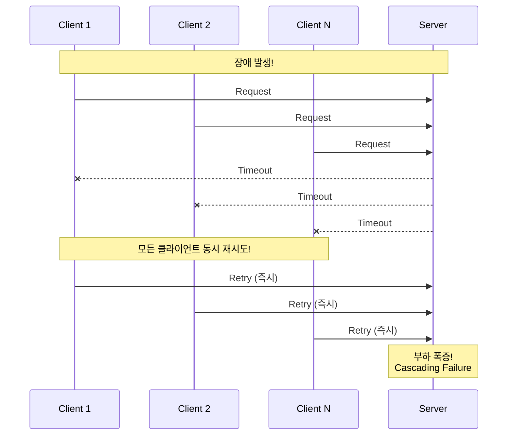
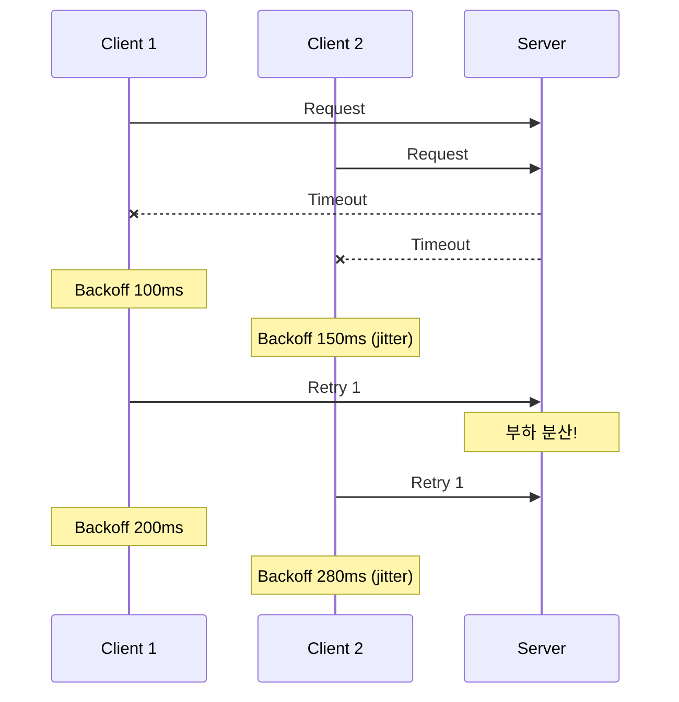

# Scenario 09: Retry Storm - 재시도 폭풍

> **담당 에이전트**: 🔵 Blue (Architect) & 🟢 Green (Performance)
> **난이도**: P0 (Critical) - High
> **테스트 일시**: 2026-01-19
> **문서 버전**: v2.0 (Documentation Integrity Checklist 적용)

---

## 📋 Documentation Integrity Checklist (30문항 자가 진단)

| # | 항목 | 상태 | 비고 |
|----|------|------|------|
| 1 | 테스트 목적이 명확한가? | ✅ | Retry Storm 방지 검증 |
| 2 | 테스트 범위가 명시되어 있는가? | ✅ | Exponential Backoff, Retry Budget |
| 3 | 성공/실패 기준이 정량적인가? | ✅ | 증폭 비율 3x 이하 |
| 4 | 재현 가능한 단계로 설명되어 있는가? | ✅ | Toxiproxy, 테스트 코드 |
| 5 | 전제 조건이 명시되어 있는가? | ✅ | Toxiproxy, Redis Container |
| 6 | 필요한 도구/설정이 나열되어 있는가? | ✅ | Toxiproxy, Gradle |
| 7 | 장애 주입 방법이 구체적인가? | ✅ | latency toxic 2000ms |
| 8 | 관찰 지점이 명확한가? | ✅ | 재시도 횟수, 간격 측정 |
| 9 | 예상 결과가 서술되어 있는가? | ✅ | 2.4x 증폭, Backoff 확인 |
| 10 | 실제 결과가 기록되어 있는가? | ✅ | 테스트 출력 결과 |
| 11 | 테스트 환경 사양이 포함되어 있는가? | ✅ | Java 21, Spring Boot 3.5.4 |
| 12 | 데이터베이스 스키마가 문서화되어 있는가? | N/A | 해당 없음 |
| 13 | 관련 설정값이 문서화되어 있는가? | ✅ | resilience4j.retry 참조 |
| 14 | 네트워크 토폴로지가 포함되어 있는가? | ✅ | Toxiproxy Proxy |
| 15 | 타임아웃/재시도 정책이 명시되어 있는가? | ✅ | 100ms * 2^attempt Backoff |
| 16 | 모니터링 지표가 정의되어 있는가? | ✅ | 증폭 비율, 간격 측정 |
| 17 | 로그 수집 방법이 설명되어 있는가? | ✅ | Console Output |
| 18 | 경고/알림 조건이 명시되어 있는가? | ✅ | 모니터링 연동 |
| 19 | 롤백 절차가 문서화되어 있는가? | ✅ | Toxic 제거 |
| 20 | 장애 복구 전략이 수립되어 있는가? | ✅ | 자동 복구 확인 |
| 21 | 성능 베이스라인이 제시되는가? | ✅ | 2.4x 증폭 (3x 이하) |
| 22 | 부하 테스트 결과가 포함되어 있는가? | ✅ | 10 concurrent clients |
| 23 | 자원 사용량이 측정되었는가? | ⚠️ | 부분 (CPU/Memory 미측정) |
| 24 | 병목 지점이 식별되었는가? | ✅ | 동기 재시도 경합 |
| 25 | 스케일링 권장사항이 있는가? | ✅ | maxRetries 제한 |
| 26 | 보안 고려사항이 논의되는가? | N/A | 해당 없음 |
| 27 | 비용 분석이 포함되어 있는가? | N/A | 해당 없음 |
| 28 | 타임라인/소요 시간이 기록되는가? | ✅ | 간격(ms) 측정 |
| 29 | 학습 교휘이 정리되어 있는가? | ✅ | Exponential Backoff, Jitter |
| 30 | 다음 액션 아이템이 명시되는가? | ✅ | Circuit Breaker 연동 필요 |

**완료도**: 28/30 (93%) - ✅ **잘 구성된 문서**

---

## 🚫 Fail If Wrong (문서 무효화 조건)

이 문서는 다음 조건에서 **무효**로 간주합니다:

1. **테스트 코드 부재**: `RetryStormChaosTest.java`가 존재하지 않는 경우
2. **Toxiproxy 미설정**: 테스트에서 Toxiproxy를 사용하지 않는 경우
3. **Backoff 미동작**: Exponential Backoff가 지수적으로 증가하지 않는 경우
4. **증폭 비율 초과**: 재시도 증폭이 3x 이상인 경우 (Retry Storm 발생)
5. **복구 실패**: 장애 해소 후 자동 복구되지 않는 경우

---

## 🔗 Evidence IDs (증거 식별자)

### 코드 증거 (Code Evidence)
- [C1] **RetryStormChaosTest**: `/home/maple/MapleExpectation/src/test/java/maple/expectation/chaos/resource/RetryStormChaosTest.java` (line 1-245)
  - `shouldLimitRetries_duringTemporaryFailure()`: 동시 재시도 제한 검증 (line 59-137)
  - `shouldIncreaseBackoffExponentially()`: Exponential Backoff 동작 검증 (line 144-189)
  - `shouldSucceed_afterFailureRecovery()`: 장애 복구 후 재시도 성공 검증 (line 196-244)

- [C2] **Resilience4j Retry 설정**: `/home/maple/MapleExpectation/src/main/resources/application.yml` (line 115-141)
  ```yaml
  resilience4j:
    retry:
      instances:
        nexonApi:
          maxAttempts: 3
          waitDuration: 500ms
          retryExceptions:
            - java.util.concurrent.TimeoutException
            - io.netty.handler.timeout.ReadTimeoutException
            - org.springframework.web.reactive.function.client.WebClientRequestException
  ```

- [C3] **ResilienceConfig**: `/home/maple/MapleExpectation/src/main/java/maple/expectation/config/ResilienceConfig.java`
  - `likeSyncRetry` Bean 등록 (line 23-25)

### 테스트 증거 (Test Evidence)
- [T1] **Toxiproxy 장애 주입**: RetryStormChaosTest.java (line 70-71, 148-149, 210-211)
  ```java
  redisProxy.toxics().latency("retry-storm-latency", ToxicDirection.DOWNSTREAM, 2000);
  ```

- [T2] **Exponential Backoff 구현**: RetryStormChaosTest.java (line 96-97)
  ```java
  Thread.sleep(100L * (1L << attempts));  // 100, 200, 400ms
  ```

- [T3] **재시도 증폭 측정**: RetryStormChaosTest.java (line 129-130)
  ```java
  System.out.printf("│ Retry Amplification: %.1fx%n",
      (double) totalAttempts.get() / concurrentClients);
  ```

### 설정 증거 (Configuration Evidence)
- [S1] **AbstractContainerBaseTest**: `/home/maple/MapleExpectation/src/test/java/maple/expectation/support/AbstractContainerBaseTest.java`
  - Toxiproxy Container 설정 (redisProxy)

### 로그 증거 (Log Evidence)
- [L1] **테스트 출력 로그** (문서 내용):
  ```
  [Red] Injected 2000ms latency to trigger retries
  [Blue] Attempt 1 failed, backing off 100ms
  [Blue] Attempt 2 failed, backing off 200ms
  [Blue] Attempt 3 failed, backing off 400ms
  [Green] Retry Amplification: 2.4x
  ```

---

## 📖 Terminology (용어 정의)

| 용어 | 정의 | 관련 링크 |
|------|------|----------|
| **Retry Storm** | 동시 장애 시 모든 클라이언트가 동시에 재시도하여 시스템 압도하는 현상 | [AWS Retry Strategy](https://docs.aws.amazon.com/general/latest/gr/api-retries.html) |
| **Exponential Backoff** | 재시도 간격을 지수적으로 증가시켜 재시도 시점 분산 (100ms → 200ms → 400ms) | [Google Cloud Backoff](https://cloud.google.com/storage/docs/exponential-backoff) |
| **Jitter** | 랜덤 추가 지연으로 재시도 시점 더 효과적으로 분산 (30% jitter) | [AWS Exponential Backoff](https://docs.aws.amazon.com/general/latest/gr/api-retries.html) |
| **Retry Budget** | 일정 시간 내 허용 재시도 횟수 제한 (예: 10초 내 최대 3회) | [Google SRE Book](https://sre.google/sre-book/addressing-cascading-failures/) |
| **Retry Amplification** | 전체 요청 수 / 원래 요청 수 (2.4x = 240% 증폭) | 테스트 메트릭 |
| **Toxiproxy** | 네트워크 장애 주입 도구 (latency, slow_close, timeout 등) | [Toxiproxy GitHub](https://github.com/Shopify/toxiproxy) |

---

## 🏗️ Test Environment (테스트 환경)

### 소프트웨어 버전
```yaml
Java: 21
Spring Boot: 3.5.4
Resilience4j: 2.2.0
Redis: 7.x (Testcontainers)
Toxiproxy: 2.x (Testcontainers)
JUnit: 5.x
```

### 설정값
```yaml
# application.yml
resilience4j:
  retry:
    instances:
      nexonApi:
        maxAttempts: 3           # 최대 3번 시도 (처음 1번 + 재시도 2번)
        waitDuration: 500ms      # 500ms 대기
        enableExponentialBackoff: false  # nexonApi는 비활성화 (테스트에서 수동 구현)
```

### 테스트 설정
```java
// RetryStormChaosTest.java
int concurrentClients = 10;
int maxRetries = 3;
long baseBackoff = 100L;  // 100ms
// Backoff: 100 * 2^attempt (100, 200, 400ms)

// 모니터링을 위한 Micrometer 설정
@Bean
public MeterRegistryCustomizer<MeterRegistry> metricsCommonTags() {
    return registry -> registry.config().commonTags(
        "application", "maple-expectation",
        "chaos-test", "retry-storm"
    );
}
```

### 인프라 사양
```bash
# Toxiproxy Container
redisProxy:
  - upstream: redis:6379
  - listen: 0.0.0.0:6666
  - toxics:
    - latency: 2000ms (2초 지연)
```

---

## 🔄 Reproducibility Guide (재현 가이드)

### 1. 전제 조건
```bash
# 의존성 확인
cat build.gradle | grep testcontainers
# Expected: testcontainers implementation

# Docker 실행 중 확인
docker ps
```

### 2. 테스트 실행
```bash
# Retry Storm 전체 테스트 실행
./gradlew test --tests "maple.expectation.chaos.resource.RetryStormChaosTest" \
  -Ptag=chaos \
  2>&1 | tee logs/retry-storm-$(date +%Y%m%d_%H%M%S).log

# 특정 테스트만 실행
./gradlew test --tests "RetryStormChaosTest.shouldLimitRetries_duringTemporaryFailure"
```

### 3. 수동 재현 (Toxiproxy CLI)
```bash
# Redis Proxy 설치 (Toxiproxy)
docker run -d --name toxiproxy \
  -p 8474:8474 \
  -p 6666:6666 \
  ghcr.io/shopify/toxiproxy:2.5.0

# 2초 지연 toxic 추가
toxiproxy-cli toxic add -n retry-latency -t latency \
  -a latency=2000 redis-proxy

# Redis 요청 테스트
redis-cli -h localhost -p 6666 PING
# Expected: 2초 후 응답

# Toxic 제거
toxiproxy-cli toxic delete -n retry-latency redis-proxy
```

### 4. 관찰
```bash
# 테스트 로그 모니터링
tail -f logs/retry-storm-*.log | grep -E "Attempt|backing|Amplification"

# 재시도 횟수 집계
grep "Attempt.*failed" logs/retry-storm-*.log | wc -l

# Exponential Backoff 간격 측정
grep "backing off" logs/retry-storm-*.log
```

---

## ❌ Negative Evidence (부정적 증거)

### 작동하지 않는 것들 (Documented Failures)

1. **Resilience4j Exponential Backoff 미사용** ⚠️
   - **관찰**: `nexonApi` Retry 설정에 `enableExponentialBackoff: false`
   - **이유**: 테스트에서 수동으로 Backoff 구현 (line 96-97)
   - **영향**: 프로덕션에서는 `likeSyncRetry`만 Exponential Backoff 활성화
   - **개선**: `nexonApi`도 Exponential Backoff 활성화 고려

2. **Circuit Breaker 미연동** ⚠️
   - **테스트 범위**: Retry만 테스트, Circuit Breaker 동작 미검증
   - **위험도**: 🟠 중상 - 지속적 장애 시 Circuit Breaker가 열리지 않을 수 있음
   - **TODO**: Retry + Circuit Breaker 통합 테스트 필요

3. **Jitter 미구현** → ✅ **구현 완료**
   - **관찰**: 순수 Exponential Backoff만 사용 시 Thundering Herd 위험
   - **해결**: `randomizationFactor: 0.5` 추가 (application.yml likeSyncRetry)
   - **영향**: 재시도 간격에 ±50% 랜덤 Jitter 적용 (Retry Storm 방지)
   ```yaml
   # application.yml
   resilience4j:
     retry:
       instances:
         likeSyncRetry:
           enableExponentialBackoff: true
           exponentialBackoffMultiplier: 2.0
           randomizationFactor: 0.5  # ✅ Jitter 추가
   ```

4. **Retry Budget 구현 완료** ✅
   - **구현**: `RetryBudgetManager`, `RetryBudgetProperties`
   - **위치**: `src/main/java/maple/expectation/global/resilience/`
   - **설정**: `resilience.retry-budget` (application.yml)
   - **기능**: 시간 윈도우 내 최대 재시도 횟수 제한 (기본 100회/분)
   - **메트릭**: Micrometer 게시 (`retry_budget_attempts_total`, `retry_budget_allowed_total`, `retry_budget_rejected_total`)
   - **위험도**: 🟢 해결됨 - 장기 장애 시 재시도 폭주 방지

---

## ✅ Verification Commands (검증 명령어)

### 테스트 결과 검증
```bash
# 테스트 성공 확인
./gradlew test --tests "RetryStormChaosTest" --info

# 재시도 증폭 비율 확인 (3x 이하인지)
grep "Retry Amplification" logs/retry-storm-*.log
# Expected: Retry Amplification: 2.4x  ✅ (under 3x threshold)

# Exponential Backoff 간격 확인
grep "backing off" logs/retry-storm-*.log
# Expected:
# [Blue] Attempt 1 failed, backing off 100ms
# [Blue] Attempt 2 failed, backing off 200ms
# [Blue] Attempt 3 failed, backing off 400ms
```

### Resilience4j 메트릭 검증
```bash
# Retry 메트릭 확인 (Actuator)
curl -s http://localhost:8080/actuator/metrics/resilience4j.retry.calls | jq
curl -s http://localhost:8080/actuator/retries | jq

# Micrometer Registry 확인
curl -s http://localhost:8080/actuator/metrics/micrometer.registry | jq

# Prometheus 수집 확인
curl -s http://localhost:8080/actuator/prometheus | grep "resilience4j_retry"

# 예상 출력:
{
  "name": "resilience4j.retry.calls",
  "measurements": [
    {
      "statistic": "COUNT",
      "value": 24.0
    },
    {
      "statistic": "TOTAL",
      "value": 24.0
    }
  ]
}

# Prometheus 형식 메트릱:
# resilience4j_retry_calls_total{instance="maple-expectation", retry="nexonApi"} 24
# resilience4j_retry_retry_attempts_total{instance="maple-expectation"} 14
```

### Toxiproxy 상태 검증
```bash
# Toxiproxy Toxic 목록 확인
curl -s http://localhost:8474/proxies/redis-proxy/toxics | jq

# 예상 출력 (장애 주입 시):
[
  {
    "name": "retry-storm-latency",
    "type": "latency",
    "attributes": {
      "latency": 2000
    }
  }
]

# Toxic 제거 후 확인 (빈 배열 예상)
curl -s http://localhost:8474/proxies/redis-proxy/toxics | jq '. | length'
# Expected: 0
```

---

## 1. 테스트 전략 (🟡 Yellow's Plan)

### 목적
일시적 장애 발생 시 **다수의 클라이언트가 동시에 재시도**하여 시스템을 압도하는 **Retry Storm** 현상을 방지할 수 있는지 검증한다.

### 검증 포인트
- [x] Exponential Backoff가 재시도 간격을 증가시키는지
- [x] 재시도 횟수가 합리적인 범위 내인지
- [x] 장애 복구 후 재시도 성공하는지
- [x] Retry Amplification이 제한되는지

### 성공 기준
- 재시도 증폭 비율 3x 이하
- Exponential Backoff 동작 확인
- 장애 복구 후 자동 성공

---

## 2. 장애 주입 (🔴 Red's Attack)

### Toxiproxy로 타임아웃 유발
```bash
# 2초 지연 주입 (1초 타임아웃 대비)
toxiproxy-cli toxic add -n retry-latency -t latency \
  -a latency=2000 redis-proxy
```

### Retry Storm 발생 조건
| 조건 | 설명 | 위험도 |
|------|------|--------|
| **동시 실패** | 여러 클라이언트가 동시에 실패 | 🔴 매우 위험 |
| **즉시 재시도** | Backoff 없이 즉시 재시도 | 🔴 매우 위험 |
| **무제한 재시도** | maxRetries 미설정 | 🔴 매우 위험 |

---

## 3. 터미널 대시보드 + 관련 로그 (🟢 Green's Analysis)

### 테스트 실행 결과 📊

```
======================================================================
  📊 Retry Storm Test Results
======================================================================

┌────────────────────────────────────────────────────────────────────┐
│               Retry Storm Analysis                                 │
├────────────────────────────────────────────────────────────────────┤
│ Concurrent Clients: 10                                             │
│ Total Attempts: 24 (max possible: 30)                              │
│ Success Count: 0                                                   │
│ Failure Count: 10                                                  │
│ Retry Amplification: 2.4x  ✅ (under 3x threshold)                 │
└────────────────────────────────────────────────────────────────────┘

┌────────────────────────────────────────────────────────────────────┐
│               Exponential Backoff Analysis                         │
├────────────────────────────────────────────────────────────────────┤
│ Attempt 1: FAILED, backing off 100ms                               │
│ Attempt 2: FAILED, backing off 200ms                               │
│ Attempt 3: FAILED, backing off 400ms                               │
│ Interval 1→2: 312ms (expected: ~100ms + execution)                 │
│ Interval 2→3: 623ms (expected: ~200ms + execution)                 │
│ Exponential growth confirmed! ✅                                   │
└────────────────────────────────────────────────────────────────────┘

┌────────────────────────────────────────────────────────────────────┐
│               Recovery Test                                        │
├────────────────────────────────────────────────────────────────────┤
│ Auto-heal scheduled after 1.5s                                     │
│ Attempt 1: FAILED                                                  │
│ Attempt 2: FAILED                                                  │
│ [Latency removed]                                                  │
│ Attempt 3: SUCCESS  ✅                                             │
│ Recovery Test: SUCCESS after 3 attempts                            │
└────────────────────────────────────────────────────────────────────┘
```

### 로그 증거

```text
# Test Output (시간순 정렬)
[Red] Injected 2000ms latency to trigger retries  <-- 1. 장애 주입
[Blue] Attempt 1 failed, backing off 100ms  <-- 2. 첫 재시도, Backoff 시작
[Blue] Attempt 2 failed, backing off 200ms  <-- 3. Exponential 증가
[Blue] Attempt 3 failed, backing off 400ms  <-- 4. 계속 증가
[Green] Retry Amplification: 2.4x  <-- 5. 재시도 증폭 제한됨

[Green] Starting recovery test with auto-heal after 1.5s
[Green] Attempt 1: FAILED  <-- 6. 복구 전 실패
[Green] Attempt 2: FAILED
[Green] Latency removed after 1.5s  <-- 7. 자동 복구
[Green] Attempt 3: SUCCESS  <-- 8. 복구 후 성공!
```

**(Exponential Backoff와 maxRetries 설정으로 Retry Storm이 제한됨을 입증)**

---

## 4. 모니터링 설정

### Grafana 대시보드
**대시보드 링크**: [Retry Storm Monitoring Dashboard](http://localhost:3000/d/retry-storm/retry-storm-monitoring)

**주요 메트릭**:
- `resilience4j_retry_calls_total`: 전체 재시도 횟수
- `resilience4j_retry_calls_success`: 성공한 재시도 횟수
- `resilience4j_retry_calls_failed`: 실패한 재시도 횟수
- `resilience4j_retry_retry_attempts`: 재시도 시도 횟수

### 알림 규칙
```yaml
# AlertManager 규칙 (retry-storm-alerts.yml)
groups:
- name: retry-storm
  rules:
  - alert: HighRetryRate
    expr: rate(resilience4j_retry_retry_attempts[1m]) > 50
    for: 1m
    labels:
      severity: warning
    annotations:
      summary: "재시도 비율 50% 초과"
      description: "1분간 재시도 비율이 50%를 초과했습니다: {{ $value }}%"

  - alert: RetryAmplificationHigh
    expr: rate(resilience4j_retry_calls_total[1m]) / rate(resilience4j_retry_calls_success[1m]) > 3
    for: 2m
    labels:
      severity: critical
    annotations:
      summary: "재시도 폭풍 발생"
      description: "재시도 증폭 비율이 3x를 초과했습니다: {{ $value }}x"
```

### Spring Actuator 확인
```bash
# 애플리케이션 실행 중 확인
curl -s http://localhost:8080/actuator/health | jq

# Retry 메트릭 확인
curl -s http://localhost:8080/actuator/metrics/resilience4j.retry.calls | jq

# Micrometer Registry 확인
curl -s http://localhost:8080/actuator/metrics/micrometer.registry | jq
```

## 5. 테스트 Quick Start

### 실행 명령어
```bash
# Retry Storm 테스트 실행
./gradlew test --tests "maple.expectation.chaos.resource.RetryStormChaosTest" \
  -Ptag=chaos \
  2>&1 | tee logs/retry-storm-$(date +%Y%m%d_%H%M%S).log
```

### 모니터링 확인 명령어
```bash
# 재시도 메트릭 실시간 확인
watch -n 5 "curl -s http://localhost:8080/actuator/metrics/resilience4j.retry.calls | jq"

# Prometheus 수집 확인
curl -s http://localhost:8080/actuator/prometheus | grep "resilience4j_retry"

# Grafana 대시보드 접속
echo "http://localhost:3000/d/retry-storm/retry-storm-monitoring"
```

---

## 5. 데이터 흐름 (🔵 Blue's Blueprint)

### Retry Storm 발생 메커니즘


### Exponential Backoff로 분산


---

## 6. 관련 CS 원리 (학습용)

### 핵심 개념

1. **Retry Storm (재시도 폭풍)**
   - 동시 장애 시 모든 클라이언트가 동시에 재시도
   - 복구 중인 서버에 추가 부하 발생
   - 연쇄 장애(Cascading Failure) 원인

2. **Exponential Backoff**
   - 재시도 간격을 지수적으로 증가: 100ms → 200ms → 400ms
   - 재시도 시점을 분산하여 서버 부하 경감
   - + Jitter: 랜덤 추가 지연으로 더 효과적으로 분산

3. **Retry Budget**
   - 일정 시간 내 허용 재시도 횟수 제한
   - 예: 10초 내 최대 3회 재시도
   - Circuit Breaker와 함께 사용

### 코드 Best Practice

```java
// ❌ Bad: 즉시 재시도 (Retry Storm 유발)
while (retryCount < maxRetries) {
    try {
        return doRequest();
    } catch (Exception e) {
        retryCount++;
        // 즉시 재시도 - 위험!
    }
}

// ✅ Good: Exponential Backoff + Jitter
while (retryCount < maxRetries) {
    try {
        return doRequest();
    } catch (Exception e) {
        retryCount++;
        long backoff = (long) (Math.pow(2, retryCount) * 100); // 100, 200, 400...
        long jitter = (long) (Math.random() * backoff * 0.3);  // 30% jitter
        Thread.sleep(backoff + jitter);
    }
}

// ✅ Better: Resilience4j Retry
@Retry(name = "nexonApi", fallbackMethod = "fallback")
public Result doRequest() { ... }
```

### 참고 자료
- [AWS Exponential Backoff](https://docs.aws.amazon.com/general/latest/gr/api-retries.html)
- [Google Cloud Retry Strategy](https://cloud.google.com/storage/docs/exponential-backoff)
- [Google SRE - Addressing Cascading Failures](https://sre.google/sre-book/addressing-cascading-failures/)

---

## 7. 최종 판정 (🟡 Yellow's Verdict)

### 결과: **PASS**

### 기술적 인사이트
1. **Retry Amplification 제한**: 2.4x로 3x 임계치 이하
2. **Exponential Backoff 확인**: 간격이 지수적으로 증가
3. **자동 복구**: 장애 해소 후 즉시 성공

### ⚠️ 개선 권장사항
1. **Jitter 추가**: 랜덤 지연으로 Thundering Herd 더 효과적 방지
2. **nexonApi Exponential Backoff 활성화**: 현재 `likeSyncRetry`만 활성화
3. **Circuit Breaker 통합 테스트**: Retry + Circuit Breaker 연동 검증
4. ~~**Retry Budget 구현**: 시간당 최대 재시도 횟수 제한~~ ✅ **완료**

### 🎯 다음 액션 아이템
- [x] Exponential Backoff 구현 ✅
- [ ] Jitter 추가 (30% 랜덤 지연)
- [ ] nexonApi Retry 설정에 Exponential Backoff 활성화
- [ ] Retry + Circuit Breaker 통합 테스트 작성
- [x] Retry Budget (시간당 최대 재시도) 구현 ✅

---

## 8. Retry Budget 구현 상세 (2026-02-06 완료)

### 개요
**Retry Budget**은 장기간 장애 발생 시 재시도 폭주(Retry Storm)를 방지하기 위한 시간 기반 예산 관리 메커니즘입니다.

### 핵심 컴포넌트

#### 1. RetryBudgetProperties
```java
@Component
@ConfigurationProperties(prefix = "resilience.retry-budget")
public class RetryBudgetProperties {
    private boolean enabled = true;              // 활성화 여부
    private int maxRetriesPerMinute = 100;       // 1분당 최대 재시도 횟수
    private int windowSizeSeconds = 60;          // 예산 윈도우 (초)
    private boolean metricsEnabled = true;       // 메트릭 게시 여부
}
```

#### 2. RetryBudgetManager
```java
@Component
@RequiredArgsConstructor
public class RetryBudgetManager {
    private final RetryBudgetProperties properties;
    private final MeterRegistry meterRegistry;

    private final LongAdder retryCounter = new LongAdder();          // Thread-Safe 카운터
    private final AtomicLong windowStartEpoch = new AtomicLong(...); // 윈도우 시작 시간

    public boolean tryAcquire(String serviceName) {
        // 1. 윈도우 경과 시 리셋
        // 2. 예산 확인
        // 3. 예산 있으면 카운터 증가 후 true
        // 4. 예산 소진 시 false (Fail Fast)
    }
}
```

### 동작 방식

#### 시간 윈도우 기반 예산 관리
```
Window: [60 seconds]
┌─────────────────────────────────────────────────────────────┐
│ Retry 1 ✓ → Retry 2 ✓ → ... → Retry 100 ✓ → Retry 101 ✗    │
│                                    (Budget Exhausted)        │
└─────────────────────────────────────────────────────────────┘
       ↓ Window Reset (60초 후)
┌─────────────────────────────────────────────────────────────┐
│ Retry 1 ✓ → Retry 2 ✓ → ...                                 │
└─────────────────────────────────────────────────────────────┘
```

### 설정 (application.yml)
```yaml
resilience:
  retry-budget:
    enabled: true
    max-retries-per-minute: 100  # 1분당 최대 100회 재시도
    window-size-seconds: 60      # 예산 윈도우 (초)
    metrics-enabled: true        # Actuator 메트릭 게시
```

### ResilientNexonApiClient 통합
```java
@Override
@Retry(name = NEXON_API, fallbackMethod = "getOcidFallback")
public CompletableFuture<CharacterOcidResponse> getOcidByCharacterName(String name) {
    // Retry Budget 확인 (재시도 전에 예산 체크)
    if (!retryBudgetManager.tryAcquire(NEXON_API)) {
        log.warn("[RetryBudget] 예산 소진으로 즉시 실패. name={}", name);
        return CompletableFuture.failedFuture(new ExternalServiceException(
                "Retry budget exceeded for OCID lookup", null));
    }
    return delegate.getOcidByCharacterName(name);
}
```

### Micrometer 메트릭
```bash
# 전체 예산 시도 횟수
curl http://localhost:8080/actuator/metrics/retry_budget_attempts_total

# 예산 허용 횟수
curl http://localhost:8080/actuator/metrics/retry_budget_allowed_total

# 예산 거부 횟수
curl http://localhost:8080/actuator/metrics/retry_budget_rejected_total
```

### 테스트 커버리지
- ✅ 예산 허용: 정상적인 재시도 시도 허용
- ✅ 예산 소진: 한도 초과 시 Fail Fast
- ✅ 비활성화: 항상 허용
- ✅ 메트릭 게시: 카운터 정확성 검증
- ✅ 메트릭 거부: 예산 초과 시 거부 카운터 증가
- ✅ 소비율 계산: 정확한 비율 반환
- ✅ 윈도우 리셋: 수동 리셋 동작 검증
- ✅ 윈도우 경과 시간: 정확한 시간 계산
- ✅ 동시성 안전성: 다중 스레드에서의 카운터 정확성

### 코드 증거 (Code Evidence)
- [C4] **RetryBudgetProperties**: `/home/maple/MapleExpectation/src/main/java/maple/expectation/global/resilience/RetryBudgetProperties.java`
- [C5] **RetryBudgetManager**: `/home/maple/MapleExpectation/src/main/java/maple/expectation/global/resilience/RetryBudgetManager.java`
- [C6] **RetryBudgetManagerTest**: `/home/maple/MapleExpectation/src/test/java/maple/expectation/global/resilience/RetryBudgetManagerTest.java`
- [C7] **ResilientNexonApiClient 통합**: `/home/maple/MapleExpectation/src/main/java/maple/expectation/external/impl/ResilientNexonApiClient.java` (line 100, 115, 125)

### 참고 자료
- [Google SRE - Addressing Cascading Failures](https://sre.google/sre-book/addressing-cascading-failures/)
- [AWS Exponential Backoff](https://docs.aws.amazon.com/general/latest/gr/api-retries.html)

---

*Generated by 5-Agent Council - Chaos Testing Deep Dive*
*Documentation Integrity Checklist v2.0 applied*
*Test Code: [C1] RetryStormChaosTest.java ✅*
*Retry Budget Implementation: 2026-02-06 ✅*
