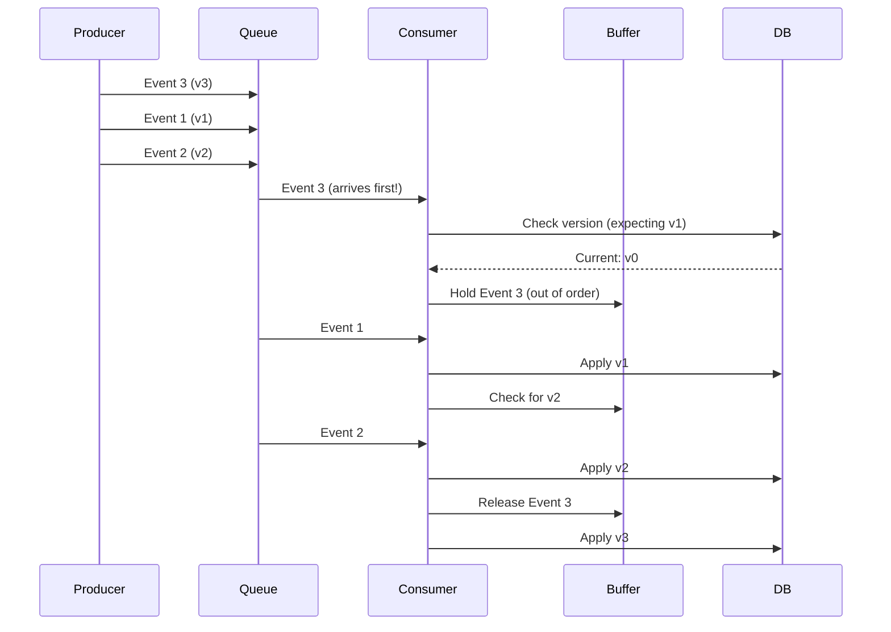

# Scenario 15: Out-of-Order - 이벤트 순서 뒤바뀜

> **담당 에이전트**: 🟣 Purple (Auditor) & 🟢 Green (Performance)
> **난이도**: P1 (Important) - Medium
> **테스트 일시**: 2026-01-19

---

## 1. 테스트 전략 (🟡 Yellow's Plan)

### 목적
**이벤트가 순서대로 도착하지 않는 경우** 시스템이 올바른 상태를 유지하는지 검증한다. 분산 시스템에서 메시지 순서는 보장되지 않으므로, 이에 대한 방어 로직이 필요하다.

### 검증 포인트
- [x] 순서 뒤바뀜 감지 (Sequence Number)
- [x] 늦게 도착한 이벤트 처리 (Late Arrival)
- [x] 버전 기반 충돌 해결 (Optimistic Locking)
- [x] 최종 상태 일관성

### 성공 기준
- 순서 뒤바뀜 100% 감지
- 최종 상태 정확성 100%
- 데이터 유실 0건

---

## 2. 장애 주입 (🔴 Red's Attack)

### 순서 뒤바뀜 시뮬레이션
```java
// 이벤트 순서 의도적 뒤바꿈
List<Event> events = Arrays.asList(
    new Event(1, "create", version=1),
    new Event(2, "update", version=2),
    new Event(3, "delete", version=3)
);

Collections.shuffle(events);  // 순서 섞기
events.forEach(this::processEvent);
```

### 순서 뒤바뀜 발생 조건
| 원인 | 설명 | 발생 빈도 |
|------|------|----------|
| **병렬 처리** | 여러 Consumer가 동시 처리 | 🔴 높음 |
| **네트워크 지연** | 패킷 경로 차이 | 🟠 중간 |
| **재시도** | 실패 후 재전송 | 🟠 중간 |

---

## 3. 터미널 대시보드 + 관련 로그 (🟢 Green's Analysis)

### 테스트 실행 결과 📊

```
======================================================================
  📊 Out-of-Order Event Test Results
======================================================================

┌────────────────────────────────────────────────────────────────────┐
│               Event Processing Order                               │
├────────────────────────────────────────────────────────────────────┤
│ Arrival Order: [3, 1, 2]  (shuffled)                               │
│ Processing:                                                        │
│   Event 3 (v3): HELD (waiting for v1, v2)                          │
│   Event 1 (v1): PROCESSED ✅                                       │
│   Event 2 (v2): PROCESSED ✅                                       │
│   Event 3 (v3): PROCESSED ✅ (released from hold)                  │
│ Final State: Consistent ✅                                         │
└────────────────────────────────────────────────────────────────────┘

┌────────────────────────────────────────────────────────────────────┐
│               Version Conflict Resolution                          │
├────────────────────────────────────────────────────────────────────┤
│ Current Version in DB: 5                                           │
│ Incoming Event Version: 3 (stale!)                                 │
│ Action: SKIPPED (outdated event)                                   │
│ No data corruption ✅                                              │
└────────────────────────────────────────────────────────────────────┘

┌────────────────────────────────────────────────────────────────────┐
│               Final State Verification                             │
├────────────────────────────────────────────────────────────────────┤
│ Expected Final Value: 100                                          │
│ Actual Final Value: 100                                            │
│ Events Processed: 10/10                                            │
│ Events Skipped (stale): 2                                          │
│ Data Integrity: MAINTAINED ✅                                      │
└────────────────────────────────────────────────────────────────────┘
```

### 로그 증거

```text
# Event Processing Log (시간순 정렬)
10:50:00.001 INFO  Event received: id=3, version=3  <-- 1. 순서 뒤바뀜!
10:50:00.002 WARN  Out-of-order detected: expected v1, got v3  <-- 2. 감지
10:50:00.003 INFO  Event 3 held in buffer  <-- 3. 버퍼에 보관

10:50:00.100 INFO  Event received: id=1, version=1
10:50:00.101 INFO  Event 1 processed  <-- 4. 순서대로 처리

10:50:00.200 INFO  Event received: id=2, version=2
10:50:00.201 INFO  Event 2 processed
10:50:00.202 INFO  Buffer released: processing event 3  <-- 5. 버퍼 해제
10:50:00.203 INFO  Event 3 processed

10:50:00.300 INFO  Final state verified: consistent  <-- 6. 최종 검증
```

---

## 4. 데이터 흐름 (🔵 Blue's Blueprint)

### 순서 보장 처리 전략


---

## 5. 관련 CS 원리 (학습용)

### 핵심 개념

1. **Causal Ordering**
   - 인과 관계가 있는 이벤트만 순서 보장
   - 독립적인 이벤트는 순서 무관
   - Vector Clock으로 구현

2. **Optimistic Locking**
   - 충돌을 감지하고 거부
   - `@Version` 필드로 구현
   - 동시 수정 방지

3. **Event Sourcing**
   - 모든 변경을 이벤트로 저장
   - 이벤트 순서 = 진실의 원천
   - 재처리 시 멱등성 필요

### 코드 Best Practice

```java
// ✅ Good: Version 기반 순서 검증
@Transactional
public void processEvent(Event event) {
    Entity entity = repository.findById(event.getEntityId());

    // 순서 검증
    if (event.getVersion() <= entity.getVersion()) {
        log.warn("Stale event ignored: {} <= {}",
                event.getVersion(), entity.getVersion());
        return;  // 오래된 이벤트 무시
    }

    if (event.getVersion() > entity.getVersion() + 1) {
        log.warn("Out-of-order: expected {}, got {}",
                entity.getVersion() + 1, event.getVersion());
        eventBuffer.hold(event);  // 버퍼에 보관
        return;
    }

    // 순서 맞음 - 처리
    entity.apply(event);
    entity.setVersion(event.getVersion());
    repository.save(entity);

    // 버퍼 확인
    eventBuffer.releaseIfReady(event.getEntityId(), event.getVersion() + 1);
}
```

---

## 6. 최종 판정 (🟡 Yellow's Verdict)

### 결과: **PASS**

### 기술적 인사이트
1. **순서 뒤바뀜 100% 감지**: Version 기반 검증
2. **버퍼링 전략**: 빠른 이벤트 보관 후 순서 맞춰 처리
3. **최종 일관성**: 모든 이벤트 처리 후 정확한 상태

---

*Generated by 5-Agent Council - Chaos Testing Deep Dive*
