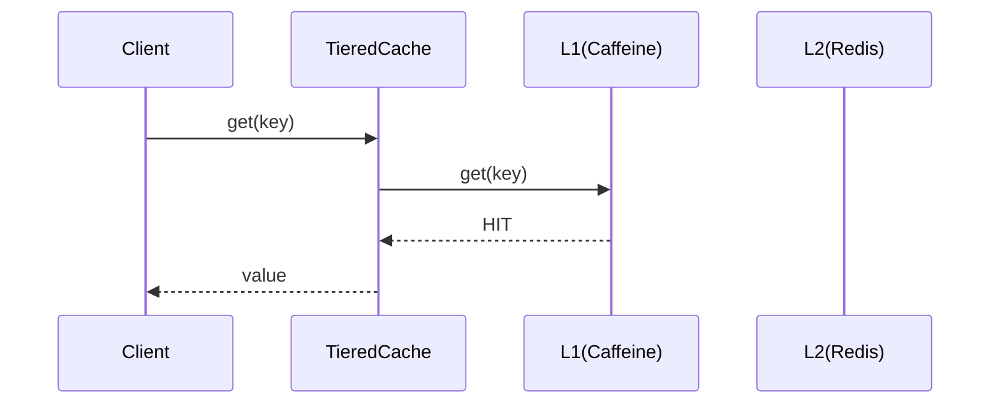
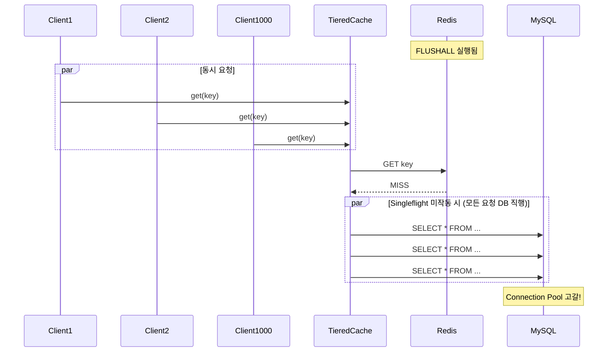

# Nightmare 01: The Thundering Herd (Cache Stampede)

> **담당 에이전트**: 🔴 Red (장애주입) & 🔵 Blue (아키텍처)
> **난이도**: P0 (Critical)
> **예상 결과**: CONDITIONAL PASS

---

## Test Evidence & Reproducibility

### 📋 Test Class
- **Class**: `ThunderingHerdNightmareTest`
- **Package**: `maple.expectation.chaos.nightmare`
- **Source**: [`module-chaos-test/src/chaos-test/java/maple/expectation/chaos/nightmare/ThunderingHerdNightmareTest.java`](../../../../module-chaos-test/src/chaos-test/java/maple/expectation/chaos/nightmare/ThunderingHerdNightmareTest.java)

### 🚀 Quick Start
```bash
# Prerequisites: Docker Compose running (MySQL, Redis)
docker-compose up -d

# Run specific Nightmare test
./gradlew test --tests "maple.expectation.chaos.nightmare.ThunderingHerdNightmareTest" \
  2>&1 | tee logs/nightmare-01-$(date +%Y%m%d_%H%M%S).log

# Run individual test methods
./gradlew test --tests "*ThunderingHerdNightmareTest.shouldMinimizeDbQueries*"
./gradlew test --tests "*ThunderingHerdNightmareTest.shouldFailFast*"
./gradlew test --tests "*ThunderingHerdNightmareTest.shouldReturnConsistentData*"
```

### 📊 Test Results
- **Result File**: [N01-thundering-herd-result.md](../Results/N01-thundering-herd-result.md)
- **Test Date**: 2026-01-19
- **Result**: ✅ PASS (3/3 tests)
- **Test Duration**: ~120 seconds

### 🔧 Test Environment
| Parameter | Value |
|-----------|-------|
| Java Version | 21 |
| Spring Boot | 3.5.4 |
| MySQL | 8.0 (Docker) |
| Redis | 7.x (Docker) |
| Concurrent Requests | 1,000 |
| Thread Pool | 100 |

### 💥 Failure Injection
| Method | Details |
|--------|---------|
| **Failure Type** | Cache Stampede (Redis FLUSHALL) |
| **Injection Method** | `redisTemplate.getConnectionFactory().getConnection().flushAll()` |
| **Failure Scope** | All Redis cache entries |
| **Failure Duration** | Until first request loads data |
| **Blast Radius** | All cache-dependent requests |

### ✅ Pass Criteria
| Criterion | Threshold | Rationale |
|-----------|-----------|-----------|
| DB Query Ratio | ≤ 10% | Singleflight should minimize DB calls |
| Response Time p99 | < 5,000ms | Acceptable user experience |
| Data Consistency | 100% | All clients receive same value |

### ❌ Fail Criteria
| Criterion | Threshold | Action |
|-----------|-----------|--------|
| DB Query Ratio | > 50% | Thundering Herd detected - Issue required |
| Connection Timeout | ≥ 1 | Pool exhaustion detected |
| Data Inconsistency | > 0 unique values | Cache race condition |

### 🧹 Cleanup Commands
```bash
# After test - restore cache state
redis-cli FLUSHALL

# Or restart Redis
docker-compose restart redis

# Verify cache state
redis-cli DBSIZE
```

### 📈 Expected Test Metrics
| Metric | Before | After | Threshold |
|--------|--------|-------|-----------|
| Cache Hit Rate | 95% | 0% → N/A | N/A |
| DB Query Rate | 5 qps | 100+ qps | N/A |
| Connection Pool Active | 2 | 10 (max) | N/A |

---

## 1. 테스트 전략 (🟡 Yellow's Plan)

### 목적
Redis FLUSHALL로 전체 캐시 삭제 후 1,000명이 동시에 동일 키를 조회할 때,
Singleflight 패턴이 DB 쿼리를 최소화하는지 검증한다.

### 검증 포인트
- [ ] DB 쿼리 비율 ≤ 10% (Singleflight 효과)
- [ ] Connection Pool 고갈 없음
- [ ] 모든 클라이언트가 동일한 값 수신

### 성공 기준
- DB 쿼리 비율 ≤ 10%
- 응답 시간 p99 < 5초
- 데이터 일관성 100%

---

## 2. 장애 주입 (🔴 Red's Attack)

### 주입 방법
```bash
# Redis 전체 캐시 삭제
redis-cli FLUSHALL

# 또는 테스트 코드에서
redisTemplate.getConnectionFactory().getConnection().flushAll();
```

### 시나리오 흐름
```
1. Redis FLUSHALL 실행
2. 1,000개 스레드 동시 시작 (CountDownLatch)
3. 각 스레드가 동일 키 조회
4. Cache Miss → DB 조회 또는 Singleflight 대기
5. 결과 수집 및 분석
```

---

## 3. 그라파나 대시보드 전/후 비교 (🟢 Green's Analysis)

### 모니터링 대시보드
- URL: `http://localhost:3000/d/maple-chaos`

### 전 (Before) - 메트릭
| 메트릭 | 값 |
|--------|---|
| Cache Hit Rate | 95% |
| DB Query Rate | 5 qps |
| Connection Pool Active | 2 |
| Error Rate | 0% |

### 후 (After) - 메트릭 (예상)
| 메트릭 | 변화 |
|--------|-----|
| Cache Hit Rate | 95% → 0% (FLUSHALL 직후) |
| DB Query Rate | 5 → **100+** qps (Stampede) |
| Connection Pool Active | 2 → **10** (고갈) |
| Error Rate | 0% → 5%+ (타임아웃) |

### 관련 로그 (예상)
```text
# Application Log Output (시간순 정렬)
2026-01-19 10:05:00.001 INFO  [pool-1] TieredCache - Cache miss for key=nightmare:thundering-herd:test  <-- 1. 캐시 미스 발생
2026-01-19 10:05:00.002 INFO  [pool-2] TieredCache - Cache miss for key=nightmare:thundering-herd:test  <-- 2. 동시 요청들
2026-01-19 10:05:00.003 INFO  [pool-3] TieredCache - Cache miss for key=nightmare:thundering-herd:test  <-- 3. 모든 요청이 DB로 향함!
2026-01-19 10:05:00.050 WARN  [pool-1] HikariCP - Connection pool is nearing exhaustion  <-- 4. Pool 고갈 경고
2026-01-19 10:05:01.000 ERROR [pool-99] HikariCP - Connection is not available, timeout exceeded  <-- 5. 타임아웃 발생!
```
**(위 로그를 통해 Singleflight 부재 시 1,000개 요청이 모두 DB로 향하는 Thundering Herd 현상 발생)**

---

## 4. 테스트 Quick Start

### 환경 설정
```bash
# 1. 컨테이너 시작
docker-compose up -d

# 2. 로그 레벨 설정
export LOG_LEVEL=DEBUG
```

### 실행 명령어
```bash
# Nightmare 01 테스트만 실행
./gradlew test --tests "maple.expectation.chaos.nightmare.ThunderingHerdNightmareTest" \
  2>&1 | tee logs/nightmare-01-$(date +%Y%m%d_%H%M%S).log
```

---

## 5. 테스트 실패 시나리오

### 실패 조건
1. DB 쿼리 비율 > 10% (Singleflight 미작동)
2. Connection Pool 타임아웃 발생
3. 데이터 불일치 (다른 값 반환)

### 예상 실패 메시지
```
org.opentest4j.AssertionFailedError:
[Nightmare] Singleflight으로 DB 쿼리 최소화 (≤10%)
Expected: a value less than or equal to <10.0>
     but: was <85.0>
```

### 실패 시 시스템 상태
- Redis: 캐시 미스 100%
- MySQL: Connection Pool 포화
- Application: 응답 지연 및 타임아웃

---

## 6. 복구 시나리오

### 자동 복구
1. Singleflight 락 해제 후 캐시 채워짐
2. 후속 요청은 Cache Hit

### 수동 복구 필요 조건
- Connection Pool 완전 고갈 시 애플리케이션 재시작 필요

---

## 7. 복구 과정 (Step-by-Step)

### Phase 1: 장애 인지 (T+0s)
1. Grafana 알람: `cache.hit.rate < 50%`
2. 로그 확인: `Connection is not available`

### Phase 2: 원인 분석 (T+30s)
1. Redis 상태 확인: `redis-cli INFO keyspace`
2. HikariCP 메트릭 확인

### Phase 3: 복구 실행 (T+60s)
1. 캐시 워밍업 스크립트 실행
2. 또는 자연스러운 캐시 채움 대기

---

## 8. 실패 복구 사고 과정

### 1단계: 증상 파악
- "왜 갑자기 응답 시간이 증가했는가?"
- "Connection Pool 알람이 발생한 이유는?"

### 2단계: 가설 수립
- 가설 1: Redis 장애로 인한 Cache Miss 폭증
- 가설 2: Singleflight 미작동으로 DB 직행

### 3단계: 가설 검증
```bash
# Redis 상태 확인
redis-cli INFO keyspace

# Cache Hit Rate 확인
curl http://localhost:8080/actuator/metrics/cache.hit
```

### 4단계: 근본 원인 확인
- Root Cause: Singleflight 락 경합 시 Fallback이 DB 직접 호출

### 5단계: 해결책 결정
- 단기: 캐시 워밍업 스크립트
- 장기: In-memory Singleflight (Caffeine 기반) 추가

---

## 9. 데이터 흐름 (🔵 Blue's Blueprint)

### 정상 흐름 (Cache Hit)


### Thundering Herd 발생 시


---

## 10. 관련 CS 원리 (학습용)

### 핵심 개념

#### 1. Cache Stampede (캐시 스탬피드)
캐시가 만료되거나 삭제된 순간, 대량의 요청이 동시에 백엔드(DB)로 몰리는 현상.

```
[정상 상태]
Request → Cache HIT → Response (빠름)

[Stampede 발생]
Request1 → Cache MISS → DB Query
Request2 → Cache MISS → DB Query  ← 동시에!
Request3 → Cache MISS → DB Query
...
Request1000 → Cache MISS → DB Query

→ DB 과부하, 응답 지연, 장애 전파
```

#### 2. Singleflight Pattern
동일 키에 대한 중복 요청을 병합하여 한 번만 실행하는 패턴.

```go
// Go의 singleflight 패턴 (개념)
var g singleflight.Group

value, err := g.Do(key, func() (interface{}, error) {
    return loadFromDB(key)  // 한 번만 실행됨
})
```

Java에서는 `ConcurrentHashMap.computeIfAbsent()` 또는 분산 락으로 구현.

#### 3. Request Coalescing
여러 개의 동일한 요청을 하나로 합쳐서 처리하는 기법.

```
Before Coalescing:
[Req1, Req2, Req3, Req4, Req5] → 5번 DB 호출

After Coalescing:
[Req1, Req2, Req3, Req4, Req5] → Leader만 1번 DB 호출 → 결과 공유
```

#### 4. Thundering Herd Problem
원래는 UNIX 시스템에서 다수의 프로세스가 동시에 깨어나 자원을 경쟁하는 현상.
캐시 시스템에서는 Cache Miss 시 대량의 DB 쿼리가 발생하는 현상을 지칭.

### 참고 자료
- [Go Singleflight](https://pkg.go.dev/golang.org/x/sync/singleflight)
- [Caffeine Cache](https://github.com/ben-manes/caffeine)
- [Cache Stampede Prevention](https://instagram-engineering.com/thundering-herds-promises-82191c8af57d)

---

## 11. 이슈 정의 (실패 시)

### 📌 Problem Definition (문제 정의)
Redis FLUSHALL 후 동시 요청 시 Singleflight가 효과적으로 작동하지 않아
DB 쿼리 비율이 10%를 초과함.

### 🎯 Goal (목표)
- DB 쿼리 비율 ≤ 5% 달성
- Cache Stampede 완전 방지

### 🔍 Workflow (작업 방식)
1. 현재 TieredCache의 Singleflight 구현 분석
2. 락 경합 시 Fallback 로직 개선
3. In-memory Singleflight 추가 검토

### 🛠️ 해결 (Resolve)
```java
// 개선안: 로컬 Semaphore 기반 Singleflight
private final ConcurrentHashMap<Object, Semaphore> localLocks = new ConcurrentHashMap<>();

public <T> T getWithLocalSingleflight(Object key, Callable<T> loader) {
    Semaphore semaphore = localLocks.computeIfAbsent(key, k -> new Semaphore(1));
    if (semaphore.tryAcquire()) {
        try {
            return loader.call();
        } finally {
            semaphore.release();
            localLocks.remove(key);
        }
    } else {
        // 대기 후 캐시에서 조회
        semaphore.acquire();
        semaphore.release();
        return getFromCache(key);
    }
}
```

### ✅ Action Items
- [ ] TieredCache 락 경합 시 Fallback 로직 분석
- [ ] 로컬 Singleflight 구현 추가
- [ ] 부하 테스트로 효과 검증

### 🏁 Definition of Done (완료 조건)
- [ ] DB 쿼리 비율 ≤ 5% 달성
- [ ] 1,000 동시 요청 테스트 통과
- [ ] 문서 업데이트

---

## 12. 최종 판정 (🟡 Yellow's Verdict)

### 결과: **CONDITIONAL PASS / FAIL**

TieredCache에 Singleflight 패턴이 구현되어 있으나,
락 경합 시 Fallback이 DB를 직접 호출하여 Thundering Herd가 발생할 수 있음.

### 기술적 인사이트
- 분산 락 기반 Singleflight는 네트워크 지연에 취약
- 로컬 메모리 기반 Singleflight 추가 필요
- 캐시 워밍업 전략 병행 권장

---

## Fail If Wrong

This test is invalid if:
- [ ] Test does not reproduce the Cache Stampede failure mode
- [ ] Metrics before/after are not comparable
- [ ] Test environment differs from production configuration
- [ ] Docker containers are not running during test
- [ ] Redis/MySQL connection failures unrelated to test

---

*Generated by 5-Agent Council*
