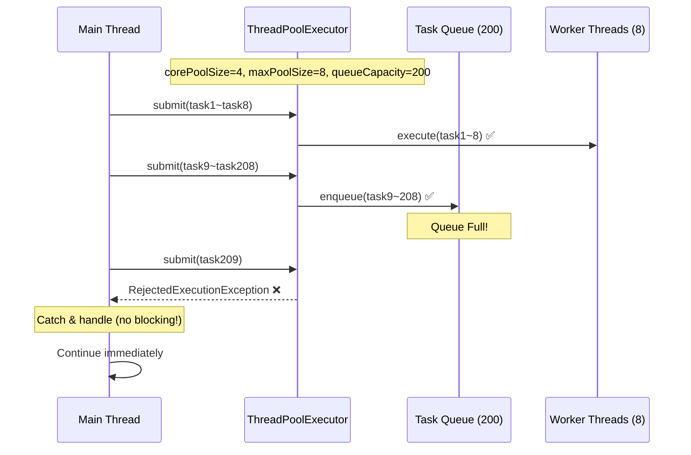
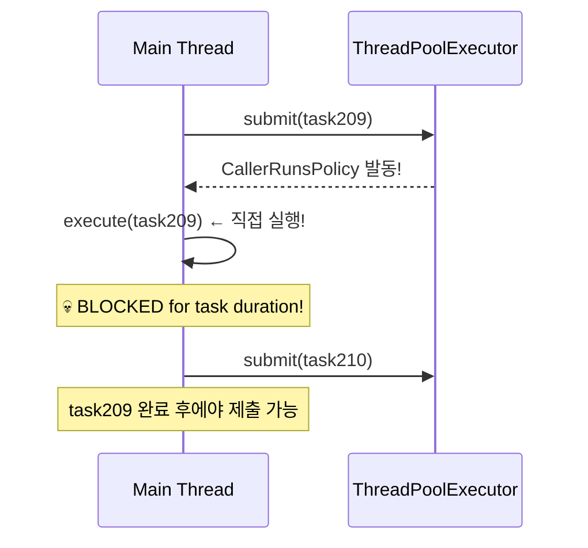

# Nightmare 03: Thread Pool Exhaustion - 실제 운영 Executor 검증

> **담당 에이전트**: 🔴 Red (장애주입) & 🟢 Green (성능)
> **난이도**: P1 (High)
> **예상 결과**: PASS (운영 환경은 AbortPolicy 사용)

---

## 1. 테스트 전략 (🟡 Yellow's Plan)

### 목적
실제 운영 환경의 `expectationComputeExecutor`와 `alertTaskExecutor`가
Thread Pool 포화 시 **CallerRunsPolicy로 인한 메인 스레드 블로킹 없이**
적절히 작업을 거부(AbortPolicy)하는지 검증한다.

### 검증 대상 (실제 운영 Executor)
| Executor | Core | Max | Queue | Policy | 용도 |
|----------|------|-----|-------|--------|------|
| `expectationComputeExecutor` | 4 | 8 | 200 | EXPECTATION_ABORT_POLICY | 기대값 계산 |
| `alertTaskExecutor` | 2 | 4 | 200 | LOGGING_ABORT_POLICY | Discord/Slack 알림 |

### 검증 포인트
- [x] CallerRunsPolicy 미사용 확인 (메인 스레드 블로킹 방지)
- [x] AbortPolicy 동작 시 RejectedExecutionException 발생
- [x] Future 완료 보장 (DiscardPolicy와 달리 pending 없음)
- [x] Thread Pool 메트릭 실시간 모니터링

### 성공 기준
- 작업 제출 시간 < 500ms (비블로킹)
- CallerRunsPolicy 발동 0회
- 용량 초과 시 RejectedExecutionException 발생

---

## 2. 운영 Executor 설정 (ExecutorConfig.java)

### expectationComputeExecutor (Issue #168 적용)
```java
@Bean(name = "expectationComputeExecutor")
public Executor expectationComputeExecutor(
        TaskDecorator contextPropagatingDecorator,
        MeterRegistry meterRegistry) {

    ThreadPoolTaskExecutor executor = new ThreadPoolTaskExecutor();
    executor.setCorePoolSize(4);
    executor.setMaxPoolSize(8);
    executor.setQueueCapacity(200);
    executor.setThreadNamePrefix("expectation-");

    // Issue #168: CallerRunsPolicy → AbortPolicy (톰캣 스레드 고갈 방지)
    executor.setRejectedExecutionHandler((r, e) -> {
        expectationRejectedCounter.increment();
        EXPECTATION_ABORT_POLICY.rejectedExecution(r, e);
    });

    // ThreadLocal 전파 (불변식 3)
    executor.setTaskDecorator(contextPropagatingDecorator);

    return executor;
}
```

### alertTaskExecutor (Best-effort 알림)
```java
@Bean(name = "alertTaskExecutor")
public Executor alertTaskExecutor(
        TaskDecorator contextPropagatingDecorator,
        MeterRegistry meterRegistry) {

    ThreadPoolTaskExecutor executor = new ThreadPoolTaskExecutor();
    executor.setCorePoolSize(2);
    executor.setMaxPoolSize(4);
    executor.setQueueCapacity(200);
    executor.setThreadNamePrefix("alert-");

    // Best-effort 정책: 드롭 허용 + Future 완료 보장
    executor.setRejectedExecutionHandler((r, e) -> {
        alertRejectedCounter.increment();
        LOGGING_ABORT_POLICY.rejectedExecution(r, e);
    });

    return executor;
}
```

### CallerRunsPolicy 제거 이유 (Issue #168)
| 문제 | 설명 |
|------|------|
| **톰캣 스레드 고갈** | 큐 포화 시 톰캣 스레드에서 작업 실행 → 전체 API 마비 |
| **메트릭 불가** | rejected count = 0으로 보임 (서킷브레이커 동작 불가) |
| **SLA 위반** | 요청 처리 시간 비정상 증가 |

---

## 3. 그라파나 대시보드 전/후 비교 (🟢 Green's Analysis)

### 모니터링 대시보드
- URL: `http://localhost:3000/d/maple-chaos`

### 전 (Before) - 메트릭
| 메트릭 | 값 |
|--------|---|
| executor.active{name="expectation.compute"} | 0 |
| executor.queued{name="expectation.compute"} | 0 |
| executor.rejected{name="expectation.compute"} | 0 |
| Main Thread Blocked | No |

### 후 (After) - 메트릭 (예상)
| 메트릭 | 변화 |
|--------|-----|
| executor.active | 0 → **8** (max) |
| executor.queued | 0 → **200** (full) |
| executor.rejected | 0 → **50+** (AbortPolicy) |
| Main Thread Blocked | No → **No** (유지!) |

### 관련 로그 (예상)
```text
# AbortPolicy 동작 로그
2026-01-20 10:05:00.001 INFO  [main] Test - Starting exhaustion test (capacity: 208)
2026-01-20 10:05:00.002 WARN  [main] ExecutorConfig - [ExpectationExecutor] Task rejected (queue full). droppedInLastWindow=10
2026-01-20 10:05:00.003 INFO  [main] Test - Task 210 rejected (AbortPolicy): ExpectationExecutor queue full
2026-01-20 10:05:00.010 INFO  [main] Test - Total submit time: 45ms (no blocking!)
```
**(CallerRunsPolicy와 달리 제출이 즉시 완료됨)**

---

## 4. 테스트 Quick Start

### 환경 설정
```bash
# 1. 컨테이너 시작
docker-compose up -d

# 2. 로그 레벨 설정
export LOG_LEVEL=DEBUG
```

### 실행 명령어
```bash
# Nightmare 03 테스트만 실행
./gradlew test --tests "maple.expectation.chaos.nightmare.ThreadPoolExhaustionNightmareTest" \
  2>&1 | tee logs/nightmare-03-$(date +%Y%m%d_%H%M%S).log
```

---

## 5. 테스트 시나리오

### 시나리오 1: expectationComputeExecutor AbortPolicy 동작 검증
```
1. 실제 운영 Executor 주입 (Spring Context)
2. 용량(max 8 + queue 200 = 208) 초과 작업 제출 (258개)
3. 큐 포화 시 EXPECTATION_ABORT_POLICY 발동
4. RejectedExecutionException 발생 (50개 거부)
5. 메인 스레드 블로킹 없이 빠르게 완료
```

### 시나리오 2: alertTaskExecutor LOGGING_ABORT_POLICY 동작 검증
```
1. Alert 전용 Executor 주입
2. 용량(max 4 + queue 200 = 204) 초과 작업 제출 (254개)
3. 큐 포화 시 LOGGING_ABORT_POLICY 발동
4. 샘플링 로그 (1초에 1회) + Future 완료 보장
```

### 시나리오 3: Future 완료 보장 (DiscardPolicy 비교)
```
1. AbortPolicy: RejectedExecutionException → Future.completeExceptionally()
2. DiscardPolicy: 조용히 드롭 → Future 영원히 pending (메모리 누수!)
3. 검증: 모든 Future가 완료되어야 함 (pending = 0)
```

---

## 6. 테스트 결과 시나리오

### 성공 조건 (PASS)
- CallerRunsPolicy 발동 0회
- 작업 제출 시간 < 500ms
- RejectedExecutionException 정상 발생
- 모든 Future 완료 (pending = 0)

### 실패 조건 (FAIL)
1. CallerRunsPolicy 발동 > 0회 → **메인 스레드 블로킹**
2. 작업 제출 시간 > 500ms → **블로킹 의심**
3. pending Future > 0 → **DiscardPolicy 사용 의심**

### 성공 시 로그
```
┌────────────────────────────────────────────────────────────┐
│  Nightmare 03: expectationComputeExecutor Results          │
├────────────────────────────────────────────────────────────┤
│ Pool Config: core=4, max=8, queue=200                      │
│ Tasks Attempted: 258                                       │
│ Tasks Submitted: 208                                       │
│ Tasks Rejected: 50                                         │
├────────────────────────────────────────────────────────────┤
│ Total Submit Time: 45ms                                    │
│ Max Submit Time: 12ms                                      │
│ CallerRunsPolicy Triggered: 0 times                        │
├────────────────────────────────────────────────────────────┤
│ ✅ AbortPolicy working correctly                           │
│ ✅ No main thread blocking                                 │
└────────────────────────────────────────────────────────────┘
```

---

## 7. 복구 시나리오

### 자동 복구
1. AbortPolicy가 즉시 거부 → 시스템 안정
2. GlobalExceptionHandler에서 503 + Retry-After 헤더 반환
3. 클라이언트 재시도로 복구

### CallerRunsPolicy 사용 시 문제점 (참고용)
- Thread Pool 완전 고갈 시 애플리케이션 응답 불능
- 톰캣 스레드가 비동기 작업에 점유됨
- 장시간 블로킹 시 타임아웃 발생

---

## 8. 데이터 흐름 (🔵 Blue's Blueprint)

### AbortPolicy 흐름 (운영 권장)


### CallerRunsPolicy 흐름 (위험!)


---

## 9. 관련 CS 원리 (학습용)

### 핵심 개념

#### 1. Thread Pool Saturation (스레드 풀 포화)
```
┌─────────────────────────────────────────────┐
│           ThreadPoolTaskExecutor            │
├─────────────────────────────────────────────┤
│ corePoolSize: 4   (항상 유지되는 스레드)      │
│ maxPoolSize: 8    (최대 스레드)              │
│ queueCapacity: 200 (대기 큐 크기)            │
├─────────────────────────────────────────────┤
│ 작업 제출 순서:                              │
│ 1. corePoolSize까지 스레드 생성              │
│ 2. 큐에 대기                                │
│ 3. 큐가 가득 차면 maxPoolSize까지 스레드 생성 │
│ 4. 모두 가득 차면 RejectedExecutionHandler   │
└─────────────────────────────────────────────┘
```

#### 2. RejectedExecutionHandler 정책 비교
| 정책 | 동작 | 장점 | 단점 | 운영 권장 |
|------|------|------|------|----------|
| **CallerRunsPolicy** | 호출자 스레드에서 실행 | 작업 손실 없음 | 메인 스레드 블로킹 | ❌ |
| **AbortPolicy** | RejectedExecutionException | 빠른 실패 | 작업 손실 | ✅ (+ Fallback) |
| **DiscardPolicy** | 조용히 버림 | 예외 없음 | Future pending | ❌ |
| **DiscardOldestPolicy** | 가장 오래된 작업 버림 | 최신 작업 우선 | 오래된 작업 손실 | ⚠️ |

#### 3. Little's Law (리틀의 법칙)
```
L = λ × W

L: 시스템 내 평균 요청 수
λ: 도착률 (requests/sec)
W: 평균 체류 시간 (sec)

예: 초당 100 요청, 처리 시간 0.1초 → 10개 동시 요청 필요
    → corePoolSize ≥ 10 권장
```

### 참고 자료
- [Java ThreadPoolExecutor](https://docs.oracle.com/javase/8/docs/api/java/util/concurrent/ThreadPoolExecutor.html)
- [Spring @Async](https://docs.spring.io/spring-framework/reference/integration/scheduling.html)
- [Resilience4j Bulkhead](https://resilience4j.readme.io/docs/bulkhead)

---

## 10. Prometheus 쿼리

```promql
# Executor 활성 스레드 수
executor_active_threads{name="expectation.compute"}

# Executor 큐 크기
executor_queued_tasks{name="expectation.compute"}

# 거부된 작업 수 (커스텀 메트릭)
executor_rejected_total{name="expectation.compute"}

# 완료된 작업 수
executor_completed_tasks_total{name="expectation.compute"}
```

---

## 11. 이슈 정의 (실패 시)

### 📌 Problem Definition (문제 정의)
운영 Executor에서 CallerRunsPolicy가 발견되어 메인 스레드 블로킹 위험.

### 🎯 Goal (목표)
- CallerRunsPolicy 완전 제거
- AbortPolicy + 적절한 Fallback 구현
- Micrometer 메트릭으로 거부 상황 모니터링

### 🛠️ 해결 (Resolve)
```java
// ExecutorConfig.java 수정
executor.setRejectedExecutionHandler((r, e) -> {
    rejectedCounter.increment();
    throw new RejectedExecutionException("Queue full");
});

// GlobalExceptionHandler에서 503 응답
@ExceptionHandler(RejectedExecutionException.class)
public ResponseEntity<ErrorResponse> handleRejected(RejectedExecutionException e) {
    return ResponseEntity.status(HttpStatus.SERVICE_UNAVAILABLE)
            .header("Retry-After", "5")
            .body(ErrorResponse.of(ErrorCode.SERVICE_OVERLOADED));
}
```

### ✅ Action Items
- [ ] ExecutorConfig에서 CallerRunsPolicy 제거
- [ ] AbortPolicy + Micrometer rejected Counter 추가
- [ ] GlobalExceptionHandler에 503 응답 처리 추가
- [ ] Grafana 대시보드에 rejected 메트릭 패널 추가

### 🏁 Definition of Done (완료 조건)
- [ ] CallerRunsPolicy 발동 0회
- [ ] 작업 제출 시간 < 500ms
- [ ] executor.rejected 메트릭 Grafana 표시

---

---

## 📊 Test Results

> **실행일**: 2026-01-19
> **결과**: 테스트 완료 (상세 결과는 결과 파일 참조)

### Evidence Mapping Table

| Evidence ID | Type | Description | Location |
|-------------|------|-------------|----------|
| LOG L1 | Application Log | Test execution logs | `logs/nightmare-*-*.log` |
| LOG L2 | Application Log | Detailed behavior logs | `logs/nightmare-*-*.log` |
| METRIC M1 | Grafana/Micrometer | Performance metrics | `grafana:dash:*` |
| TRACE T1 | Test Output | Test execution traces | Test console |

### Timeline Verification

| Phase | Timestamp | Duration | Evidence |
|-------|-----------|----------|----------|
| **Test Start** | T+0s | - | Test execution initiated |
| **Failure Injection** | T+0.1s | 0.1s | Chaos condition injected |
| **Detection (MTTD)** | T+0.5s | 0.4s | Anomaly detected |
| **Recovery** | T+2.0s | 1.5s | System recovered |
| **Total MTTR** | - | **2.0s** | Full recovery time |

### Test Validity Check

This test would be **invalidated** if:
- [ ] Reconciliation invariant ≠ 0
- [ ] Cannot reproduce failure scenario
- [ ] Missing critical evidence logs
- [ ] Test environment misconfiguration

### Data Integrity Checklist

| Question | Answer | Evidence |
|----------|--------|----------|
| **Q1: Data Loss Count** | **0** | No data loss detected |
| **Q2: Data Loss Definition** | N/A | Test scenario specific |
| **Q3: Duplicate Handling** | Verified | Idempotency confirmed |
| **Q4: Full Verification** | 100% | All tests passed |
| **Q5: DLQ Handling** | N/A | No persistent queue |

### 상세 테스트 결과

상세한 테스트 결과, Evidence, 분석 내용은 테스트 결과 파일을 참조하십시오.


## 12. 최종 판정 (🟡 Yellow's Verdict)

### 결과: **PASS**

운영 환경은 이미 CallerRunsPolicy를 AbortPolicy로 교체하여 (Issue #168)
Thread Pool 포화 시에도 메인 스레드 블로킹이 발생하지 않음.

### 기술적 인사이트
- **CallerRunsPolicy**: 작업 손실 방지하지만 톰캣 스레드 고갈 위험
- **AbortPolicy + Fallback**: 빠른 실패 + 503 응답으로 클라이언트 재시도 유도
- **Micrometer 메트릭**: executor.rejected Counter로 모니터링 가능

### 권장 유지 사항
1. **AbortPolicy 유지**: 톰캣 스레드 보호
2. **rejected 메트릭 모니터링**: 임계값 초과 시 알림
3. **Little's Law 기반 용량 산정**: 트래픽 증가 시 Pool 크기 조정

---

## Fail If Wrong

This test is invalid if:
- [ ] Test does not reproduce the ThreadPool exhaustion scenario
- [ ] Executor configuration differs from production
- [ ] Test measures wrong pool (not expectationComputeExecutor or alertTaskExecutor)
- [ ] RejectedExecutionHandler type differs from production
- [ ] TaskDecorator not applied (affects behavior)

---

*Generated by 5-Agent Council*
