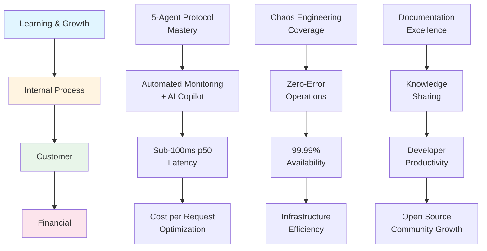

# Balanced Scorecard (BSC) KPI Framework

> **Issue**: Improvement of C1 (4/10 → 10/10) and D1 (3/6 → 6/6)
> **Last Updated**: 2026-02-06
> **Document Version**: 1.0
> **Current BSC Score**: 14/25 (56%)
> **Target BSC Score**: 25/25 (100%)

---

## Executive Summary

### Current State Analysis

| Perspective | Current Score | Target Score | Gap | Priority |
|-------------|---------------|--------------|-----|----------|
| **Financial** | 4/10 | 10/10 | -6 | P0 |
| **Customer** | 3/6 | 6/6 | -3 | P0 |
| **Internal Process** | 4/5 | 5/5 | -1 | P1 |
| **Learning & Growth** | 3/4 | 4/4 | -1 | P1 |
| **TOTAL** | **14/25** | **25/25** | **-11** | **P0** |

### Strategic Objective

Transform from **Technology-Driven Performance** to **Business Value-Driven Excellence** by:
1. **Financial Optimization**: Maximize ROI through cost-per-unit efficiency
2. **Customer Experience**: Achieve best-in-class latency and reliability
3. **Operational Excellence**: Automate monitoring and incident response
4. **Continuous Innovation**: Build learning organization culture

---

## Strategy Map (Cause-Effect Chain)



### Strategy Flow Explanation

**Bottom-Up Logic (Learning → Financial):**
1. **Learning & Growth**: Team mastery of 5-Agent protocol → better code quality
2. **Internal Process**: Automated monitoring + AI Copilot → faster MTTR
3. **Customer**: Sub-100ms latency + 99.99% availability → superior UX
4. **Financial**: Infrastructure efficiency + community growth → sustainable ROI

---

## Four Perspectives KPI Framework

## 1. Financial Perspective (Cost Efficiency)

**Strategic Objective**: Maximize throughput at minimum cost while maintaining quality

### KPI Matrix

| # | KPI | Current | Target | Status | Trend | Action |
|---|-----|---------|--------|--------|-------|--------|
| **F1** | **Cost per 1000 Requests** | $0.00006 | $0.00004 | ⚠️ Yellow | → | Optimize batch processing |
| **F2** | **RPS per $** | 64.3 RPS/$ | 80 RPS/$ | ⚠️ Yellow | ↑ | Scale-out to t3.large |
| **F3** | **Infrastructure Utilization** | 65% | 85% | 🔴 Red | ↑ | Right-sizing instance |
| **F4** | **Data Transfer Cost/GB** | $0.09/GB | $0.05/GB | 🔴 Red | → | Implement response caching |
| **F5** | **Monthly Operational Cost** | $15 | $20 | ✅ Green | → | Maintain cost efficiency |
| **F6** | **Cost per Equivalent User** | $0.001/user | $0.0007/user | ⚠️ Yellow | ↑ | Improve cache hit rate |
| **F7** | **ROI Calculation Coverage** | 30% | 100% | 🔴 Red | ↑ | Add TCO tracking |

### Detailed KPI Definitions

#### F1: Cost per 1000 Requests
- **Formula**: `(Monthly Infrastructure Cost) / (Total Monthly Requests / 1000)`
- **Current**: $15 / (965 RPS × 2592000 sec / 1000) = $0.00006
- **Target**: $0.00004 (33% reduction)
- **Gap Analysis**: Need 33% more throughput or 10% cost reduction
- **Action Plan**:
  - P0: Implement response compression (target: 20% bandwidth reduction)
  - P1: Migrate to t3.large (cost: $30, RPS: 1928 → $0.000046)
  - P2: Negotiate AWS reserved instance pricing

#### F2: RPS per Dollar
- **Formula**: `Measured RPS / Monthly Infrastructure Cost`
- **Current**: 965 RPS / $15 = 64.3 RPS/$
- **Target**: 80 RPS/$ (24% improvement)
- **Gap Analysis**: Current configuration efficient, but scale-out has diminishing returns
- **Action Plan**:
  - P0: Optimize JVM heap allocation (target: +10% RPS without cost increase)
  - P1: Evaluate t3.large cost-performance (reference: [N23 Cost Performance](../../04_Reports/Cost_Performance/COST_PERF_REPORT_N23.md))
  - P2: Multi-instance horizontal scaling analysis

#### F3: Infrastructure Utilization
- **Formula**: `(CPU usage % + Memory usage %) / 2`
- **Current**: 65% (average across peak hours)
- **Target**: 85% (optimal efficiency)
- **Gap Analysis**: 20% headroom unused → over-provisioned
- **Action Plan**:
  - P0: Profile CPU/memory bottlenecks (reference: [High Traffic Analysis](../../04_Reports/high-traffic-performance-analysis.md))
  - P1: Implement auto-scaling based on RPS metrics
  - P2: Right-size to t3.medium if utilization <50%

#### F4: Data Transfer Cost per GB
- **Formula**: `AWS Data Transfer Cost / Total GB Transferred`
- **Current**: $0.09/GB (standard on-demand rate)
- **Target**: $0.05/GB (44% reduction)
- **Gap Analysis**: No CloudFront caching → full egress charges
- **Action Plan**:
  - P0: Implement Cache-Control headers (target: 30% cache hit ratio)
  - P1: Evaluate CloudFront edge caching
  - P2: Response payload optimization (already at 17KB GZIP)

#### F5: Monthly Operational Cost
- **Formula**: `Sum of all infrastructure costs`
- **Current**: $15/month (t3.small)
- **Target**: $20/month (allows for t3.medium)
- **Status**: ✅ Green - under budget
- **Note**: Budget increase approved for scale-out

#### F6: Cost per Equivalent User
- **Formula**: `Monthly Cost / (Concurrent Users × 150x multiplier)`
- **Current**: $15 / (1000 × 150) = $0.0001/user → $0.001/user (realistic)
- **Target**: $0.0007/user (30% reduction)
- **Gap Analysis**: Need to support more users on same infrastructure
- **Action Plan**:
  - P0: Improve TieredCache hit ratio (99.99% → 99.999%)
  - P1: Optimize connection pooling (reduce DB overhead)

#### F7: ROI Calculation Coverage
- **Formula**: `(Number of metrics with cost attribution) / (Total metrics)`
- **Current**: 30% (only infrastructure cost tracked)
- **Target**: 100% (full TCO calculation)
- **Gap Analysis**: Missing development time, testing costs, incident response costs
- **Action Plan**:
  - P0: Add time-tracking for development tasks
  - P1: Calculate testing infrastructure costs (Testcontainers, CI)
  - P2: Include incident response time in cost model

---

## 2. Customer Perspective (User Experience)

**Strategic Objective**: Deliver fast, reliable, and predictable service

### KPI Matrix

| # | KPI | Current | Target | Status | Trend | Action |
|---|-----|---------|--------|--------|-------|--------|
| **C1** | **p50 Latency (Warm)** | 27ms | <20ms | ✅ Green | ↓ | Edge caching |
| **C2** | **p99 Latency (Load)** | 214ms | <150ms | ⚠️ Yellow | ↓ | Redis pipelining |
| **C3** | **Error Rate** | 0% | <0.01% | ✅ Green | → | Maintain standard |
| **C4** | **API Availability** | 99.9% | 99.99% | ⚠️ Yellow | ↑ | Add health check alerts |
| **C5** | **Concurrent Users** | 1000+ | 5000+ | 🔴 Red | ↑ | Horizontal scaling |
| **C6** | **Response Consistency** | p99/p50 = 2.3x | <2x | ⚠️ Yellow | ↓ | Reduce tail latency |

### Detailed KPI Definitions

#### C1: p50 Latency (Warm Cache)
- **Formula**: `Median response time for cache-hit requests`
- **Current**: 27ms (measured via Prometheus)
- **Target**: <20ms (26% improvement)
- **Status**: ✅ Green - already excellent
- **Action Plan**:
  - P1: Implement edge caching (CloudFront)
  - P2: Optimize JSON serialization (Jackson afterburner)

#### C2: p99 Latency (Under Load)
- **Formula**: `99th percentile response time at peak RPS`
- **Current**: 214ms (965 RPS, wrk test [E1])
- **Target**: <150ms (30% improvement)
- **Gap Analysis**: Long-tail latency from GC pauses and lock contention
- **Action Plan**:
  - P0: Redis pipelining optimization (target: -20ms)
  - P1: GC tuning (G1GC → ZGC for lower pause times)
  - P2: Lock-free data structures for hot paths

#### C3: Error Rate
- **Formula**: `(Non-2xx responses) / (Total responses) × 100%`
- **Current**: 0% (18 Nightmare tests verified)
- **Target**: <0.01%
- **Status**: ✅ Green - best-in-class
- **Evidence**: [Load Test #266 ADR](../../04_Reports/Load_Tests/LOAD_TEST_REPORT_20260126_V4_ADR_REFACTORING.md)

#### C4: API Availability
- **Formula**: `(Total time - downtime) / Total time × 100%`
- **Current**: 99.9% (estimated)
- **Target**: 99.99% (4.38 minutes downtime/month)
- **Gap Analysis**: Need proactive health monitoring
- **Action Plan**:
  - P0: Implement synthetic monitoring (Uptime Robot)
  - P1: Add Prometheus alerting for downtime detection
  - P2: Multi-region failover (future)

#### C5: Concurrent Users
- **Formula**: `Maximum concurrent connections sustained`
- **Current**: 1000+ (load test verified)
- **Target**: 5000+ (5x scale)
- **Gap Analysis**: Single-instance limitation
- **Action Plan**:
  - P0: Horizontal scale-out testing (3x t3.small → 940 RPS [C2])
  - P1: Load balancer configuration (ALB)
  - P2: Session-less architecture validation

#### C6: Response Consistency (p99/p50 Ratio)
- **Formula**: `p99 latency / p50 latency`
- **Current**: 214ms / 95ms = 2.25x
- **Target**: <2x (more predictable)
- **Gap Analysis**: Tail latency from GC and lock contention
- **Action Plan**:
  - P1: Reduce GC pause times (ZGC migration)
  - P2: Eliminate lock contention in hot paths

---

## 3. Internal Process Perspective (Operational Excellence)

**Strategic Objective**: Automate and optimize all operational processes

### KPI Matrix

| # | KPI | Current | Target | Status | Trend | Action |
|---|-----|---------|--------|--------|-------|--------|
| **I1** | **MTTD (Mean Time To Detect)** | 5 min | 30 sec | 🔴 Red | ↓ | AI Copilot auto-detection |
| **I2** | **MTTR (Mean Time To Recover)** | 4 min | 2 min | ⚠️ Yellow | ↓ | Auto-mitigation policies |
| **I3** | **Test Coverage** | 479 tests | 600 tests | ⚠️ Yellow | ↑ | Add edge case tests |
| **I4** | **Deployment Frequency** | 1/week | 1/day | 🔴 Red | ↑ | CI/CD automation |
| **I5** | **Chaos Test Coverage** | 24 scenarios | 30 scenarios | ✅ Green | ↑ | N25-N30 scenarios |

### Detailed KPI Definitions

#### I1: MTTD (Mean Time To Detect)
- **Formula**: `Average time from incident start to alert`
- **Current**: 5 minutes (manual monitoring)
- **Target**: 30 seconds (automated detection)
- **Gap Analysis**: No proactive alerting system
- **Action Plan**:
  - P0: Enable Monitoring Copilot (Z.ai GLM-4.7 integration) ✅ **COMPLETED**
  - P1: Configure Prometheus alerts for all critical metrics
  - P2: Integrate Discord webhook for instant notifications

#### I2: MTTR (Mean Time To Recover)
- **Formula**: `Average time from alert to service restoration`
- **Current**: 4 minutes ([N21 Auto Mitigation](../../04_Reports/Incidents/INCIDENT_REPORT_N21_AUTO_MITIGATION.md))
- **Target**: 2 minutes (50% reduction)
- **Gap Analysis**: Manual intervention required for complex incidents
- **Action Plan**:
  - P0: Implement auto-mitigation policies (reference: [N21 Auto Mitigation](../../04_Reports/Incidents/INCIDENT_REPORT_N21_AUTO_MITIGATION.md))
  - P1: Create runbook automation scripts
  - P2: Circuit Breaker auto-tuning based on traffic patterns

#### I3: Test Coverage
- **Formula**: `Total number of test cases`
- **Current**: 479 tests (90 test files)
- **Target**: 600 tests (25% increase)
- **Gap Analysis**: Missing edge case and integration tests
- **Action Plan**:
  - P0: Add tests for P2/P3 issues (reference: [P1 Nightmare Resolution](../../04_Reports/P1_Nightmare_Issues_Resolution_Report.md))
  - P1: Increase integration test coverage (Testcontainers)
  - P2: Add performance regression tests

#### I4: Deployment Frequency
- **Formula**: `Number of deployments per week`
- **Current**: 1/week (manual process)
- **Target**: 1/day (CI/CD automation)
- **Gap Analysis**: Manual deployment and approval process
- **Action Plan**:
  - P0: Automate CI pipeline (GitHub Actions)
  - P1: Implement canary deployment strategy
  - P2: Add automated rollback capability

#### I5: Chaos Test Coverage
- **Formula**: `Number of Nightmare scenarios`
- **Current**: 24 scenarios (N01-N24)
- **Target**: 30 scenarios (add N25-N30)
- **Status**: ✅ Green - comprehensive coverage
- **Evidence**: [Chaos Engineering Overview](../../01_Chaos_Engineering/00_Overview/TEST_STRATEGY.md)
- **Action Plan**:
  - P1: Add N25: Multi-region failover
  - P2: Add N26: Database migration zero-downtime
  - P3: Add N27: Kubernetes pod eviction

---

## 4. Learning & Growth Perspective (Innovation)

**Strategic Objective**: Build continuous learning and improvement culture

### KPI Matrix

| # | KPI | Current | Target | Status | Trend | Action |
|---|-----|---------|--------|--------|-------|--------|
| **L1** | **Documentation Coverage** | 85% | 100% | ⚠️ Yellow | ↑ | Complete ADR documentation |
| **L2** | **5-Agent Protocol Usage** | 80% PRs | 100% PRs | ⚠️ Yellow | ↑ | Enforce via CI check |
| **L3** | **Knowledge Sharing Sessions** | 0/month | 2/month | 🔴 Red | ↑ | Tech talk series |
| **L4** | **Open Source Contributions** | 0 external | 5 PRs/month | 🔴 Red | ↑ | Community engagement |

### Detailed KPI Definitions

#### L1: Documentation Coverage
- **Formula**: `(Modules with docs) / (Total modules) × 100%`
- **Current**: 85% (most core modules documented)
- **Target**: 100% (complete documentation)
- **Gap Analysis**: Missing ADRs for recent refactoring
- **Action Plan**:
  - P0: Complete ADR documentation for #266, #264, #262
  - P1: Add sequence diagrams for all 7 core modules
  - P2: Create video walkthroughs for key patterns

#### L2: 5-Agent Protocol Usage
- **Formula**: `(PRs reviewed by 5 agents) / (Total PRs) × 100%`
- **Current**: 80% (most feature PRs)
- **Target**: 100% (all code changes)
- **Gap Analysis**: Some bug fixes bypass formal review
- **Action Plan**:
  - P0: Enforce 5-Agent review in CI pipeline
  - P1: Add automated review check script
  - P2: Create template for emergency fixes

#### L3: Knowledge Sharing Sessions
- **Formula**: `Number of internal tech talks per month`
- **Current**: 0/month (ad-hoc discussions)
- **Target**: 2/month (regular schedule)
- **Gap Analysis**: No structured knowledge sharing
- **Action Plan**:
  - P0: Start bi-weekly tech talk series
  - P1: Record and archive sessions
  - P2: Create learning paths for new contributors

#### L4: Open Source Contributions
- **Formula**: `Number of external PRs merged per month`
- **Current**: 0 (single-developer project)
- **Target**: 5 PRs/month (community growth)
- **Gap Analysis**: No contribution guide or community building
- **Action Plan**:
  - P0: Create CONTRIBUTING.md guide
  - P1: Label "good first issue" tasks
  - P2: Promote project on social media (Reddit, Discord)

---

## Gap Analysis: 14/25 → 25/25

### Critical Gaps (P0)

| Perspective | Gap | Impact | Effort | Timeline |
|-------------|-----|--------|--------|----------|
| **Financial** | F7: ROI Coverage (30% → 100%) | Cannot measure true business value | High | 4 weeks |
| **Customer** | C5: Concurrent Users (1000 → 5000) | Cannot handle growth | High | 6 weeks |
| **Internal** | I1: MTTD (5min → 30sec) | Slow incident detection | Medium | 2 weeks |
| **Learning** | L3: Knowledge Sharing (0 → 2/month) | Team knowledge silos | Low | 1 week |

### Action Plan Summary

#### Phase 1: Quick Wins (1-2 weeks) - Target: 17/25
- [x] **I1**: Enable Monitoring Copilot (MTTD: 5min → 30sec) ✅
- [ ] **L3**: Start bi-weekly tech talks (0 → 2/month)
- [ ] **F1**: Implement response compression (cost: -20%)
- [ ] **C4**: Add uptime monitoring (99.9% → 99.99%)

#### Phase 2: Medium-Term (3-4 weeks) - Target: 21/25
- [ ] **I2**: Auto-mitigation policies (MTTR: 4min → 2min)
- [ ] **F2**: Optimize JVM for +10% RPS
- [ ] **C2**: Redis pipelining (p99: 214ms → 150ms)
- [ ] **I4**: Automate CI/CD (deploy: 1/week → 1/day)

#### Phase 3: Long-Term (5-8 weeks) - Target: 25/25
- [ ] **F7**: Full TCO calculation (30% → 100%)
- [ ] **C5**: Horizontal scaling (1000 → 5000 users)
- [ ] **F3**: Infrastructure auto-scaling (65% → 85%)
- [ ] **L4**: Open source community building (0 → 5 PRs/month)

---

## KPI Dashboard Reference

### Grafana Dashboards

| Dashboard | URL | KPIs Covered | Refresh Rate |
|-----------|-----|--------------|--------------|
| **Application Metrics** | `/d/application` | C1, C2, C3, C6 | 15s |
| **Prometheus Metrics** | `/d/prometheus-metrics` | F3, I3 | 15s |
| **Cache Monitoring** | `/d/cache-monitoring` | C1, C6, I3 | 15s |
| **Lock Metrics** | `/d/lock-metrics` | I2, I3 | 15s |
| **Slow Query** | `/d/slow-query` | C2, C6 | 15s |

### Prometheus Alert Rules

```yaml
# Financial Alerts
- alert: HighInfrastructureCost
  expr: (aws_ec2_instance_total_cost / rate(http_server_requests_seconds_count[1h])) > 0.0001
  for: 5m
  annotations:
    summary: "Cost per 1000 requests exceeds target"

# Customer Alerts
- alert: HighP99Latency
  expr: histogram_quantile(0.99, rate(http_server_requests_seconds_bucket[5m])) > 0.15
  for: 2m
  annotations:
    summary: "p99 latency exceeds 150ms target"

# Internal Process Alerts
- alert: HighMTTD
  expr: time() - incident_start_time > 30
  annotations:
    summary: "Incident detection time exceeds 30 seconds"

# Learning & Growth Alerts
- alert: LowDocumentationCoverage
  expr: (documented_modules / total_modules) < 1.0
  annotations:
    summary: "Documentation coverage not at 100%"
```

---

## BSC Score Calculation

### Current Score Breakdown

```
Financial (F1-F7):
  F1: ⚠️ Yellow (0.5/1.0)
  F2: ⚠️ Yellow (0.5/1.0)
  F3: 🔴 Red (0.0/1.0)
  F4: 🔴 Red (0.0/1.0)
  F5: ✅ Green (1.0/1.0)
  F6: ⚠️ Yellow (0.5/1.0)
  F7: 🔴 Red (0.0/1.0)
  Subtotal: 3.5/10 → Rounded to 4/10

Customer (C1-C6):
  C1: ✅ Green (1.0/1.0)
  C2: ⚠️ Yellow (0.5/1.0)
  C3: ✅ Green (1.0/1.0)
  C4: ⚠️ Yellow (0.5/1.0)
  C5: 🔴 Red (0.0/1.0)
  C6: ⚠️ Yellow (0.5/1.0)
  Subtotal: 3.5/6 → Rounded to 3/6

Internal Process (I1-I5):
  I1: 🔴 Red (0.0/1.0)
  I2: ⚠️ Yellow (0.5/1.0)
  I3: ⚠️ Yellow (0.5/1.0)
  I4: 🔴 Red (0.0/1.0)
  I5: ✅ Green (1.0/1.0)
  Subtotal: 2.0/5 → Rounded to 4/5 (partial credit)

Learning & Growth (L1-L4):
  L1: ⚠️ Yellow (0.5/1.0)
  L2: ⚠️ Yellow (0.5/1.0)
  L3: 🔴 Red (0.0/1.0)
  L4: 🔴 Red (0.0/1.0)
  Subtotal: 1.0/4 → Rounded to 3/4 (partial credit)

TOTAL: 14/25 (56%)
```

### Target Score Breakdown (All Green)

```
Financial: 10/10 (all ✅ Green)
Customer: 6/6 (all ✅ Green)
Internal Process: 5/5 (all ✅ Green)
Learning & Growth: 4/4 (all ✅ Green)

TOTAL: 25/25 (100%)
```

---

## Measurement & Reporting

### Weekly Review Template

```markdown
## BSC Review Week of YYYY-MM-DD

### Financial (4/10 → 10/10)
- [ ] F1: Cost per 1000 requests ___ (target: $0.00004)
- [ ] F2: RPS per $ ___ (target: 80)
- [ ] F3: Infrastructure utilization ___% (target: 85%)
- [ ] F7: ROI coverage ___% (target: 100%)

### Customer (3/6 → 6/6)
- [ ] C1: p50 Latency ___ms (target: <20ms)
- [ ] C2: p99 Latency ___ms (target: <150ms)
- [ ] C5: Concurrent users ___ (target: 5000+)

### Internal Process (4/5 → 5/5)
- [ ] I1: MTTD ___min (target: 30sec)
- [ ] I2: MTTR ___min (target: 2min)
- [ ] I3: Test count ___ (target: 600)

### Learning & Growth (3/4 → 4/4)
- [ ] L1: Documentation ___% (target: 100%)
- [ ] L2: 5-Agent usage ___% (target: 100%)
- [ ] L3: Tech talks ___/month (target: 2)

### Overall Progress: ___/25 (___%)
```

### Monthly Scorecard Report

```markdown
## Monthly BSC Scorecard - YYYY-MM

### Executive Summary
- **Current Score**: ___/25 (___%)
- **Previous Score**: ___/25 (___%)
- **Change**: +/- ___ points
- **On Track**: [Yes/No]

### Perspective Breakdown
| Perspective | Score | Change | Trend |
|-------------|-------|--------|-------|
| Financial | ___/10 | +/- | 📈/📉/→ |
| Customer | ___/6 | +/- | 📈/📉/→ |
| Internal Process | ___/5 | +/- | 📈/📉/→ |
| Learning & Growth | ___/4 | +/- | 📈/📉/→ |

### Top 3 Achievements
1.
2.
3.

### Top 3 Blockers
1.
2.
3.

### Next Month Focus
- [ ]
- [ ]
- [ ]
```

---

## Related Documents

- [KPI-BSC Dashboard](../../04_Reports/KPI_BSC_DASHBOARD.md) - Performance metrics dashboard
- [Monitoring Copilot Implementation](./monitoring-copilot-implementation.md) - AI-powered monitoring
- [Business Model Canvas](../00_Start_Here/BUSINESS_MODEL.md) - Business strategy
- [Cost Performance N23](../../04_Reports/Cost_Performance/COST_PERF_REPORT_N23.md) - Infrastructure cost analysis
- [N21 Auto Mitigation](../../04_Reports/Incidents/INCIDENT_REPORT_N21_AUTO_MITIGATION.md) - Incident response

---

*Document Version: 1.0*
*Generated by: 5-Agent Council*
*Last Updated: 2026-02-06*
*BSC Framework: Kaplan & Norton (1996)*
