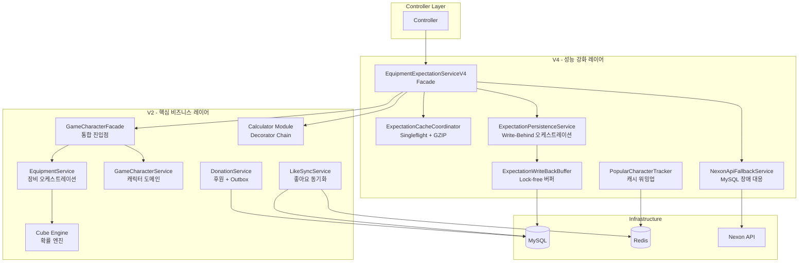
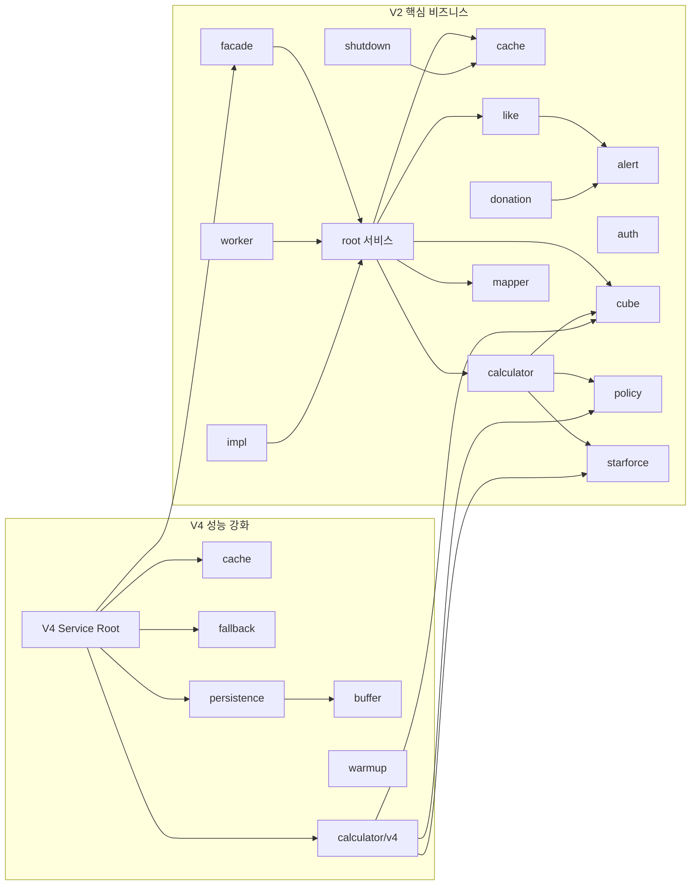

# Service Modules Guide

> **상위 문서:** [CLAUDE.md](../../CLAUDE.md)

서비스 레이어의 모듈 구조와 각 모듈의 역할, 핵심 클래스, 적용된 설계 패턴을 정리한 가이드입니다.

---

## 개요

MapleExpectation의 서비스 레이어는 **V2 (핵심 비즈니스)**와 **V4 (성능 강화)** 두 세대로 구성됩니다.

- **V2:** 도메인 로직, 캐싱, 계산, 동기화 등 핵심 비즈니스 기능 (15개 모듈, ~97개 클래스)
- **V4:** Write-Behind 버퍼, 캐시 코디네이션, Fallback 등 성능/회복탄력성 강화 (6개 모듈, ~10개 클래스)
- **Calculator V4:** Decorator Chain 기반 BigDecimal 정밀 계산기 (8개 클래스)



---

## V2 - 핵심 비즈니스 서비스

### 1. root (루트 서비스)

장비 계산, 캐릭터 관리, 좋아요 동기화 등 핵심 도메인 오케스트레이션 서비스.

| 클래스 | 역할 |
|--------|------|
| `EquipmentService` | 장비 업그레이드 비용 계산 오케스트레이션. Single-flight 패턴으로 중복 MISS 방지, 비동기 파이프라인, GZIP 스트리밍 |
| `GameCharacterService` | 캐릭터 도메인 서비스. 조회/생성/보강, 네거티브/포지티브 캐싱, 비동기 DB 갱신 |
| `DonationService` | 커피 후원 기능. 분산 락, 멱등성 검사, Transactional Outbox 패턴 |
| `LikeSyncService` | 좋아요 동기화 (Financial-grade). Lua Script 원자적 fetch, 보상 트랜잭션, Graceful Shutdown 폴백 |
| `LikeSyncExecutor` | 개별 좋아요 카운트 갱신. JDBC batchUpdate, CircuitBreaker, REQUIRES_NEW 격리 |
| `LikeRelationSyncService` | Redis → DB 배치 동기화. L1→L2 flush, UNIQUE 제약 충돌 정상 처리 |
| `OcidResolver` | OCID 해석 (Get or Create 패턴). 네거티브 캐시, Optional 체이닝 |
| `CubeTrialsProvider` | 큐브 기대 시행 횟수 제공 인터페이스 |
| `LikeProcessor` | 좋아요/취소 처리 인터페이스 |

**설계 패턴:** Single-flight, Transactional Outbox, Compensation Transaction, Optional Chaining

---

### 2. alert (Discord 알림)

Discord Webhook 기반 알림 시스템. AI SRE 자동 분석 통합.

| 클래스 | 역할 |
|--------|------|
| `DiscordAlertService` | Discord 알림 전송. Fire-and-forget (3초 타임아웃), AI 분석 연동 |
| `DiscordMessageFactory` | Discord Embed 메시지 생성 Factory. 심각도 이모지, 스택 트레이스 제한 |
| `DiscordMessage` (dto) | Discord 메시지 Record DTO (Embed, Field, Footer) |

**설계 패턴:** Factory

---

### 3. auth (인증/인가)

사용자 인증, 세션, 관리자 검증 등 보안 관련 서비스.

| 클래스 | 역할 |
|--------|------|
| `AuthService` | 인증 서비스 |
| `AdminService` | 관리자 검증 (핑거프린트 기반) |
| `SessionService` | 사용자 세션 관리 |
| `RefreshTokenService` | JWT 리프레시 토큰 관리 |
| `CharacterLikeService` | 좋아요 관리 (자기 좋아요/중복 방지) |

---

### 4. cache (다계층 캐싱)

L1(Caffeine) + L2(Redis) TieredCache 기반 캐싱과 좋아요 버퍼 전략.

| 클래스 | 역할 |
|--------|------|
| `EquipmentCacheService` | 장비 데이터 L1+L2 캐싱. 유효성 검증, 만료 관리 |
| `EquipmentDataResolver` | 장비 데이터 소스 우선순위 결정 (DB vs API). 15분 DB TTL |
| `EquipmentFingerprintGenerator` | 장비 업데이트 핑거프린트 생성. 테이블 버전 해싱 |
| `TotalExpectationCacheService` | 기댓값 결과 L1+L2 캐싱 |
| `LikeBufferStorage` | 좋아요 버퍼 저장소 인터페이스 |
| `LikeBufferStrategy` | 좋아요 버퍼 전략 (Redis/인메모리). `fetchAndClear()` 원자적 스냅샷 |
| `LikeRelationBuffer` | 좋아요 관계 인메모리 버퍼. Redis flush 연동 |
| `LikeRelationBufferStrategy` | 좋아요 관계 버퍼링 전략 |

**설계 패턴:** Strategy, TieredCache (L1+L2)

---

### 5. calculator (기댓값 계산)

Decorator 패턴 기반 장비 업그레이드 기대 비용 계산 엔진.

| 클래스 | 역할 |
|--------|------|
| `ExpectationCalculator` | 기댓값 계산 인터페이스 |
| `ExpectationCalculatorFactory` | 계산기 인스턴스 생성 Factory |
| `CubeRateCalculator` | 큐브 성공 확률 계산 |
| `PotentialCalculator` | 잠재능력 비용 계산 |
| `EnhanceDecorator` | 강화 비용 계산 Decorator 추상 클래스 |
| `BaseItem` (impl) | Decorator Chain 시작점 (비용 = 0) |
| `BlackCubeDecorator` (impl) | 블랙큐브 강화 Decorator |

**설계 패턴:** Decorator (GoF), Factory

---

### 6. cube (큐브 확률 엔진)

큐브 확률 분포 계산을 위한 수학적 엔진 모듈.

| 클래스 | 역할 |
|--------|------|
| `CubeDpCalculator` (component) | Damage per shot 계산 |
| `CubeSlotCountResolver` (component) | 슬롯 수 결정 |
| `DpModeInferrer` (component) | DP 모드 추론 |
| `ProbabilityConvolver` (component) | 확률 합성곱 연산 |
| `SlotDistributionBuilder` (component) | 분포 생성 |
| `StatValueExtractor` (component) | 스탯 값 추출 |
| `TailProbabilityCalculator` (component) | 꼬리 확률 계산 |
| `CubeEngineFeatureFlag` (config) | 큐브 엔진 피처 토글 |
| `TableMassConfig` (config) | 테이블 질량 설정 |
| `DensePmf` (dto) | Dense 확률 질량 함수 |
| `SparsePmf` (dto) | Sparse 확률 질량 함수 |

**설계 패턴:** Component 분리 (SRP), Strategy (Feature Flag)

---

### 7. donation (후원 + Transactional Outbox)

후원 기능과 Transactional Outbox 기반 이벤트 신뢰성 보장.

| 클래스 | 역할 |
|--------|------|
| `PaymentStrategy` | 결제 전략 인터페이스 |
| `InternalPointPaymentStrategy` | 내부 포인트 결제 구현체 |
| `DonationProcessor` (event) | 후원 트랜잭션 처리 |
| `DonationEventListener` (listener) | 후원 이벤트 리스너 |
| `DonationFailedEvent` (listener) | 후원 실패 이벤트 |
| `OutboxProcessor` (outbox) | Transactional Outbox 프로세서 |
| `DlqHandler` (outbox) | Dead Letter Queue 처리 |
| `DlqAdminService` (outbox) | DLQ 관리 서비스 |
| `OutboxMetrics` (outbox) | Outbox 메트릭 기록 |

**설계 패턴:** Strategy, Transactional Outbox, Dead Letter Queue

---

### 8. facade (통합 진입점)

캐릭터 관련 서비스의 통합 진입점 Facade.

| 클래스 | 역할 |
|--------|------|
| `GameCharacterFacade` | 캐릭터 도메인 통합 Facade. 하위 서비스 조합 |
| `GameCharacterSynchronizer` | 캐릭터 데이터 동기화 |

**설계 패턴:** Facade (GoF)

---

### 9. impl (구현체)

인터페이스 구현체 모듈.

| 클래스 | 역할 |
|--------|------|
| `CubeServiceImpl` | 큐브 계산 서비스 구현체 |
| `DatabaseLikeProcessor` | DB 기반 좋아요 처리 (LikeProcessor 구현) |

---

### 10. like (좋아요 시스템)

좋아요 기능의 보상 트랜잭션, 실시간 이벤트, 복구, 전략 패턴 하위 모듈.

| 클래스 | 역할 |
|--------|------|
| `CompensationCommand` (compensation) | 보상 트랜잭션 인터페이스 |
| `RedisCompensationCommand` (compensation) | Redis 기반 보상 명령 |
| `FetchResult` (dto) | 원자적 fetch 결과 DTO |
| `LikeSyncFailedEvent` (event) | 좋아요 동기화 실패 이벤트 |
| `LikeSyncEventListener` (listener) | 동기화 이벤트 리스너 |
| `LikeEventPublisher` (realtime) | 좋아요 이벤트 발행 인터페이스 |
| `LikeEventSubscriber` (realtime) | 좋아요 이벤트 구독 인터페이스 |
| `LikeEvent` (realtime/dto) | 실시간 좋아요 이벤트 |
| `RedisLikeEventPublisher` (realtime/impl) | Redis Pub/Sub 발행 |
| `RedisLikeEventSubscriber` (realtime/impl) | Redis Pub/Sub 구독 |
| `OrphanKeyRecoveryService` (recovery) | 고아 Redis 키 복구 |
| `AtomicFetchStrategy` (strategy) | 원자적 fetch 인터페이스 |
| `LuaScriptAtomicFetchStrategy` (strategy) | Lua Script 원자적 fetch |
| `RenameAtomicFetchStrategy` (strategy) | RENAME 명령 원자적 fetch |

**설계 패턴:** Strategy, Compensation Transaction, Observer (Pub/Sub), Command

---

### 11. mapper (데이터 변환)

DTO 매핑 모듈.

| 클래스 | 역할 |
|--------|------|
| `EquipmentMapper` | 장비 데이터 DTO 매핑 |

---

### 12. policy (비즈니스 정책)

비즈니스 규칙 정책 모듈.

| 클래스 | 역할 |
|--------|------|
| `CubeCostPolicy` | 큐브 비용 산정 정책 |

---

### 13. shutdown (Graceful Shutdown)

애플리케이션 종료 시 데이터 안전성 보장 모듈.

| 클래스 | 역할 |
|--------|------|
| `ShutdownDataPersistenceService` | 좋아요 버퍼 → 파일 영속화 (종료 시) |
| `ShutdownDataRecoveryService` | 파일 → 시스템 복구 (시작 시) |
| `EquipmentPersistenceTracker` | 장비 데이터 영속화 추적 |
| `PersistenceTrackerStrategy` | 영속화 추적 전략 인터페이스 |

**설계 패턴:** Strategy, SmartLifecycle

---

### 14. starforce (스타포스 계산)

스타포스 강화 확률/비용 조회 테이블 모듈.

| 클래스 | 역할 |
|--------|------|
| `StarforceLookupTable` | 스타포스 데이터 조회 인터페이스 |
| `StarforceLookupTableImpl` | 스타포스 테이블 구현체 |
| `NoljangProbabilityTable` (config) | 놀장(파괴 방지) 확률 테이블 설정 |

---

### 15. worker (비동기 워커)

백그라운드 비동기 작업 실행 워커 모듈.

| 클래스 | 역할 |
|--------|------|
| `EquipmentDbWorker` | 장비 DB 비동기 처리 워커 |
| `GameCharacterWorker` | 캐릭터 비동기 처리 워커 |

---

## V4 - 성능 강화 서비스

### 1. root (메인 Facade)

V4 서비스의 진입점. 비동기 계산 디스패치와 캐시/영속화 조율.

| 클래스 | 역할 |
|--------|------|
| `EquipmentExpectationServiceV4` | V4 메인 Facade. 비동기 디스패치, 프리셋 병렬 계산 (3-preset via ExecutorService), GZIP 압축 응답 |

**설계 패턴:** Facade, Async Pipeline

---

### 2. buffer (Write-Behind 버퍼)

Lock-free CAS 기반 Write-Behind 버퍼와 Graceful Shutdown 핸들러.

| 클래스 | 역할 |
|--------|------|
| `ExpectationWriteBackBuffer` | Lock-free 인메모리 버퍼. CAS + Exponential Backoff, Phaser 기반 Shutdown Race 방지, Backpressure |
| `ExpectationBatchShutdownHandler` | 3-Phase Graceful Shutdown (Block → Wait → Drain). SmartLifecycle 구현, 실패 추적 메트릭 |
| `ExpectationWriteTask` | Write-Behind 버퍼 Record DTO. `{characterId}:{presetNo}` 키로 중복 제거 (Latest-wins) |
| `BackoffStrategy` | CAS 재시도 백오프 전략 인터페이스. ExponentialBackoff (1ns→512ns), NoOpBackoff (테스트용) |

**설계 패턴:** Strategy, SmartLifecycle, Phaser-based Race Prevention

---

### 3. cache (캐시 코디네이션)

Singleflight + GZIP+Base64 압축 캐시 코디네이터.

| 클래스 | 역할 |
|--------|------|
| `ExpectationCacheCoordinator` | Singleflight 패턴 (TieredCache.get). GZIP+Base64 압축/해제, L1 Fast Path (#264), `fromCache` 플래그 관리 |

**설계 패턴:** Singleflight, Compression Pipeline

---

### 4. fallback (Nexon API 장애 대응)

MySQL Degraded 상태 시 Nexon API 직접 호출 Fallback.

| 클래스 | 역할 |
|--------|------|
| `NexonApiFallbackService` | MySQL 장애 시 Nexon API 직접 호출 (28초 타임아웃). Redis 캐싱 (TTL 10분, DEGRADED 시 PERSIST), 보상 로그 기록 |

**설계 패턴:** Fallback, Circuit Breaker Integration

---

### 5. persistence (영속화)

Write-Behind 버퍼의 DB 영속화 오케스트레이션.

| 클래스 | 역할 |
|--------|------|
| `ExpectationPersistenceService` | 비동기 버퍼 offer + Backpressure 시 동기 Fallback. Upsert 패턴 (INSERT ON DUPLICATE KEY UPDATE) |

**설계 패턴:** Write-Behind, Backpressure Fallback

---

### 6. warmup (캐시 워밍업)

인기 캐릭터 추적 기반 캐시 사전 워밍업.

| 클래스 | 역할 |
|--------|------|
| `PopularCharacterTracker` | Redis ZSET 기반 일별 접근 추적. ZINCRBY O(log N), 48시간 TTL, 어제 Top N 캐릭터 조회로 워밍업 지원 |

**설계 패턴:** Sorted Set Ranking, Fire-and-Forget

---

### 7. calculator/v4 (V4 계산기 Decorator Chain)

BigDecimal 정밀 계산 기반 V4 Decorator Chain. `service/v2/calculator/v4/` 경로에 위치.

| 클래스 | 역할 |
|--------|------|
| `EquipmentExpectationCalculator` | V4 계산기 인터페이스. BigDecimal 반환, `CostBreakdown` Record (비용 분류) |
| `EquipmentEnhanceDecorator` | Decorator 추상 클래스. 비용 누적 위임 |
| `EquipmentExpectationCalculatorFactory` | Decorator Chain 구성 Factory. 조건부 체인 조합 |
| `BaseEquipmentItem` (impl) | Chain 시작점 (비용 = ZERO) |
| `BlackCubeDecoratorV4` (impl) | 블랙큐브(윗잠) Decorator. 기하분포 기대 시행, Infinity→ZERO 처리 |
| `RedCubeDecoratorV4` (impl) | 레드큐브(윗잠) Decorator. 블랙큐브 대비 저가/저확률 |
| `AdditionalCubeDecoratorV4` (impl) | 에디셔널큐브(아랫잠) Decorator. 추가 잠재 옵션 |
| `StarforceDecoratorV4` (impl) | 스타포스 Decorator. 0~25성, 파괴 위험, Lookup Table O(1) |

**Decorator Chain 구성 예시:**
```
BaseEquipmentItem
  → BlackCubeDecoratorV4   (잠재능력 보유 시)
  → AdditionalCubeDecoratorV4 (추가잠재 보유 시)
  → StarforceDecoratorV4   (스타포스 보유 시)
```

**설계 패턴:** Decorator (GoF), Factory, BigDecimal Precision

---

## 설계 패턴 요약 테이블

| 패턴 | 적용 위치 | 목적 |
|------|-----------|------|
| **Facade** | `GameCharacterFacade`, `EquipmentExpectationServiceV4` | 복잡한 하위 시스템 통합 진입점 |
| **Decorator** | `calculator/`, `calculator/v4/` | 장비 강화 비용 누적 계산 |
| **Factory** | `ExpectationCalculatorFactory`, `DiscordMessageFactory` | 객체 생성 캡슐화 |
| **Strategy** | `LikeBufferStrategy`, `AtomicFetchStrategy`, `BackoffStrategy`, `PaymentStrategy` | 알고리즘 교체 가능 |
| **Transactional Outbox** | `donation/outbox/` | 이벤트 발행 신뢰성 보장 |
| **Compensation Transaction** | `like/compensation/` | 실패 시 데이터 정합성 복구 |
| **Single-flight** | `EquipmentService`, `ExpectationCacheCoordinator` | 동일 요청 중복 방지 |
| **Write-Behind** | `ExpectationWriteBackBuffer`, `ExpectationPersistenceService` | 비동기 DB 영속화 |
| **Observer (Pub/Sub)** | `like/realtime/` | 실시간 좋아요 이벤트 전파 |
| **Command** | `CompensationCommand` | 보상 명령 캡슐화 |
| **SmartLifecycle** | `ExpectationBatchShutdownHandler` | Graceful Shutdown 순서 제어 |
| **TieredCache** | `cache/` 모듈 전반 | L1(Caffeine) + L2(Redis) 다계층 캐싱 |

---

## 모듈 의존성 그래프


