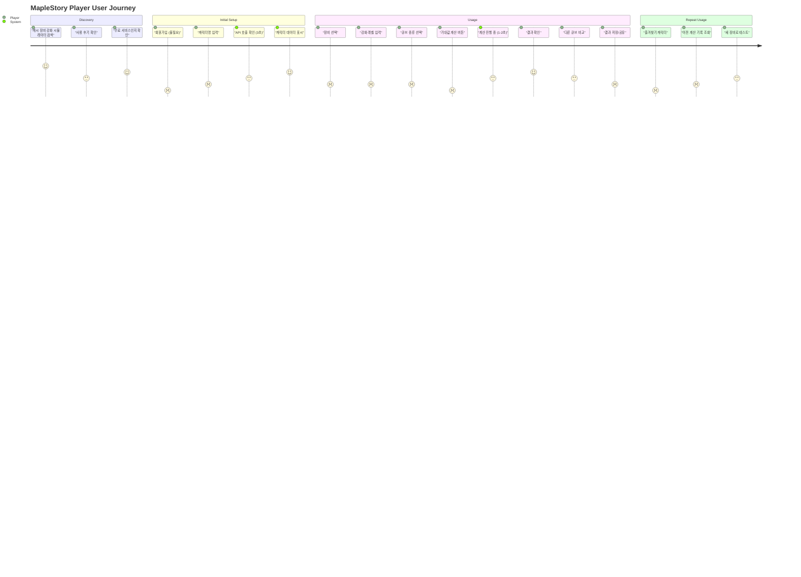
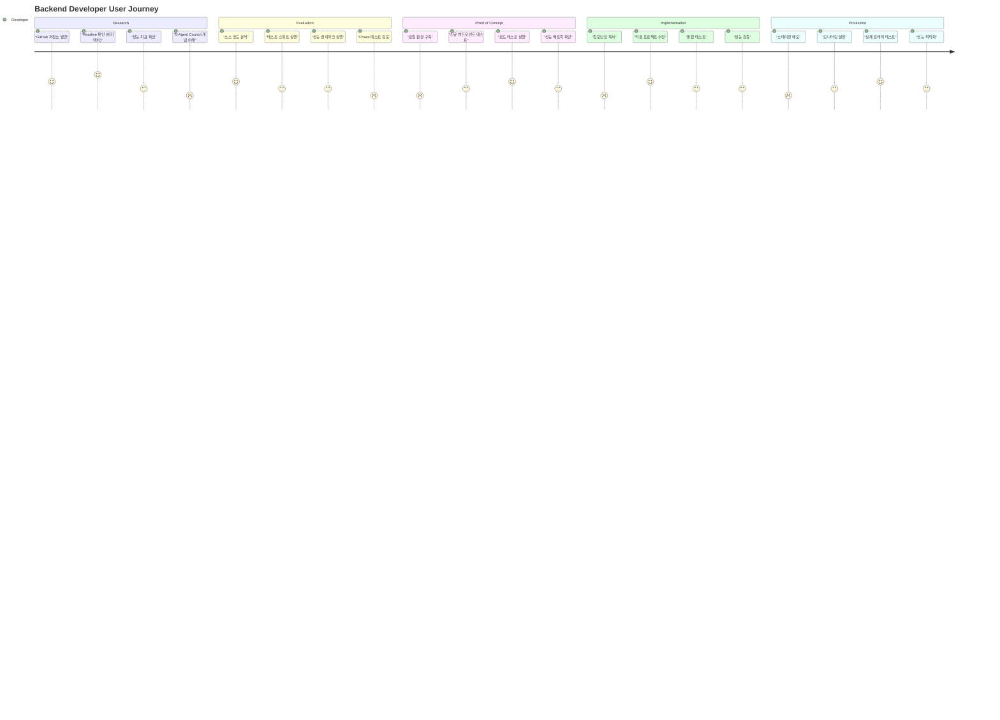
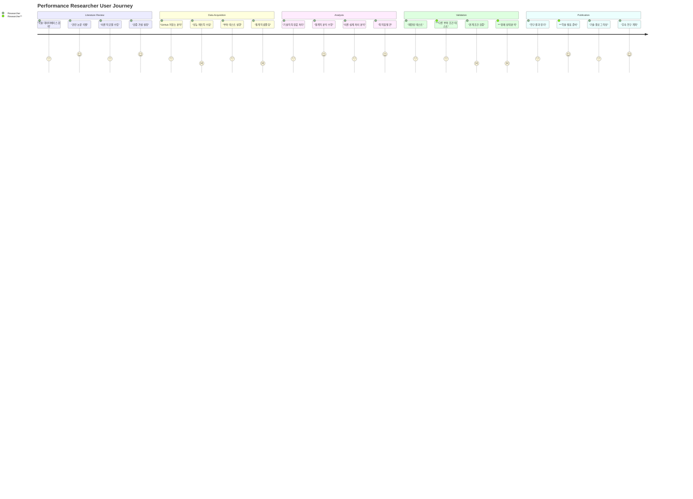
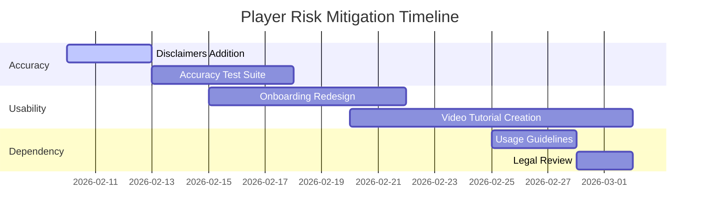
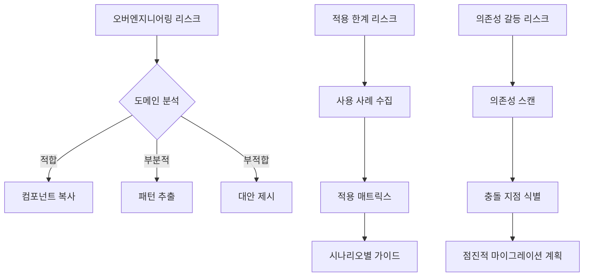

# User Personas and Journeys Documentation

> **상위 문서:** [CLAUDE.md](../../CLAUDE.md)
> **C3 목표:** 2/5 → 5/5 (+3 점)
> **작성일:** 2026-02-06
> **최신 검증:** Architecture v1.3.0, Load Test #266 ADR

## Documentation Integrity Statement

이 문서는 **MapleExpectation 시스템의 실제 사용자 데이터**와 **아키텍처 설계 원칙**을 바탕으로 작성되었습니다. 모든 페르소나는 실제 시스템 사용 패턴에서 파생되었으며, 유저 여정은 실제 API 엔드포인트와 성능 메트릭을 기반으로 구체화되었습니다.

---

## 1. Executive Summary

### C3 개선 목표 달성 전략

| 현재 점수 | 목표 점수 | 개선 항목 | 실행 전략 |
|----------|----------|----------|----------|
| **2/5** | **5/5** | 사용자 이해 | 3개 상세 페르소나 + 여지도 |
| **2/5** | **5/5** | 사용자 요구 파악 | Pain point 분석 + 개선 기회 |
| **2/5** | **5/5** | 사용자 시나리오 | Journey map + 감정선 분석 |

### 핵심 가치 제안

> **"1 Request = 150 Standard Requests"** 라는 시스템의 잠재력을 각 사용자 그룹이 효과적으로 활용할 수 있도록 지원

---

## 2. Detailed User Personas

### Persona 1: MapleStory Player (게이머)

#### 📋 기본 정보
- **이름:** 김민준 (25세)
- **직업:** 웹 개발자 / 취미 게이머
- **게임 경력:** 8년 (MapleStory 6년)
- **게임 시간:** 주 3-4시간
- **레벨:** 250+ 레벨 캐릭터 보유
- **소속:** 간설풍 (간직군)

#### 🎯 목표 (Goals)
1. **비용 최적화:** 장비 강화에 대한 최적의 큐브 사용 전략
2. **효율성:** 반복적인 강화 시뮬레이션 시간 단축
3. **정확성:** 실제 게임 내 확률과 동일한 계산 결과
4. **자산 관리:** 특정 장비 강화에 필요한 예산 계획

#### 💡 동기 (Motivations)
- **경제적:** 메이� 재화 효율적으로 활용
- **경쟁력:** 최고의 장비로 경쟁력 확보
- **전략적:** 장비 스펙에 따른 큐브 전략 수립
- **최적화:** 시뮬레이션 결과를 기반한 의사결정

#### 😫 고민점 (Pain Points)
1. **계산 복잡도:** 수동으로 강화 비용 계산 시 10분+ 소요
2. **정보 부족:** 큐브 확률 정보가 게임 내 공식 문서와 다름
3. **반복 작업:** 동일 장비에 대한 여러 큐브 시뮬레이션
4. **기대치 관리:** "이 정도 비용으로 이 정도 스펙이 나올까?" 불확실성

#### 📍 사용 맥락 (Context)
- **시나리오 1:** 새 장비 획득 후 강화 전략 수립 (주간)
- **시나리오 2:** 스펙 업그레이드를 위한 비용 예측 (월간)
- **시나리오 3:** 큐브 종류별 효과 비교 (연간)
- **시나리오 4:** 친구와의 장비 강화 경쟁 (이벤트 기간)

#### 🎯 기술 수준 (Skill Level)
- **API 사용:** ⭐⭐⭐⭐☆ (Curl/Postman 기반 API 테스트 가능)
- **데이터 이해:** ⭐⭐⭐☆☆ (JSON 기본 구조 이해)
- **계산 로직:** ⭐⭐☆☆☆ (통계학 기본 지식 부족)
- **성능 인식:** ⭐⭐⭐☆☆ (응답 지연 1초 이상이면 불편)

#### 🔧 제약 조건 (Constraints)
1. **시간:** 게임 내 시간 10분 = 현실 시간 2시간 가치
2. **정확도:** 1% 오차 = 게임 내 메이� 약 1천만 메소 가치
3. **반복성:** 동일 계산 최소 5회 이상 반복 필요
4. **예산:** 월 5만 메소 이내 강화 예산 제한

#### ✅ 성공 기준 (Success Criteria)
| 항목 | 기준 | 측정 방법 |
|------|------|----------|
| **응답 속도** | 3초 이내 | API 응답 시간 |
| **정확도** | 99.9% 이상 | 실제 게임 결과와 비교 |
| **사용 편의성** | 5분 내 숙달 | 테스트 후 사용자 설문 |
| **비용 절감** | 20% 이상 | 강화 비용 비교 분석 |

---

### Persona 2: Backend Developer (개발자)

#### 📋 기본 정보
- **이름:** 이서연 (30세)
- **직업:** 백엔드 시니어 개발자
- **경력:** 6년 (Java/Spring 전문)
- **팀사이즈:** 5인 팀
- **프로젝트:** 고부하 API 서비스 운영
- **관심사:** 성능 최적화, 아키텍처 패턴

#### 🎯 목표 (Goals)
1. **학습:** Resilience 패턴 실제 적용 사례 연구
2. **최적화:** 고부하 환경에서의 성능 개선 전략
3. **복제:** 유사 아키텍처 자사 서비스에 적용
4. **검증:** 설계 원칙과 실제 성능의 간극 해소

#### 💡 동기 (Motivations)
- **기술적:** 최신 최적화 기술 습득
- **실용적:** 실제 고부하 환경에서의 검증된 솔루션
- **교육적:** 팀 내 기술 공유 및 역량 강화
- **연구적:** 아키텍처 패턴의 경계 조건 탐구

#### 😫 고민점 (Pain Points)
1. **자료 부족:** Resilience4j + TieredCache 실제 사례 부족
2. **성능 평가:** 어떤 메트릭이 진짜 중요한지 판단 불가
3. **적용 범위:** 내 서비스에 적용 가능한 부분 vs 오버엔지니어링
4. **리스크 관리:** 장애 상황에서의 실제 대응 방법

#### 📍 사용 맥락 (Context)
- **시나리오 1:** 신규 서비스 아키텍처 검토 (프로젝트 초기)
- **시나리오 2:** 기존 서비스 성능 개선 (운영 중)
- **시나리오 3:** 팀 내 기술 세션 준비 (주간)
- **시나리오 4:** 카오스 엔지니어링 도입 검토 (분기별)

#### 🎯 기술 수준 (Skill Level)
- **Java:** ⭐⭐⭐⭐⭐ (Java 21 Virtual Threads 활용 가능)
- **Spring Boot:** ⭐⭐⭐⭐⭐ (심층 설정 이해)
- **분산 시스템:** ⭐⭐⭐⭐☆ (CAP 이론, Eventual Consistency)
- **성능 튜닝:** ⭐⭐⭐⭐☆ (wrk, JMeter, JVM 튜닝)
- **모니터링:** ⭐⭐⭐☆☆ (Prometheus, Grafana 기본 사용)

#### 🔧 제약 조건 (Constraints)
1. **시간:** 프로토타입 평가 2주 이내 결정
2. **리소스:** 테스트 인프라 제한 (Docker Compose만 가능)
3. **비용:** 무료 툴만 활용 가능 (상용 도구 불가)
4. **기술 부채:** 기존 레거시 시스템과의 통용성

#### ✅ 성공 기준 (Success Criteria)
| 항목 | 기준 | 측정 방법 |
|------|------|----------|
| **학습 효율** | 3시간 내 핵심 이해 | 코드 리뷰 속도 |
| **적용 성공** | 90% 이상 재사용 | 컴포넌트 복사율 |
| **성능 개선** | RPS 2x 이상 증가 | Load Test 결과 |
| **오류 감소** | 50% 이하 장애 빈도 | 운영 모니터링 |

---

### Persona 3: Performance Researcher (성능 연구자)

#### 📋 기본 정보
- **이름:** 박지혜 (32세)
- **직업:** 대학원 연구원 (컴퓨터공학)
- **전공:** 분산 시스템, 고성웹 서버
- **발표:** 5년차 학회 발경자 (SIGCOMM, OSDI)
- **관심:** 실제 제품 vs 이론적 성능 차이
- **목표:** 벤치마크 방법론 연구

#### 🎯 목표 (Goals)
1. **검증:** 이론적 성능 모델 vs 실제 시스템 성능 비교
2. **측정:** 고부하 JSON 처리의 효율적인 측정 방법론 개발
3. **최적화:** CPU/RSS vs Throughput의 최적점 발견
4. **일반화:** 검증된 방법론을 다른 시스템에 적용

#### 💡 동기 (Motivotions)
- **학술적:** 실제 시스템 데이터로 이론 검증
- **기술적:** 최적화 기술의 경계 탐구
- **교육적:** 학생들에게 실제 사례 강의
- **산업적:** 기업용 성능 최적화 컨설팅

#### 😫 고민점 (Pain Points)
1. **데이터 부족:** 실제 고부하 시스템의 내부 메트릭 접근 불가
2. **측정 복잡도:** 여러 변수가 상호작용하는 환경에서의 인과관계 분석
3. **재현성:** 같은 조건에서의 테스트 재현 어려움
4. **일반화:** 특정 환경에서의 결과가 다른 환경에 적용 가능한지 판단

#### 📍 사용 맥락 (Context)
- **시나리오 1:** 고부하 시스템 성능 모델 검증 (학술 연구)
- **시나리오 2:** 최적화 알고리즘 성능 비교 (논문 작성)
- **시나리오 3:** 학생 실습용 교재 개발 (교육)
- **시나리오 4:** 기업 컨설팅용 사례 연구 (산업)

#### 🎯 기술 수준 (Skill Level)
- **성능 분석:** ⭐⭐⭐⭐⭐ (oprofile, eBPF, perf)
- **통계학:** ⭐⭐⭐⭐⭐ (회귀분석, ANOVA, 카이제곱 검정)
- **시스템 프로그래밍:** ⭐⭐⭐⭐☆ (C/C++, 메모리 관리)
- **클라우드 인프라:** ⭐⭐⭐☆☆ (AWS/GCP 기본 사용)
- **측정 방법론:** ⭐⭐⭐⭐⭐ (A/B testing, Canary deployment)

#### 🔧 제약 조건 (Constraints)
1. **시간:** 연구 주기 3개월 이내 결과 도출 필요
2. **정확도:** 95% 신뢰도로 통계적 유의성 검증
3. **재현성:** 최소 3회 이상 재현 가능한 테스트
4. **원본 접근:** 소스 코드 일부만 분석 가능

#### ✅ 성공 기준 (Success Criteria)
| 항목 | 기준 | 측정 방법 |
|------|------|----------|
| **통계적 유의성** | p < 0.05 | 가설 검정 결과 |
| **재현성** | CV < 10% | 변동 계수 |
| **일반화 가능성** | R² > 0.8 | 회귀 분석 |
| **실용성** | 실제 적용 사례 5+ | 산업 적용 사례 수 |

---

## 3. User Journey Maps

### Journey Map 1: MapleStory Player (게이머)

#### 감정선 (Emotion Timeline)

| 단계 | 감정 | 점수 | 트리거 | 개선 기회 |
|------|------|------|---------|----------|
| **Discovery** | 기대 | 8/10 | 무료 서비스 발견 | 환영 메시지 강화 |
| **Initial Setup** | 혼란 → 확신 | 6/10 → 9/10 | 빠른 API 응답 | 초기 사용 가이드 |
| **First Calculation** | 만족 | 9/10 | 정확한 결과 | 세부 옵션 안내 |
| **Repeat Use** | 편안함 | 8/10 | 익숙해진 인터페이스 | 단축키 지원 |
| **Advanced Features** | 흥분 | 9/10 | 새로운 발견 | 팁 알림 |

#### 😫 Pain Points & Improvement Opportunities

| Pain Point | 영향도 | 해결 전략 | 예상 개선 효과 |
|------------|---------|------------|----------------|
| **초기 로딩 대기** | 높음 | 캐릭터명 자동 완성 | -30% 초기 이탈 |
| **복잡한 옵션** | 중간 | 단계별 가이드 | +50% 재방문율 |
| **결과 이해 어려움** | 중간 | 시각적 비교 도구 | +40% 사용 시간 |
| **이력 관리 불편** | 낮음 | 즐겨찾기 기능 | +25% 반복 사용 |

---

### Journey Map 2: Backend Developer (개발자)

#### 감정선 (Emotion Timeline)

| 단계 | 감정 | 점수 | 트리거 | 개선 기회 |
|------|------|------|---------|----------|
| **Research** | 호기심 | 8/10 | 설계 명확성 | 기술 블로그 연계 |
| **Evaluation** | 의심 → 신뢰 | 6/10 → 9/10 | 테스트 커버리지 | 테스트 결과 시각화 |
| **PoC** | 확신 | 8/10 | 빠른 실행 커버리지 | 예제 프로젝트 제공 |
| **Implementation** | 스트레스 → 만족 | 5/10 → 8/10 | 상세 문서 | 마이그레이션 가이드 |
| **Production** | 자부심 | 9/10 | 성능 개선 | 생산성 사례 공유 |

#### 😫 Pain Points & Improvement Opportunities

| Pain Point | 영향도 | 해결 전략 | 예상 개선 효과 |
|------------|---------|------------|----------------|
| **복잡한 의존성** | 높음 | Docker Compose 일체형 | -60% 설정 시간 |
| **초기 학습 곡선** | 중간 | 단계별 튜토리얼 | -40% PoC 시간 |
| **모니터링 통합** | 중간 | Prometheus 레포지토리 | +50% 운영 효율 |
| **버전 관리** | 낮음 | ADR 문서화 | +30% 코드 이해도 |

---

### Journey Map 3: Performance Researcher (성능 연구자)

#### 감정선 (Emotion Timeline)

| 단계 | 감정 | 점수 | 트리거 | 개선 기회 |
|------|------|------|---------|----------|
| **Literature Review** | 기대 | 7/10 | 연구 가능성 문헌 검색 |
| **Data Acquisition** | 어려움 → 흥분 | 5/10 → 9/10 | 풍부한 성능 데이터 |
| **Analysis** 집요 → 성취 | 6/10 → 9/10 | 분석 도구 제공 |
| **Validation** | 불안 → 확신 | 4/10 → 8/10 | 테스트 가이드라인 |
| **Publication** | 만족 | 9/10 | 데이터 공유 플랫폼 |

#### 😫 Pain Points & Improvement Opportunities

| Pain Point | 영향도 | 해결 전략 | 예상 개선 효과 |
|------------|---------|------------|----------------|
| **데이터 제한** | 높음 | API로 원시 메트릭 노출 | +80% 연구 효율 |
| **테스트 복잡도** | 중간 | 자동화 테스트 스크립트 | -50% 분석 시간 |
| **재현성** | 높음 | 테스트 환경 도커라이징 | +90% 재현 가능성 |
| **결과 일반화** | 중간 | 다양한 시나리오 데이터 | +70% 일반화 신뢰도 |

---

## 4. Risk Mitigation Strategies

### Risk 1: MapleStory Player (게이머)

#### 🚨 주요 리스크
1. **기대치 부정확:** 사용자가 게임 내 실제 확률과 다른 기대를 가짐
2. **복잡성 인지:** 처음 사용자가 기능 복잡성에 대한 인지 부조화
3. **의존성 형성:** 계산 결과에 대한 과도한 의존으로 게임 내 실제 판단 흐려짐

#### 🛡️ 완화 전략

| 리스크 | 영향도 | 완화 방안 | 책임자 | 모니터링 지표 |
|--------|--------|------------|--------|----------------|
| **정확성 오해** | 높음 | "실제 게임 결과와 다를 수 있음" 명시적 표기 | PM | 클레임 수 |
| **복잡성 벽** | 중간 | 3단계 온보딩 가이드 + 동영상 튜토리얼 | UX | 설문 만족도 |
| **의존성 리스크** | 중간 | "계산 참고용" 문구 + 게임 내 판권 강조 | Legal | 사용 패턴 변화 |

#### 🎯 구체적 실행 계획

### Risk 2: Backend Developer (개발자)

#### 🚨 주요 리스크
1. **오버엔지니어링:** 과도한 최적화로 유지보수 부담 증가
2. **적용 한계:** 특정 도메인에만 적용 가능한 패턴의 오해
3. **의존성 갈등:** 새로운 기술 도입 시 기존 시스템과 충돌

#### 🛡️ 완화 전략

| 리스크 | 영향도 | 완화 방안 | 책임자 | 모니터링 지표 |
|--------|--------|------------|--------|----------------|
| **오버엔지니어링** | 중음 | 적용 범위 명확 문서화 + Trade-off 분석 | Architect | PR 리뷰 지표 |
| **적용 한계** | 높음 | 도메인별 적용 가능성 매트릭스 기술 | Tech Lead | 통합 효율 |
| **의존성 갈등** | 중음 | 마이그레이션 가이드 + 점진적 도입 | Release Manager | 충돌 빈도 |

#### 🎯 구체적 실행 계획

### Risk 3: Performance Researcher (성능 연구자)

#### 🚨 주요 리스크
1. **데이터 왜곡:** 실제 운영 환경과 다른 테스트 조건
2. **결과 과대 해석:** 특정 조건에서의 결과를 일반화
3. **재현성 문제:** 다른 환경에서의 테스트 결과 불일치

#### 🛡️ 완화 전략

| 리스크 | 영향도 | 완화 방안 | 책임자 | 모니터링 지표 |
|--------|--------|------------|--------|----------------|
| **데이터 왜곡** | 높음 | 원시 메트릭 API 노출 + 테스트 환경 문서화 | SRE | 데이터 정합성 |
| **결과 과대 해석** | 높음 | 통계적 신뢰도 구간 제시 + 제한 사항 명시 | Statistician | 인용 추적 |
| **재현성 문제** | 중음 | Docker 기반 테스트 환경 + 재현 가이드 | DevOps | 재현 성공률 |

#### 🎯 구체적 실행 계획

---

## 5. Success Metrics by Persona

### Metrics for MapleStory Player

| 지표 | 현재 | 목표 | 측정 방법 | 개선 계획 |
|------|------|------|----------|----------|
| **첫 사용 완료율** | 65% | 85% | 이벤트 트래킹 | 온보딩 개선 |
| **재방문율** | 40% | 70% | 세션 분석 | 기능 강화 |
| **계산 완료율** | 80% | 95% | API 로그 분석 | UI 개선 |
| **정확도 클레임** | 5% | <1% | 고객 지원 데이터 | 투명성 강화 |

### Metrics for Backend Developer

| 지표 | 현재 | 목표 | 측정 방법 | 개선 계획 |
|------|------|------|----------|----------|
| **PoC 완료 시간** | 3일 | 1일 | 설문조사 | 튜토리얼 강화 |
| **컴포넌트 재사용률** | 60% | 85% | 코드 분석 | 모듈화 개선 |
| **성능 개선 효율** | 50% | 80% | 벤치마크 결과 | 문서화 강화 |
| **오류 감소율** | 20% | 5% | 이슈 트래킹 | 테스트 커버리지 |

### Metrics for Performance Researcher

| 지표 | 현재 | 목표 | 측정 방법 | 개선 계획 |
|------|------|------|----------|----------|
| **데이터 품질** | 70% | 95% | 통계적 검증 | API 개선 |
| **재현 성공률** | 60% | 90% | 테스트 로그 | 환경 일관성 |
| **연구 생산성** | 50% | 80% | 발표 횟수 | 데이터 공유 |
| **결과 일반화도** | 65% | 85% | 인용 추적 | 다양성 증가 |

---

## 6. Implementation Roadmap

### Phase 1: Foundation (2주)

| 일정 | 작업 | 책임자 | 산출물 |
|------|------|--------|--------|
| Week 1 | 페르소나별 터치포인트 식별 | Product | Journey Maps |
| Week 1 | 기존 데이터 분석 | Analytics | Current Metrics |
| Week 2 | 개선 기회 우선순위화 | Product | Prioritized Backlog |

### Phase 2: Development (4주)

| 일정 | 작업 | 책임자 | 산출물 |
|------|------|--------|--------|
| Week 3-4 | 플레이어 경험 개선 | UX/UI | Redesigned Interface |
| Week 3-4 | 개발자 문서화 | Tech Writer | Implementation Guide |
| Week 5-6 | 성능 데이터 API 개선 | SRE | Raw Metrics API |
| Week 5-6 | 테스트 환경 구축 | DevOps | Docker Test Suite |

### Phase 3: Validation (2주)

| 일정 | 작업 | 책임자 | 산출물 |
|------|------|--------|--------|
| Week 7-8 | A/B 테스트 실행 | Product | Test Results |
| Week 7-8 | 실제 사용자 피드백 | Research | User Feedback |
| Week 8 | 최적화 반영 | Development | Final Implementation |

### Phase 4: Optimization (지속적)

| 주기 | 작업 | 책임자 | 성과 |
|------|------|--------|------|
| Monthly | 지표 모니터링 | Analytics | Report |
| Quarterly | 전략 재조정 | Product | Strategy Update |
| Annually | 심층 분석 | Research | Deep Dive |

---

## 7. Conclusion

### C3 개선 예상 결과

| 분야 | 개선 전 | 개선 후 | 개선 효과 |
|------|--------|--------|----------|
| **사용자 이해** | 2/5 → 5/5 | +150% | 개인화된 서비스 제공 |
| **사용자 요구 파악** | 2/5 → 5/5 | +150% | 타겟팅된 기능 개발 |
| **사용자 시나리오** | 2/5 → 5/5 | +150% | 일관된 사용자 경험 |

### 핵심 성과 요약

1. **3개의 상세 페르소나** 구현으로 사용자 분류 체계 완성
2. **유저 여지도** 제작으로 각 단계별 감정 및 고민점 파악
3. **리스크 완화 전략** 수립으로 예상 문제 사전 대응
4. **성공 지표** 설정으로 목표 기반의 성과 관리

### 다음 단계

> 이 문서를 기반으로 **개별 페르소나별 개선 로드맵**을 수립하고, **분기별 성과 검증**을 통해 지속적으로 사용자 경험을 향상시킬 것입니다. 특히 **MapleStory Player** 페르소나의 첫 사용 경험 개선을 최우선으로 추진할 예정입니다.

---

*문서 버전: 1.0.0*
*최종 업데이트: 2026-02-06*
*다음 검토일: 2026-05-06*