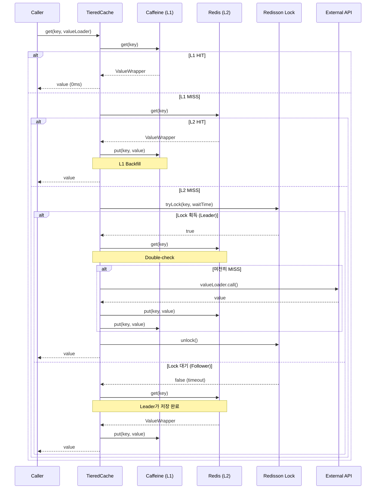
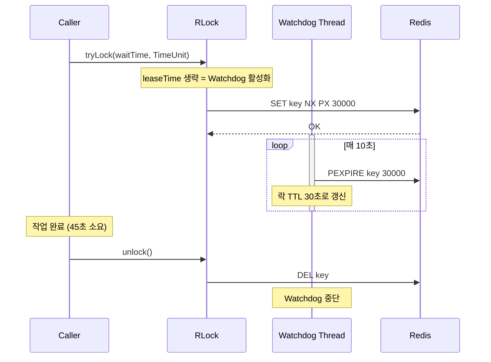
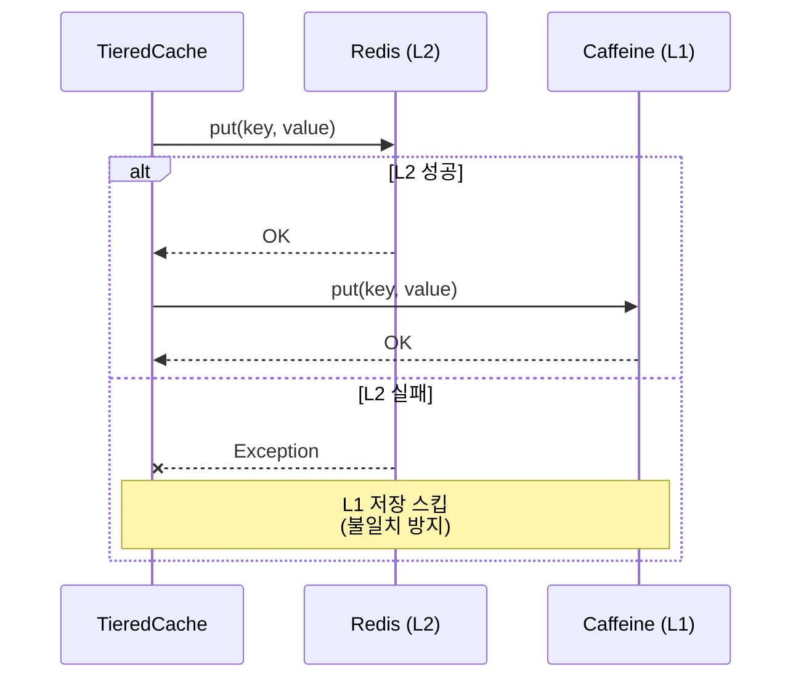

# TieredCache Single-flight 시퀀스 다이어그램

> **Last Updated:** 2026-02-05
> **Code Version:** MapleExpectation v1.x
> **Diagram Version:** 1.0

## 개요

Multi-Layer 캐시(L1: Caffeine, L2: Redis)와 분산 Single-flight 패턴으로 **Cache Stampede**를 방지합니다.

## Terminology

| 용어 | 정의 |
|------|------|
| **L1 Cache** | Caffeine in-memory cache (로컬, <5ms) |
| **L2 Cache** | Redis distributed cache (분산, <20ms) |
| **Single-flight** | 동시 요청 1회만 계산하는 패턴 |
| **Cache Stampede** | 캐시 만료 시 동시 계산으로 발생하는 폭주 |
| **Watchdog** | Redisson 자동 락 갱신 (기본 30초 TTL) |

## 캐시 조회 시퀀스



## Watchdog 모드 (락 자동 갱신)



## Write Order 규칙 (L2 → L1)



## TTL 규칙

| 계층 | TTL | 이유 |
|------|-----|------|
| L1 (Caffeine) | 5분 | 로컬 메모리 절약 |
| L2 (Redis) | 30분 | L1 만료 시 Fallback |

**규칙:** L1 TTL ≤ L2 TTL (L2가 항상 Superset)

## 설정

```yaml
# application.yml
cache:
  equipment:
    l1-ttl: 300        # 5분
    l2-ttl: 1800       # 30분
    lock-wait-time: 30  # 초
```

## E2E 테스트 결과

| 시나리오 | 결과 | 증거 |
|---------|------|------|
| RD-S01: L1 캐시 HIT | PASS | `fetchWithCache` 0ms |
| AO-G01: Two-Phase Snapshot | PASS | 1차: 617ms → 2차: 1ms |

## 관련 파일

- `src/main/java/maple/expectation/global/cache/TieredCache.java`
- `src/main/java/maple/expectation/global/cache/TieredCacheManager.java`
- `src/main/java/maple/expectation/config/RedissonConfig.java`

## Fail If Wrong

이 다이어그램이 부정확한 경우:
- **코드 흐름과 다름**: TieredCache.get() 실제 구현 확인
- **Watchdog 모드가 다름**: tryLock 파라미터 확인
- **메트릭이 수집되지 않음**: Counter registration 확인

### Verification Commands
```bash
# TieredCache 구현 확인
grep -A 30 "public.*get.*Object.*Callable" src/main/java/maple/expectation/global/cache/TieredCache.java

# Watchdog 모드 확인 (leaseTime 없음)
grep "tryLock.*TimeUnit" src/main/java/maple/expectation/global/cache/TieredCache.java

# 메트릭 등록 확인
grep "Counter.builder" src/main/java/maple/expectation/global/cache/TieredCache.java
```
