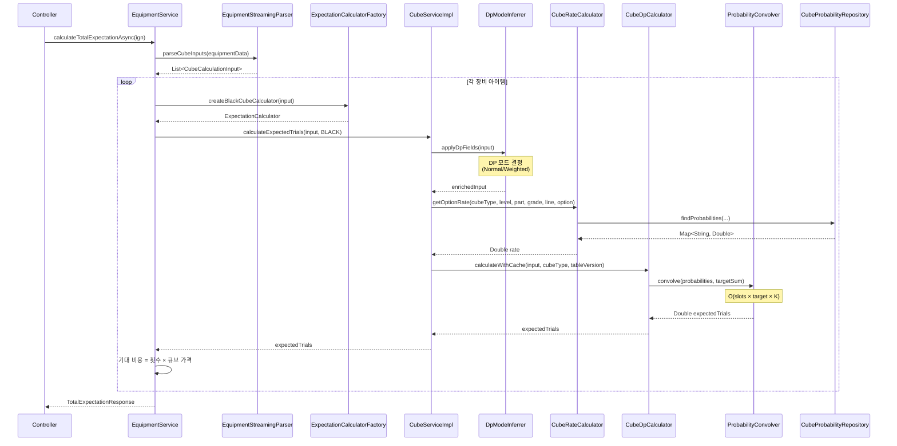
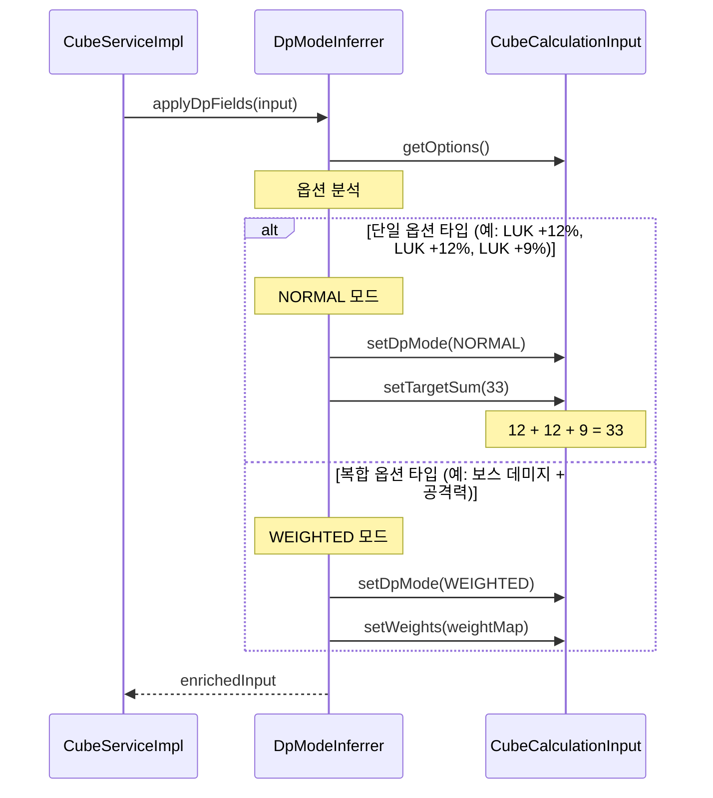
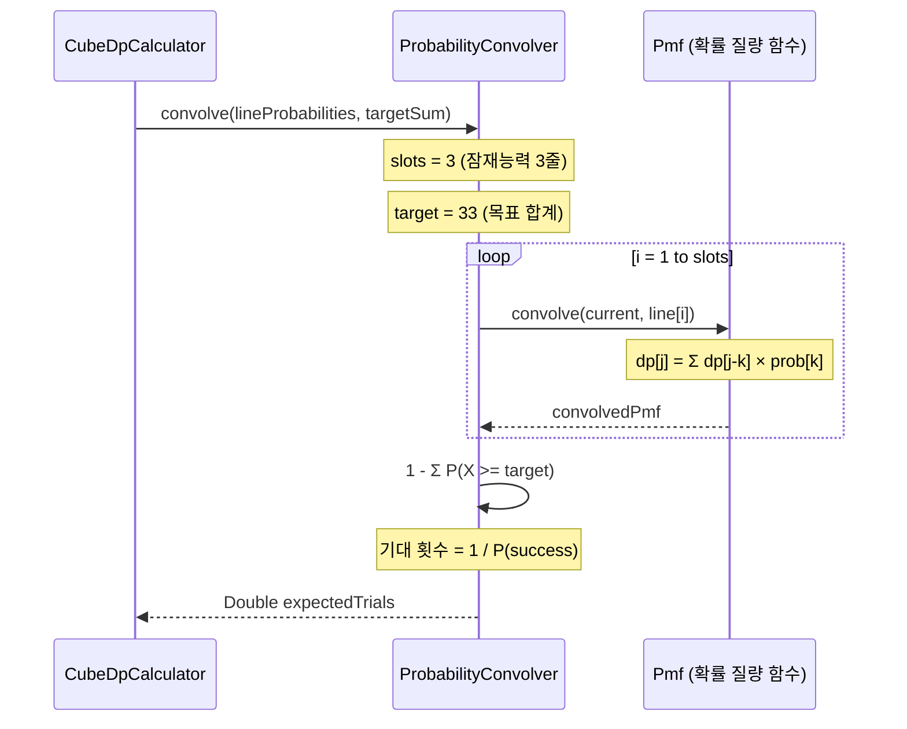
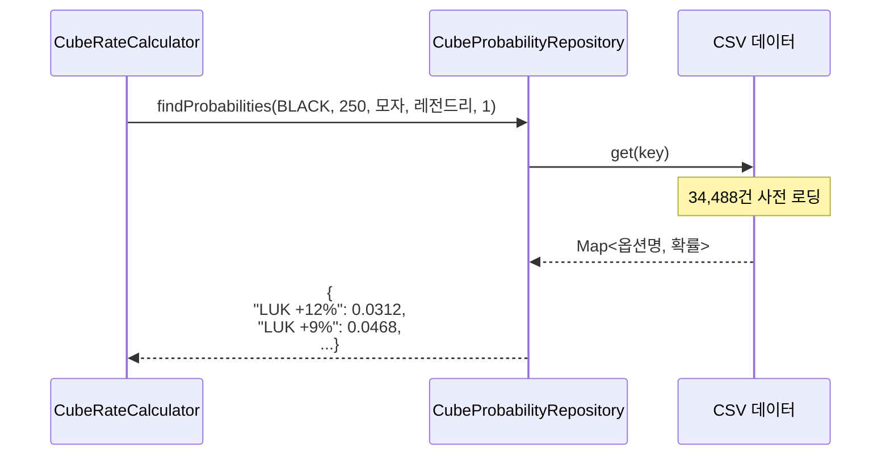

# DP Calculator 시퀀스 다이어그램

## 개요

동적 프로그래밍(DP)으로 큐브 기대값을 계산합니다. Kahan Summation Algorithm을 적용한 double 연산으로 부동소수점 오차를 최소화합니다. (재미용 서비스 특성상 금융급 BigDecimal 정확도 불필요)

## 전체 계산 시퀀스



## DpModeInferrer



## ProbabilityConvolver (핵심 DP)



**복잡도:** O(slots × target × K)
- slots: 잠재능력 줄 수 (3)
- target: 목표 스탯 합계
- K: 각 줄의 가능한 옵션 수

## 확률 조회



## 정밀도 보장

### Kahan Summation Algorithm (double 기반)

고성능 double 연산을 사용하되, Kahan Summation으로 부동소수점 오차 누적을 최소화합니다.

```java
// Kahan Summation: 부동소수점 합산 시 오차 누적 방지
double sum = 0.0;
double c = 0.0;  // 보정값

for (double value : values) {
    double y = value - c;
    double t = sum + y;
    c = (t - sum) - y;  // 손실된 정밀도 보정
    sum = t;
}
```

> **설계 결정:** 금융급 정확도가 필요한 서비스가 아니므로 BigDecimal 대신 고성능 double + Kahan Summation 조합을 선택했습니다.
> 확률 계산에서 10^-12 수준의 오차는 기대값 시뮬레이션에 무시 가능한 영향만 미칩니다.

## 캐시 키 구조

```
expectation:v3:{ocid}:{equipmentHash}:{tableVersionHash}:lv3
```

| 구성 요소 | 용도 |
|----------|------|
| ocid | 캐릭터 고유 ID |
| equipmentHash | 장비 상태 해시 |
| tableVersionHash | 확률 테이블 버전 |
| lv3 | 캐시 레벨 |

## E2E 테스트 결과

| 시나리오 | 결과 | 증거 |
|---------|------|------|
| DP-S01: 단일 옵션 확률 조회 | PASS | `CubeProbabilityRepository.findProbabilities (0 ms)` |
| DP-S03: 기대값 계산 정확성 | PASS | `totalCost: 96,588,685,000,000 메소` |
| DP Calculator 동작 | PASS | `CubeDpCalculator.calculateWithCache` 호출 확인 |

## API 응답 예시

```json
{
  "userIgn": "강은호",
  "totalCost": 96588685000000,
  "totalCostText": "96,588,685,000,000 메소",
  "items": [
    {
      "part": "모자",
      "itemName": "에테르넬 시프반다나",
      "potential": "스킬 재사용 대기시간 -2초 | 스킬 재사용 대기시간 -2초 | 스킬 재사용 대기시간 -2초",
      "expectedCost": 43076900000000,
      "expectedCount": 861538
    }
  ]
}
```

## 관련 파일

- `src/main/java/maple/expectation/service/v2/cube/component/CubeDpCalculator.java`
- `src/main/java/maple/expectation/service/v2/cube/component/ProbabilityConvolver.java`
- `src/main/java/maple/expectation/service/v2/cube/component/DpModeInferrer.java`
- `src/main/java/maple/expectation/repository/v2/CubeProbabilityRepository.java`
