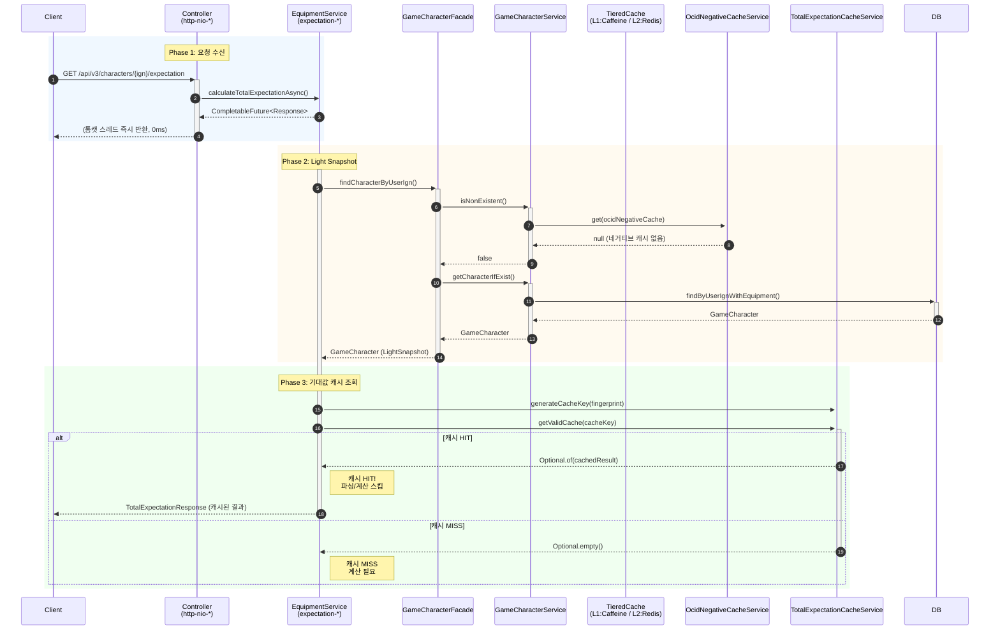

# Expectation API 캐시 데이터 흐름

> **Last Updated:** 2026-02-05
> **Code Version:** MapleExpectation v1.x
> **Diagram Version:** 1.0

## 개요

`GET /api/v3/characters/{userIgn}/expectation` API의 **캐시 레이어** 전체 흐름을 분석합니다.
TieredCache (L1:Caffeine + L2:Redis), Light/Two-Phase Snapshot, Single-Flight 패턴에 집중합니다.

## 핵심 캐시 아키텍처

| 패턴 | 설명 | 효과 |
|------|------|------|
| **Two-Phase Snapshot** | Light → Full 단계적 로드 | 캐시 HIT 시 불필요한 DB 조회 방지 |
| **Tiered Cache (L1/L2)** | Caffeine → Redis | 레이턴시 최소화 |
| **Single-Flight** | 동일 키 동시 요청 시 1회만 계산 | 중복 계산 방지 |
| **Light Snapshot** | 캐시 키 생성용 최소 필드 (ocid, fingerprint) | 캐시 조회 최적화 |
| **Full Snapshot** | 계산용 전체 필드 | 정확한 계산 수행 |

---

## 캐시 레이어 동작

### 캐시 구성

| 캐시 | 키 패턴 | TTL | 용도 |
|------|---------|-----|------|
| `ocidNegativeCache` | `{userIgn}` | 5분 | 존재하지 않는 캐릭터 |
| `ocidCache` | `{userIgn}` | 1시간 | OCID 매핑 |
| `equipment` | `{ocid}` | 15분 | 장비 데이터 |
| `expectationResult` | `expectation:v{ver}:{fingerprint}:{tableHash}` | 30분 | 기대값 결과 |

### 캐시 조회 시나리오



### TieredCache 상세 흐름

```mermaid
sequenceDiagram
    participant Service as EquipmentService
    participant L1Cache as CaffeineCache (L1)
    participant L2Cache as RedisCache (L2)
    participant Redis as Redis Server

    activate Service

    Service->>L1Cache: get(key)
    alt L1 HIT
        L1Cache-->>Service: ValueWrapper (1ms)
        Note right of Service: L1 Cache HIT!<br/>~2ms
    else L1 MISS
        L1Cache-->>-Service: null

        Service->>L2Cache: get(key)
        alt L2 HIT
            L2Cache->>+Redis: GET (Redisson)
            Redis-->>-L2Cache: Value
            L2Cache-->>-Service: ValueWrapper (L2 Cache HIT)
            Note right of Service: L2 Cache HIT<br/>~5ms
        else L2 MISS
            L2Cache->>+Redis: GET
            Redis-->>-L2Cache: null
            L2Cache-->>-Service: null (Cache MISS)
            Note right of Service: Total Cache MISS<br/>계산 필요
        end
    end

    deactivate Service
```

### Single-Flight 동작

```mermaid
sequenceDiagram
    participant Service as EquipmentService
    participant SingleFlight as SingleFlightExecutor
    participant Leader as Leader Thread
    participant Follower as Follower Threads
    participant Resolver as EquipmentDataResolver
    participant Cache as TieredCache

    %% 동시 요청 발생
    par 동시 요청
        Service->>+SingleFlight: executeAsync(key, loader)
        activate Leader
        Leader-->>Service: started
    and 동시 요청
        Service->>+SingleFlight: executeAsync(key, loader)
        activate Follower
        Follower-->>Service: waiting
    and 동시 요청
        Service->>+SingleFlight: executeAsync(key, loader)
        activate Follower
        Follower-->>Service: waiting
    end

    %% Leader 계산
    Leader->>+Resolver: resolveAsync(ocid, userIgn)
    Resolver->>+DB/NexonAPI: 데이터 조회
    Resolver-->>-Leader: byte[] (장비 데이터)
    Leader->>+Resolver: parseCubeInputs()
    Resolver-->>-Leader: List<CubeCalculationInput>
    Leader->>+Calculator: calculate()
    Calculator-->>-Leader: TotalExpectationResponse

    %% 캐시 저장
    Leader->>Cache: saveCache(key, result)
    Leader-->>-Service: TotalExpectationResponse
    deactivate Leader

    %% Follower 처리
    Follower-->>-Service: TotalExpectationResponse (캐시에서 가져옴)
    Follower-->>-Service: TotalExpectationResponse (캐시에서 가져옴)
    deactivate Follower

    Note over SingleFlight: 동일 키 동시 요청 3개 중<br/>Leader: 1회 계산<br/>Follower: 캐시에서 2회 조회
```

---

## 성능 특성 (캐시 관련)

### 응답 시간 분석

| 시나리오 | 구간 | 소요 시간 | 비고 |
|----------|------|----------|------|
| **캐시 HIT** | 톰캣 스레드 점유 | 0ms | 즉시 CompletableFuture 반환 |
|  | LightSnapshot 조회 | ~6ms | DB 1회 |
|  | 기대값 캐시 조회 | ~2ms | L1 + L2 |
|  | **총 (Cache HIT)** | **~8ms** | 완전 최적화 경로 |
| **캐시 MISS** | 톰캣 스레드 점유 | 0ms | 즉시 반환 |
|  | LightSnapshot 조회 | ~6ms | DB 1회 |
|  | 기대값 캐시 조회 | ~2ms | L1 + L2 |
|  | FullSnapshot 조회 | ~8ms | DB 1회 |
|  | Nexon API (OCID) | ~89ms | 캐릭터 신규 시 |
|  | Nexon API (장비) | ~440ms | 캐시 MISS 시 |
|  | 파싱 + 계산 | ~5ms | CPU Bound |
|  | 캐시 저장 | ~50ms | L2 Redis |
|  | **총 (Cache MISS)** | **~600ms** | 신규 캐릭터 |

### 캐시 히트율 영향

- **Cache HIT 시**: ~8ms (L1/L2 조회만)
- **Cache MISS 시**: ~600ms (신규 계산 포함)
- **히트율 90%**: 평균 ~61ms
- **히트율 95%**: 평균 ~31ms

---

## 모니터링 지표

```yaml
# 캐시 관련 메트릭
cache.hit{layer=L1}
cache.hit{layer=L2}
cache.miss
cache.lock.failure
cache.eviction{reason=size,ttl}
cache.get.time

# Single-Flight 메트릭
singleflight.leader.count
singleflight.follower.count
singleflight.timeout.count
singleflight.exception.count

# 기대값 캐시 메트릭
expectation.cache.hit
expectation.cache.miss
expectation.cache.size
expectation.cache.expiry
```

---

## 참고

- **Issue #158**: TotalExpectationResponse 캐싱
- **CLAUDE.md**: TieredCache 설계 가이드
- **docs/02_Technical_Guides/infrastructure.md**: 캐시 아키텍처 상세

## Evidence Links

- **EquipmentService:** `src/main/java/maple/expectation/service/v2/EquipmentService.java`
- **TotalExpectationCacheService:** `src/main/java/maple/expectation/service/v2/cache/TotalExpectationCacheService.java`
- **SingleFlightExecutor:** `src/main/java/maple/expectation/global/cache/SingleFlightExecutor.java`

## Fail If Wrong

이 다이어그램이 부정확한 경우:
- **TieredCache 동작이 다름**: L1→L2 순서 확인
- **Single-Flight 미작동**: 실제 동시 요청 테스트 필요
- **캐시 HIT/MISS 로직 오류**: CacheService 구현체 확인

### Verification Commands
```bash
# 캐시 레이어 구조 확인
grep -r "TieredCache\|Caffeine\|Redis" src/main/java/maple/expectation/

# Single-Flight 구현 확인
grep -A 10 "SingleFlightExecutor\|getWithLoader" src/main/java/maple/expectation/

# 캐시 키 생성 로직 확인
grep -A 5 "generateCacheKey\|fingerprint" src/main/java/maple/expectation/
```