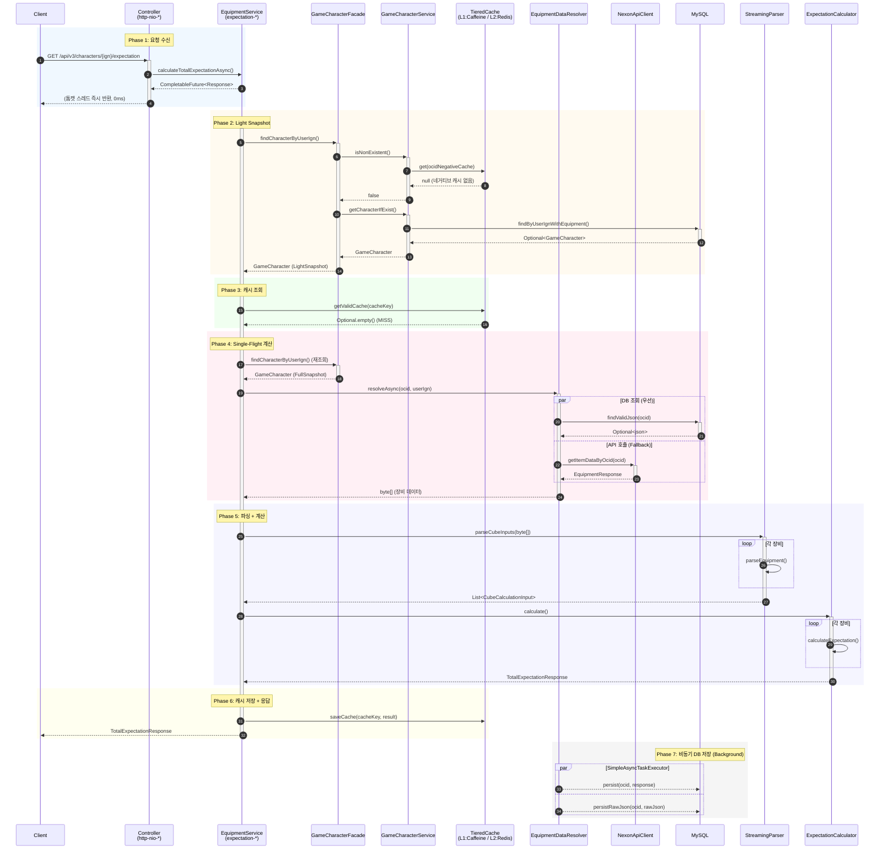
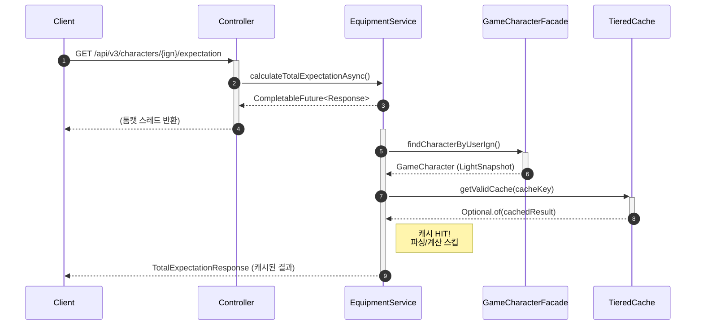
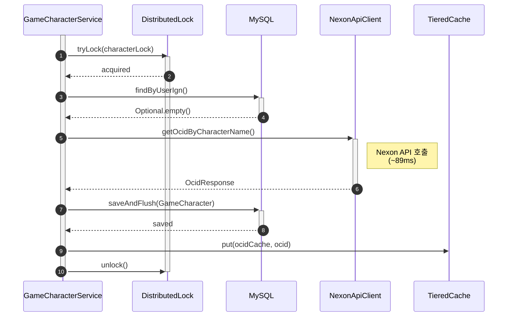
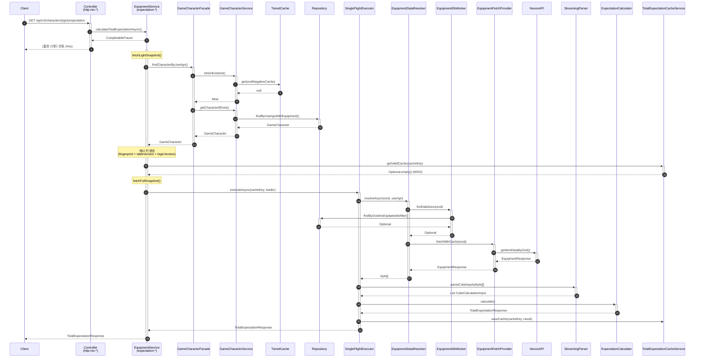

# Expectation API 데이터 흐름 분석

> **Last Updated:** 2026-02-05
> **Code Version:** MapleExpectation v1.x
> **Diagram Version:** 1.0

## 개요

`GET /api/v3/characters/{userIgn}/expectation` API의 전체 데이터 흐름을 분석한 문서입니다.
Trace Log 기반으로 비동기 파이프라인, 캐시 레이어, 외부 API 호출 등의 흐름을 시각화합니다.

## Terminology

| 용어 | 정의 |
|------|------|
| **Light Snapshot** | 캐시 키 생성용 최소 필드 (ocid, fingerprint) |
| **Full Snapshot** | 계산용 전체 필드 |
| **Single-Flight** | 동시 요청 1회만 계산 |
| **Tiered Cache** | L1(Caffeine) + L2(Redis) |
| **GZIP** | 응답 압축 |

---

## 핵심 아키텍처 패턴

| 패턴 | 설명 | 효과 |
|------|------|------|
| **Non-Blocking Async** | 톰캣 스레드 즉시 반환 (0ms) | RPS 719 달성 (wrk 벤치마크) |
| **Two-Phase Snapshot** | Light → Full 단계적 로드 | 캐시 HIT 시 불필요한 DB 조회 방지 |
| **Single-Flight** | 동일 키 동시 요청 시 1회만 계산 | 중복 계산 방지 |
| **Tiered Cache (L1/L2)** | Caffeine → Redis | 레이턴시 최소화 |
| **Resilient API Client** | Circuit Breaker + Retry | 외부 API 장애 격리 |
| **Write-Behind** | 응답 후 비동기 DB 저장 | 응답 시간 단축 |

---

## 스레드 풀 구성

| Thread Pool | 역할 | 특징 |
|-------------|------|------|
| `http-nio-8080-exec-*` | 톰캣 요청 처리 | 즉시 반환 (0ms) |
| `expectation-*` | 기대값 계산 전용 | 커스텀 ThreadPoolExecutor |
| `scheduling-*` | 스케줄링 작업 | @Scheduled |
| `ForkJoinPool.commonPool-*` | CompletableFuture 기본 | 공용 풀 |
| `SimpleAsyncTaskExecutor-*` | @Async 메서드 | 비동기 저장 |
| `redisson-*` | Redis 콜백 | Redisson 내부 |

---

## 시퀀스 다이어그램

### 전체 흐름 (Cache MISS 시나리오)



### 캐시 HIT 시나리오 (최적 경로)



### 캐릭터 신규 생성 흐름



---

## 데이터 흐름 요약

### 1. 요청 → 응답 (Happy Path)



### 2. 캐시 레이어 동작

| 캐시 | 키 패턴 | TTL | 용도 |
|------|---------|-----|------|
| `ocidNegativeCache` | `{userIgn}` | 5분 | 존재하지 않는 캐릭터 |
| `ocidCache` | `{userIgn}` | 1시간 | OCID 매핑 |
| `equipment` | `{ocid}` | 15분 | 장비 데이터 |
| `expectationResult` | `expectation:v{ver}:{fingerprint}:{tableHash}` | 30분 | 기대값 결과 |

### 3. 외부 API 호출

| API | Endpoint | 용도 | 평균 응답 |
|-----|----------|------|----------|
| OCID 조회 | `GET /character/id` | 캐릭터 고유 ID 조회 | ~89ms |
| 장비 조회 | `GET /character/item-equipment` | 장비 상세 데이터 | ~440ms |

---

## 성능 특성

### 응답 시간 분석 (Trace Log 기준)

| 구간 | 소요 시간 | 비고 |
|------|----------|------|
| 톰캣 스레드 점유 | 0ms | 즉시 CompletableFuture 반환 |
| LightSnapshot 조회 | ~6ms | DB 1회 |
| 캐시 조회 | ~2ms | L1 + L2 |
| FullSnapshot 조회 | ~8ms | DB 1회 |
| Nexon API (OCID) | ~89ms | 캐릭터 신규 시 |
| Nexon API (장비) | ~440ms | 캐시 MISS 시 |
| 파싱 + 계산 | ~5ms | CPU Bound |
| 캐시 저장 | ~50ms | L2 Redis |
| **총 (Cache MISS)** | **~600ms** | 신규 캐릭터 |
| **총 (Cache HIT)** | **~10ms** | 캐시된 결과 |

### 동시성 처리

- **Single-Flight**: 동일 캐시 키 100개 동시 요청 → 1회만 계산
- **Leader Deadline**: 30초 (timeout 시 예외)
- **Follower Timeout**: 30초 (timeout 시 캐시 fallback)

---

## 권장 모니터링 지표

```yaml
# Micrometer 메트릭
cache.hit{layer=L1}
cache.hit{layer=L2}
cache.miss
cache.lock.failure
nexon.api.latency{endpoint=ocid}
nexon.api.latency{endpoint=equipment}
expectation.compute.time
singleflight.leader.count
singleflight.follower.count
```

---

## 참고

- **Issue #118**: 비동기 Non-Blocking 파이프라인 (.join() 제거)
- **Issue #158**: TotalExpectationResponse 캐싱
- **CLAUDE.md**: 프로젝트 아키텍처 가이드라인

## Evidence Links
- **EquipmentService:** `src/main/java/maple/expectation/service/v2/EquipmentService.java`
- **GameCharacterFacade:** `src/main/java/maple/expectation/service/v2/facade/GameCharacterFacade.java`
- **ExpectationCalculator:** `src/main/java/maple/expectation/service/v2/calculator/ExpectationCalculator.java`

## Fail If Wrong

이 다이어그램이 부정확한 경우:
- **API 호출 순서가 다름**: EquipmentService 실제 흐름 확인
- **Two-Phase Snapshot 미작동**: Light → Full 로드 순서 확인
- **캐싱이 작동하지 않음**: TieredCache 확인

### Verification Commands
```bash
# EquipmentService 비동기 구현 확인
grep "CompletableFuture" src/main/java/maple/expectation/service/v2/EquipmentService.java | head -20

# Two-Phase 구현 확인
grep -A 10 "fetchLightSnapshot\|fetchFullSnapshot" src/main/java/maple/expectation/service/v2/

# Single-flight 확인
grep -A 20 "getWithLoader\|SingleFlight" src/main/java/maple/expectation/global/cache/
```
