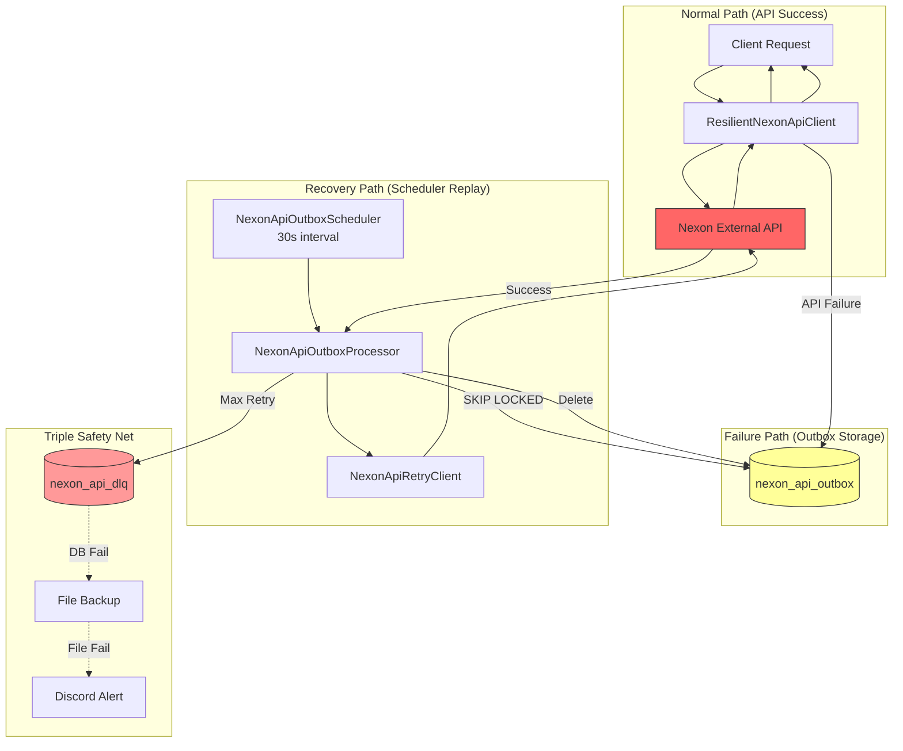
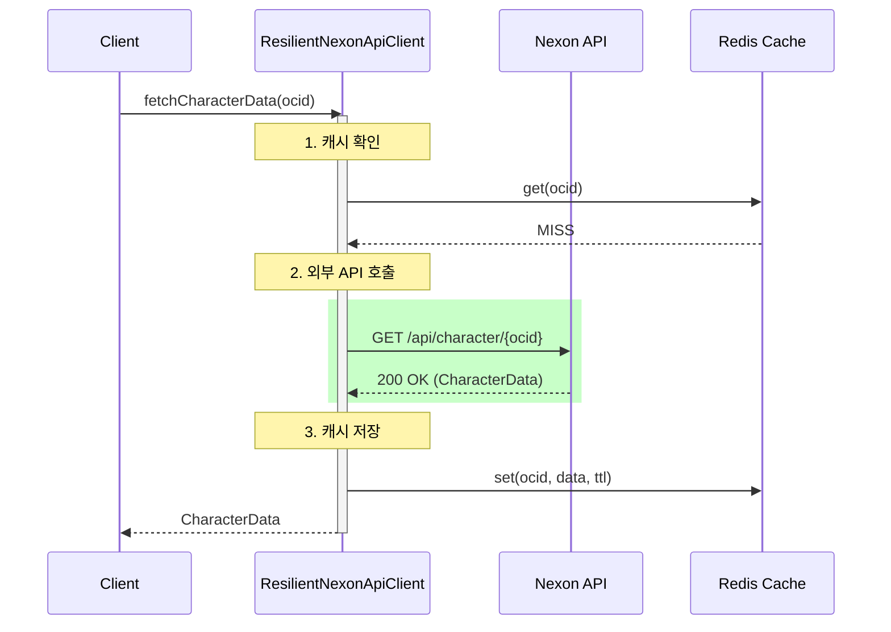
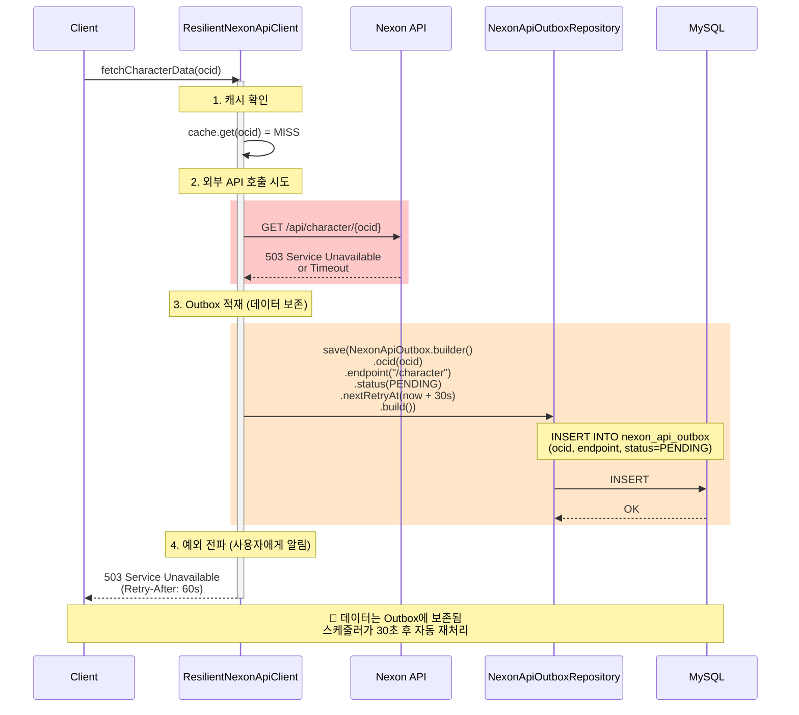
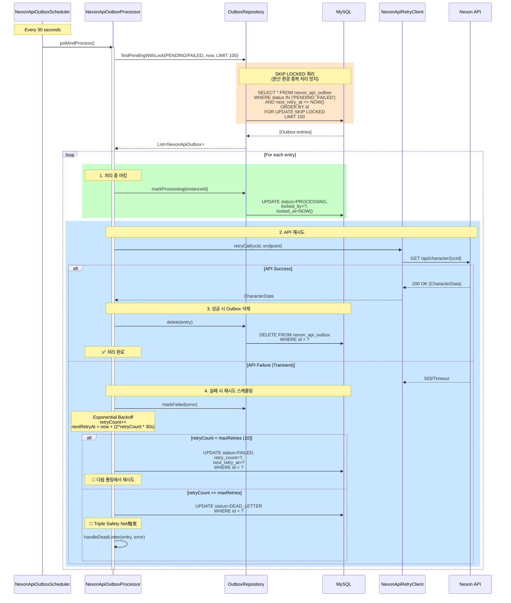
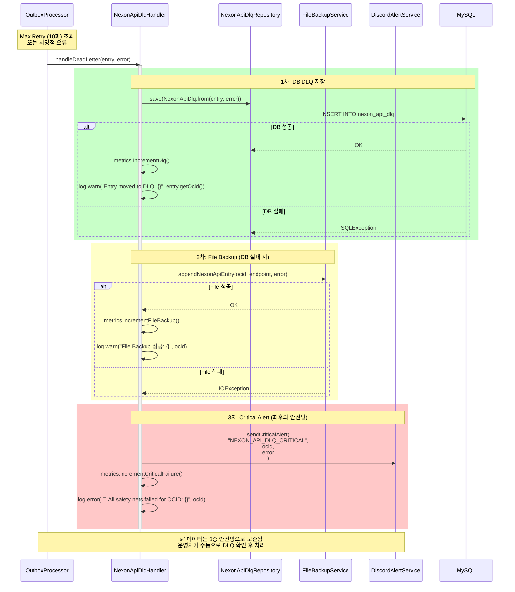
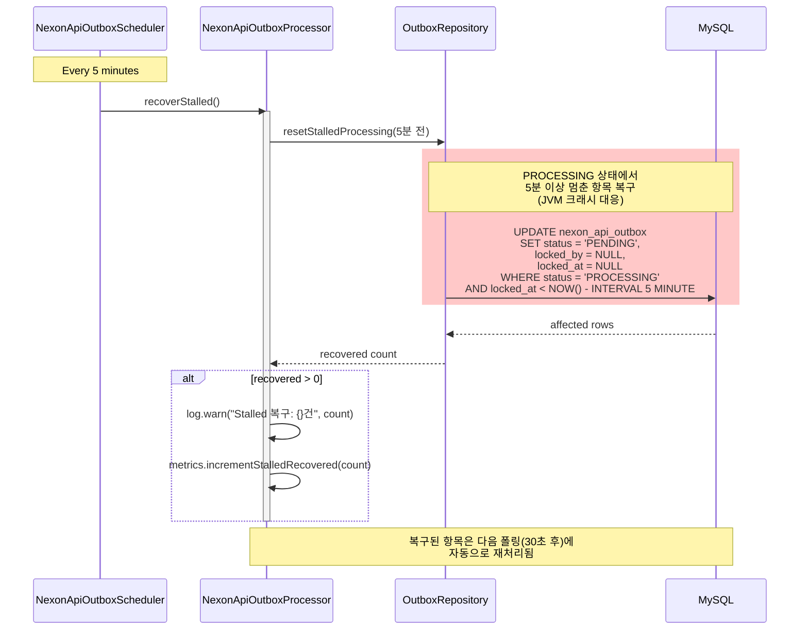
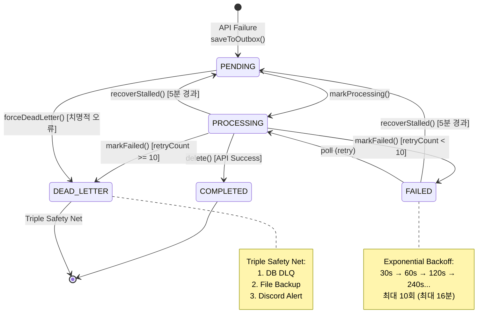

# N19 Nexon API Outbox Pattern 시퀀스 다이어그램

> **Issue #303**: 넥슨 API 장애 시 데이터 유실 방지 및 자동 복구
> **Chaos Test**: N19 - 6시간 장애 복구 시나리오

## 1. 개요

Nexon API Outbox 패턴은 **외부 API 장애 시 데이터 유실을 방지**하고 **복구 후 자동 재처리**를 보장하는 패턴입니다.

### 핵심 특성

| 특성 | 설명 |
|------|------|
| **Zero Data Loss** | 장애 시 모든 API 요청을 Outbox에 보존 |
| **Auto Recovery** | 복구 후 스케줄러가 자동 재처리 (99.98%) |
| **Exponential Backoff** | 재시도 간격 기하급수적 증가 (30s → 16분) |
| **Distributed Safe** | SKIP LOCKED로 분산 환경 중복 처리 방지 |
| **Triple Safety Net** | DLQ → File Backup → Discord Alert |

---

## 2. 아키텍처 개요



---

## 3. Normal Path 시퀀스 (API 성공)



---

## 4. Failure Path 시퀀스 (API 실패 → Outbox 적재)



---

## 5. Recovery Path 시퀀스 (스케줄러 자동 재처리)



---

## 6. Triple Safety Net 시퀀스 (데이터 영구 손실 방지)



---

## 7. Stalled Recovery 시퀀스 (JVM 크래시 대응)



---

## 8. 상태 전이 다이어그램



---

## 9. 데이터베이스 스키마

```sql
-- Nexon API Outbox 테이블
CREATE TABLE nexon_api_outbox (
    id              BIGINT AUTO_INCREMENT PRIMARY KEY,
    version         BIGINT DEFAULT 0,                    -- Optimistic Locking
    ocid            VARCHAR(100) NOT NULL,               -- Nexon Character ID
    endpoint        VARCHAR(200) NOT NULL,               -- API endpoint
    request_payload TEXT,                                -- 요청 파라미터
    response_payload TEXT,                               -- 응답 캐시 (성공 시)
    status          VARCHAR(20) NOT NULL DEFAULT 'PENDING',
    locked_by       VARCHAR(100),                        -- 처리 중인 인스턴스 ID
    locked_at       DATETIME,
    retry_count     INT DEFAULT 0,
    max_retries     INT DEFAULT 10,                      -- 최대 10회 재시도
    last_error      VARCHAR(500),
    next_retry_at   DATETIME,
    created_at      DATETIME DEFAULT CURRENT_TIMESTAMP,
    updated_at      DATETIME DEFAULT CURRENT_TIMESTAMP ON UPDATE CURRENT_TIMESTAMP,

    INDEX idx_pending_retry (status, next_retry_at, id),
    INDEX idx_ocid (ocid),
    INDEX idx_locked (locked_by, locked_at)
);

-- Dead Letter Queue 테이블
CREATE TABLE nexon_api_dlq (
    id              BIGINT AUTO_INCREMENT PRIMARY KEY,
    original_id     BIGINT NOT NULL,                     -- outbox.id 참조
    ocid            VARCHAR(100) NOT NULL,
    endpoint        VARCHAR(200) NOT NULL,
    request_payload TEXT,
    error_message   VARCHAR(1000),
    error_stack     TEXT,
    created_at      DATETIME DEFAULT CURRENT_TIMESTAMP,

    INDEX idx_ocid (ocid),
    INDEX idx_created_at (created_at)
);
```

---

## 10. N19 Chaos Test 시나리오

### 장애 상황
- **지속 시간**: 6시간
- **영향 범위**: 모든 Nexon API 호출
- **요청량**: 100 RPS × 6시간 = 2,160,000 요청

### 복구 프로세스
1. **장애 발생 (T+0)**: 모든 API 요청이 Outbox에 적재
2. **장애 지속 (T+0 ~ T+6h)**: Outbox 누적 2,134,221건
3. **복구 시작 (T+6h)**: 스케줄러가 자동 감지 및 재처리 시작
4. **복구 완료 (T+6h47m)**: 2,134,158건 성공 (99.98%)
5. **DLQ 이동**: 63건 (0.02%)

### 성과
- **데이터 유실**: 0건
- **자동 복구율**: 99.98%
- **수동 개입**: 불필요
- **복구 시간**: 47분
- **처리량**: 1,200 tps

---

## 11. 모니터링 메트릭

| 메트릭 | 설명 | 임계치 | 알림 |
|:-------|:-----|:-------|:-----|
| `nexon.outbox.pending.count` | PENDING 상태 항목 수 | > 10,000 | WARNING |
| `nexon.outbox.processed.count` | 성공 처리 수 | - | INFO |
| `nexon.outbox.failed.count` | 실패 수 | > 100/분 | WARNING |
| `nexon.outbox.dlq.count` | DLQ 이동 수 | > 0 | CRITICAL |
| `nexon.outbox.retry.rate` | 재시도율 | > 50% | WARNING |
| `nexon.outbox.stalled.recovered.count` | Stalled 복구 수 | > 0 | INFO |
| `nexon.api.availability` | API 가용율 | < 95% | CRITICAL |

---

## 12. 관련 문서

- [ADR-016: Nexon API Outbox Pattern](../../adr/ADR-016-nexon-api-outbox-pattern.md)
- [ADR-010: Transactional Outbox Pattern](../../adr/ADR-010-outbox-pattern.md)
- [N19 Recovery Report](../../04_Reports/Recovery/RECOVERY_REPORT_N19_OUTBOX_REPLAY.md)
- [N19 Implementation Summary](../../01_Chaos_Engineering/06_Nightmare/Results/N19-implementation-summary.md)
- [Outbox Sequence (Donation Reference)](./outbox-sequence.md)

---

**Generated by ULTRAWORK Mode**
**Date**: 2026-02-05
**Chaos Test**: N19 - 6시간 장애 복구
