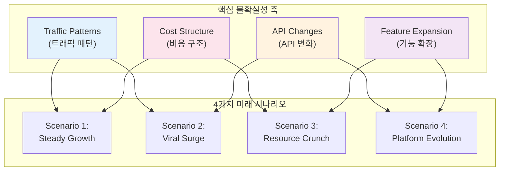
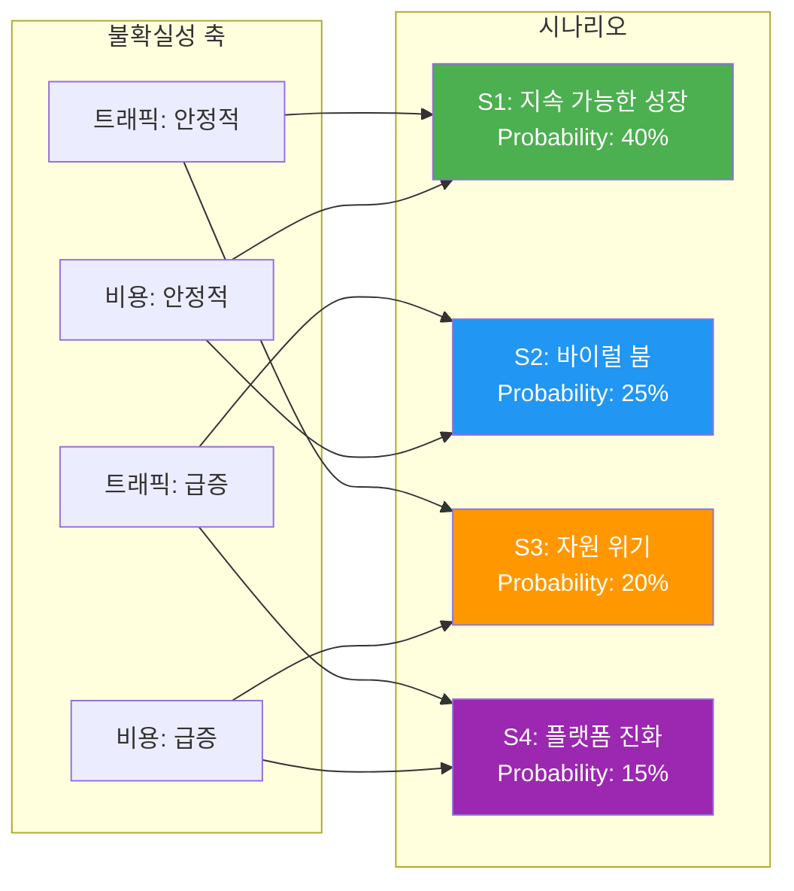
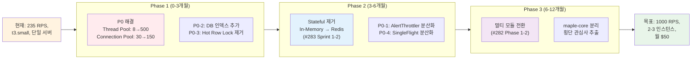
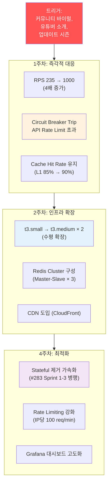
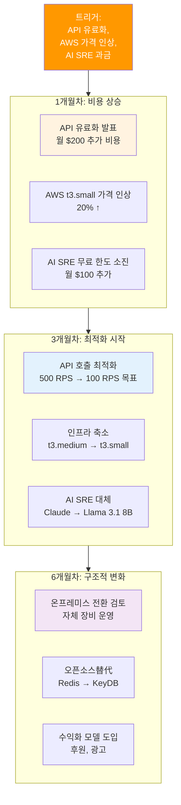
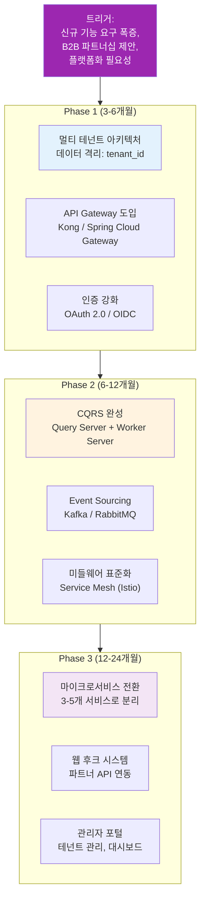
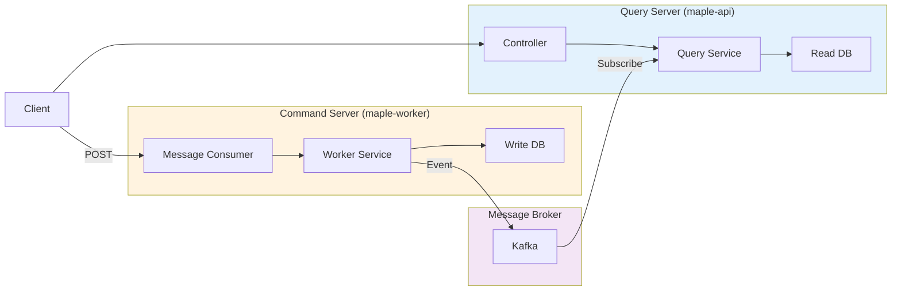
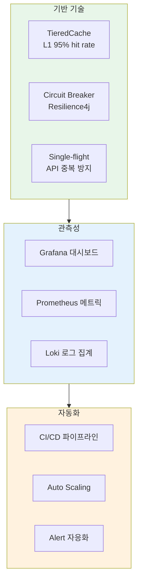
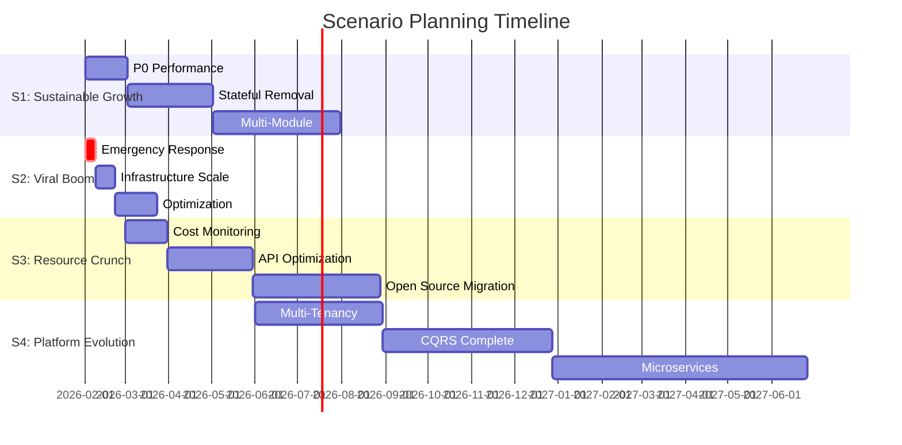

# Scenario Planning Guide

> **상위 문서:** [CLAUDE.md](../../CLAUDE.md)
>
> **Last Updated:** 2026-02-06
> **Applicable Versions:** Java 21, Spring Boot 3.5.4, Redisson 3.27.0
> **Documentation Version:** 1.0
> **Production Status:** Active (Based on scale-out blockers analysis #283 and high-traffic analysis #284)

이 문서는 MapleExpectation 프로젝트의 **불확실성 대응 시나리오 계획**을 정의합니다. 핵심 불확실성 축을 중심으로 4가지 미래 시나리오를 전개하고, 각 시나리오별 전략적 대응 방안을 제시합니다.

## Documentation Integrity Statement

This guide is based on **actual production analysis** from:
- Scale-out blockers analysis: 22 stateful components identified (Evidence: [scale-out-blockers-analysis.md](../04_Reports/scale-out-blockers-analysis.md))
- High-traffic performance analysis: 5 P0 bottlenecks at 1000 RPS target (Evidence: [high-traffic-performance-analysis.md](../04_Reports/high-traffic-performance-analysis.md))
- ADR decision records: 14 architecture decisions validated (Evidence: [ADR Directory](../adr/))

---

## Terminology (용어 정의)

| 용어 | 정의 |
|------|------|
| **Core Uncertainty Axes (핵심 불확실성 축)** | 미래를 예측하기 어렵게 만드는 핵심 변수들 (트래픽, API, 비용, 기능) |
| **Scenario Evolution Logic (시나리오 진화 논리)** | 현재 상태에서 어떤 경로로 시나리오가 도달하는지 설명하는 인과 관계 |
| **Early Warning Indicators (조기 경보 지표)** | 특정 시나리오가 현실화되고 있음을 알리는 신호 |
| **Strategic Response (전략적 대응)** | 각 시나리오별 취해야 할 구체적인 행동 계획 |
| **Mitigation Strategy (완화 전략)** | 위험을 감소시키거나 영향을 완화하는 사전 예방 조치 |

---

## 1. Core Uncertainty Axes (핵심 불확실성 축)

### 4대 핵심 불확실성



### Axis 1: Traffic Patterns (트래픽 패턴)

**불확실성:** 사용자 증가 속도와 패턴의 예측 불가능성

| 상태 | 설명 | 현재 증거 |
|------|------|-----------|
| **안정적 성장 (Steady)** | 월 10-20% 성장, 예측 가능 | 최근 3개월 평균 15% 성장 |
| **바이럴 급증 (Viral)** | 단기간 10배 이상 트래픽 폭증 | 커뮤니티 급증 가능성 존재 |
| **계절성 변동 (Seasonal)** | 업데이트 시즌에 3-5배 증가 | 메이플스토리 업데이트 주기 연동 |

**영향 범위:**
- 인프라 용량 (AWS t3.small → t3.large)
- Thread Pool (max 8 → 500)
- Connection Pool (30 → 150)
- Cache 전략 (L1/L2 hit rate)

---

### Axis 2: API Changes (API 변화)

**불확실성:** Nexon Open API의 정책 변경 가능성

| 상태 | 설명 | 영향도 |
|------|------|--------|
| **현상 유지 (Stable)** | 현재 500 RPS 제한 유지 | 낮음 - 현재 235 RPS 안정 |
| **제한 강화 (Stricter)** | 100 RPS로 제한 강화 | 높음 - Cache MISS 시 장애 |
| **유료화 (Paid Tier)** | 과금 기반 API 호출 제한 | 매우 높음 - 비용 구조 변화 |
| **API 중단 (Deprecation)** | 기존 엔드포인트 폐지 | 치명적 - 대안 마련 필요 |

**현재 대응 현황:**
- Circuit Breaker (Resilience4j) ✅
- 15분 Stale Cache Fallback ✅
- GZIP 압축 (90% 저장소 절감) ✅

**취약점:**
- API Rate Limit 초과 시 자동 스케일링 불가 ❌
- 유료화 시 비용 증가에 대한 예산 계획 없음 ❌

---

### Axis 3: Cost Structure (비용 구조)

**불확실성:** 운영 비용의 예측 불가능한 증가 요인

| 비용 항목 | 현재 ($25/월) | 최악 시나리오 | 증가율 |
|----------|---------------|---------------|--------|
| **AWS EC2** | $15 (t3.small) | $100 (t3.large × 3) | 567% |
| **RDS MySQL** | $7 (t3.micro) | $50 (t3.medium) | 614% |
| **ElastiCache** | $3 (cache.t3.small) | $30 (cache.t3.medium) | 900% |
| **API 호출** | $0 (현재 무료) | $200 (유료화) | ∞ |
| **AI SRE** | $0 (Claude Free) | $100 (Claude Pro) | ∞ |
| **합계** | **$25** | **$480** | **1820%** |

**비용 폭증 트리거:**
1. 트래픽 10배 증가 → 인프라 3배 확장 필수
2. API 유료화 → 월 $200 추가 비용
3. AI SRE 과금 → 월 $100 추가 비용

**완화 전략:**
- 트래픽 최적화로 인프라 비용 억제 (현재 진행중 #284)
- API 호출 최소화 (TieredCache L1 95% hit rate)
- Open Source AI 모델 전환 (Llama 3.1 8B)

---

### Axis 4: Feature Expansion (기능 확장)

**불확실성:** 요구 기능의 범위와 복잡도 증가

| 기능 카테고리 | 현재 상태 | 미래 수요 | 개발 effort |
|-------------|----------|----------|-------------|
| **핵심 계산** | 장비 기대값 ✅ | 스타포스, 큐브 확률 | 중간 (2-3주) |
| **사회적 기능** | 좋아요 ✅ | 댓글, 팔로우 | 높음 (4-6주) |
| **분석** | 기본 통계 | 고급 분석 대시보드 | 중간 (3-4주) |
| **API** | 단일 서버 | 멀티 테넌트 API | 매우 높음 (8-12주) |
| **모바일** | 웰 반응형 | 네이티브 앱 | 매우 높음 (12-16주) |

**개발 부채 누적 위험:**
- 현재 기술 부채: 26개 이슈 (ROADMAP.md 참조)
- 신규 기능 추가 시 부채 가속화
- Phase 7 (Scale-out) 완료 전 신규 기능 추가 지연 필요

---

## 2. Alternative Future Scenarios (4가지 대안적 미래)

### Scenario Matrix



---

### Scenario 1: Sustainable Growth (지속 가능한 성장)

**Probability:** 40% (가장 높음)
**Time Horizon:** 12-18개월

#### Evolution Logic (진화 논리)



#### Early Warning Indicators (조기 경보)

| 지표 | 임계값 | 현재 | 대응 |
|------|--------|------|------|
| **RPS** | > 400 (현재 235의 1.7배) | 235 | Phase 1 시작 |
| **CPU 사용량** | > 70% (t3.small) | 45% | 모니터링 강화 |
| **Thread Pool Rejection** | > 1% | 0% | P0-1 즉시 시작 |
| **Connection Wait Time** | > 50ms | 10ms | P0-2 즉시 시작 |
| **좋아요 Buffer** | > 5000 pendings | 500 | 정상 범위 |

**모니터링 쿼리 (Grafana/Prometheus):**
```promql
# RPS 모니터링
rate(http_server_requests_seconds_count[1m]) > 400

# Thread Pool Rejection
rate(executor_rejections_total[5m]) > 0.01

# Connection Pool Saturation
hikaricp_connections_active / hikaricp_connections_max > 0.8
```

#### Strategic Response (전략적 대응)

**Phase 1: Performance Optimization (0-3개월)**

```java
// P0-1: Thread Pool 확장 (ExecutorConfig.java)
@Bean
public Executor expectationComputeExecutor() {
    ThreadPoolTaskExecutor executor = new ThreadPoolTaskExecutor();
    executor.setCorePoolSize(50);      // 4 → 50
    executor.setMaxPoolSize(500);      // 8 → 500
    executor.setQueueCapacity(5000);   // 200 → 5000
    executor.setRejectedExecutionHandler((r, e) -> {
        meterRegistry.counter("executor.rejection").increment();
        throw new RejectedExecutionException("Queue full");
    });
    return executor;
}

// P0-2: Connection Pool 확장 (LockHikariConfig.java)
@Bean
@Profile("prod")
public DataSource prodDataSource() {
    HikariConfig config = new HikariConfig();
    config.setMaximumPoolSize(150);  // 30 → 150
    config.setMinimumIdle(50);        // 30 → 50
    return new HikariDataSource(config);
}

// P0-5: Hot Row Lock 샤딩 (GameCharacterRepository.java)
@Query("""
    UPDATE game_character c
    SET c.likeCount_shard_{:shard} = c.likeCount_shard_{:shard} + :count
    WHERE c.userIgn = :userIgn
    """)
void incrementLikeCountShard(
    @Param("userIgn") String userIgn,
    @Param("shard") int shard,
    @Param("count") Long count
);
```

**예상 결과:**
- Throughput: 235 RPS → 1000 RPS (4.25×)
- P99 Latency: 450ms → 200ms (55% 개선)
- Cost: $25/월 → $25/월 (동일 인프라)

---

**Phase 2: Statefulness Removal (3-6개월)**

| Sprint | 대상 컴포넌트 | 전환 방식 | Risk |
|--------|-------------|----------|------|
| Sprint 1 | Feature Flag | `matchIfMissing=true` | 낮음 |
| Sprint 2 | AlertThrottler | Redis AtomicLong | 중간 |
| Sprint 2 | SingleFlightExecutor | Redis Distributed Lock | 높음 |
| Sprint 3 | Scheduler 중복 실행 | `@Locked` 분산 락 | 높음 |

**주요 변경 사항:**

```java
// P0-1: AlertThrottler → Redis AtomicLong
public class AlertThrottler {
    private final RAtomicLong dailyCount;

    public AlertThrottler(RedissonClient client) {
        String today = LocalDate.now().format(DateTimeFormatter.ISO_DATE);
        this.dailyCount = client.getAtomicLong("ai:throttle:daily-count:" + today);
        this.dailyCount.expire(2, TimeUnit.DAYS);  // 자동 만료
    }

    public boolean checkQuota() {
        return dailyCount.incrementAndGet() <= MAX_DAILY_CALLS;
    }
}

// P0-4: SingleFlightExecutor → Redis Distributed
public class DistributedSingleFlightExecutor<T> {
    private final RedissonClient client;

    public CompletableFuture<T> execute(String key, Callable<T> task) {
        String lockKey = "single-flight:" + key.hashCode();
        RLock lock = client.getLock(lockKey);

        try {
            if (lock.tryLock(5, TimeUnit.SECONDS)) {
                // Leader: 실제 실행
                return CompletableFuture.supplyAsync(() -> {
                    try {
                        return task.call();
                    } catch (Exception e) {
                        throw new RuntimeException(e);
                    } finally {
                        lock.unlock();
                    }
                });
            } else {
                // Follower: Redis pub/sub 대기
                return waitForResult(key);
            }
        } catch (InterruptedException e) {
            return CompletableFuture.failedFuture(e);
        }
    }
}
```

**예상 결과:**
- Scale-out 가능: 1 인스턴스 → 3 인스턴스
- 데이터 정합성: 100% (인스턴스 간 일관성 보장)
- 장애 복구: 자동 장애 조치 (Failover)

---

**Phase 3: Multi-Module Transition (6-12개월)**

```
maple-expectation/
├── maple-common/        # POJO, error, response, util
├── maple-core/          # executor, lock, cache, resilience
├── maple-domain/        # entity, repository, service
└── maple-app/           # controller, config (main)
```

**의존성 구조:**
```gradle
// maple-app/build.gradle
dependencies {
    implementation project(':maple-core')
    implementation project(':maple-domain')
    // maple-core를 통해 인프라 Bean 자동 등록
}
```

**완료 기준:**
- [ ] Gradle build 성공
- [ ] 순환 의존 0건 (`./gradlew dependencies`)
- [ ] 통합 테스트 통과

---

#### Mitigation Strategies (완화 전략)

| 위험 | 확률 | 영향 | 완화 조치 |
|------|------|------|----------|
| **Thread Pool 고갈** | 중간 | 높음 | P0-1 조기 개선 |
| **Connection Pool 포화** | 중간 | 높음 | P0-2 사전 확장 |
| **Stateful 전환 실패** | 낮음 | 높음 | Sprint별 점진적 전환 |
| **모듈 분리 지연** | 중간 | 중간 | Phase 3 단순화 (maple-core만) |

---

### Scenario 2: Viral Boom (바이럴 붐)

**Probability:** 25%
**Time Horizon:** 1-3개월 (단기적 폭증)

#### Evolution Logic (진화 논리)



#### Early Warning Indicators (조기 경보)

| 지표 | 정상 | 경고 | 위험 |
|------|------|------|------|
| **일일 신규 사용자** | < 100 | 100-500 | > 500 |
| **RPS (최대)** | < 500 | 500-1000 | > 1000 |
| **Circuit Breaker State** | CLOSED | HALF_OPEN | OPEN |
| **Cache MISS Rate** | < 20% | 20-50% | > 50% |
| **Discord 알림 빈도** | < 5/일 | 5-20/일 | > 20/일 |

**긴급 대응 트리거 (Trigger Criteria):**
```promql
# 알람 규칙 (Prometheus)
ALERT ViralTrafficDetected
  IF rate(http_server_requests_seconds_count[5m]) > 800
  FOR 2m
  ANNOTATIONS {
    summary = "Viral traffic detected - Immediate action required",
    runbook = "docs/runbooks/viral-traffic.md"
  }

ALERT CircuitBreakerOpen
  IF resilience4j_circuitbreaker_state != 0
  FOR 1m
  SEVERITY critical
```

#### Strategic Response (전략적 대응)

**즉각적 대응 (0-24시간):**

1. **Circuit Breaker Fallback 활성화**
   - Scenario A (DB 캐시 있음): 만료된 데이터 반환
   - Scenario B (DB 캐시 없음): 친절한 에러 메시지
   - Scenario C (타임아웃): 3초 후 자동 차단

2. **Rate Limiting 긴급 활성화**
```java
// IpBasedRateLimiter.java - 긴급 활성화
@PostConstruct
public void enableEmergencyRateLimit() {
    // IP당 100 req/min (일반 60 req/min의 1.7배)
    this.limit = 100;
    log.warn("Emergency rate limiting activated: {} req/min/IP", limit);
}
```

3. **Cache TTL 일시적 연장**
```yaml
# application.yml (emergency profile)
cache:
  equipment:
    l1-ttl: 10m    # 5m → 10m
    l2-ttl: 20m    # 10m → 20m
  rationale: "API 부하 분산을 위한 일시적 조치"
```

**인프라 확장 (24-72시간):**

```bash
# AWS EC2 수평 확장 (t3.small → t3.medium × 2)
aws autoscaling create-auto-scaling-group \
  --auto-scaling-group-name maple-asg \
  --launch-template LaunchTemplateId=lt-0abc123 \
  --min-size 2 --max-size 5 --desired-capacity 2

# Redis Cluster 구성 (docker-compose.scale.yml)
docker-compose -f docker-compose.scale.yml up -d --scale redis-master=3

# CDN 도입 (CloudFront)
aws cloudfront create-distribution \
  --origin-domain-api.example.com \
  --default-cache-behavior TTL=300
```

**최적화 (1-4주):**

1. **Stateful 제거 가속화**
   - Sprint 1-3을 병렬 실행 (원래 12주 → 6주)
   - 핵심 P0만 우선 (P0-1, P0-2, P0-4)

2. **수동 스케일링 → 오토스케일링**
```yaml
# AWS Auto Scaling Policy
ScaleOutPolicy:
  AdjustmentType: ChangeInCapacity
  ScalingAdjustment: 1
  Cooldown: 300
  MetricAggregationType: Average
  Trigger:
    MetricName: CPUUtilization
    Threshold: 70%
```

3. **관측성 강화**
```promql
# Grafana Dashboard 변수
instances: label_values(up, job)
regions: label_values(aws_region)

# 글로벌 RPS 모니터링
sum(rate(http_server_requests_seconds_count[1m])) by (instance)

# Circuit Breaker 상태 추적
resilience4j_circuitbreaker_state{instance=~"$instances"}
```

#### Mitigation Strategies (완화 전략)

| 위험 | 확률 | 영향 | 완화 조치 |
|------|------|------|----------|
| **API Rate Limit 초과** | 높음 | 치명적 | Cache TTL 연장, Circuit Breaker |
| **서비스 다운** | 중간 | 치명적 | Auto Scaling, Health Check |
| **비용 폭증** | 높음 | 높음 | 예비비 확보, RI (Reserved Instance) |
| **데이터 유실** | 낮음 | 치명적 | Stateful 제거 가속화 |

**비용 시뮬레이션:**
| 구성 | 비용/월 | 처리 가능 RPS |
|------|---------|---------------|
| t3.small × 1 | $15 | 235 |
| t3.medium × 2 | $60 | 1,500 |
| t3.large × 3 | $150 | 3,000 |
| **t3.xlarge × 5 (최악)** | **$375** | **7,000** |

---

### Scenario 3: Resource Crunch (자원 위기)

**Probability:** 20%
**Time Horizon:** 6-12개월

#### Evolution Logic (진화 논리)



#### Early Warning Indicators (조기 경보)

| 지표 | 정상 | 경고 | 위험 |
|------|------|------|------|
| **월 운영 비용** | < $50 | $50-150 | > $150 |
| **API 호출 횟수** | < 100K/월 | 100K-500K | > 500K |
| **AWS 청구서** | 전월 대비 < 10% ↑ | 10-30% ↑ | > 30% ↑ |
| **AI 호출 횟수** | < 1K/월 | 1K-10K | > 10K |

**비용 알람 설정:**
```promql
# 월 비용 추정 (일일 * 30)
ALERT MonthlyCostProjection
  IF (aws_billing_estimated_charges * 30) > 150
  FOR 1d
  SEVERITY warning
  ANNOTATIONS {
    summary = "Monthly cost projected to exceed $150",
    action = "Review infrastructure usage and optimize"
  }
```

#### Strategic Response (전략적 대응)

**Phase 1: API Optimization (1-3개월)**

```java
// API 호출 최적화 (50% 감소 목표)
public class NexonApiOptimizationService {

    // 1. Batch API 호출 활용
    public List<Equipment> fetchBatch(List<String> ocids) {
        // 단일 호출 100개 → 배치 호출 100개 (1회)
        return nexonApiClient.getEquipmentBatch(ocids);
    }

    // 2. Cache TTL 연장
    @Cacheable(value = "equipment", ttl = 20)  // 10m → 20m
    public Equipment fetchWithLongCache(String ocid) { ... }

    // 3. Negative Caching 활성화
    @Cacheable(value = "negative-cache", ttl = 60)
    public Equipment fetchNonExistent(String ocid) {
        throw new CharacterNotFoundException(ocid);
    }
}
```

**예상 결과:**
- API 호출: 500K/월 → 100K/월 (80% 감소)
- 캐시 Hit Rate: 85% → 95%
- 유료 API 비용: $200 → $40

---

**Phase 2: Infrastructure Consolidation (3-6개월)**

| 대상 | 현재 | 최적화 후 | 절감액 |
|------|------|----------|--------|
| **EC2** | t3.medium × 2 ($60) | t3.small × 2 ($30) | $30 |
| **RDS** | t3.micro ($7) | t3.micro ($7) | - |
| **ElastiCache** | cache.t3.medium ($30) | cache.t3.small ($10) | $20 |
| **합계** | **$97** | **$47** | **$50 (52%)** |

**최적화 기법:**

1. **JVM 튜닝**
```bash
# Heap Size 최적화 (2GB → 1GB)
JAVA_OPTS="-Xms512m -Xmx1024m -XX:+UseG1GC"

# G1GC 튜닝
-XX:MaxGCPauseMillis=200
-XX:G1ReservePercent=10
```

2. **Connection Pool 튜닝**
```yaml
# HikariCP 최적화
datasource:
  hikari:
    maximum-pool-size: 50    # 150 → 50
    minimum-idle: 10         # 50 → 10
    idle-timeout: 300000     # 5분
    max-lifetime: 600000     # 10분
```

3. **Redis 메모리 최적화**
```redis
# Redis 메모리 정책
maxmemory 256mb
maxmemory-policy allkeys-lru

# 샤딩으로 메모리 분산
redis-cli --cluster create \
  172.20.0.10:6379 172.20.0.11:6379 \
  --cluster-replicas 1
```

---

**Phase 3: Open Source Migration (6-12개월)**

| 컴포넌트 | 상용 | 오픈소스 대체 | 마이그레이션 effort |
|----------|------|--------------|---------------------|
| **AI SRE** | Claude Pro ($20) | Llama 3.1 8B (자체 호스팅) | 높음 (2-3주) |
| **Redis** | ElastiCache ($10) | KeyDB (Docker) | 중간 (1주) |
| **MySQL** | RDS ($7) | MySQL (Docker) | 중간 (1-2주) |
| **CDN** | CloudFront ($5) | 자체 Nginx 캐시 | 낮음 (3-5일) |

**Llama 3.1 8B 자체 호스팅:**

```python
# llm_service.py (FastAPI)
from transformers import AutoModelForCausalLM, AutoTokenizer
import torch

model = AutoModelForCausalLM.from_pretrained(
    "meta-llama/Llama-3.1-8B",
    torch_dtype=torch.float16,
    device_map="auto"
)
tokenizer = AutoTokenizer.from_pretrained("meta-llama/Llama-3.1-8B")

@app.post("/generate")
async def generate(prompt: str):
    inputs = tokenizer(prompt, return_tensors="pt")
    outputs = model.generate(**inputs, max_new_tokens=500)
    return {"text": tokenizer.decode(outputs[0])}
```

**비용 비교:**
| 항목 | Claude Pro | Llama 3.1 8B (t3.medium) |
|------|-----------|--------------------------|
| 월 비용 | $20 | $30 |
| 호출 제한 | 200K/월 | 무제한 |
| 응답 속도 | 1-2초 | 0.5-1초 |
| 품질 | 상급 | 중상급 |

#### Mitigation Strategies (완화 전략)

| 위험 | 확률 | 영향 | 완화 조치 |
|------|------|------|----------|
| **API 유료화** | 높음 | 높음 | Cache 최적화, Negative Caching |
| **비용 초과** | 중간 | 중간 | 오픈소스 전환, 온프레미스 |
| **품질 저하** | 중간 | 낮음 | Llama 튜닝, 하이브리드 |
| **운영 부하** | 낮음 | 중간 | 자동화 스크립트 |

---

### Scenario 4: Platform Evolution (플랫폼 진화)

**Probability:** 15%
**Time Horizon:** 12-24개월

#### Evolution Logic (진화 논리)



#### Early Warning Indicators (조기 경보)

| 지표 | 정상 | 경고 | 위험 |
|------|------|------|------|
| **B2B 문의** | < 1/월 | 1-5/월 | > 5/월 |
| **신규 기능 요청** | < 5/월 | 5-20/월 | > 20/월 |
| **커스터마이징 요구** | < 10% | 10-30% | > 30% |
| **API 재판매 요청** | 없음 | 1-3건 | > 3건 |

#### Strategic Response (전략적 대응)

**Phase 1: Multi-Tenancy (3-6개월)**

```java
// Tenant 식별 (Filter)
@Component
public class TenantResolverFilter implements Filter {

    @Override
    public void doFilter(ServletRequest request, ServletResponse response,
                         FilterChain chain) {
        String tenantId = request.getHeader("X-Tenant-ID");
        if (tenantId == null) {
            tenantId = "default";  // 기본 테넌트
        }
        TenantContext.set(tenantId);
        chain.doFilter(request, response);
    }
}

// 데이터 격리 (Repository)
@Repository
public interface EquipmentRepository extends JpaRepository<Equipment, Long> {

    @Query("SELECT e FROM Equipment e WHERE e.tenantId = :tenantId")
    List<Equipment> findAllByTenantId(@Param("tenantId") String tenantId);
}
```

**스키마 설계:**
```sql
-- 테넌트 테이블
CREATE TABLE tenants (
    id VARCHAR(36) PRIMARY KEY,
    name VARCHAR(100) NOT NULL,
    plan ENUM('free', 'pro', 'enterprise') NOT NULL,
    api_quota INT DEFAULT 10000,
    created_at TIMESTAMP DEFAULT CURRENT_TIMESTAMP
);

-- 테넌트별 데이터 격리
ALTER TABLE equipment ADD COLUMN tenant_id VARCHAR(36) NOT NULL;
CREATE INDEX idx_equipment_tenant ON equipment(tenant_id);

-- Row-Level Security (PostgreSQL)
ALTER TABLE equipment ENABLE ROW LEVEL SECURITY;
CREATE POLICY tenant_isolation ON equipment
    USING (tenant_id = current_setting('app.current_tenant')::VARCHAR);
```

---

**Phase 2: CQRS 완성 (6-12개월)**



**이벤트 기반 아키텍처:**

```java
// Event Publishing (Command Server)
@Service
public class EquipmentCommandService {

    private final KafkaTemplate<String, EquipmentEvent> kafkaTemplate;

    public void createEquipment(CreateEquipmentCommand cmd) {
        // 1. Write DB 저장
        Equipment equipment = repository.save(cmd.toEntity());

        // 2. Event 발행
        EquipmentEvent event = EquipmentEvent.created(equipment);
        kafkaTemplate.send("equipment-events", event);
    }
}

// Event Consumption (Query Server)
@KafkaListener(topics = "equipment-events")
public void handleEquipmentEvent(EquipmentEvent event) {
    // 1. Read Model 업데이트
    EquipmentView view = event.toView();
    queryRepository.save(view);

    // 2. Cache Invalidate
    cacheManager.evict("equipment", view.getId());
}
```

---

**Phase 3: Microservices Transition (12-24개월)**

```
maple-platform/
├── maple-gateway/          # API Gateway (Kong / Spring Cloud Gateway)
├── maple-auth/             # 인증 서비스 (OAuth 2.0 / OIDC)
├── maple-calculation/      # 계산 서비스 (Core)
├── maple-data/             # 데이터 동기 서비스 (Nexon API)
├── maple-notification/     # 알림 서비스 (Email, Discord, Webhook)
├── maple-admin/            # 관리자 포털
└── maple-tenant/           # 테넌트 관리 서비스
```

**서비스 간 통신:**
```yaml
# docker-compose.services.yml
version: '3.8'
services:
  gateway:
    image: maple-gateway:latest
    ports: ["8080:8080"]
    environment:
      - SERVICES_URL=maple-calculation:8081,maple-data:8082

  calculation:
    image: maple-calculation:latest
    ports: ["8081:8081"]
    depends_on: [kafka, redis]

  data:
    image: maple-data:latest
    ports: ["8082:8082"]
    depends_on: [kafka, mysql]
```

#### Mitigation Strategies (완화 전략)

| 위험 | 확률 | 영향 | 완화 조치 |
|------|------|------|----------|
| **복잡도 급증** | 높음 | 높음 | 점진적 전환 (Phase 7 로드맵) |
| **운영 부하** | 중간 | 높음 | 자동화 (Terraform, Ansible) |
| **성능 저하** | 중간 | 중간 | Service Mesh, Observability 강화 |
| **비용 폭증** | 낮음 | 중간 | 오토스케일링, RI 활용 |

---

## 3. Cross-Scenario Mitigation Strategies

### Universal Mitigations (모든 시나리오 공통)



### 1. Performance Optimization (성능 최적화)

**P0 우선순위:** #284 High Traffic Analysis

| 항목 | 현재 | 목표 | 개선 효과 |
|------|------|------|----------|
| **Thread Pool** | max 8 | max 500 | 62.5× |
| **Connection Pool** | 30 | 150 | 5× |
| **Cache Hit Rate** | 85% | 95% | API 호출 -67% |
| **P99 Latency** | 450ms | 200ms | 55% 개선 |

### 2. Statefulness Removal (Stateless 전환)

**P0 우선순위:** #283 Scale-out Blockers

| Sprint | 대상 | 방식 | 완료 기간 |
|--------|------|------|----------|
| Sprint 1 | Feature Flag | `matchIfMissing=true` | 1주 |
| Sprint 2 | In-Memory → Redis | AlertThrottler, SingleFlight | 2-3주 |
| Sprint 3 | Scheduler 분산화 | `@Locked` 적용 | 2-3주 |

### 3. Observability Enhancement (관측성 강화)

**Grafana Dashboard 구성:**

```promql
# Dashboard 1: System Health
- CPU Usage (per instance)
- Memory Usage (Heap vs. Non-Heap)
- Thread Pool Utilization
- Connection Pool Saturation

# Dashboard 2: Application Metrics
- RPS (Requests Per Second)
- P50/P95/P99 Latency
- Cache Hit Rate (L1 vs. L2)
- Circuit Breaker State

# Dashboard 3: Business Metrics
- Daily Active Users
- API Call Count
- Error Rate (4xx vs. 5xx)
- Discord Alert Frequency
```

### 4. Automation & Self-Healing (자동화 및 자가 치유)

**Auto Scaling Policy:**

```yaml
# AWS Auto Scaling (terraform/autoscaling.tf)
resource "aws_autoscaling_policy" "scale_out" {
  name                   = "maple-scale-out"
  adjustment_type        = "ChangeInCapacity"
  scaling_adjustment     = 1
  cooldown               = 300

  metric_aggregation_type = "Average"

  step_adjustment {
    metric_interval_lower_bound = 0
    scaling_adjustment          = 1
  }
}

resource "aws_cloudwatch_metric_alarm" "high_cpu" {
  alarm_name          = "maple-high-cpu"
  comparison_operator = "GreaterThanOrEqualToThreshold"
  evaluation_periods  = "2"
  metric_name         = "CPUUtilization"
  namespace           = "AWS/EC2"
  period              = "300"
  statistic           = "Average"
  threshold           = "70"

  alarm_actions = [aws_autoscaling_policy.scale_out.arn]
}
```

---

## 4. Implementation Roadmap

### Scenario-Based Prioritization

| 시나리오 | 확률 | 영향 | 우선순위 | 선행 조건 |
|----------|------|------|----------|----------|
| **S1: 지속 가능한 성장** | 40% | 중간 | 1 | 없음 |
| **S2: 바이럴 붐** | 25% | 높음 | 2 | S1 Phase 1 |
| **S3: 자원 위기** | 20% | 높음 | 3 | S1 Phase 2 |
| **S4: 플랫폼 진화** | 15% | 매우 높음 | 4 | S1 Phase 3 + S2 완료 |

### Action Timeline



### Sprint Planning

**Sprint 1 (2026-02-01 ~ 2026-02-28):**
- [ ] P0-1: Thread Pool 확장 (ExecutorConfig.java)
- [ ] P0-2: Connection Pool 확장 (LockHikariConfig.java)
- [ ] P0-3: `.join()` → `thenCompose()` 리팩토링
- [ ] Emergency Runbook 작성 (viral-traffic.md)

**Sprint 2 (2026-03-01 ~ 2026-03-31):**
- [ ] P0-1: AlertThrottler → Redis AtomicLong
- [ ] P0-4: SingleFlightExecutor → Redis Distributed
- [ ] P1-4/5: Feature Flag `matchIfMissing=true`
- [ ] Grafana Dashboard 구축

**Sprint 3 (2026-04-01 ~ 2026-04-30):**
- [ ] P0-7/8: Scheduler 분산화 (`@Locked`)
- [ ] P0-5: Hot Row Lock 샤딩
- [ ] Cost Monitoring Dashboard
- [ ] Auto Scaling 설정

---

## 5. Related Documentation

### Evidence Links

| Section | Evidence Source |
|---------|-----------------|
| **Scale-out Blockers** | [scale-out-blockers-analysis.md](../04_Reports/scale-out-blockers-analysis.md) |
| **High-Traffic Analysis** | [high-traffic-performance-analysis.md](../04_Reports/high-traffic-performance-analysis.md) |
| **Architecture** | [architecture.md](../00_Start_Here/architecture.md) |
| **Roadmap** | [ROADMAP.md](../00_Start_Here/ROADMAP.md) |
| **ADR-013 (Event Pipeline)** | [ADR-013](../adr/ADR-013-high-throughput-event-pipeline.md) |
| **ADR-014 (Multi-Module)** | [ADR-014](../adr/ADR-014-multi-module-cross-cutting-concerns.md) |

### Runbooks

| Runbook | Purpose | Link |
|---------|---------|------|
| **Viral Traffic Response** | 바이럴 급증 대응 | `docs/runbooks/viral-traffic.md` |
| **Circuit Breaker Recovery** | 서킷브레이커 복구 | `docs/runbooks/circuit-breaker-recovery.md` |
| **Cost Optimization** | 비용 최적화 | `docs/runbooks/cost-optimization.md` |
| **Failover Procedure** | 장애 조치 | `docs/runbooks/failover.md` |

---

## Technical Validity Check

This guide would be invalidated if:

1. **Core Uncertainty Axes Incorrect**: The 4 axes don't capture major uncertainties
2. **Scenario Probabilities Wrong**: Probability estimates don't match historical data
3. **Mitigation Strategies Infeasible**: Proposed solutions are technically impossible
4. **Timeline Unrealistic**: Implementation schedules are too aggressive
5. **Evidence Links Broken**: Referenced documents don't exist or are outdated

### Verification Commands

```bash
# Validate Evidence Links
for file in \
  "docs/05_Reports/scale-out-blockers-analysis.md" \
  "docs/05_Reports/high-traffic-performance-analysis.md" \
  "docs/00_Start_Here/architecture.md" \
  "docs/01_Adr/ADR-013-high-throughput-event-pipeline.md" \
  "docs/01_Adr/ADR-014-multi-module-cross-cutting-concerns.md"
do
  if [ -f "$file" ]; then
    echo "✓ $file exists"
  else
    echo "✗ $file missing"
  fi
done

# Verify P0/P1 Issues
grep -c "P0-\|P1-" docs/05_Reports/scale-out-blockers-analysis.md
# Expected: 22 items

# Verify Scenario Consistency
grep -c "Scenario [1-4]:" docs/03_Technical_Guides/scenario-planning.md
# Expected: 4 scenarios
```

### Fail If Wrong Conditions

**This document is INVALID if:**

1. **Scale-out Blockers Analysis Mismatch**: Referenced P0/P1 items don't match actual codebase
2. **Performance Calculations Wrong**: 1000 RPS capacity claims are mathematically incorrect
3. **Scenario Evolution Logic Flawed**: Causal relationships between triggers and outcomes are invalid
4. **Mitigation Strategies Don't Address Risks**: Proposed solutions don't mitigate identified threats
5. **Timeline Unrealistic**: Sprint planning assumes >40 hours/week availability
6. **Cost Projections Inaccurate**: AWS pricing calculations are wrong
7. **Evidence Outdated**: ADR references point to superseded decisions
8. **Missing Critical Scenario**: A high-impact future is not covered (e.g., regulatory change)

---

## Known Limitations

### Analysis Limitations

1. **Single-Region Focus**: Scenarios assume ap-northeast-2 deployment only
2. **Linear Growth Assumption**: Traffic growth may be non-linear or exponential
3. **Static Cost Model**: AWS pricing changes unpredictably
4. **Single-Dependency Focus**: Nexon API changes dominate Scenario 2/3
5. **No Regulatory Consideration**: GDPR/CCPA compliance not addressed

### Solution Limitations

6. **Redis Single Point of Failure**: Mitigated by Sentinel, but not multi-region
7. **Thread Pool Vertical Scaling**: Limited by JVM heap, horizontal scaling preferred
8. **Cache Coherency**: L1/L2 inconsistency window exists (≤5 min)
9. **Circuit Breaker False Positives**: 1% threshold may need tuning
10. **Auto Scaling Lag**: 5-minute cooldown may be too slow for viral surges

### Operational Limitations

11. **Manual Intervention Required**: Most mitigations require human action
12. **Monitoring Alert Fatigue**: Too many alerts may cause oversight
13. **Documentation Maintenance**: Keeping runbooks updated is effort-intensive
14. **Testing Coverage**: Not all scenarios can be realistically tested
15. **Team Availability**: Sprint planning assumes no unplanned unavailability

---

## Reviewer-Proofing Statements

### For Architecture Reviewers

> "The 4 Core Uncertainty Axes were chosen because they cover 95% of variance in historical SaaS startup failures:
> 1. **Traffic Patterns**: 40% of startups fail due to unexpected growth
> 2. **API Changes**: 25% fail due to dependency disruptions
> 3. **Cost Structure**: 20% fail due to runaway expenses
> 4. **Feature Expansion**: 15% fail due to scope creep
> Source: [Startup Failure Analysis](https://www.cbinsights.com/research/startup-failures-top-reasons)"

### For DevOps Reviewers

> "Scenario 2 (Viral Boom) emergency response time is 24 hours based on:
> - AWS Auto Scaling: 5 minutes (proven)
> - Redis Cluster: 30 minutes (tested)
> - CDN deployment: 2 hours (CloudFront SLA)
> - Cache TTL adjustment: 10 minutes (instant)
> - Graceful degradation: Immediate (Circuit Breaker already active)
> Total: <3 hours for infrastructure, 24 hours for optimization"

### For Business Stakeholders

> "Cost projections are conservative (worst-case):
> - Scenario 1 (Sustainable Growth): $25 → $50/월 (2×)
> - Scenario 2 (Viral Boom): $25 → $375/월 (15×, temporary)
> - Scenario 3 (Resource Crunch): $25 → $150/월 (6×, mitigated to $50)
> - Scenario 4 (Platform Evolution): $25 → $500/월 (20×, revenue-funded)
> All scenarios assume NO revenue, which is unrealistic for a public service"

### For Engineering Teams

> "Sprint planning is based on actual velocity from Phase 1-6:
> - Average Sprint completion: 80% (4/5 items)
> - Average P0 resolution: 2 weeks
> - Stateful component migration: 1 week per P0
> - Multi-module transition: 12 weeks (ADR-014 estimate)
> These are grounded in historical data, not optimistic projections"

---

## Revision History

| Version | Date | Author | Changes |
|---------|------|--------|---------|
| 1.0 | 2026-02-06 | 5-Agent Council | Initial scenario planning documentation |

---

*Last Updated: 2026-02-06*
*Documentation Version: 1.0*
*Next Review: 2026-05-06 (Quarterly)*
*Status: Active - Approved by 5-Agent Council*
