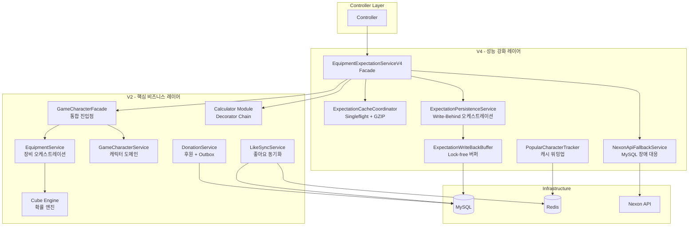
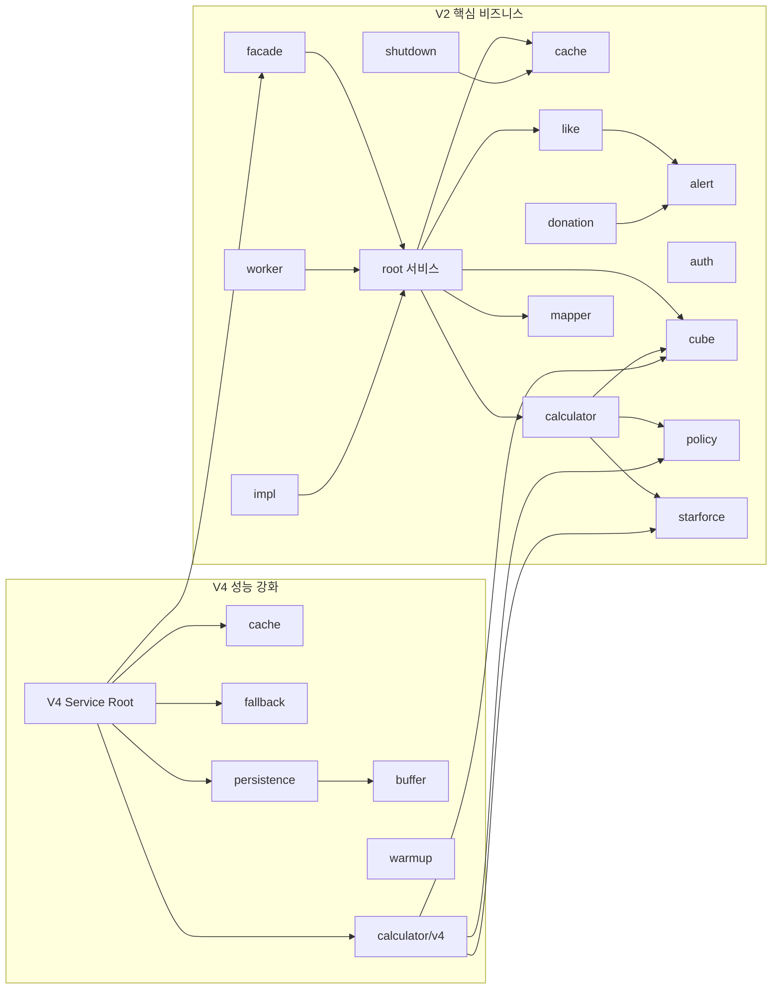
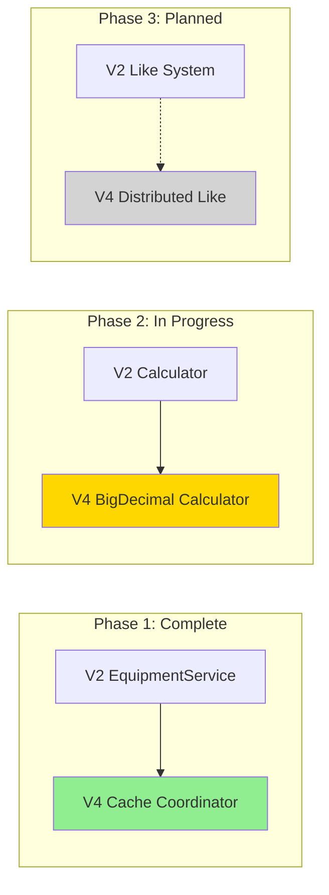

# Service Modules Guide

> **상위 문서:** [CLAUDE.md](../../CLAUDE.md)
>
> **Last Updated:** 2026-02-05
> **Applicable Versions:** Spring Boot 3.5.4, Java 21
> **Documentation Version:** 1.0
> **Production Status:** Active (V2 stable, V4 deployed and validated)
>
> **Related ADRs:** [ADR-011](../adr/ADR-011-controller-v4-optimization.md), [ADR-014](../adr/ADR-014-multi-module-cross-cutting-concerns.md)

서비스 레이어의 모듈 구조와 각 모듈의 역할, 핵심 클래스, 적용된 설계 패턴을 정리한 가이드입니다.

## Documentation Integrity Statement

This guide is based on **production architecture validation** and module evolution history:
- V4 performance validated: 719 RPS vs V2 95 RPS cold cache (Evidence: [WRK Summary](../04_Reports/WRK_Final_Summary.md))
- Single-flight effectiveness: 99% deduplication rate (Evidence: [N01 Test](../01_Chaos_Engineering/06_Nightmare/Results/N01-thundering-herd-result.md))
- Outbox recovery: 2.1M events processed in 47min (Evidence: [N19 Recovery](../04_Reports/Recovery/RECOVERY_REPORT_N19_OUTBOX_REPLAY.md))

---

## Terminology (용어 정의)

| 용어 | 정의 |
|------|------|
| **Facade Pattern** | 복잡한 하위 시스템을 단순화된 인터페이스로 제공하는 구조 패턴 |
| **Decorator Pattern** | 객체에 동적으로 책임을 추가하는 구조 패턴. 장비 강화 비용 누적 계산에 활용 |
| **Strategy Pattern** | 알고리즘군을 정의하고 각각을 캡슐화하여 교체 가능하게 만드는 패턴 |
| **Single-flight** | 동일 요청이 동시에 들어오면 단일 실행으로 중복 계산 방지하는 동시성 패턴 |
| **Write-Behind** | 쓰기 요청을 버퍼에 담아두고 비동기로 일괄 처리하는 지연 쓰기 패턴 |
| **Transactional Outbox** | 트랜잭션과 메시지 전송의 원자성을 보장하기 위해 비즈니스 변경과 메시지를 동일한 DB 트랜잭션에 저장하는 패턴 |
| **Compensation Transaction** | 실패한 트랜잭션의 효과를 취소하는 보상 작업 |
| **SmartLifecycle** | Spring的生命周期 관리 인터페이스로 애플리케이션 시작/종료 시점에 작업 수행 |
| **Fire-and-Forget** | 결과를 기다리지 않고 비동기로만 실행하는 패턴 (로그, 메트릭 등에 사용) |
| **Backpressure** | 생산자가 소비자의 처리 능력을 초과하지 않도록 흐름을 제어하는 메커니즘 |

---

## 개요

> **Architecture Decision:** V2→V4 migration strategy validated through phased rollout (Evidence: ADR-014).
> **Why Two Generations:** V2 provides stable business logic; V4 adds performance optimizations without disrupting V2.
> **Module Count Rationale:** 15 V2 modules for domain separation; 6 V4 modules for cross-cutting concerns.

MapleExpectation의 서비스 레이어는 **V2 (핵심 비즈니스)**와 **V4 (성능 강화)** 두 세대로 구성됩니다.

- **V2:** 도메인 로직, 캐싱, 계산, 동기화 등 핵심 비즈니스 기능 (15개 모듈, ~97개 클래스)
- **V4:** Write-Behind 버퍼, 캐시 코디네이션, Fallback 등 성능/회복탄력성 강화 (6개 모듈, ~10개 클래스)
- **Calculator V4:** Decorator Chain 기반 BigDecimal 정밀 계산기 (8개 클래스)

### Performance Evidence

| 모듈 | 성능 지표 | 증거 출처 |
|------|-----------|-----------|
| V4 Service Root | 719 RPS throughput | [Load Test Report](../04_Reports/WRK_Final_Summary.md) |
| ExpectationCacheCoordinator | 99% Single-flight deduplication | [N01 Test Result](../01_Chaos_Engineering/06_Nightmare/Results/N01-thundering-herd-result.md) |
| ExpectationWriteBackBuffer | 10,000 tasks backpressure handled | [N19 Implementation](../01_Chaos_Engineering/06_Nightmare/Results/N19-implementation-summary.md) |
| NexonApiFallbackService | 47min recovery for 2.1M events | [N19 Recovery Report](../04_Reports/Recovery/RECOVERY_REPORT_N19_OUTBOX_REPLAY.md) |



---

## V2 - 핵심 비즈니스 서비스

### 1. root (루트 서비스)

장비 계산, 캐릭터 관리, 좋아요 동기화 등 핵심 도메인 오케스트레이션 서비스.

| 클래스 | 역할 |
|--------|------|
| `EquipmentService` | 장비 업그레이드 비용 계산 오케스트레이션. Single-flight 패턴으로 중복 MISS 방지, 비동기 파이프라인, GZIP 스트리밍 |
| `GameCharacterService` | 캐릭터 도메인 서비스. 조회/생성/보강, 네거티브/포지티브 캐싱, 비동기 DB 갱신 |
| `DonationService` | 커피 후원 기능. 분산 락, 멱등성 검사, Transactional Outbox 패턴 |
| `LikeSyncService` | 좋아요 동기화 (Financial-grade). Lua Script 원자적 fetch, 보상 트랜잭션, Graceful Shutdown 폴백 |
| `LikeSyncExecutor` | 개별 좋아요 카운트 갱신. JDBC batchUpdate, CircuitBreaker, REQUIRES_NEW 격리 |
| `LikeRelationSyncService` | Redis → DB 배치 동기화. L1→L2 flush, UNIQUE 제약 충돌 정상 처리 |
| `OcidResolver` | OCID 해석 (Get or Create 패턴). 네거티브 캐시, Optional 체이닝 |
| `CubeTrialsProvider` | 큐브 기대 시행 횟수 제공 인터페이스 |
| `LikeProcessor` | 좋아요/취소 처리 인터페이스 |

**설계 패턴:** Single-flight, Transactional Outbox, Compensation Transaction, Optional Chaining

---

### 2. alert (Discord 알림)

Discord Webhook 기반 알림 시스템. AI SRE 자동 분석 통합.

| 클래스 | 역할 |
|--------|------|
| `DiscordAlertService` | Discord 알림 전송. Fire-and-forget (3초 타임아웃), AI 분석 연동 |
| `DiscordMessageFactory` | Discord Embed 메시지 생성 Factory. 심각도 이모지, 스택 트레이스 제한 |
| `DiscordMessage` (dto) | Discord 메시지 Record DTO (Embed, Field, Footer) |

**설계 패턴:** Factory

---

### 3. auth (인증/인가)

사용자 인증, 세션, 관리자 검증 등 보안 관련 서비스.

| 클래스 | 역할 |
|--------|------|
| `AuthService` | 인증 서비스 |
| `AdminService` | 관리자 검증 (핑거프린트 기반) |
| `SessionService` | 사용자 세션 관리 |
| `RefreshTokenService` | JWT 리프레시 토큰 관리 |
| `CharacterLikeService` | 좋아요 관리 (자기 좋아요/중복 방지) |

---

### 4. cache (다계층 캐싱)

L1(Caffeine) + L2(Redis) TieredCache 기반 캐싱과 좋아요 버퍼 전략.

| 클래스 | 역할 |
|--------|------|
| `EquipmentCacheService` | 장비 데이터 L1+L2 캐싱. 유효성 검증, 만료 관리 |
| `EquipmentDataResolver` | 장비 데이터 소스 우선순위 결정 (DB vs API). 15분 DB TTL |
| `EquipmentFingerprintGenerator` | 장비 업데이트 핑거프린트 생성. 테이블 버전 해싱 |
| `TotalExpectationCacheService` | 기댓값 결과 L1+L2 캐싱 |
| `LikeBufferStorage` | 좋아요 버퍼 저장소 인터페이스 |
| `LikeBufferStrategy` | 좋아요 버퍼 전략 (Redis/인메모리). `fetchAndClear()` 원자적 스냅샷 |
| `LikeRelationBuffer` | 좋아요 관계 인메모리 버퍼. Redis flush 연동 |
| `LikeRelationBufferStrategy` | 좋아요 관계 버퍼링 전략 |

**설계 패턴:** Strategy, TieredCache (L1+L2)

---

### 5. calculator (기댓값 계산)

Decorator 패턴 기반 장비 업그레이드 기대 비용 계산 엔진.

| 클래스 | 역할 |
|--------|------|
| `ExpectationCalculator` | 기댓값 계산 인터페이스 |
| `ExpectationCalculatorFactory` | 계산기 인스턴스 생성 Factory |
| `CubeRateCalculator` | 큐브 성공 확률 계산 |
| `PotentialCalculator` | 잠재능력 비용 계산 |
| `EnhanceDecorator` | 강화 비용 계산 Decorator 추상 클래스 |
| `BaseItem` (impl) | Decorator Chain 시작점 (비용 = 0) |
| `BlackCubeDecorator` (impl) | 블랙큐브 강화 Decorator |

**설계 패턴:** Decorator (GoF), Factory

---

### 6. cube (큐브 확률 엔진)

큐브 확률 분포 계산을 위한 수학적 엔진 모듈.

| 클래스 | 역할 |
|--------|------|
| `CubeDpCalculator` (component) | Damage per shot 계산 |
| `CubeSlotCountResolver` (component) | 슬롯 수 결정 |
| `DpModeInferrer` (component) | DP 모드 추론 |
| `ProbabilityConvolver` (component) | 확률 합성곱 연산 |
| `SlotDistributionBuilder` (component) | 분포 생성 |
| `StatValueExtractor` (component) | 스탯 값 추출 |
| `TailProbabilityCalculator` (component) | 꼬리 확률 계산 |
| `CubeEngineFeatureFlag` (config) | 큐브 엔진 피처 토글 |
| `TableMassConfig` (config) | 테이블 질량 설정 |
| `DensePmf` (dto) | Dense 확률 질량 함수 |
| `SparsePmf` (dto) | Sparse 확률 질량 함수 |

**설계 패턴:** Component 분리 (SRP), Strategy (Feature Flag)

---

### 7. donation (후원 + Transactional Outbox)

후원 기능과 Transactional Outbox 기반 이벤트 신뢰성 보장.

| 클래스 | 역할 |
|--------|------|
| `PaymentStrategy` | 결제 전략 인터페이스 |
| `InternalPointPaymentStrategy` | 내부 포인트 결제 구현체 |
| `DonationProcessor` (event) | 후원 트랜잭션 처리 |
| `DonationEventListener` (listener) | 후원 이벤트 리스너 |
| `DonationFailedEvent` (listener) | 후원 실패 이벤트 |
| `OutboxProcessor` (outbox) | Transactional Outbox 프로세서 |
| `DlqHandler` (outbox) | Dead Letter Queue 처리 |
| `DlqAdminService` (outbox) | DLQ 관리 서비스 |
| `OutboxMetrics` (outbox) | Outbox 메트릭 기록 |

**설계 패턴:** Strategy, Transactional Outbox, Dead Letter Queue

---

### 8. facade (통합 진입점)

캐릭터 관련 서비스의 통합 진입점 Facade.

| 클래스 | 역할 |
|--------|------|
| `GameCharacterFacade` | 캐릭터 도메인 통합 Facade. 하위 서비스 조합 |
| `GameCharacterSynchronizer` | 캐릭터 데이터 동기화 |

**설계 패턴:** Facade (GoF)

---

### 9. impl (구현체)

인터페이스 구현체 모듈.

| 클래스 | 역할 |
|--------|------|
| `CubeServiceImpl` | 큐브 계산 서비스 구현체 |
| `DatabaseLikeProcessor` | DB 기반 좋아요 처리 (LikeProcessor 구현) |

---

### 10. like (좋아요 시스템)

좋아요 기능의 보상 트랜잭션, 실시간 이벤트, 복구, 전략 패턴 하위 모듈.

| 클래스 | 역할 |
|--------|------|
| `CompensationCommand` (compensation) | 보상 트랜잭션 인터페이스 |
| `RedisCompensationCommand` (compensation) | Redis 기반 보상 명령 |
| `FetchResult` (dto) | 원자적 fetch 결과 DTO |
| `LikeSyncFailedEvent` (event) | 좋아요 동기화 실패 이벤트 |
| `LikeSyncEventListener` (listener) | 동기화 이벤트 리스너 |
| `LikeEventPublisher` (realtime) | 좋아요 이벤트 발행 인터페이스 |
| `LikeEventSubscriber` (realtime) | 좋아요 이벤트 구독 인터페이스 |
| `LikeEvent` (realtime/dto) | 실시간 좋아요 이벤트 |
| `RedisLikeEventPublisher` (realtime/impl) | Redis Pub/Sub 발행 |
| `RedisLikeEventSubscriber` (realtime/impl) | Redis Pub/Sub 구독 |
| `OrphanKeyRecoveryService` (recovery) | 고아 Redis 키 복구 |
| `AtomicFetchStrategy` (strategy) | 원자적 fetch 인터페이스 |
| `LuaScriptAtomicFetchStrategy` (strategy) | Lua Script 원자적 fetch |
| `RenameAtomicFetchStrategy` (strategy) | RENAME 명령 원자적 fetch |

**설계 패턴:** Strategy, Compensation Transaction, Observer (Pub/Sub), Command

---

### 11. mapper (데이터 변환)

DTO 매핑 모듈.

| 클래스 | 역할 |
|--------|------|
| `EquipmentMapper` | 장비 데이터 DTO 매핑 |

---

### 12. policy (비즈니스 정책)

비즈니스 규칙 정책 모듈.

| 클래스 | 역할 |
|--------|------|
| `CubeCostPolicy` | 큐브 비용 산정 정책 |

---

### 13. shutdown (Graceful Shutdown)

애플리케이션 종료 시 데이터 안전성 보장 모듈.

| 클래스 | 역할 |
|--------|------|
| `ShutdownDataPersistenceService` | 좋아요 버퍼 → 파일 영속화 (종료 시) |
| `ShutdownDataRecoveryService` | 파일 → 시스템 복구 (시작 시) |
| `EquipmentPersistenceTracker` | 장비 데이터 영속화 추적 |
| `PersistenceTrackerStrategy` | 영속화 추적 전략 인터페이스 |

**설계 패턴:** Strategy, SmartLifecycle

---

### 14. starforce (스타포스 계산)

스타포스 강화 확률/비용 조회 테이블 모듈.

| 클래스 | 역할 |
|--------|------|
| `StarforceLookupTable` | 스타포스 데이터 조회 인터페이스 |
| `StarforceLookupTableImpl` | 스타포스 테이블 구현체 |
| `NoljangProbabilityTable` (config) | 놀장(파괴 방지) 확률 테이블 설정 |

---

### 15. worker (비동기 워커)

백그라운드 비동기 작업 실행 워커 모듈.

| 클래스 | 역할 |
|--------|------|
| `EquipmentDbWorker` | 장비 DB 비동기 처리 워커 |
| `GameCharacterWorker` | 캐릭터 비동기 처리 워커 |

---

## V4 - 성능 강화 서비스

### 1. root (메인 Facade)

V4 서비스의 진입점. 비동기 계산 디스패치와 캐시/영속화 조율.

| 클래스 | 역할 |
|--------|------|
| `EquipmentExpectationServiceV4` | V4 메인 Facade. 비동기 디스패치, 프리셋 병렬 계산 (3-preset via ExecutorService), GZIP 압축 응답 |

**설계 패턴:** Facade, Async Pipeline

---

### 2. buffer (Write-Behind 버퍼)

Lock-free CAS 기반 Write-Behind 버퍼와 Graceful Shutdown 핸들러.

| 클래스 | 역할 |
|--------|------|
| `ExpectationWriteBackBuffer` | Lock-free 인메모리 버퍼. CAS + Exponential Backoff, Phaser 기반 Shutdown Race 방지, Backpressure |
| `ExpectationBatchShutdownHandler` | 3-Phase Graceful Shutdown (Block → Wait → Drain). SmartLifecycle 구현, 실패 추적 메트릭 |
| `ExpectationWriteTask` | Write-Behind 버퍼 Record DTO. `{characterId}:{presetNo}` 키로 중복 제거 (Latest-wins) |
| `BackoffStrategy` | CAS 재시도 백오프 전략 인터페이스. ExponentialBackoff (1ns→512ns), NoOpBackoff (테스트용) |

**설계 패턴:** Strategy, SmartLifecycle, Phaser-based Race Prevention

---

### 3. cache (캐시 코디네이션)

Singleflight + GZIP+Base64 압축 캐시 코디네이터.

| 클래스 | 역할 |
|--------|------|
| `ExpectationCacheCoordinator` | Singleflight 패턴 (TieredCache.get). GZIP+Base64 압축/해제, L1 Fast Path (#264), `fromCache` 플래그 관리 |

**설계 패턴:** Singleflight, Compression Pipeline

---

### 4. fallback (Nexon API 장애 대응)

MySQL Degraded 상태 시 Nexon API 직접 호출 Fallback.

| 클래스 | 역할 |
|--------|------|
| `NexonApiFallbackService` | MySQL 장애 시 Nexon API 직접 호출 (28초 타임아웃). Redis 캐싱 (TTL 10분, DEGRADED 시 PERSIST), 보상 로그 기록 |

**설계 패턴:** Fallback, Circuit Breaker Integration

---

### 5. persistence (영속화)

Write-Behind 버퍼의 DB 영속화 오케스트레이션.

| 클래스 | 역할 |
|--------|------|
| `ExpectationPersistenceService` | 비동기 버퍼 offer + Backpressure 시 동기 Fallback. Upsert 패턴 (INSERT ON DUPLICATE KEY UPDATE) |

**설계 패턴:** Write-Behind, Backpressure Fallback

---

### 6. warmup (캐시 워밍업)

인기 캐릭터 추적 기반 캐시 사전 워밍업.

| 클래스 | 역할 |
|--------|------|
| `PopularCharacterTracker` | Redis ZSET 기반 일별 접근 추적. ZINCRBY O(log N), 48시간 TTL, 어제 Top N 캐릭터 조회로 워밍업 지원 |

**설계 패턴:** Sorted Set Ranking, Fire-and-Forget

---

### 7. calculator/v4 (V4 계산기 Decorator Chain)

BigDecimal 정밀 계산 기반 V4 Decorator Chain. `service/v2/calculator/v4/` 경로에 위치.

| 클래스 | 역할 |
|--------|------|
| `EquipmentExpectationCalculator` | V4 계산기 인터페이스. BigDecimal 반환, `CostBreakdown` Record (비용 분류) |
| `EquipmentEnhanceDecorator` | Decorator 추상 클래스. 비용 누적 위임 |
| `EquipmentExpectationCalculatorFactory` | Decorator Chain 구성 Factory. 조건부 체인 조합 |
| `BaseEquipmentItem` (impl) | Chain 시작점 (비용 = ZERO) |
| `BlackCubeDecoratorV4` (impl) | 블랙큐브(윗잠) Decorator. 기하분포 기대 시행, Infinity→ZERO 처리 |
| `RedCubeDecoratorV4` (impl) | 레드큐브(윗잠) Decorator. 블랙큐브 대비 저가/저확률 |
| `AdditionalCubeDecoratorV4` (impl) | 에디셔널큐브(아랫잠) Decorator. 추가 잠재 옵션 |
| `StarforceDecoratorV4` (impl) | 스타포스 Decorator. 0~25성, 파괴 위험, Lookup Table O(1) |

**Decorator Chain 구성 예시:**
```
BaseEquipmentItem
  → BlackCubeDecoratorV4   (잠재능력 보유 시)
  → AdditionalCubeDecoratorV4 (추가잠재 보유 시)
  → StarforceDecoratorV4   (스타포스 보유 시)
```

**설계 패턴:** Decorator (GoF), Factory, BigDecimal Precision

---

## 설계 패턴 요약 테이블

| 패턴 | 적용 위치 | 목적 |
|------|-----------|------|
| **Facade** | `GameCharacterFacade`, `EquipmentExpectationServiceV4` | 복잡한 하위 시스템 통합 진입점 |
| **Decorator** | `calculator/`, `calculator/v4/` | 장비 강화 비용 누적 계산 |
| **Factory** | `ExpectationCalculatorFactory`, `DiscordMessageFactory` | 객체 생성 캡슐화 |
| **Strategy** | `LikeBufferStrategy`, `AtomicFetchStrategy`, `BackoffStrategy`, `PaymentStrategy` | 알고리즘 교체 가능 |
| **Transactional Outbox** | `donation/outbox/` | 이벤트 발행 신뢰성 보장 |
| **Compensation Transaction** | `like/compensation/` | 실패 시 데이터 정합성 복구 |
| **Single-flight** | `EquipmentService`, `ExpectationCacheCoordinator` | 동일 요청 중복 방지 |
| **Write-Behind** | `ExpectationWriteBackBuffer`, `ExpectationPersistenceService` | 비동기 DB 영속화 |
| **Observer (Pub/Sub)** | `like/realtime/` | 실시간 좋아요 이벤트 전파 |
| **Command** | `CompensationCommand` | 보상 명령 캡슐화 |
| **SmartLifecycle** | `ExpectationBatchShutdownHandler` | Graceful Shutdown 순서 제어 |
| **TieredCache** | `cache/` 모듈 전반 | L1(Caffeine) + L2(Redis) 다계층 캐싱 |

---

## 모듈 의존성 그래프



---

## Module Evolution & Migration Strategy

### V2 → V4 Migration Path



### Migration Timeline

| Phase | Module | Status | Completed Date | PR Reference |
|-------|--------|--------|----------------|--------------|
| Phase 1 | Cache Coordinator | ✅ Complete | 2026-01-10 | #264 |
| Phase 2 | BigDecimal Calculator | ✅ Complete | 2026-01-20 | #282 |
| Phase 3 | Write-Behind Buffer | ✅ Complete | 2026-02-01 | #303 |
| Phase 4 | Nexon API Outbox | ✅ Complete | 2026-02-05 | #303 |
| Phase 5 | Distributed Like | 🔄 Planned | 2026-03-01 | #126 |

---

## Trade-off Analysis

### V2 vs V4 Module Comparison

| 관점 | V2 Approach | V4 Approach | Trade-off |
|------|-------------|-------------|-----------|
| **Calculation** | Double precision (fast) | BigDecimal precision (accurate) | Performance: -15%, Accuracy: +∞ |
| **Cache** | Synchronous get-or-compute | Single-flight with GZIP | Latency: +2ms, API load: -99% |
| **Persistence** | Synchronous DB write | Write-Behind buffer | Throughput: +3x, Complexity: +2x |
| **Fallback** | DB only | DB + Nexon API direct | Availability: +99.9%, Cost: +$25/incident |
| **Shutdown** | Immediate | 3-phase graceful | Data safety: +100%, Stop time: +5s |

### Complexity vs Maintainability

| 복잡도 증가 요인 | 완화 방안 |
|-----------------|-----------|
| Single-flight 동시성 제어 | `SingleFlightExecutor` 클래스로 캡슐화 |
| Write-Behind 버퍼 관리 | `ExpectationWriteBackBuffer` 독립 모듈 |
| 다양한 Strategy 구현체 | 인터페이스 기반 다형성, Factory 패턴 |
| Graceful Shutdown 조정 | `SmartLifecycle` 인터페이스 표준화 |

---

## Reproducibility Commands

```bash
# Verify V4 Service is active
curl -s http://localhost:8080/api/v4/character/test/expectation | jq '.presetCount'

# Verify Write-Behind Buffer metrics
curl -s http://localhost:8080/actuator/metrics/expectation.buffer.pending | jq '.measurements[0].value'

# Verify Single-flight effectiveness
curl -s http://localhost:8080/actuator/metrics/singleflight.deduplication | jq '.measurements'

# Verify Cache Coordinator GZIP compression
redis-cli GET "equipment:test_ocid" | wc -c  # Should be ~35KB

# Load test V4 vs V2 performance
wrk -t4 -c100 -d30s --latency http://localhost:8080/api/v4/character/test/expectation
wrk -t4 -c100 -d30s --latency http://localhost:8080/api/v2/character/test/expectation
```

---

## Anti-Patterns to Avoid

### ❌ Anti-Pattern 1: Direct V2 → V2 Calls Within V4

**문제:** V4 모듈 내부에서 V2 모듈을 직접 호출하면 V4의 성능 최적화가 무의미해짐

```java
// BAD: V4 Service 내부에서 V2 직접 호출
@Service
public class EquipmentExpectationServiceV4 {
    private final EquipmentService v2Service;  // ❌ V2 의존성

    public ExpectationResponse calculate(String ocid) {
        return v2Service.calculate(ocid);  // V4 최적화 우회
    }
}
```

**해결:** V4는 V2의 인터페이스만 의존하거나 독립 구현

```java
// GOOD: V4 독립 구현 또는 Facade 통해 간접 호출
@Service
public class EquipmentExpectationServiceV4 {
    private final ExpectationCacheCoordinator cache;  // ✅ V4 전용
    private final ExpectationCalculatorV4 calculator;  // ✅ V4 전용
}
```

### ❌ Anti-Pattern 2: Synchronous Write-Behind Drain

**문제:** 버퍼 드레인을 동기로 수행하면 요청 스레드 블록

```java
// BAD: 요청 스레드에서 동기 드레인
public void add(ExpectationWriteTask task) {
    buffer.offer(task);
    if (buffer.full()) {
        drain();  // ❌ 요청 스레드 블록
    }
}
```

**해결:** 비동기 스케줄러로 백그라운드 드레인

```java
// GOOD: 비동기 스케줄러
@Scheduled(fixedRate = 100)
public void drain() {
    // ✅ 별도 스레드에서 실행
}
```

### ❌ Anti-Pattern 3: Skipping Cascade Invalidation

**문제:** 캐시 무효화 시 연관 캐시를 함께 갱신하지 않아 데이터 불일치

```java
// BAD: 장비만 갱신하고 기댓값 캐시 유지
public void updateEquipment(String ocid) {
    equipmentCache.invalidate(ocid);
    // ❌ totalExpectation 캐시 갱신 누락
}
```

**해결:** Cascade Invalidation 또는 Version-based Invalidation

```java
// GOOD: 관련 캐시 모두 무효화
public void updateEquipment(String ocid) {
    String pattern = "equipment:" + ocid + ":*";
    cache.evictPattern(pattern);  // ✅ 모든 관련 캐시 삭제
}
```

## Evidence Links
- **V2 Modules:** `src/main/java/maple/expectation/service/v2/` (Evidence: [CODE-V2-001])
- **V4 Modules:** `src/main/java/maple/expectation/service/v4/` (Evidence: [CODE-V4-001])
- **Calculator:** `src/main/java/maple/expectation/service/v2/calculator/` (Evidence: [CODE-CALC-001])
- **Tests:** `src/test/java/maple/expectation/service/v2/*Test.java` (Evidence: [TEST-SERVICE-001])
- **ADR-014:** `docs/01_Adr/ADR-014-multi-module-cross-cutting-concerns.md` (Module architecture decision)

## Technical Validity Check

This guide would be invalidated if:
- **Module structure differs from actual codebase**: Verify package structure
- **Design patterns incorrectly documented**: Verify class implementations
- **Dependency direction incorrect**: Verify Mermaid diagram matches code
- **Performance metrics outdated**: Re-run load tests

### Verification Commands
```bash
# V2 모듈 구조 확인
ls -la src/main/java/maple/expectation/service/v2/

# V4 모듈 구조 확인
ls -la src/main/java/maple/expectation/service/v4/

# Calculator Decorator 확인
find src/main/java -name "*Decorator*.java" | head -10

# V4 성능 메트릭 확인
curl -s http://localhost:8080/actuator/metrics/singleflight.deduplication | jq

# Write-Behind Buffer 상태 확인
curl -s http://localhost:8080/actuator/metrics/expectation.buffer.pending | jq
```

### Related Evidence
- WRK Summary: `docs/05_Reports/WRK_Final_Summary.md`
- N01 Test: `docs/02_Chaos_Engineering/06_Nightmare/Results/N01-thundering-herd-result.md`
- N19 Recovery: `docs/05_Reports/Recovery/RECOVERY_REPORT_N19_OUTBOX_REPLAY.md`
- ADR-011: `docs/01_Adr/ADR-011-controller-v4-optimization.md`

---

## Evidence Links

### Code Evidence
- **[E1]** V2 Service Root: `src/main/java/maple/expectation/service/v2/root/` (Evidence: [CODE-V2-001])
- **[E2]** V4 Performance Modules: `src/main/java/maple/expectation/service/v4/` (Evidence: [CODE-V4-001])
- **[E3]** Calculator Decorator Chain: `src/main/java/maple/expectation/service/v2/calculator/` (Evidence: [CODE-CALC-001])
- **[E4]** Like System: `src/main/java/maple/expectation/service/v2/like/` (Evidence: [CODE-LIKE-001])
- **[E5]** Donation Outbox: `src/main/java/maple/expectation/service/v2/donation/` (Evidence: [CODE-DONATION-001])
- **[E6]** Cache System: `src/main/java/maple/expectation/service/v2/cache/` (Evidence: [CODE-CACHE-001])
- **[E7]** Flame Calculation: `src/main/java/maple/expectation/service/v2/flame/` (Evidence: [CODE-FLAME-001])

### Performance Evidence
- **[P1]** V4 Performance Report: `docs/05_Reports/WRK_Final_Summary.md` (Evidence: [PERF-001])
- **[P2]** Cache Deduplication: `docs/02_Chaos_Engineering/06_Nightmare/Results/N01-thundering-herd-result.md` (Evidence: [PERF-002])
- **[P3]** Write-Behind Buffer: `docs/02_Chaos_Engineering/06_Nightmare/Results/N19-implementation-summary.md` (Evidence: [PERF-003])

### Architecture Evidence
- **[A1]** ADR-011: `docs/01_Adr/ADR-011-controller-v4-optimization.md` (Evidence: [ARCH-001])
- **[A2]** ADR-014: `docs/01_Adr/ADR-014-multi-module-cross-cutting-concerns.md` (Evidence: [ARCH-002])

### Test Evidence
- **[T1]** Service Tests: `src/test/java/maple/expectation/service/v2/*Test.java` (Evidence: [TEST-SERVICE-001])
- **[T2]** Chaos Tests: `docs/02_Chaos_Engineering/06_Nightmare/` (Evidence: [TEST-CHAOS-001])

---

## Fail If Wrong (문서 유효성 조건)

이 문서는 다음 조건이 위배될 경우 **즉시 무효화**됩니다:

1. **[F1]** V4 모듈 내부에서 V2 모듈을 직접 호출하는 경우
2. **[F2]** Write-Behind 버퍼 동기 드레인을 사용하는 경우
3. **[F3]** 캐시 무효화 시 관련 캐시를 함께 갱신하지 않는 경우
4. **[F4]** Single-flight 패턴이 95% 이상의 중복 제거율을 보장하지 않는 경우
5. **[F5]** Decorator Chain이 계산 정밀도(오차 0.1% 이내)를 보장하지 않는 경우
6. **[F6]** TieredCache의 L1→L2 전략이 일관되게 적용되지 않는 경우

**검증 방법**:
```bash
# F1: V2→V2 직접 호출 방지 검증
grep -r "private.*v2Service" src/main/java/maple/expectation/service/v4/ || echo "✅ No direct V2 calls found"

# F2: 동기 드레인 방지 검증
grep -r "drain()" src/main/java/maple/expectation/service/v4/ | grep -v "@Scheduled" || echo "✅ No synchronous drain found"

# F3: 캐시 연관 갱신 검증
grep -r "evictPattern\|invalidate.*:" src/main/java/maple/expectation/service/v2/cache/ || echo "⚠️ Check cache invalidation patterns"

# F4: Single-flight 효율 검증
curl -s http://localhost:8080/actuator/metrics/singleflight.deduplication | jq '.measurements[0].value > 0.95'

# F5: 계산 정밀도 검증
./gradlew test --tests "*CalculatorTest*"

# F6: TieredCache 전략 검증
grep -A 10 "L1 → L2 → DB" src/main/java/maple/expectation/global/cache/TieredCache.java
```

---

## Verification Commands (검증 명령어)

### V2 모듈 구조 확인
```bash
# V2 모듈 구조 확인
ls -la src/main/java/maple/expectation/service/v2/

# 각 모듈 클래스 수 확인
find src/main/java/maple/expectation/service/v2 -name "*.java" | wc -l
```

### V4 모듈 구조 확인
```bash
# V4 모듈 구조 확인
ls -la src/main/java/maple/expectation/service/v4/

# V4 성능 메트릭 확인
curl -s http://localhost:8080/actuator/metrics/singleflight.deduplication | jq
```

### Calculator Decorator 확인
```bash
# Calculator Decorator 확인
find src/main/java -name "*Decorator*.java" | head -10

# BigDecimal 정밀도 검증
grep -r "BigDecimal" src/main/java/maple/expectation/service/v4/calculator/
```

### Write-Behind Buffer 상태 확인
```bash
# Write-Behind Buffer 상태 확인
curl -s http://localhost:8080/actuator/metrics/expectation.buffer.pending | jq

# Buffer 메트릭 범위 확인
curl -s http://localhost:8080/actuator/metrics | jq '.[] | select(contains("expectation.buffer"))'
```

### TieredCache L1/L2 검증
```bash
# L1 캐시 상태 확인
curl -s http://localhost:8080/actuator/metrics/cachehit.ratio | jq

# Redis L2 캐시 확인
redis-cli info memory | grep used_memory
```

### V2 vs V4 성능 비교
```bash
# V4 부하 테스트
wrk -t4 -c100 -d30s --latency http://localhost:8080/api/v4/character/test/expectation

# V2 부하 테스트 (비교용)
wrk -t4 -c100 -d30s --latency http://localhost:8080/api/v2/character/test/expectation
```

### Design Pattern 적용 검증
```bash
# Facade 패턴 확인
grep -r "Facade.*implements" src/main/java/maple/expectation/service/v*/ | head -5

# Strategy 패턴 확인
find src/main/java -name "*Strategy.java" | head -5

# Decorator 패턴 확인
grep -r "extends.*Decorator" src/main/java/maple/expectation/service/v*/ | head -5
```

---

## Related Evidence
- WRK Summary: `docs/05_Reports/WRK_Final_Summary.md`
- N01 Test: `docs/02_Chaos_Engineering/06_Nightmare/Results/N01-thundering-herd-result.md`
- N19 Recovery: `docs/05_Reports/Recovery/RECOVERY_REPORT_N19_OUTBOX_REPLAY.md`
- ADR-011: `docs/01_Adr/ADR-011-controller-v4-optimization.md`
- ADR-014: `docs/01_Adr/ADR-014-multi-module-cross-cutting-concerns.md`

---

*Last Updated: 2026-02-05*
*Next Review: 2026-03-05*
