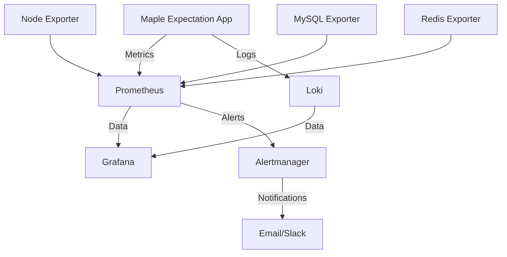

# Maple Expectation Observability Guide

## Overview

This document provides a comprehensive guide for setting up and using the observability stack for Maple Expectation. The stack includes Prometheus for metrics collection, Grafana for visualization, and Alertmanager for alerting.

## Architecture



## Quick Start

### 1. Start the Observability Stack

```bash
# Start all services (MySQL, Redis, Application, Observability)
docker-compose up -d

# Or start observability stack separately
docker-compose -f docker-compose.observability.yml up -d
```

### 2. Access the Services

- **Grafana**: http://localhost:3000 (admin/admin or GRAFANA_PASSWORD)
- **Prometheus**: http://localhost:9090
- **Alertmanager**: http://localhost:9093
- **Loki**: http://localhost:3100

## Configuration Details

### Application Configuration

The Spring Boot application is pre-configured with Micrometer metrics and Prometheus integration:

```yaml
management:
  endpoints:
    web:
      exposure:
        include: "health,info,metrics,prometheus,loggers"
    enabled-by-default: true
  endpoint:
    health:
      show-details: always
  metrics:
    export:
      prometheus:
        enabled: true
    tags:
      application: ${spring.application.name}
      chaos.test: ${CHAOS_TEST:false}
```

### Prometheus Configuration

**Location**: `docker/prometheus/prometheus.yml`

Key configurations:
- Scraping interval: 5s for application, 15s for system metrics
- Retention: 15 days
- Alert rules for critical metrics

### Alertmanager Configuration

**Location**: `docker/alertmanager/alertmanager.yml`

Alert routing:
- Critical alerts → Email + Slack
- Warning alerts → Email
- Info alerts → Email only

### Grafana Configuration

**Location**: `docker/grafana/provisioning/`

Pre-configured dashboards:
- System Overview Dashboard
- Business Metrics Dashboard
- Chaos Test Dashboard

## Custom Metrics

The application exposes several custom metrics:

### Application Metrics

- `maple_cache_hits_total` - Cache hit count
- `maple_cache_misses_total` - Cache miss count
- `maple_equipment_processed_total` - Equipment processing count
- `maple_cube_trials_total` - Cube trial count
- `maple_sync_queue_size` - Sync queue size

### External Service Metrics

- `nexon_api_requests_total` - Nexon API request count
- `nexon_api_request_duration_seconds` - API request duration

### Chaos Test Metrics

- `chaos_test_failures_total` - Chaos test failure count
- `chaos_retry_storm_rate` - Retry storm detection rate
- `chaos_latency_injection_seconds` - Latency injection metrics

## Alert Rules

### Critical Alerts

1. **High CPU Usage**: >80% for 5 minutes
2. **High Memory Usage**: >90% for 5 minutes
3. **Application Error Rate**: >5% for 2 minutes
4. **Circuit Breaker Open**: >1 minute
5. **Database Pool Exhausted**: >90% for 2 minutes

### Warning Alerts

1. **High Disk Usage**: >90% for 5 minutes
2. **High Response Time**: >1s for 5 minutes
3. **High JVM Memory**: >85% for 5 minutes
4. **Redis High Latency**: >0.1s for 2 minutes
5. **Low Cache Hit Rate**: <70% for 10 minutes

## Monitoring Setup

### 1. Environment Variables

Set these environment variables for production:

```bash
export GRAFANA_PASSWORD="your-secure-password"
export SMTP_PASSWORD="your-smtp-password"
export SLACK_WEBHOOK_URL="your-slack-webhook"
```

### 2. Data Persistence

All services use Docker volumes for data persistence:
- `prometheus_data`: Prometheus metrics storage
- `grafana_data`: Grafana dashboards and configurations
- `loki_data`: Log storage
- `alertmanager_data`: Alertmanager state

### 3. Resource Limits

Each service has resource limits defined:
- Prometheus: 512MB RAM, 0.5 CPU
- Grafana: 256MB RAM, 0.25 CPU
- Loki: 512MB RAM, 0.5 CPU
- Alertmanager: 256MB RAM, 0.25 CPU

## Advanced Usage

### Adding Custom Dashboards

1. Create dashboard JSON files in `docker/grafana/provisioning/dashboards/`
2. Use the Grafana UI to create and customize dashboards
3. Provision dashboards will be automatically loaded

### Custom Alert Rules

1. Add new alert rules to `docker/prometheus/rules/alert_rules.yml`
2. Use PromQL for alert expressions
3. Configure routing in `alertmanager.yml`

### Log Aggregation

Loki is configured to collect:
- Application logs from Docker containers
- MySQL slow query logs
- Promtail log parsing

## Troubleshooting

### Common Issues

1. **Grafana not loading dashboards**
   - Check provisioning directory permissions
   - Verify JSON syntax in dashboard files

2. **Prometheus not scraping metrics**
   - Verify application is running on port 8080
   - Check `/actuator/prometheus` endpoint accessibility

3. **Alerts not firing**
   - Check Alertmanager logs
   - Verify alert rule expressions are valid
   - Confirm notification channels are configured

### Health Checks

All services have health checks enabled:

```bash
# Prometheus health
curl http://localhost:9090/-/ready

# Grafana health
curl http://localhost:3000/api/health

# Alertmanager health
curl http://localhost:9093/-/ready
```

## Scaling

### Horizontal Scaling

- Prometheus: Add scrape instances
- Grafana: Load balance multiple instances
- Loki: Distribute across multiple nodes

### Vertical Scaling

Adjust resource limits in `docker-compose.observability.yml`:

```yaml
deploy:
  resources:
    limits:
      memory: 1G
      cpus: '1.0'
```

## Integration with Production

### 1. Security

- Configure SSL/TLS for all services
- Set strong passwords
- Configure network security groups

### 2. Backup

```bash
# Backup Grafana dashboards
docker run --rm -v grafana_data:/var/lib/grafana -v $(pwd)/backup:/backup alpine tar cvf /backup/grafana_backup.tar /var/lib/grafana

# Backup Prometheus data
docker run --rm -v prometheus_data:/prometheus -v $(pwd)/backup:/backup alpine tar cvf /backup/prometheus_backup.tar /prometheus
```

### 3. Monitoring the Monitoring

- Use self-monitoring dashboards
- Set up alerts for monitoring stack issues
- Regular maintenance and updates

## API Reference

### Prometheus API

- Query metrics: `GET /api/v1/query`
- Query range: `GET /api/v1/query_range`
- Series: `GET /api/v1/series`

### Grafana API

- Create dashboard: `POST /api/dashboards`
- Get dashboard: `GET /api/dashboards/{uid}`
- Alert notifications: `POST /api/alerts`

### Loki API

- Query logs: `POST /loki/api/v1/query`
- Series: `GET /loki/api/v1/series`

---

*For more detailed information about each component, refer to the official documentation:*
- [Prometheus Documentation](https://prometheus.io/docs/)
- [Grafana Documentation](https://grafana.com/docs/)
- [Loki Documentation](https://grafana.com/docs/loki/)