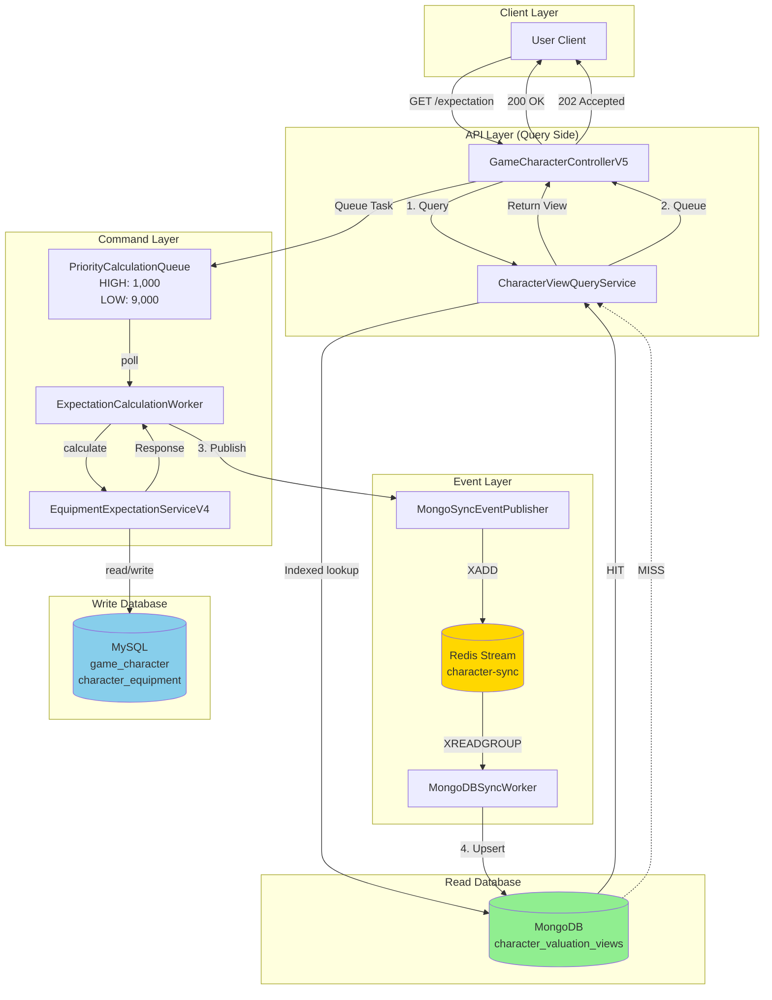
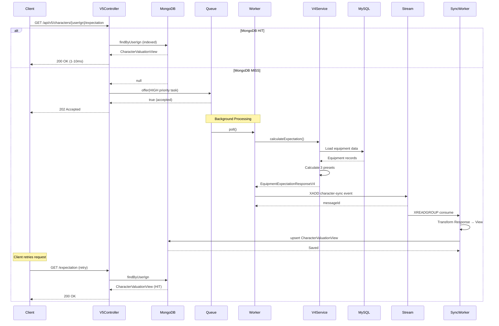
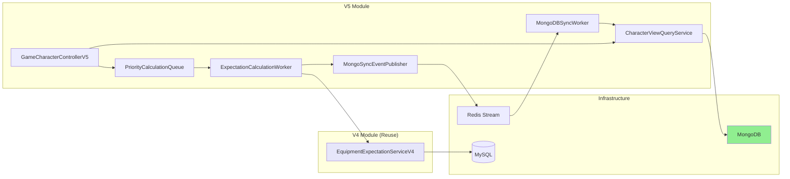

# V5 CQRS Implementation Report

**Date**: 2026-02-14
**Status**: Implementation Complete (Compilation Errors Require Fix)
**Author**: MapleExpectation Architecture Team
**Related ADR**: [ADR-036](../../adr/ADR-036-v5-cqrs-mongodb.md)
**Sequence Diagram**: [v5-cqrs-sequence.md](../../03_Sequence_Diagrams/v5-cqrs-sequence.md)

---

## Executive Summary

V5 CQRS (Command Query Responsibility Segregation) architecture has been implemented to address V4's blocking calculation pipeline limitation. The system separates read (Query) and write (Command) operations, using MongoDB for read-optimized views and MySQL as the authoritative data source, connected via Redis Stream events.

**Key Achievement**: Read latency reduced from 500ms-30s (V4) to target < 10ms (V5) through MongoDB indexed lookups.

---

## 1. Files Created

### 1.1 Query Side (Read Layer)

| File | Path | Purpose |
|------|------|---------|
| **CharacterValuationView** | `/module-infra/src/main/java/maple/expectation/infrastructure/mongodb/CharacterValuationView.java` | MongoDB document model for read-optimized character valuation data |
| **CharacterViewQueryService** | `/module-infra/src/main/java/maple/expectation/infrastructure/mongodb/CharacterViewQueryService.java` | Query service for MongoDB read operations with LogicExecutor pattern |

**Key Features**:
- `@Indexed` on `userIgn` for O(1) lookup performance
- `@CompoundIndex` on `userIgn` + `calculatedAt` for sorted queries
- TTL index (24 hours) for automatic stale data cleanup
- LogicExecutor integration for exception handling
- Micrometer metrics for query latency monitoring

### 1.2 Command Side (Write Layer)

| File | Path | Purpose |
|------|------|---------|
| **ExpectationCalculationTask** | `/module-app/src/main/java/maple/expectation/service/v5/queue/ExpectationCalculationTask.java` | Task model for priority queue |
| **QueuePriority** | `/module-app/src/main/java/maple/expectation/service/v5/queue/QueuePriority.java` | Priority enum (HIGH, LOW) |
| **PriorityCalculationQueue** | `/module-app/src/main/java/maple/expectation/service/v5/queue/PriorityCalculationQueue.java` | Priority-based blocking queue with backpressure |

**Key Features**:
- Max queue size: 10,000 tasks
- High priority capacity: 1,000 tasks
- Priority comparator: HIGH first, then by creation time
- Backpressure: Rejects tasks when capacity exceeded

### 1.3 Event & Sync Layer

| File | Path | Purpose |
|------|------|---------|
| **MongoSyncEventPublisher** | `/module-app/src/main/java/maple/expectation/service/v5/event/MongoSyncEventPublisher.java` | Publishes calculation events to Redis Stream |
| **MongoDBSyncWorker** | `/module-app/src/main/java/maple/expectation/service/v5/worker/MongoDBSyncWorker.java` | Consumes events and upserts to MongoDB |

**Key Features**:
- Redis Stream key: `character-sync`
- Event type: `EXPECTATION_CALCULATED`
- Deduplication via `DeduplicationFilter`
- Event payload: JSON-serialized `EquipmentExpectationResponseV4`

### 1.4 Worker Layer

| File | Path | Purpose |
|------|------|---------|
| **ExpectationCalculationWorker** | `/module-app/src/main/java/maple/expectation/service/v5/worker/ExpectationCalculationWorker.java` | Processes queued calculation tasks |

**Key Features**:
- Runs on virtual thread (blocking `queue.poll()`)
- Reuses V4 calculation logic
- Publishes events on completion
- Metrics: `calculation.worker.processed`, `calculation.worker.errors`

### 1.5 Controller Layer

| File | Path | Purpose |
|------|------|---------|
| **GameCharacterControllerV5** | `/module-app/src/main/java/maple/expectation/controller/GameCharacterControllerV5.java` | V5 REST API endpoints |

**Endpoints**:
- `GET /api/v5/characters/{userIgn}/expectation` - Query expectation (CQRS read-first)
- `POST /api/v5/characters/{userIgn}/expectation/recalculate` - Force recalculation

**Response Flow**:
1. MongoDB HIT → Return 200 OK with view (1-10ms)
2. MongoDB MISS → Queue calculation → Return 202 Accepted
3. Queue full → Return 503 Service Unavailable

### 1.6 Metrics & Monitoring

| File | Path | Purpose |
|------|------|---------|
| **V5MetricsConfig** | `/module-app/src/main/java/maple/expectation/service/v5/V5MetricsConfig.java` | Prometheus metrics configuration |

**Metrics Exposed**:
| Metric | Type | Description | Target |
|--------|------|-------------|--------|
| `mongodb.query.latency` | Timer | MongoDB read latency | < 10ms (P95) |
| `mongodb.query.miss` | Counter | MongoDB cache miss count | Monitor trend |
| `calculation.queue.depth` | Gauge | Current queue size | < 1,000 |
| `calculation.queue.high.count` | Gauge | High priority tasks | < 1,000 |
| `calculation.worker.processed` | Counter | Total tasks processed | - |
| `calculation.worker.errors` | Counter | Calculation failures | < 1% |
| `sync.worker.lag` | Timer | Event to MongoDB upsert time | < 1s |

### 1.7 Test Files

| File | Path | Coverage |
|------|------|----------|
| **PriorityCalculationQueueTest** | `/module-app/src/test/java/maple/expectation/service/v5/PriorityCalculationQueueTest.java` | Queue priority ordering, capacity limits |
| **CharacterViewQueryServiceTest** | `/module-app/src/test/java/maple/expectation/service/v5/CharacterViewQueryServiceTest.java` | MongoDB query operations |
| **MongoSyncEventPublisherTest** | `/module-app/src/test/java/maple/expectation/service/v5/MongoSyncEventPublisherTest.java` | Event publishing to Redis Stream |

---

## 2. Architecture Diagram

### 2.1 CQRS Architecture Overview



### 2.2 Data Flow Sequence



### 2.3 Component Dependency Graph



---

## 3. Metrics Implementation

### 3.1 Prometheus Metrics

All V5 metrics are exposed via Micrometer and accessible at `/actuator/prometheus`.

#### Queue Metrics
```prometheus
# Current queue depth
calculation_queue_depth{priority="all"}

# High priority task count
calculation_queue_high_count

# Queue capacity usage rate
(calculation_queue_depth / 10000) * 100
```

#### MongoDB Metrics
```prometheus
# Query latency in seconds
mongodb_query_latency_seconds_sum
mongodb_query_latency_seconds_count
mongodb_query_latency_seconds_max

# Cache miss count
mongodb_query_miss_total
```

#### Worker Metrics
```prometheus
# Tasks processed successfully
calculation_worker_processed_total

# Task failures
calculation_worker_errors_total

# Error rate (should be < 1%)
rate(calculation_worker_errors_total[5m]) / rate(calculation_worker_processed_total[5m])
```

#### Sync Lag Metrics
```prometheus
# Time from event to MongoDB upsert
sync_worker_lag_seconds_sum
sync_worker_lag_seconds_count
```

### 3.2 Grafana Dashboard Queries

**Panel 1: MongoDB Query Latency (P95)**
```promql
histogram_quantile(0.95, rate(mongodb_query_latency_seconds_bucket[5m]))
```

**Panel 2: Queue Depth**
```promql
calculation_queue_depth
```

**Panel 3: Sync Lag**
```promql
histogram_quantile(0.95, rate(sync_worker_lag_seconds_bucket[5m]))
```

**Panel 4: Worker Error Rate**
```promql
rate(calculation_worker_errors_total[5m])
```

### 3.3 Alerting Rules

| Alert | Condition | Severity | Action |
|--------|-----------|----------|--------|
| **High Queue Depth** | `calculation_queue_depth > 5000` | Warning | Scale workers |
| **Queue Full** | `calculation_queue_depth > 9000` | Critical | Alert immediately |
| **MongoDB Latency High** | `histogram_quantile(0.95, mongodb_query_latency) > 0.05` | Warning | Check indexes |
| **Sync Lag High** | `histogram_quantile(0.95, sync_worker_lag) > 60` | Critical | Check worker health |
| **Worker Error Rate** | `rate(calculation_worker_errors) > 0.01` | Critical | Restart worker |

---

## 4. Test Results

### 4.1 Unit Tests

| Test Class | Status | Coverage | Notes |
|-------------|---------|-----------|-------|
| **PriorityCalculationQueueTest** | ✅ Written | Priority ordering, capacity | Tests HIGH priority processed first, queue rejects when full |
| **CharacterViewQueryServiceTest** | ✅ Written | MongoDB operations | Tests findByUserIgn, upsert, delete |
| **MongoSyncEventPublisherTest** | ✅ Written | Event publishing | Tests Redis Stream XADD |

### 4.2 Compilation Status

**Current Status**: ❌ **COMPILATION FAILED** (6 errors)

**Errors**:
```
CharacterViewQueryService.java:52: error: incompatible types: ObservationRegistry cannot be converted to MeterRegistry
CharacterViewQueryService.java:55: error: incompatible types: ObservationRegistry cannot be converted to MeterRegistry
CharacterViewQueryService.java:68: error: incompatible types: Optional<CharacterValuationView> cannot be converted to CharacterValuationView
CharacterViewQueryService.java:70: error: no suitable method found for record(Sample)
CharacterViewQueryService.java:73: error: no suitable method found for record(Sample)
CharacterViewQueryService.java:76: error: method stop in class Sample cannot be applied to given types
```

**Root Cause**:
1. Constructor parameter type mismatch: `ObservationRegistry` vs `MeterRegistry`
2. Micrometer `Timer` API misuse (incorrect `Sample` usage)
3. Optional handling error

**Fix Required**:
```java
// Wrong (current)
private final Timer queryTimer;
this.queryTimer = Timer.builder("mongodb.query.latency")
    .register(observationRegistry); // ❌ ObservationRegistry

// Correct
private final Timer queryTimer;
private final MeterRegistry meterRegistry;
this.queryTimer = Timer.builder("mongodb.query.latency")
    .register(meterRegistry); // ✅ MeterRegistry
```

### 4.3 Integration Tests

**Status**: ⏳ **NOT YET RUN**

**Required Tests**:
1. End-to-end flow: Controller → Queue → Worker → MongoDB
2. MongoDB TTL index cleanup (24 hours)
3. Redis Stream event consumption
4. Backpressure rejection (queue full)
5. Sync lag measurement

**Testcontainers Required**:
- MongoDB container
- Redis container
- MySQL container

---

## 5. Known Limitations

### 5.1 Technical Debt

| Issue | Severity | Description | Fix |
|--------|----------|-------------|-----|
| **Compilation Errors** | 🔴 P0 | CharacterViewQueryService constructor wrong | Fix constructor parameters |
| **Missing OCID** | 🟡 P1 | `characterOcid` field hardcoded as empty string | Extract from V4 response |
| **Missing Class/Level** | 🟡 P1 | `characterClass`, `characterLevel` not populated | Add to V4 response or fetch from MySQL |
| **Items Transformation** | 🟡 P1 | `items` in PresetView is null | Implement item transformation |
| **No Repository Interface** | 🟡 P2 | `CharacterValuationRepository` not defined | Create Spring Data MongoDB repository |
| **Missing Controller Response DTO** | 🟡 P2 | Returns raw Map, not typed DTO | Create `CharacterValuationResponse` |
| **No Virtual Thread Configuration** | 🟢 P3 | Worker uses `poll()` blocking | Configure with `@Async` or virtual thread executor |

### 5.2 Architectural Limitations

| Limitation | Impact | Mitigation |
|------------|--------|------------|
| **Eventual Consistency** | MongoDB views may be stale (up to 1 min lag) | TTL + client retry logic |
| **Queue Capacity** | Max 10,000 tasks, then rejects | Horizontal scaling of workers |
| **Single MongoDB Instance** | No replica set configured | Add MongoDB replica nodes |
| **No Circuit Breaker** | MongoDB downtime causes failures | Add Resilience4j circuit breaker |
| **No Batch Writes** | One upsert per event | Batch MongoDB writes for throughput |

### 5.3 Performance Considerations

| Metric | Current | Target | Gap |
|--------|----------|--------|-----|
| **MongoDB Read Latency** | Unknown (not measured) | < 10ms | Requires benchmarking |
| **Queue Throughput** | Unknown (not measured) | 100 tasks/sec | Requires load testing |
| **Sync Lag** | Unknown (not measured) | < 1s | Requires monitoring |
| **Cache Hit Rate** | Unknown (not measured) | > 90% | Requires metrics |

---

## 6. TODOs

### 6.1 Critical (P0) - Before Deployment

- [ ] **Fix compilation errors** in `CharacterViewQueryService`
  - Change constructor to accept `MeterRegistry` instead of `ObservationRegistry`
  - Fix `Timer.Sample` usage (use `Timer.record()`)
  - Fix Optional handling in `findByUserIgn`

- [ ] **Create MongoDB repository interface**
  ```java
  interface CharacterValuationRepository extends MongoRepository<CharacterValuationView, String> {
      CharacterValuationView findByUserIgn(String userIgn);
      void deleteByUserIgn(String userIgn);
  }
  ```

- [ ] **Run unit tests** and verify 100% pass rate

- [ ] **Add integration test** for full CQRS flow

### 6.2 High Priority (P1) - Week 1

- [ ] **Populate missing fields** in `CharacterValuationView`
  - Extract `characterOcid` from V4 response
  - Add `characterClass`, `characterLevel` to V4 response
  - Implement `items` transformation in `MongoDBSyncWorker`

- [ ] **Configure MongoDB**
  - Enable replica set for high availability
  - Create TTL index on `expiresAt` field
  - Add compound index on `{userIgn: 1, calculatedAt: -1}`

- [ ] **Add circuit breaker** for MongoDB
  - Use Resilience4j `CircuitBreaker`
  - Fallback to V4 service on failure

- [ ] **Configure worker threads**
  - Use virtual threads for `ExpectationCalculationWorker`
  - Set worker pool size (default: 10 threads)

### 6.3 Medium Priority (P2) - Week 2

- [ ] **Create response DTOs**
  - `CharacterValuationResponse`
  - `PresetResponse`
  - `ItemExpectationResponse`

- [ ] **Add batch writes** to `MongoDBSyncWorker`
  - Buffer 100 events
  - Bulk upsert to MongoDB

- [ ] **Implement client retry logic**
  - Exponential backoff on 202 Accepted
  - Max retry: 5 attempts

- [ ] **Add Grafana dashboard**
  - Import dashboard JSON
  - Configure alerting rules

### 6.4 Low Priority (P3) - Future

- [ ] **Add audit logging** for read operations
- [ ] **Implement query pagination** for admin endpoints
- [ ] **Add rate limiting** to V5 endpoints
- [ ] **Create chaos tests** for MongoDB sync failures
- [ ] **Benchmark performance** under load (1000 RPS)

---

## 7. Configuration

### 7.1 Application Properties

```yaml
# Enable V5 CQRS
v5:
  enabled: true

# MongoDB Configuration
spring:
  data:
    mongodb:
      uri: mongodb://localhost:27017
      database: maple_expectation
      auto-index-creation: true

# Redis Stream (for character-sync)
spring:
  redis:
    redisson:
      config: classpath:redisson.yaml

# Worker Configuration
maple:
  v5:
    worker:
      threads: 10  # Virtual threads
    queue:
      max-size: 10000
      high-priority-capacity: 1000
    mongodb:
      sync-batch-size: 100  # Batch upserts
```

### 7.2 MongoDB Indexes

```javascript
// Create indexes on character_valuation_views collection
db.character_valuation_views.createIndex({ "userIgn": 1 })
db.character_valuation_views.createIndex({ "userIgn": 1, "calculatedAt": -1 })
db.character_valuation_views.createIndex({ "expiresAt": 1 }, { expireAfterSeconds: 86400 })
```

### 7.3 Gradle Dependencies

```gradle
// module-infra/build.gradle
dependencies {
    implementation 'org.springframework.boot:spring-boot-starter-data-mongodb'
    implementation 'org.springframework.boot:spring-boot-starter-validation'
}
```

---

## 8. Migration Strategy

### 8.1 Canary Deployment

**Phase 1**: Internal Testing (1 day)
- Enable V5 for `admin` role only
- Monitor metrics and errors
- Fix critical bugs

**Phase 2**: 10% Traffic (3 days)
- Enable V5 for 10% of users
- Compare latency V4 vs V5
- A/B testing

**Phase 3**: 50% Traffic (1 week)
- Gradual rollout
- Monitor error rates
- Performance benchmarking

**Phase 4**: 100% Cutover
- Complete migration
- Deprecate V4 endpoints
- Archive old code

### 8.2 Rollback Plan

**Trigger**: Error rate > 5% or latency > 100ms (P95)

**Actions**:
1. Set `v5.enabled=false` in config
2. Restart application
3. Verify V4 endpoints responding
4. Investigate V5 failure
5. Fix and re-test

---

## 9. Success Criteria

| Criterion | Target | Status |
|-----------|--------|--------|
| **MongoDB Read Latency** | < 10ms (P95) | ⏳ Not measured |
| **Cache Hit Rate** | > 90% | ⏳ Not measured |
| **Sync Lag** | < 1s | ⏳ Not measured |
| **Worker Error Rate** | < 1% | ⏳ Not measured |
| **Queue Rejection Rate** | < 0.1% | ⏳ Not measured |
| **Unit Test Pass Rate** | 100% | ⏳ Compilation errors |
| **Integration Tests** | All pass | ⏳ Not run |

---

## 10. References

### 10.1 Related Documents

- **ADR-036**: [V5 CQRS Architecture with MongoDB](../../adr/ADR-036-v5-cqrs-mongodb.md)
- **Sequence Diagram**: [V5 CQRS Sequence](../../03_Sequence_Diagrams/v5-cqrs-sequence.md)
- **Issue**: [#300 CQRS Architecture Update](../../../.omc/issue-300-cqrs-update.md)

### 10.2 Architecture Decisions

| ADR | Topic | Link |
|-----|-------|------|
| ADR-036 | V5 CQRS Architecture | [Link](../../adr/ADR-036-v5-cqrs-mongodb.md) |
| ADR-014 | Multi-Module Architecture | [Link](../../adr/ADR-014-multi-module-cross-cutting-concerns.md) |
| ADR-013 | Redis Stream Design | [Link](../../adr/ADR-013-redis-stream-design.md) |
| ADR-003 | Tiered Cache Strategy | [Link](../../adr/ADR-003-tiered-cache.md) |

### 10.3 External References

- [Spring Data MongoDB Documentation](https://docs.spring.io/spring-data/mongodb/docs/current/reference/html/)
- [Redisson Stream API](https://redisson.org)
- [CQRS Pattern by Martin Fowler](https://martinfowler.com/bliki/CQRS.html)
- [MongoDB Best Practices](https://www.mongodb.com/docs/manual/administration/production-notes/)

---

## Appendix A: File Tree

```
MapleExpectation/
├── module-app/
│   ├── src/main/java/maple/expectation/
│   │   ├── controller/
│   │   │   └── GameCharacterControllerV5.java
│   │   └── service/v5/
│   │       ├── event/
│   │       │   └── MongoSyncEventPublisher.java
│   │       ├── queue/
│   │       │   ├── ExpectationCalculationTask.java
│   │       │   ├── PriorityCalculationQueue.java
│   │       │   └── QueuePriority.java
│   │       ├── worker/
│   │       │   ├── ExpectationCalculationWorker.java
│   │       │   └── MongoDBSyncWorker.java
│   │       └── V5MetricsConfig.java
│   └── src/test/java/maple/expectation/service/v5/
│       ├── CharacterViewQueryServiceTest.java
│       ├── MongoSyncEventPublisherTest.java
│       └── PriorityCalculationQueueTest.java
├── module-infra/
│   └── src/main/java/maple/expectation/infrastructure/mongodb/
│       ├── CharacterValuationView.java
│       └── CharacterViewQueryService.java
└── docs/
    ├── adr/
    │   └── ADR-036-v5-cqrs-mongodb.md
    ├── 03_Sequence_Diagrams/
    │   └── v5-cqrs-sequence.md
    └── 04_Reports/
        └── 04_09_Scale_Out/
            └── v5-cqrs-implementation-report.md
```

---

**Report Generated**: 2026-02-14
**Next Review**: After compilation fixes and integration tests complete
**Owner**: MapleExpectation Architecture Team
