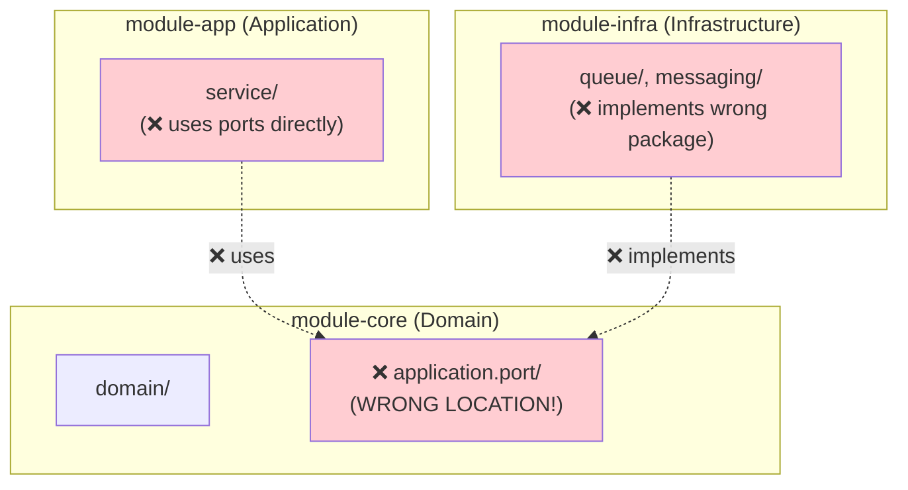
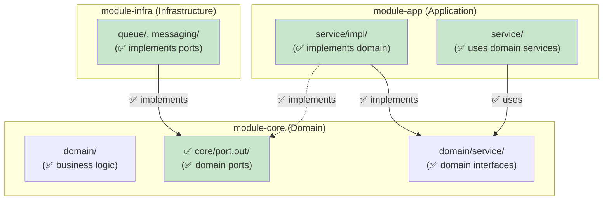

# Circular Dependency Analysis - Final Report

**Date**: 2026-02-16  
**Status**: ❌ CRITICAL ARCHITECTURAL VIOLATIONS DETECTED  
**Risk Level**: P0 - Immediate Action Required

---

## Executive Summary

The analysis revealed **CRITICAL architectural violations** that compromise the multi-module structure:

### ✅ Good News
- **No circular dependencies at Gradle module level**
- Dependency direction follows DIP: `module-app → module-infra → module-core → module-common`
- Zero reverse dependencies (infra/core/common → app)

### ❌ Critical Issues
1. **P0 - Port Interfaces in Wrong Package** (7 ports)
   - Located in `module-core/application/port/` instead of `module-core/core/port/out/`
   - Forces infrastructure to depend on "application" package in core module
   - Creates confusion about architectural boundaries

2. **P1 - Infrastructure Depends on Application Ports** (8 files)
   - module-infra implements ports from `core/application/port`
   - Creates semantic circular dependency (Infrastructure → Core/Application)
   - Violates Clean Architecture layering

3. **P1 - Service Layer Directly Uses Ports** (10 files)
   - Service layer bypasses domain services
   - Tight coupling to infrastructure implementation details
   - Makes testing and maintenance difficult

---

## Critical Violation #1: Port Interfaces in Wrong Package

### Current State (BROKEN)

**Location**: `/module-core/src/main/java/maple/expectation/application/port/`

**Port Interfaces** (7 files):
```
application.port/
├── AlertPublisher.java
├── EventPublisher.java
├── LikeBufferStrategy.java
├── LikeRelationBufferStrategy.java
├── MessageQueue.java
├── MessageTopic.java
└── PersistenceTrackerStrategy.java
```

### Why This Is Wrong

1. **Package Name Mismatch**: Package is `application.port` but located in `module-core`
2. **Architectural Confusion**: Unclear if these are application or domain ports
3. **Hexagonal Architecture Violation**: Domain ports should be in `core/port/out/`
4. **Semantic Circular Dependency**: Infrastructure depends on "application" package in core

### Correct State

**Target Location**: `/module-core/src/main/java/maple/expectation/core/port/out/`

```
core.port.out/
├── AlertPublisher.java
├── EventPublisher.java
├── LikeBufferStrategy.java
├── LikeRelationBufferStrategy.java
├── MessageQueue.java
├── MessageTopic.java
└── PersistenceTrackerStrategy.java
```

### Impact Analysis

**Before Fix**:
```
module-infra/RedisLikeBufferStorage.java
    ↓ imports
maple.expectation.application.port.LikeBufferStrategy
    ↓ located in
module-core/src/main/java/maple/expectation/application/port/
    ↓ VIOLATION: Infrastructure → Core/Application (wrong direction)
```

**After Fix**:
```
module-infra/RedisLikeBufferStorage.java
    ↓ imports
maple.expectation.core.port.out.LikeBufferStrategy
    ↓ located in
module-core/src/main/java/maple/expectation/core/port/out/
    ↓ CORRECT: Infrastructure → Core/Port (DIP compliant)
```

---

## Critical Violation #2: Infrastructure Depends on Application Ports

### Dependency Chain (Current - BROKEN)

```
module-infra (Infrastructure Layer)
    ↓ implements ports from
module-core/application/port (WRONG package)
    ↓ semantic confusion
Infrastructure depends on "Application" (semantic violation)
```

### Affected Files in module-infra (8 files)

| File | Package | Implements | Violation |
|------|---------|------------|-----------|
| `RedisLikeBufferStorage.java` | `queue.like` | `LikeBufferStrategy` | ❌ Wrong package path |
| `RedisLikeRelationBuffer.java` | `queue.like` | `LikeRelationBufferStrategy` | ❌ Wrong package path |
| `RedisEquipmentPersistenceTracker.java` | `queue.persistence` | `PersistenceTrackerStrategy` | ❌ Wrong package path |
| `RedisEventPublisher.java` | `messaging` | `EventPublisher`, `MessageQueue` | ❌ Wrong package path |
| `KafkaEventPublisher.java` | `messaging` | `EventPublisher` | ❌ Wrong package path |
| `RedisMessageQueue.java` | `messaging` | `MessageQueue` | ❌ Wrong package path |
| `RedisMessageTopic.java` | `messaging` | `MessageTopic` | ❌ Wrong package path |
| `MessagingConfig.java` | `config` | Multiple ports | ❌ Wrong package path |

**Total**: 10 import violations

### Why This Violates Clean Architecture

**Clean Architecture Rule**: 
- Inner layers (Core) should NOT know about outer layers (Infrastructure)
- Outer layers (Infrastructure) depend on inner layers (Core)
- Abstractions (ports) owned by inner layers

**Current Violation**:
```
Infrastructure → Core/Application (semantic confusion)
❌ "Application" suggests outer layer, but it's in Core (inner layer)
```

**Correct Architecture**:
```
Infrastructure → Core/Port/Out (clear ownership)
✅ Core owns its infrastructure contracts
```

---

## Critical Violation #3: Service Layer Uses Ports Directly

### Anti-Pattern: Service → Infrastructure Port

**Affected Files** (10 service layer files):
1. `LikeSyncScheduler.java` → `LikeBufferStrategy`
2. `NexonDataCollector.java` → `EventPublisher`
3. `BatchWriter.java` → `MessageQueue`
4. `DatabaseLikeProcessor.java` → `LikeBufferStrategy`
5. `GameCharacterFacade.java` → `MessageQueue`, `MessageTopic`
6. `CharacterLikeService.java` → `LikeBufferStrategy`, `LikeRelationBufferStrategy`
7. `LikeSyncService.java` → `LikeBufferStrategy`
8. `LikeBufferConfig.java` → Multiple ports
9. `StatelessAlertService.java` → `AlertPublisher`
10. `BufferedLikeAspect.java` → `LikeBufferStrategy`

### Code Example: Current (Wrong)

❌ **Anti-Pattern**:
```java
@Service
public class CharacterLikeService {
    private final LikeBufferStrategy buffer; // Infrastructure port!
    private final LikeRelationBufferStrategy relationBuffer; // Another port!
    
    public void toggleLike(UserIgn ign, CharacterId id) {
        buffer.increment(ign.value(), 1); // Direct infra call
        relationBuffer.add(ign.value(), id.value()); // Another direct call
    }
}
```

**Problems**:
1. Business logic tightly coupled to infrastructure
2. Cannot test without mocking infrastructure
3. Violates Single Responsibility Principle
4. Hard to change infrastructure (affects many files)
5. Service layer becomes infrastructure coordination layer

### Code Example: Correct (Domain-Driven)

✅ **Correct Pattern**:
```java
// Step 1: Domain service interface in module-core
package maple.expectation.domain.service;

public interface LikeDomainService {
    void toggle(UserIgn ign, CharacterId id);
    void cancel(UserIgn ign, CharacterId id);
    void syncBuffer();
    long getLikeCount(CharacterId id);
}

// Step 2: Implementation in module-app
@Service
public class LikeDomainServiceImpl implements LikeDomainService {
    private final LikeBufferStrategy buffer; // Infra dependency hidden
    private final LikeRelationBufferStrategy relationBuffer;
    private final LikeRepository repository;
    private final LogicExecutor executor;
    
    @Override
    public void toggle(UserIgn ign, CharacterId id) {
        executor.executeVoid(() -> {
            // Business logic with infra implementation
            buffer.increment(ign.value(), 1);
            relationBuffer.add(ign.value(), id.value());
            repository.save(new Like(ign, id));
        }, TaskContext.of("LikeDomain", "Toggle"));
    }
    
    // ... other methods
}

// Step 3: Service uses domain service
@Service
public class CharacterLikeService {
    private final LikeDomainService likeService; // Single dependency
    
    public void toggleLike(UserIgn ign, CharacterId id) {
        likeService.toggle(ign, id); // Clean business logic
    }
    
    public LikeResult getCharacterLikes(CharacterId id) {
        return LikeResult.of(likeService.getLikeCount(id));
    }
}
```

**Benefits**:
1. Loose coupling to infrastructure
2. Easy to test (mock domain service)
3. Business logic centralized
4. Infrastructure changes isolated
5. Follows Dependency Inversion Principle

---

## Resolution Recommendations

### Option A: Move Ports to core/port/out/ (RECOMMENDED ✅)

**Rationale**:
- Follows Hexagonal Architecture (Ports & Adapters)
- Domain owns its infrastructure contracts
- Aligns with DIP (Infrastructure depends on Core)
- Semantic clarity: `core.port.out` = output ports from domain

**Implementation Steps**:

#### Step 1: Create directory structure
```bash
mkdir -p module-core/src/main/java/maple/expectation/core/port/out
```

#### Step 2: Move port files
```bash
cd module-core/src/main/java/maple/expectation
mv application/port/* core/port/out/
rmdir application/port  # Remove empty directory
```

#### Step 3: Update package declarations (7 files)
```bash
# In each port file:
# Before: package maple.expectation.application.port;
# After:  package maple.expectation.core.port.out;
```

#### Step 4: Update imports in module-infra (8 files)
```bash
# Before: import maple.expectation.application.port.LikeBufferStrategy;
# After:  import maple.expectation.core.port.out.LikeBufferStrategy;
```

#### Step 5: Update imports in module-app (10 files)
```bash
# Before: import maple.expectation.application.port.LikeBufferStrategy;
# After:  import maple.expectation.core.port.out.LikeBufferStrategy;
```

#### Step 6: Update documentation
- Update ADR-014 with new port location
- Update architecture diagrams
- Update CLAUDE.md Section 16

#### Step 7: Verify
```bash
# Check for remaining violations
grep -r "import maple\.expectation\.application\.port" \
  module-infra/src/main/java --include="*.java"
# Should return 0

# Build and test
./gradlew clean build -x test
./gradlew test
```

**Affected Files**: 25 total
- 7 port interfaces (package declaration)
- 8 infrastructure implementations (import)
- 10 service layer files (import)

**Estimated Effort**: 4-6 hours
**Risk**: Low (mechanical refactoring)
**Rollback**: Simple (git revert)

---

### Option B: Create Domain Services (Phase 2, Week 2-3)

**Pattern**: Extract domain services to hide infrastructure complexity

**Implementation Steps**:

#### Step 1: Create domain service interfaces in module-core
```java
// module-core/.../domain/service/LikeDomainService.java
package maple.expectation.domain.service;

import maple.expectation.domain.model.character.UserIgn;
import maple.expectation.domain.model.character.CharacterId;

public interface LikeDomainService {
    void toggle(UserIgn ign, CharacterId id);
    void cancel(UserIgn ign, CharacterId id);
    void syncBuffer();
    long getLikeCount(CharacterId id);
    boolean hasLiked(UserIgn ign, CharacterId id);
}
```

#### Step 2: Implement domain services in module-app
```java
// module-app/.../service/impl/LikeDomainServiceImpl.java
package maple.expectation.service.impl;

@Service
@RequiredArgsConstructor
public class LikeDomainServiceImpl implements LikeDomainService {
    private final LikeBufferStrategy buffer;
    private final LikeRelationBufferStrategy relationBuffer;
    private final LikeRepository repository;
    private final LogicExecutor executor;
    
    @Override
    public void toggle(UserIgn ign, CharacterId id) {
        executor.executeVoid(() -> {
            if (hasLiked(ign, id)) {
                cancel(ign, id);
            } else {
                buffer.increment(ign.value(), 1);
                relationBuffer.add(ign.value(), id.value());
                repository.save(new Like(ign, id));
            }
        }, TaskContext.of("LikeDomain", "Toggle"));
    }
    
    // ... other implementations
}
```

#### Step 3: Refactor existing services
```java
// Before
@Service
@RequiredArgsConstructor
public class CharacterLikeService {
    private final LikeBufferStrategy buffer;
    private final LikeRelationBufferStrategy relationBuffer;
    private final LikeRepository repository;
    
    public void toggleLike(UserIgn ign, CharacterId id) {
        // Direct infra calls...
    }
}

// After
@Service
@RequiredArgsConstructor
public class CharacterLikeService {
    private final LikeDomainService likeService; // Single dependency
    
    public void toggleLike(UserIgn ign, CharacterId id) {
        likeService.toggle(ign, id); // Clean business logic
    }
}
```

**Estimated Effort**: 16-24 hours
**Risk**: Medium (touches business logic)
**Benefits**: 
- Reduces coupling
- Centralizes business logic
- Easier to test

---

## Architecture Diagrams

### Current Architecture (BROKEN)



### Target Architecture (CORRECT)



---

## Implementation Plan

### Phase 1: Move Ports (Week 1, Day 1-2)

| Task | Duration | Files | Risk |
|------|----------|-------|------|
| Create `core/port/out/` directory | 10 min | 1 | Low |
| Move 7 port files | 30 min | 7 | Low |
| Update package declarations | 1 hour | 7 | Low |
| Update imports in module-infra | 2 hours | 8 | Low |
| Update imports in module-app | 2 hours | 10 | Low |
| Update documentation | 1 hour | 3 | Low |
| Verify and test | 2 hours | All | Low |
| **Total** | **8-9 hours** | **25 files** | **Low** |

### Phase 2: Create Domain Services (Week 2-3)

| Task | Duration | Deliverable |
|------|----------|-------------|
| Identify service boundaries | 4 hours | 5-10 domain services |
| Create domain service interfaces | 8 hours | Core module interfaces |
| Implement domain services | 12 hours | App module implementations |
| Refactor existing services | 16 hours | Updated service classes |
| Testing and verification | 8 hours | All tests passing |
| **Total** | **48 hours** | **~50 files** |

### Phase 3: Verification (Week 4)

1. Run all tests: `./gradlew test`
2. Check dependency rules: `./gradlew dependencies`
3. Update ADR-014
4. Update architecture diagrams
5. Create ArchUnit tests for enforcement

---

## Success Criteria

### Before Fix
- ❌ Ports in `module-core/application.port/` (7 files)
- ❌ module-infra implements `core.application.port` (8 files, 10 imports)
- ❌ Service layer uses ports directly (10 files)
- ❌ Semantic confusion about layer boundaries

### After Fix
- ✅ Ports in `module-core/core.port.out/` (7 files)
- ✅ module-infra implements `core.port.out` (8 files, 10 imports)
- ✅ Service layer uses domain services (0 direct port usage)
- ✅ Clear layer boundaries following Hexagonal Architecture
- ✅ All tests passing
- ✅ No circular dependency warnings

---

## Verification Commands

### Pre-Migration
```bash
# Check current violations
grep -r "import maple\.expectation\.application\.port" \
  module-infra/src/main/java --include="*.java" | wc -l
# Expected: 10

# Build and test
./gradlew clean build -x test
./gradlew test
```

### Post-Migration
```bash
# Check remaining violations (should be 0)
grep -r "import maple\.expectation\.application\.port" \
  module-infra/src/main/java --include="*.java"
# Expected: (empty)

# Verify correct imports
grep -r "import maple\.expectation\.core\.port\.out" \
  module-infra/src/main/java --include="*.java" | wc -l
# Expected: 10

# Build and test
./gradlew clean build -x test
./gradlew test
```

---

## Related Documentation

- **ADR-014**: Multi-Module Cross-Cutting Concerns
- **ADR-039**: Current Architecture Assessment
- **CLAUDE.md**: Section 16 - Proactive Refactoring & Quality
- **Hexagonal Architecture**: Alistair Cockburn's Ports & Adapters
- **Clean Architecture**: Robert C. Martin's Dependency Rules

---

## Appendix: Complete File Listing

### Port Interfaces to Move (7 files)
```
module-core/src/main/java/maple/expectation/application/port/
├── AlertPublisher.java
├── EventPublisher.java
├── LikeBufferStrategy.java
├── LikeRelationBufferStrategy.java
├── MessageQueue.java
├── MessageTopic.java
├── PersistenceTrackerStrategy.java
└── package-info.java
```

**Target**: `module-core/src/main/java/maple/expectation/core/port/out/`

### Infrastructure Files to Update (8 files)
```
module-infra/src/main/java/maple/expectation/infrastructure/
├── config/MessagingConfig.java
├── messaging/
│   ├── KafkaEventPublisher.java
│   ├── RedisEventPublisher.java
│   ├── RedisMessageQueue.java
│   └── RedisMessageTopic.java
└── queue/
    ├── like/
    │   ├── RedisLikeBufferStorage.java
    │   └── RedisLikeRelationBuffer.java
    └── persistence/
        └── RedisEquipmentPersistenceTracker.java
```

### Application Files to Update (10 files)
```
module-app/src/main/java/maple/expectation/
├── alert/StatelessAlertService.java
├── aop/aspect/BufferedLikeAspect.java
├── config/LikeBufferConfig.java
└── service/
    ├── ingestion/
    │   ├── BatchWriter.java
    │   └── NexonDataCollector.java
    ├── v2/
    │   ├── auth/CharacterLikeService.java
    │   ├── facade/GameCharacterFacade.java
    │   ├── impl/DatabaseLikeProcessor.java
    │   └── LikeSyncService.java
    └── scheduler/LikeSyncScheduler.java
```

---

**Report Generated**: 2026-02-16  
**Next Review**: After Phase 1 completion  
**Owner**: Architecture Team
