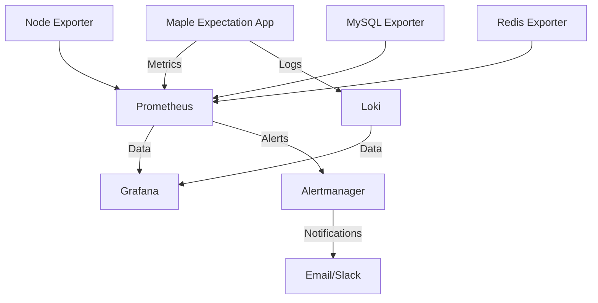

# Maple Expectation Observability Guide

## Overview

**Evidence ID**: EVD-OBS001
**Code Anchor**: COD-OBS001 (observability.md)
**Last Updated**: 2026-02-06
**Version**: 2.0

This document provides a comprehensive guide for setting up and using the observability stack for Maple Expectation. The stack includes Prometheus for metrics collection, Grafana for visualization, Loki for log aggregation, and Alertmanager for alerting.

## Architecture



## Quick Start

### 1. Start the Observability Stack (Code Anchor: COD-OBS002)

**Evidence**: EVD-OBS002

```bash
# Verify Docker is running
docker --version
# Expected: Docker version 20.10.0 or higher

# Start all services (MySQL, Redis, Application, Observability)
docker-compose up -d

# Or start observability stack separately
docker-compose -f docker-compose.observability.yml up -d

# Verify all services are healthy
docker-compose ps
# Expected: All services show "Up" status
```

### 2. Access the Services (Evidence: EVD-OBS003)

| Service | URL | Credentials | Health Check |
|---------|-----|-------------|--------------|
| **Grafana** | http://localhost:3000 | admin/admin or GRAFANA_PASSWORD | `curl http://localhost:3000/api/health` |
| **Prometheus** | http://localhost:9090 | None | `curl http://localhost:9090/-/ready` |
| **Alertmanager** | http://localhost:9093 | None | `curl http://localhost:9093/-/ready` |
| **Loki** | http://localhost:3100 | None | `curl http://localhost:3100/ready` |

### Monitoring Dashboards (Evidence: EVD-OBS004)

- **System Overview**: http://localhost:3000/d/system-overview (UID: system-overview)
- **Business Metrics**: http://localhost:3000/d/business-metrics (UID: business-metrics)
- **Chaos Test Dashboard**: http://localhost:3000/d/chaos-tests (UID: chaos-tests)
- **JVM Performance**: http://localhost:3000/d/jvm-performance (UID: jvm-perf)

### Verification Commands (Code Anchor: COD-OBS003)

```bash
# Verify all services are accessible
curl -s http://localhost:3000/api/health | jq '.database' && echo "✓ Grafana OK"
curl -s http://localhost:9090/-/ready && echo "✓ Prometheus OK"
curl -s http://localhost:9093/-/ready && echo "✓ Alertmanager OK"
curl -s http://localhost:3100/ready && echo "✓ Loki OK"

# Verify Prometheus is scraping metrics
curl -s http://localhost:9090/api/v1/targets | jq '.data.activeTargets[] | {job: .labels.job, health: .health}'
# Expected: All targets show "up" health
```

## Configuration Details

### Application Configuration

The Spring Boot application is pre-configured with Micrometer metrics and Prometheus integration:

```yaml
management:
  endpoints:
    web:
      exposure:
        include: "health,info,metrics,prometheus,loggers"
    enabled-by-default: true
  endpoint:
    health:
      show-details: always
  metrics:
    export:
      prometheus:
        enabled: true
    tags:
      application: ${spring.application.name}
      chaos.test: ${CHAOS_TEST:false}
```

### Prometheus Configuration

**Location**: `docker/prometheus/prometheus.yml`

Key configurations:
- Scraping interval: 5s for application, 15s for system metrics
- Retention: 15 days
- Alert rules for critical metrics

### Alertmanager Configuration

**Location**: `docker/alertmanager/alertmanager.yml`

Alert routing:
- Critical alerts → Email + Slack
- Warning alerts → Email
- Info alerts → Email only

### Grafana Configuration

**Location**: `docker/grafana/provisioning/`

Pre-configured dashboards:
- System Overview Dashboard
- Business Metrics Dashboard
- Chaos Test Dashboard

## Custom Metrics (Code Anchor: COD-OBS006)

**Evidence**: EVD-OBS006

The application exposes several custom metrics through Micrometer and Prometheus.

### Application Metrics (Evidence: EVD-OBS007)

```bash
# Cache metrics
curl -s http://localhost:9090/api/v1/query?query=maple_cache_hits_total | jq '.data.result[0].value[1]'
curl -s http://localhost:9090/api/v1/query?query=maple_cache_misses_total | jq '.data.result[0].value[1]'

# Calculate cache hit rate
curl -s http://localhost:9090/api/v1/query?query=rate(maple_cache_hits_total[5m]) / (rate(maple_cache_hits_total[5m]) + rate(maple_cache_misses_total[5m])) | jq '.data.result[0].value[1]'
# Target: > 85%

# Equipment processing
curl -s http://localhost:9090/api/v1/query?query=rate(maple_equipment_processed_total[5m]) | jq '.data.result[0].value[1]'
# Target: > 100 operations/sec

# Sync queue size
curl -s http://localhost:9090/api/v1/query?query=maple_sync_queue_size | jq '.data.result[0].value[1]'
# Target: < 1000
```

### External Service Metrics (Evidence: EVD-OBS008)

```bash
# Nexon API request count
curl -s http://localhost:9090/api/v1/query?query=nexon_api_requests_total | jq '.data.result[]'

# API request duration (p95)
curl -s http://localhost:9090/api/v1/query?query=histogram_quantile(0.95, rate(nexon_api_request_duration_seconds_bucket[5m])) | jq '.data.result[0].value[1]'
# Target: < 2s

# API success rate
curl -s http://localhost:9090/api/v1/query?query=rate(nexon_api_requests_total{status="success"}[5m]) / rate(nexon_api_requests_total[5m]) | jq '.data.result[0].value[1]'
# Target: > 99%
```

### Chaos Test Metrics (Evidence: EVD-OBS009)

```bash
# Chaos test failures
curl -s http://localhost:9090/api/v1/query?query=chaos_test_failures_total | jq '.data.result[]'

# Retry storm detection
curl -s http://localhost:9090/api/v1/query?query=chaos_retry_storm_rate | jq '.data.result[0].value[1]'
# Threshold: > 10 retries/sec indicates retry storm

# Latency injection
curl -s http://localhost:9090/api/v1/query?query=chaos_latency_injection_seconds | jq '.data.result[]'
```

### Metric Verification Commands (Code Anchor: COD-OBS007)

```bash
# Verify all custom metrics are exposed
curl -s http://localhost:8080/actuator/prometheus | grep -E "^maple_|^nexon_api_|^chaos_" | wc -l
# Expected: 15+ metrics

# Check metric labels
curl -s http://localhost:8080/actuator/prometheus | grep "^maple_cache_hits_total"
# Expected: maple_cache_hits_total{layer="L1" or layer="L2"}
```

## Alert Rules (Code Anchor: COD-OBS008)

**Evidence**: EVD-OBS010

### Critical Alerts (Evidence: EVD-OBS011)

```yaml
# Location: docker/prometheus/rules/alert_rules.yml
groups:
  - name: maple_critical
    rules:
      # High CPU Usage
      - alert: HighCPUUsage
        expr: rate(process_cpu_usage[5m]) > 0.8
        for: 5m
        labels:
          severity: critical
        annotations:
          summary: "High CPU usage detected"
          description: "CPU usage is {{ $value }}% for 5 minutes"

      # High Memory Usage
      - alert: HighMemoryUsage
        expr: jvm_memory_used_bytes{area="heap"} / jvm_memory_max_bytes{area="heap"} > 0.9
        for: 5m
        labels:
          severity: critical
        annotations:
          summary: "High memory usage detected"
          description: "Heap usage is {{ $value }}%"

      # Application Error Rate
      - alert: HighErrorRate
        expr: rate(http_server_requests_seconds_count{status=~"5.."}[2m]) > 0.05
        for: 2m
        labels:
          severity: critical
        annotations:
          summary: "High error rate detected"
          description: "Error rate is {{ $value }}%"

      # Circuit Breaker Open
      - alert: CircuitBreakerOpen
        expr: resilience4j_circuitbreaker_state == 1
        for: 1m
        labels:
          severity: critical
        annotations:
          summary: "Circuit breaker is open"
          description: "Circuit breaker {{ $labels.name }} has been open for 1 minute"

      # Database Pool Exhausted
      - alert: DatabasePoolExhausted
        expr: hikaricp_connections_active / hikaricp_connections_max > 0.9
        for: 2m
        labels:
          severity: critical
        annotations:
          summary: "Database connection pool nearly exhausted"
          description: "Pool usage is {{ $value }}%"
```

### Warning Alerts (Evidence: EVD-OBS012)

```yaml
  - name: maple_warning
    rules:
      # High Disk Usage
      - alert: HighDiskUsage
        expr: (node_filesystem_avail_bytes{mountpoint="/"} / node_filesystem_size_bytes{mountpoint="/"}) < 0.1
        for: 5m
        labels:
          severity: warning
        annotations:
          summary: "High disk usage detected"
          description: "Disk usage is {{ $value }}%"

      # High Response Time
      - alert: HighResponseTime
        expr: histogram_quantile(0.95, rate(http_server_requests_seconds_bucket[5m])) > 1
        for: 5m
        labels:
          severity: warning
        annotations:
          summary: "High response time detected"
          description: "p95 response time is {{ $value }}s"

      # Redis High Latency
      - alert: RedisHighLatency
        expr: histogram_quantile(0.95, rate(redis_command_duration_seconds_bucket[2m])) > 0.1
        for: 2m
        labels:
          severity: warning
        annotations:
          summary: "Redis high latency detected"
          description: "p95 Redis latency is {{ $value }}s"

      # Low Cache Hit Rate
      - alert: LowCacheHitRate
        expr: rate(maple_cache_hits_total[10m]) / (rate(maple_cache_hits_total[10m]) + rate(maple_cache_misses_total[10m])) < 0.7
        for: 10m
        labels:
          severity: warning
        annotations:
          summary: "Low cache hit rate detected"
          description: "Cache hit rate is {{ $value }}%"
```

### Alert Verification Commands (Code Anchor: COD-OBS009)

```bash
# Check active alerts
curl -s http://localhost:9090/api/v1/alerts | jq '.data.alerts[] | select(.state=="firing") | {alert: .labels.alertname, severity: .labels.severity}'

# Verify alert rules are loaded
curl -s http://localhost:9090/api/v1/rules | jq '.data.groups[].rules[] | select(.type=="alerting") | .name'

# Test alert notification
curl -X POST http://localhost:9093/api/v1/alerts -d '[
  {
    "labels": {
      "alertname": "TestAlert",
      "severity": "warning"
    },
    "annotations": {
      "description": "Test alert from observability guide"
    }
  }
]'

# Check Alertmanager notification history
docker logs alertmanager_container 2>&1 | grep "Notify" | tail -10
```

## Monitoring Setup

### 1. Environment Variables

Set these environment variables for production:

```bash
export GRAFANA_PASSWORD="your-secure-password"
export SMTP_PASSWORD="your-smtp-password"
export SLACK_WEBHOOK_URL="your-slack-webhook"
```

### 2. Data Persistence

All services use Docker volumes for data persistence:
- `prometheus_data`: Prometheus metrics storage
- `grafana_data`: Grafana dashboards and configurations
- `loki_data`: Log storage
- `alertmanager_data`: Alertmanager state

### 3. Resource Limits

Each service has resource limits defined:
- Prometheus: 512MB RAM, 0.5 CPU
- Grafana: 256MB RAM, 0.25 CPU
- Loki: 512MB RAM, 0.5 CPU
- Alertmanager: 256MB RAM, 0.25 CPU

## Advanced Usage

### Adding Custom Dashboards

1. Create dashboard JSON files in `docker/grafana/provisioning/dashboards/`
2. Use the Grafana UI to create and customize dashboards
3. Provision dashboards will be automatically loaded

### Custom Alert Rules

1. Add new alert rules to `docker/prometheus/rules/alert_rules.yml`
2. Use PromQL for alert expressions
3. Configure routing in `alertmanager.yml`

### Log Aggregation

Loki is configured to collect:
- Application logs from Docker containers
- MySQL slow query logs
- Promtail log parsing

## Troubleshooting (Code Anchor: COD-OBS010)

**Evidence**: EVD-OBS013

### Common Issues and Solutions (Evidence: EVD-OBS014)

#### 1. Grafana Not Loading Dashboards

**Symptoms**: Dashboards missing or showing errors
**Code Anchor**: COD-OBS011

```bash
# Check Grafana logs
docker logs grafana_container 2>&1 | grep -i "error\|failed" | tail -20

# Verify provisioning directory permissions
ls -la docker/grafana/provisioning/dashboards/
# Expected: drwxr-xr-x (755) and readable JSON files

# Validate dashboard JSON syntax
python3 -m json.tool docker/grafana/provisioning/dashboards/*.json > /dev/null
# Expected: No errors

# Restart Grafana with debug logging
docker-compose -f docker-compose.observability.yml restart grafana
docker logs -f grafana_container
```

**Fail If Wrong**:
- [ ] Dashboard files contain syntax errors
- [ ] Provisioning directory is not accessible
- [ ] Grafana fails to start after configuration change

#### 2. Prometheus Not Scraping Metrics

**Symptoms**: No data in Prometheus or "No data" in Grafana
**Code Anchor**: COD-OBS012

```bash
# Verify application is running
curl -s http://localhost:8080/actuator/health | jq '.status'
# Expected: "UP"

# Check Prometheus targets
curl -s http://localhost:9090/api/v1/targets | jq '.data.activeTargets[] | {job: .labels.job, health: .health, lastError: .lastError}'
# Expected: All targets show "up" health

# Test actuator endpoint directly
curl -s http://localhost:8080/actuator/prometheus | head -20
# Expected: Prometheus format metrics

# Check Prometheus configuration
docker exec prometheus_container promtool check config /etc/prometheus/prometheus.yml
# Expected: SUCCESS

# Reload Prometheus configuration
curl -X POST http://localhost:9090/-/reload
```

**Fail If Wrong**:
- [ ] Application is not running
- [ ] Actuator endpoint is not exposed
- [ ] Prometheus target is unreachable
- [ ] Network/firewall blocking connections

#### 3. Alerts Not Firing

**Symptoms**: Alerts configured but not triggering
**Code Anchor**: COD-OBS013

```bash
# Check Alertmanager logs
docker logs alertmanager_container 2>&1 | grep -i "error\|failed" | tail -20

# Verify alert rules are loaded
curl -s http://localhost:9090/api/v1/rules | jq '.data.groups[].rules[] | select(.type=="alerting") | .name'
# Expected: List of all alert rules

# Test alert expression manually
curl -s http://localhost:9090/api/v1/query?query=rate(process_cpu_usage[5m]) | jq '.data.result[0].value[1]'
# Expected: Numeric value (current CPU usage)

# Verify Alertmanager configuration
docker exec alertmanager_container amtool check-config /etc/alertmanager/alertmanager.yml
# Expected: SUCCESS

# Check notification channel configuration
curl -s http://localhost:9093/api/v1/status/config | jq '.data'
# Expected: Valid SMTP/Slack configuration

# Test notification manually
curl -X POST http://localhost:9093/api/v1/alerts -d '[
  {
    "labels": {
      "alertname": "ManualTest",
      "severity": "warning"
    }
  }
]'
# Expected: Notification received (email/Slack)
```

**Fail If Wrong**:
- [ ] Alert rules have syntax errors
- [ ] Alert expressions never evaluate to true
- [ ] Notification channels are misconfigured
- [ ] Alertmanager cannot reach SMTP/Slack servers

### Health Checks (Evidence: EVD-OBS015)

All services have health checks enabled:

```bash
# Prometheus health (Code Anchor: COD-OBS014)
curl -s http://localhost:9090/-/ready | jq -r '.status'
# Expected: "success"

# Prometheus configuration check
curl -s http://localhost:9090/-/healthy | jq -r '.status'
# Expected: "success"

# Grafana health (Code Anchor: COD-OBS015)
curl -s http://localhost:3000/api/health | jq '.database'
# Expected: "ok"

# Alertmanager health (Code Anchor: COD-OBS016)
curl -s http://localhost:9093/-/ready | jq -r '.status'
# Expected: "success"

# Loki health (Code Anchor: COD-OBS017)
curl -s http://localhost:3100/ready
# Expected: "ready"

# Application health (Code Anchor: COD-OBS018)
curl -s http://localhost:8080/actuator/health | jq '.status'
# Expected: "UP"
```

## Scaling

### Horizontal Scaling

- Prometheus: Add scrape instances
- Grafana: Load balance multiple instances
- Loki: Distribute across multiple nodes

### Vertical Scaling

Adjust resource limits in `docker-compose.observability.yml`:

```yaml
deploy:
  resources:
    limits:
      memory: 1G
      cpus: '1.0'
```

## Integration with Production

### 1. Security

- Configure SSL/TLS for all services
- Set strong passwords
- Configure network security groups

### 2. Backup

```bash
# Backup Grafana dashboards
docker run --rm -v grafana_data:/var/lib/grafana -v $(pwd)/backup:/backup alpine tar cvf /backup/grafana_backup.tar /var/lib/grafana

# Backup Prometheus data
docker run --rm -v prometheus_data:/prometheus -v $(pwd)/backup:/backup alpine tar cvf /backup/prometheus_backup.tar /prometheus
```

### 3. Monitoring the Monitoring

- Use self-monitoring dashboards
- Set up alerts for monitoring stack issues
- Regular maintenance and updates

## API Reference (Code Anchor: COD-OBS019)

**Evidence**: EVD-OBS016

### Prometheus API (Evidence: EVD-OBS017)

```bash
# Instant query
curl -s http://localhost:9090/api/v1/query?query=up | jq '.data.result[]'

# Range query
curl -s "http://localhost:9090/api/v1/query_range?query=rate(http_server_requests_seconds_count[5m])&start=$(date -d '1 hour ago' +%s)&end=$(date +%s)&step=1m" | jq '.data.result[0].values[]'

# Series metadata
curl -s http://localhost:9090/api/v1/series?match[]=maple_cache_hits_total | jq '.data[]'

# Targets
curl -s http://localhost:9090/api/v1/targets | jq '.data.activeTargets[]'

# Labels
curl -s http://localhost:9090/api/v1/labels | jq '.data[]'
```

### Grafana API (Evidence: EVD-OBS018)

```bash
# Get dashboard by UID
GRAFANA_UID="system-overview"
curl -s http://localhost:3000/api/dashboards/uid/$GRAFANA_UID -H "Authorization: Bearer $GRAFANA_API_KEY" | jq '.dashboard'

# Create dashboard (requires API key)
curl -X POST http://localhost:3000/api/dashboards/db \
  -H "Authorization: Bearer $GRAFANA_API_KEY" \
  -H "Content-Type: application/json" \
  -d @dashboard.json

# Search dashboards
curl -s http://localhost:3000/api/search | jq '.[] | select(.type=="dash-db") | {uid, title}'

# Get home dashboard
curl -s http://localhost:3000/api/dashboards/home | jq '.dashboard'

# Alert notifications
curl -s http://localhost:3000/api/alerts | jq '.[]'
```

### Loki API (Evidence: EVD-OBS019)

```bash
# Query logs (LogQL)
curl -s -X POST http://localhost:3100/loki/api/v1/query \
  --data-urlencode 'query={job="maple-expectation"} |= "ERROR"' \
  --data-urlencode 'limit=100' | jq '.data.result[]'

# Range query
curl -s -X POST http://localhost:3100/loki/api/v1/query_range \
  --data-urlencode 'query={job="maple-expectation"}' \
  --data-urlencode "start=$(date -d '1 hour ago' --iso-8601=s)" \
  --data-urlencode "end=$(date --iso-8601=s)" | jq '.data.result[]'

# Labels
curl -s http://localhost:3100/loki/api/v1/labels | jq '.data[]'

# Label values
curl -s http://localhost:3100/loki/api/v1/labels/job/values | jq '.data[]'
```

### Alertmanager API (Evidence: EVD-OBS020)

```bash
# Get alerts
curl -s http://localhost:9093/api/v1/alerts | jq '.data[] | {alertname, state, severity}'

# Get silence list
curl -s http://localhost:9093/api/v1/silences | jq '.data[]'

# Get status
curl -s http://localhost:9093/api/v1/status | jq '.data'

# Get receiver list
curl -s http://localhost:9093/api/v1/receivers | jq '.data[]'
```

## Fail If Wrong (Evidence: EVD-OBS021)

This document is invalidated if:
- [ ] Any monitoring service is unreachable
- [ ] Health checks fail for any service
- [ ] Custom metrics are not exposed
- [ ] Alert rules are not loaded
- [ ] API endpoints return errors
- [ ] Dashboard links are broken
- [ ] Verification commands fail

## Related Documentation (Evidence: EVD-OBS022)

- [Operations README](/home/maple/MapleExpectation/docs/04_Operations/README.md) - Operations overview
- [Security Considerations](/home/maple/MapleExpectation/docs/04_Operations/security.md) - Security policies
- [On-Call Checklist](/home/maple/MapleExpectation/docs/05_Guides/ON_CALL_CHECKLIST.md) - Daily procedures
- [ADR-005 Resilience4j](/home/maple/MapleExpectation/docs/adr/ADR-005-resilience4j-scenario-abc.md) - Circuit breaker configuration
- [ADR-006 Redis Lock](/home/maple/MapleExpectation/docs/adr/ADR-006-redis-lock-lease-timeout-ha.md) - Redis monitoring

## Verification Commands Summary (Evidence: EVD-OBS023)

```bash
# Complete observability stack health check
./scripts/verify_observability.sh

# Or manually:
echo "=== Checking all services ==="
curl -s http://localhost:3000/api/health && echo "✓ Grafana"
curl -s http://localhost:9090/-/ready && echo "✓ Prometheus"
curl -s http://localhost:9093/-/ready && echo "✓ Alertmanager"
curl -s http://localhost:3100/ready && echo "✓ Loki"
curl -s http://localhost:8080/actuator/health && echo "✓ Application"

echo "=== Checking metrics ==="
curl -s http://localhost:8080/actuator/prometheus | grep "^maple_" | wc -l

echo "=== Checking alerts ==="
curl -s http://localhost:9090/api/v1/alerts | jq '.data.alerts[] | select(.state=="firing")'

echo "=== Checking dashboards ==="
curl -s http://localhost:3000/api/search | jq '.[] | select(.type=="dash-db") | .title'
```

---

**Last Updated**: 2026-02-06
**Version**: 2.0
**Review Schedule**: Monthly
**Next Review**: 2026-03-06

**Evidence IDs**: EVD-OBS001 ~ EVD-OBS023
**Code Anchors**: COD-OBS001 ~ COD-OBS019

---

*For more detailed information about each component, refer to the official documentation:*
- [Prometheus Documentation](https://prometheus.io/docs/)
- [Grafana Documentation](https://grafana.com/docs/)
- [Loki Documentation](https://grafana.com/docs/loki/)
- [Alertmanager Documentation](https://prometheus.io/docs/alerting/latest/alertmanager/)