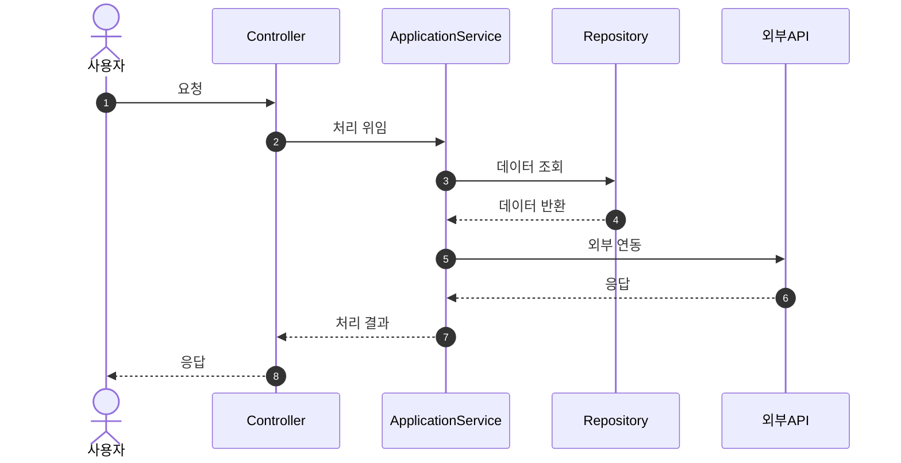

# Sequence Diagrams

이 디렉토리는 MapleExpectation 프로젝트의 주요 비즈니스 흐름을 시퀀스 다이어그램으로 문서화합니다.

## 다이어그램 목록

| 파일 | 설명 | 관련 이슈 |
|------|------|----------|
| [character-lookup-sequence.md](character-lookup-sequence.md) | 캐릭터 조회 비동기 흐름 (Phase 2/3/4) | Issue #169, #207 |
| [authentication-sequence.md](authentication-sequence.md) | 로그인/토큰갱신/로그아웃 흐름 | Issue #279 |

## 작성 가이드

### Mermaid 시퀀스 다이어그램 템플릿

### 참여자 명명 규칙

| 유형 | 접두사/접미사 | 예시 |
|------|---------------|------|
| Controller | `~Controller` | `GameCharacterController` |
| Service | `~Service` | `EquipmentService` |
| Repository | `~Repository` | `CharacterRepository` |
| External API | `~Client` | `NexonApiClient` |
| Database | `DB` | `MySQL`, `Redis` |

## 관련 문서

- [CLAUDE.md](../../CLAUDE.md) - 프로젝트 규칙
- [architecture.md](../00_Start_Here/architecture.md) - 아키텍처 개요
