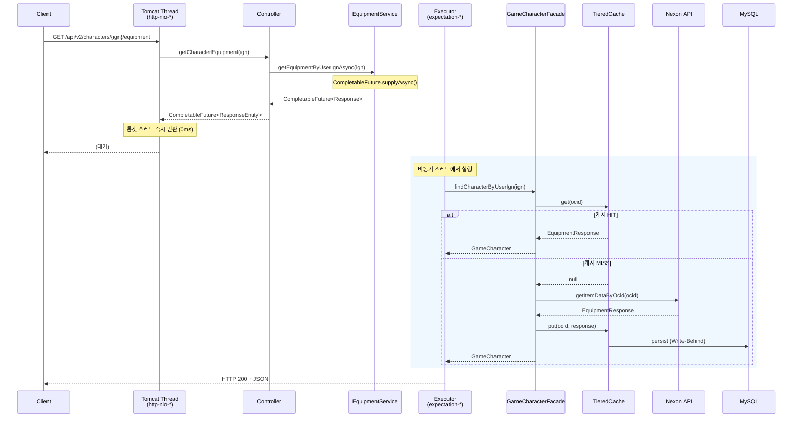
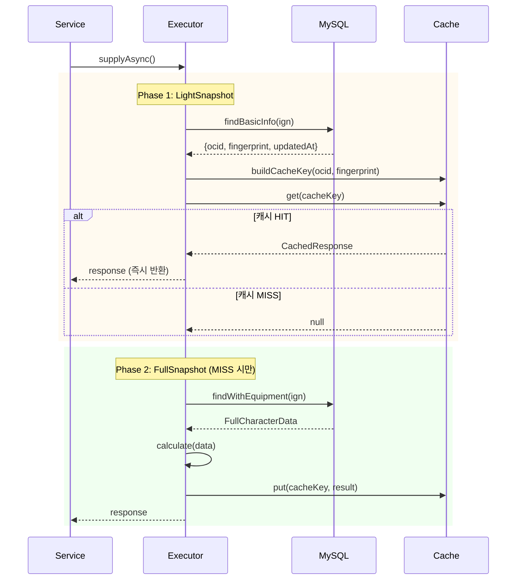
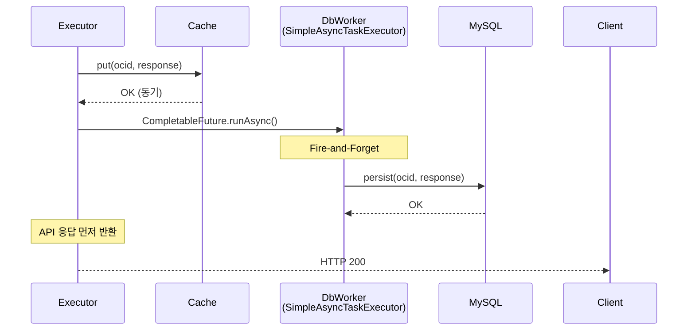

# Async Pipeline 시퀀스 다이어그램

> **Last Updated:** 2026-02-05
> **Code Version:** MapleExpectation v1.x
> **Diagram Version:** 1.0
> **Related Issue:** #118

## 개요

톰캣 스레드 즉시 반환(0ms 목표)으로 고처리량 API를 구현합니다. Issue #118에서 `.join()` 제거 및 완전 비동기화 적용.

## Terminology

| 용어 | 정의 |
|------|------|
| **Tomcat Thread** | http-nio-* 요청 처리 스레드 |
| **Two-Phase Snapshot** | Light → Full 단계적 데이터 로드 |
| **Write-Behind** | 응답 후 비동기 DB 저장 |
| **Single-flight** | 동시 요청 1회만 계산 |

## 전체 파이프라인 시퀀스



## 톰캣 스레드 즉시 반환

```java
// Controller - 0ms 반환
@GetMapping("/{userIgn}/equipment")
public CompletableFuture<ResponseEntity<EquipmentResponse>> getCharacterEquipment(
        @PathVariable String userIgn) {

    return equipmentService.getEquipmentByUserIgnAsync(userIgn)
            .thenApply(ResponseEntity::ok);  // Non-blocking
}
```

**trace.log 증거:**
```
[http-nio-8080-exec-8] --> [START] GameCharacterControllerV2.getCharacterEquipment
[http-nio-8080-exec-8] <-- [END] GameCharacterControllerV2.getCharacterEquipment (0 ms)
```

## Two-Phase Snapshot 패턴



**성능 효과:**
- 캐시 HIT 시 FullSnapshot DB 조회 스킵
- 1차: 617ms → 2차: **1ms**

## Write-Behind 패턴



## 스레드 풀 분리

| Thread Pool | 역할 | 설정 |
|-------------|------|------|
| `http-nio-*` | 톰캣 요청 | 즉시 반환 (0ms 목표) |
| `expectation-*` | 계산 전용 | CPU 코어 수 기반 |
| `SimpleAsyncTaskExecutor-*` | Fire-and-Forget | @Async 비동기 |

```java
@Bean("expectationComputeExecutor")
public Executor expectationComputeExecutor() {
    ThreadPoolTaskExecutor executor = new ThreadPoolTaskExecutor();
    executor.setCorePoolSize(Runtime.getRuntime().availableProcessors());
    executor.setMaxPoolSize(Runtime.getRuntime().availableProcessors() * 2);
    executor.setQueueCapacity(100);
    executor.setRejectedExecutionHandler(CUSTOM_ABORT_POLICY);
    executor.setThreadNamePrefix("expectation-");
    return executor;
}
```

## .join() 제거 규칙 (Issue #118)

```java
// ❌ Bad - 호출 스레드 블로킹
return service.calculateAsync(userIgn).join();

// ✅ Good - 체이닝으로 논블로킹 유지
return service.calculateAsync(userIgn)
        .thenApply(this::postProcess)
        .orTimeout(30, TimeUnit.SECONDS)
        .exceptionally(this::handleException);
```

## E2E 테스트 결과

| 시나리오 | 결과 | 증거 |
|---------|------|------|
| LE-S01: execute 정상 반환 | PASS | 톰캣 스레드 **0ms** 반환 |
| AO-G01: Two-Phase Snapshot | PASS | 1차: 617ms → 2차: **1ms** |
| Write-Behind | PASS | `EquipmentDbWorker.persist` (253ms, 비동기) |

## 관련 파일

- `src/main/java/maple/expectation/controller/GameCharacterControllerV2.java`
- `src/main/java/maple/expectation/service/v2/EquipmentService.java`
- `src/main/java/maple/expectation/config/ExecutorConfig.java`

## Fail If Wrong

이 다이어그램이 부정확한 경우:
- **톰캣 스레드 반환하지 않음**: CompletableFuture 반환 확인
- **.join() 사용으로 블로킹 발생**: 비동기 파이프라인 확인
- **Write-Behind 누락**: CompletableFuture.runAsync 확인

### Verification Commands
```bash
# 톰캣 스레드 반환 확인
grep "CompletableFuture.*ResponseEntity" src/main/java/maple/expectation/controller/*Controller.java

# .join() 사용 확인 (금지)
grep "\.join()" src/main/java/maple/expectation/service/v2/EquipmentService.java

# Write-Behind 확인
grep "CompletableFuture.runAsync" src/main/java/maple/expectation/service/v2/
```
