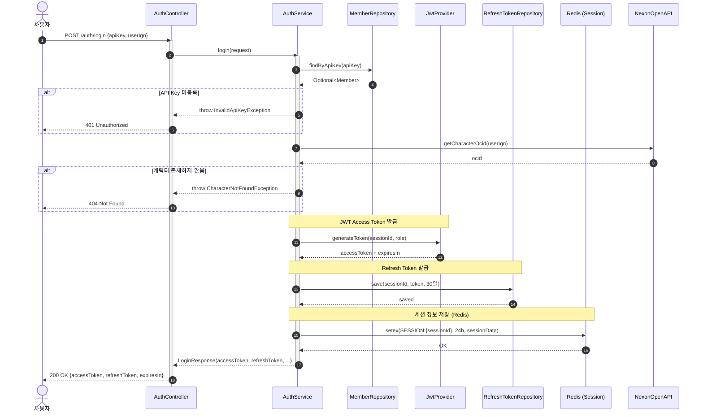
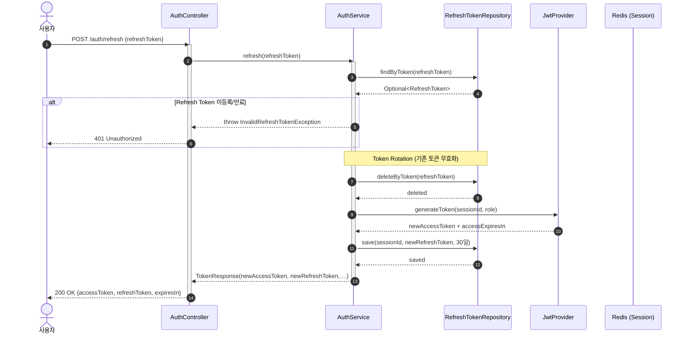
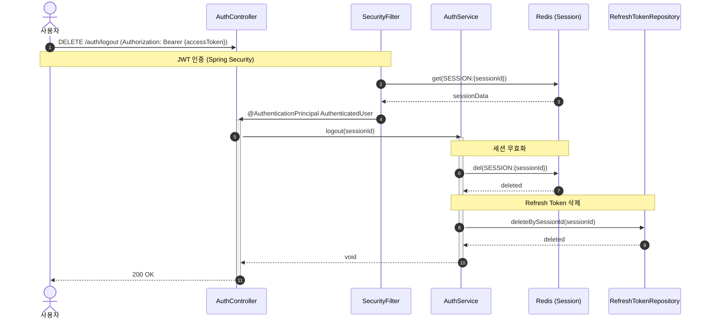

# Authentication Sequence

## 개요

사용자가 API Key와 IGN으로 인증하여 JWT Access Token과 Refresh Token을 발급받는 시퀀스입니다.

## 비즈니스 흐름

1. **로그인**: API Key 인증 → JWT + Refresh Token 발급
2. **토큰 갱신**: Refresh Token → 새 Access Token + Refresh Token 발급 (Token Rotation)
3. **로그아웃**: 세션 무효화 + Refresh Token 삭제

## 시퀀스 다이어그램

### 1. Login Flow



### 2. Token Refresh Flow (Issue #279)



### 3. Logout Flow



## 관련 컴포넌트

| 컴포넌트 | 경로 | 역할 |
|---------|------|------|
| AuthController | `controller/AuthController.java` | 인증 API 엔드포인트 |
| AuthService | `service/v2/auth/AuthService.java` | 인증 비즈니스 로직 |
| JwtProvider | `infrastructure/security/JwtProvider.java` | JWT 생성/검증 |
| RefreshTokenRepository | `domain/redis/RefreshTokenRepository.java` | Refresh Token 저장소 |
| MemberRepository | `domain/member/MemberRepository.java` | 회원 정보 저장소 |

## 핵심 로직

### 1. 로그인 인증 흐름
```java
// 1. API Key 검증
Member member = memberRepository.findByApiKey(apiKey)
    .orElseThrow(() -> new InvalidApiKeyException(apiKey));

// 2. 캐릭터 존재 확인 (Nexon API)
String ocid = nexonApiClient.getCharacterOcid(userIgn);

// 3. JWT + Refresh Token 발급
String accessToken = jwtProvider.generateToken(sessionId, role);
refreshTokenRepository.save(sessionId, refreshToken, 30 days);
```

### 2. Token Rotation (Issue #279)
```java
// 기존 Refresh Token 무효화
refreshTokenRepository.deleteByToken(oldRefreshToken);

// 새 토큰 쌍 발급
String newAccessToken = jwtProvider.generateToken(sessionId, role);
String newRefreshToken = UUID.randomUUID().toString();
refreshTokenRepository.save(sessionId, newRefreshToken, 30 days);
```

### 3. 세션 무효화
```java
// Redis 세션 삭제
redisTemplate.delete("SESSION:" + sessionId);

// Refresh Token 삭제
refreshTokenRepository.deleteBySessionId(sessionId);
```

## 타임아웃 및 예외 처리

| 시나리오 | 예외 타입 | HTTP Status |
|---------|-----------|-------------|
| API Key 미등록 | `InvalidApiKeyException` | 401 |
| 캐릭터 존재하지 않음 | `CharacterNotFoundException` | 404 |
| Refresh Token 미등록/만료 | `InvalidRefreshTokenException` | 401 |
| 토큰 위변조 | `JwtValidationException` | 401 |

## 관련 이슈

- Issue #279: Refresh Token Rotation 구현
- CLAUDE.md Section 18: Spring Security 6.x Filter Best Practice
