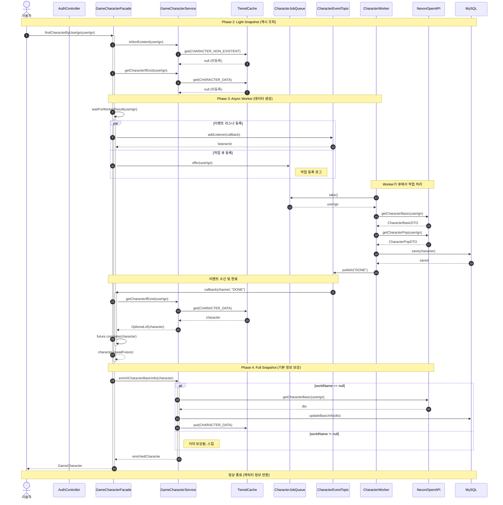

# Character Lookup Sequence

## 개요

사용자가 캐릭터 이름(IGN)으로 캐릭터 정보를 조회하는 비동기 시퀀스입니다.

## 비즈니스 흐름

1. **Phase 2 (Light Snapshot)**: Redis/DB에서 캐릭터 조회
2. **Phase 3 (Async Worker)**: 데이터가 없으면 큐에 작업 등록 및 이벤트 대기
3. **Phase 4 (Full Snapshot)**: 기본 정보 보강 (worldName이 null이면 API 호출)

## 시퀀스 다이어그램



## 관련 컴포넌트

| 컴포넌트 | 경로 | 역할 |
|---------|------|------|
| GameCharacterFacade | `service/v2/facade/GameCharacterFacade.java` | 캐릭터 조회 Facade |
| GameCharacterService | `service/v2/GameCharacterService.java` | 비즈니스 로직 |
| CharacterWorker | `service/v2/worker/CharacterWorker.java` | 비동기 작업 처리 |
| CharacterJobQueue | `core/port/out/MessageQueue.java` | 작업 큐 |
| CharacterEventTopic | `core/port/out/MessageTopic.java` | 이벤트 버스 |

## 핵심 로직

### 1. 캐시 조회 패스
```java
// Cache Hit → 즉시 반환
gameCharacterService.getCharacterIfExist(userIgn)
    .ifPresent(character -> return character);
```

### 2. 비동기 작업 대기 패스
```java
// Cache Miss → 큐 등록 + 이벤트 대기
performQueueOffer(userIgn);
awaitFuture(future, userIgn, context);
```

### 3. 이벤트 기반 완료 통지
```java
characterEventTopic.addListener(String.class, (channel, msg) -> {
    if ("DONE".equals(msg)) {
        future.complete(character);
    }
});
```

## 타임아웃 및 예외 처리

| 시나리오 | 예외 타입 | HTTP Status |
|---------|-----------|-------------|
| 캐릭터 존재하지 않음 | `CharacterNotFoundException` | 404 |
| 작업 대기 타임아웃 (10초) | `CompletionException(TimeoutException)` | 503 + Retry-After |
| 외부 API 실패 | `InternalSystemException` | 500 |

## 관련 이슈

- Issue #169: TimeoutException 전파 수정
- Issue #207: 경량 테스트 강제 규칙
