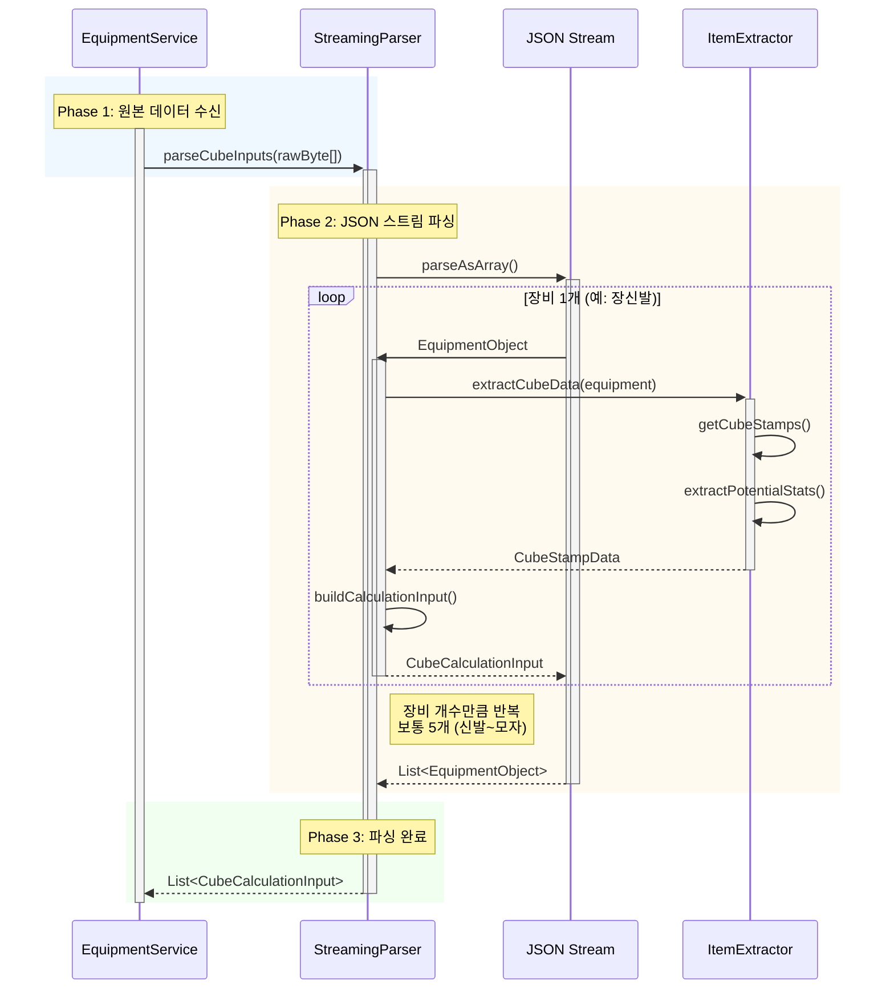
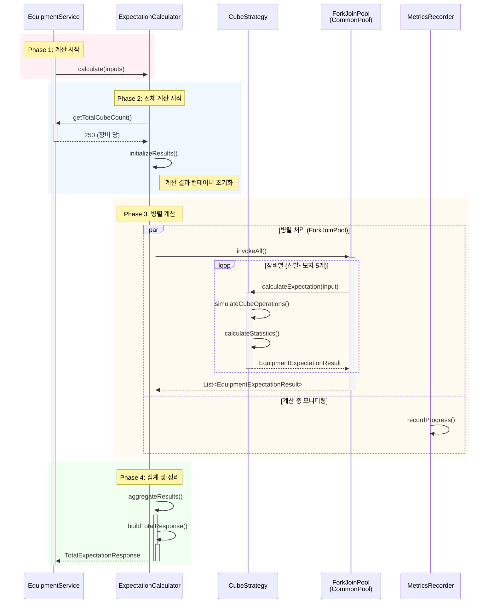
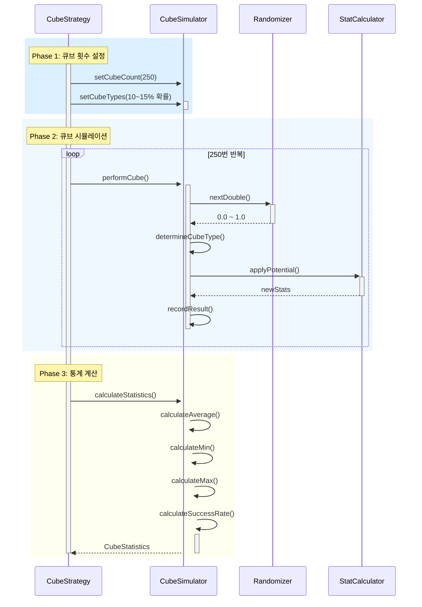

# Expectation Calculation Pipeline Sequence Diagram

> **Last Updated:** 2026-02-13
> **Code Version:** MapleExpectation v1.x
> **Diagram Version:** 1.0

## 개요

`GET /api/v3/characters/{userIgn}/expectation` API의 **계산 파이프라인** 흐름을 분석한 문서입니다. StreamingParser, ExpectationCalculator, 계산 로직에 집중합니다.

## 핵심 계산 아키텍처

| 패턴 | 설명 | 효과 |
|------|------|------|
| **StreamingParser** | JSON Stream 파싱 | 메모리 효율 |
| **Template Method** | 계산 로직 템플릿 | 확장성 |
| **Strategy Pattern** | 큐브별 계산 전략 | 유연성 |
| **Batch Processing** | 장비별 계산 병렬화 | 성능 최적화 |

---

## 계산 파이프라인 다이어그램

### 1. 데이터 파싱



### 2. 계산 실행



### 3. 큐브 시뮬레이션 상세



---

## 데이터 구조

### 1. 입력 데이터 구조

```yaml
CubeCalculationInput:
  equipmentId: String           # 장비 ID (e.g., "SHOES")
  cubeStamps: List[CubeStamp]   # 큐브 스탬프 목록
  cubeTypes: Map<String, Int>   # 큐브 종류별 비용
  potencyOptions: List[Potency] # 퍼텐셜 옵션

CubeStamp:
  cubeType: String              # 큐브 종류 (e.g., "miracle")
  status: String                # 상태 (e.g., "protected", "unprotected")
  potentialStats: List[Stat]    # 현재 퍼텐셜
```

### 2. 출력 데이터 구조

```yaml
TotalExpectationResponse:
  characterName: String
  totalExpectation: Double      # 전체 기대값
  equipmentResults: List[EquipmentResult]
  successRate: Double           # 성공률 (e.g., 50%)

EquipmentResult:
  equipmentId: String
  equipmentName: String
  expectation: Double           # 장비 기대값
  cubeCount: Int               # 소모 큐브 개수
  potencyDistribution: Map<String, Double> # 퍼텐셜 분포
```

---

## 계산 알고리즘

### 1. 기대값 계산 공식

```
기대값 = Σ (성공 확률 × 성공 시 스탯)
     + Σ (실패 확률 × 기존 스탯)

where:
  성공 확률 = 큐브 성공률 × 퍼텐셜 착률
  스탯 = 퍼텐셜별 스탯 × 개수
```

### 2. 큐브 성공률

| 큐브 종류 | 성공률 | 보존률 |
|----------|--------|--------|
| **Miracle Cube** | 10% | 100% |
| **Dark Cube** | 20% | 80% |
| **Hyper Cube** | 25% | 70% |
| **Chaos Cube** | 30% | 60% |

### 3. 퍼텐셜 착률

| 레벨 | 착률 | 설명 |
|------|------|------|
| **Tier 1 (15%)** | 100% | 최하위 퍼텐셜 |
| **Tier 2 (15%)** | 100% | 2번째 퍼텐셜 |
| **Tier 3 (70%)** | 30% | 3번째 퍼텐셜 |
| **Tier 4 (0%)** | 15% | 최상위 퍼텐셜 (착률 감소) |

---

## 성능 특성

| 구간 | 평균 응답시간 | 설명 |
|------|-------------|------|
| **데이터 파싱** | ~5ms | JSON 스트림 파싱 |
| **단일 장비 계산** | ~1ms | 250회 큐브 시뮬레이션 |
| **5개 장비 계산** | ~5ms | 병렬 처리 |
| **데이터 집계** | ~1ms | 통계 계산 |
| **계산 총시간** | ~6ms | CPU Bound |

### 병렬 처리 전략

- **ForkJoinPool.commonPool**: 기본 병렬 스레드 (CPU 코어 수 기준)
- **Work Stealing**: 동적 작업 분배
- **Task Granularity**: 장비별 1개 Task

### 최적화 기법

1. **Early Termination**: 최대 큐브 개수 제한 (250개)
2. **Stat Caching**: 계산 중 스탯 변화량만 추적
3. **Random Optimization**: 난수 생성 최적화

---

## 모니터링 지표

```yaml
# 계산 관련 메트릭
calculation.time.per.equipment
calculation.time.total
calculation.success.rate
calculation.cube.count

# 파싱 관련 메트릭
parsing.time
parsing.memory.usage
parsing.equipment.count

# 병렬 처리 메트릭
calculation.parallelism
calculation.thread.pool.utilization
calculation.work stealing.count
```

---

## 예외 처리

| 예외 유형 | 발생 시점 | 처리 방식 |
|----------|----------|----------|
| **InvalidInputException** | 파싱 시 | 즉시 에러 응답 |
| **CalculationTimeoutException** | 계산 시 | 부분 결과 반환 |
| **SimulatorException** | 시뮬레이션 시 | 이전 유효한 결과 사용 |

---

## 참고

- **CLAUDE.md**: [계산 로직 가이드](../CLAUDE.md#6-design-patterns--structure)
- **docs/03_Technical_Guides/infrastructure.md**: 성능 최적화 가이드
- **Issue #172**: 큐브 시뮬레이션 성능 개선

## Evidence Links

- **ExpectationCalculator**: `src/main/java/maple/expectation/service/v2/calculator/ExpectationCalculator.java`
- **StreamingParser**: `src/main/java/maple/expectation/service/v2/parser/StreamingParser.java`
- **CubeStrategy**: `src/main/java/maple/expectation/service/v2/strategy/CubeStrategy.java`

## Fail If Wrong

이 다이어그램이 부정확한 경우:
- **계산 순서가 다름**: 실제 계산 흐름 확인
- **병렬 처리 미작동**: ForkJoinPool 사용 확인
- **파싱 로직 오류**: StreamingParser 구현체 확인

### Verification Commands
```bash
# 계산 파이프라인 확인
grep -A 10 "calculate\|parseCubeInputs" src/main/java/maple/expectation/service/v2/

# 병렬 처리 확인
grep -A 5 "ForkJoinPool\|parallel" src/main/java/maple/expectation/service/v2/

# 큐브 시뮬레이션 확인
grep -A 20 "simulateCube" src/main/java/maple/expectation/service/v2/
```