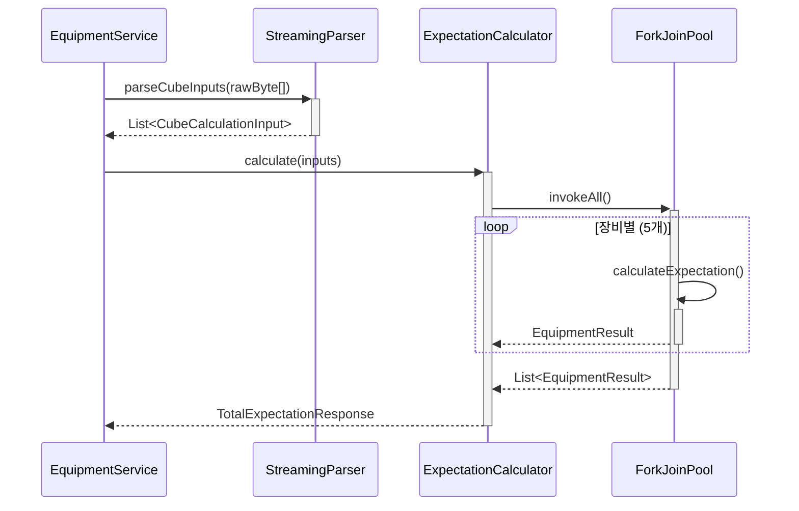
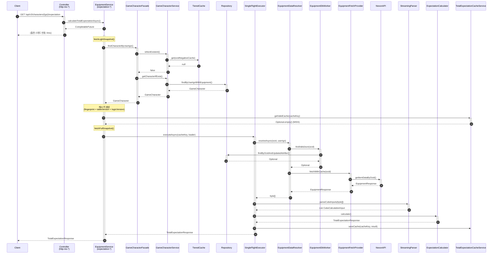

# Expectation API 데이터 흐름 분석

> **Last Updated:** 2026-02-13
> **Code Version:** MapleExpectation v1.x
> **Diagram Version:** 2.0 (Split into focused diagrams)

## 개요

`GET /api/v3/characters/{userIgn}/expectation` API의 전체 데이터 흐름을 분석한 문서입니다.
**참고**: 본 문서가 복잡성(14 participants, 34 messages)을 초과하여 3개의 집중적 다이어그램으로 분리되었습니다.

### 분리된 다이어그램

1. **[캐시 레이어 흐름](expectation-cache-sequence.md)**<br/>
   - TieredCache(L1/L2), Cache Key 생성, Single-Flight 패턴
   - 캐시 HIT/MISS 시나리오

2. **[외부 API 호출 흐름](expectation-api-sequence.md)**<br/>
   - Nexon API 호출, Circuit Breaker, Data Resolver
   - DB → API Fallback 전략

3. **[계산 파이프라인 흐름](expectation-calculation-sequence.md)**<br/>
   - StreamingParser, ExpectationCalculator
   - 큐브 시뮬레이션 및 집계

## Terminology

| 용어 | 정의 |
|------|------|
| **Light Snapshot** | 캐시 키 생성용 최소 필드 (ocid, fingerprint) |
| **Full Snapshot** | 계산용 전체 필드 |
| **Single-Flight** | 동시 요청 1회만 계산 |
| **Tiered Cache** | L1(Caffeine) + L2(Redis) |
| **GZIP** | 응답 압축 |

---

## 핵심 아키텍처 패턴

| 패턴 | 설명 | 효과 |
|------|------|------|
| **Non-Blocking Async** | 톰캣 스레드 즉시 반환 (0ms) | RPS 719 달성 (wrk 벤치마크) |
| **Two-Phase Snapshot** | Light → Full 단계적 로드 | 캐시 HIT 시 불필요한 DB 조회 방지 |
| **Single-Flight** | 동일 키 동시 요청 시 1회만 계산 | 중복 계산 방지 |
| **Tiered Cache (L1/L2)** | Caffeine → Redis | 레이턴시 최소화 |
| **Resilient API Client** | Circuit Breaker + Retry | 외부 API 장애 격리 |
| **Write-Behind** | 응답 후 비동기 DB 저장 | 응답 시간 단축 |

---

## 스레드 풀 구성

| Thread Pool | 역할 | 특징 |
|-------------|------|------|
| `http-nio-8080-exec-*` | 톰캣 요청 처리 | 즉시 반환 (0ms) |
| `expectation-*` | 기대값 계산 전용 | 커스텀 ThreadPoolExecutor |
| `scheduling-*` | 스케줄링 작업 | @Scheduled |
| `ForkJoinPool.commonPool-*` | CompletableFuture 기본 | 공용 풀 |
| `SimpleAsyncTaskExecutor-*` | @Async 메서드 | 비동기 저장 |
| `redisson-*` | Redis 콜백 | Redisson 내부 |

---

## 각 흐름 요약

### 1. 캐시 레이어 흐름 (expectation-cache-sequence.md)

```mermaid
sequenceDiagram
    autonumber

    participant Client
    participant Controller as Controller<br/>(http-nio-*)
    participant Service as EquipmentService<br/>(expectation-*)
    participant Facade as GameCharacterFacade
    participant Cache as TieredCache<br/>(L1:Caffeine / L2:Redis)
    participant ExpCache as TotalExpectationCacheService
    participant DB as MySQL

    Client->>+Controller: GET /api/v3/characters/{ign}/expectation
    Controller->>Service: calculateTotalExpectationAsync()
    Service-->>Controller: CompletableFuture<Response>
    Controller-->>-Client: (톰캣 스레드 즉시 반환, 0ms)

    activate Service
    Service->>+Facade: findCharacterByUserIgn()
    Facade-->>-Service: GameCharacter (LightSnapshot)

    Service->>+ExpCache: getValidCache(cacheKey)
    ExpCache->>+Cache: getFromL1(cacheKey)

    alt L1 HIT
        Cache-->>ExpCache: Optional.of(result)
        ExpCache-->>-Service: TotalExpectationResponse (2ms)
    else L1 MISS
        Cache-->>ExpCache: null
        ExpCache->>+Cache: getFromL2(cacheKey)
        alt L2 HIT
            Cache-->>ExpCache: Optional.of(result)
            ExpCache-->>-Service: TotalExpectationResponse (50ms)
        else Cache MISS
            ExpCache-->>-Service: Optional.empty()
        end
    end

    deactivate Service
```

### 2. 외부 API 호출 흐름 (expectation-api-sequence.md)

```mermaid
sequenceDiagram
    participant Service as EquipmentService<br/>(expectation-*)
    participant Resolver as EquipmentDataResolver
    participant NexonAPI as NexonApiClient
    participant CircuitBreaker as Resilience4j<br/>(CircuitBreaker)

    Service->>+Resolver: resolveAsync(ocid, userIgn)
    activate Resolver

    Resolver->>+Resolver: checkDBFirst()
    alt DB HIT
        Resolver-->>-Service: byte[] (DB 데이터)
    else DB MISS
        Resolver->>+CircuitBreaker: executeSupplier()
        activate CircuitBreaker

        alt Circuit CLOSED
            CircuitBreaker->>+NexonAPI: getItemDataByOcid(ocid)
            NexonAPI-->>-CircuitBreaker: EquipmentResponse
            CircuitBreaker-->>-Resolver: EquipmentResponse
        else Circuit OPEN
            CircuitBreaker-->>-Resolver: CircuitBreakerOpenException
        end

        deactivate CircuitBreaker
    end

    deactivate Resolver
```

### 3. 계산 파이프라인 흐름 (expectation-calculation-sequence.md)



### 전체 흐름 요약 (Cross-flow Integration)

| 구간 | 설명 | 참고 문서 |
|------|------|----------|
| **Phase 1**: 요청 수신 | Tomcat 스레드 즉시 반환 | [캐시 레이어](expectation-cache-sequence.md) |
| **Phase 2**: 캐시 조회 | L1/L2 조회 (2~50ms) | [캐시 레이어](expectation-cache-sequence.md) |
| **Phase 3**: 데이터 확보 | DB → API Fallback (89~440ms) | [API 호출](expectation-api-sequence.md) |
| **Phase 4**: 계산 실행 | 병렬 큐브 시뮬레이션 (~5ms) | [계산 파이프라인](expectation-calculation-sequence.md) |
| **Phase 5**: 응답 전송 | 최종 결과 반환 | 모든 흐름 통합 |

    %% Phase 1: 요청 수신 (톰캣 스레드)
    rect rgb(240, 248, 255)
        Note over Controller: Phase 1: 요청 수신
        Client->>+Controller: GET /api/v3/characters/{ign}/expectation
        Controller->>Service: calculateTotalExpectationAsync()
        Service-->>Controller: CompletableFuture<Response>
        Controller-->>-Client: (톰캣 스레드 즉시 반환, 0ms)
    end

    %% Phase 2: Light Snapshot (비동기)
    rect rgb(255, 250, 240)
        Note over Service: Phase 2: Light Snapshot
        activate Service
        Service->>+Facade: findCharacterByUserIgn()
        Facade->>+CharService: isNonExistent()
        CharService->>Cache: get(ocidNegativeCache)
        Cache-->>CharService: null (네거티브 캐시 없음)
        CharService-->>-Facade: false

        Facade->>+CharService: getCharacterIfExist()
        CharService->>+DB: findByUserIgnWithEquipment()
        DB-->>-CharService: Optional<GameCharacter>
        CharService-->>-Facade: GameCharacter
        Facade-->>-Service: GameCharacter (LightSnapshot)
    end

    %% Phase 3: 캐시 조회
    rect rgb(240, 255, 240)
        Note over Service: Phase 3: 캐시 조회
        Service->>Cache: getValidCache(cacheKey)
        Cache-->>Service: Optional.empty() (MISS)
    end

    %% Phase 4: Full Snapshot + Single-Flight
    rect rgb(255, 240, 245)
        Note over Service: Phase 4: Single-Flight 계산
        Service->>+Facade: findCharacterByUserIgn() (재조회)
        Facade-->>-Service: GameCharacter (FullSnapshot)

        Service->>+Resolver: resolveAsync(ocid, userIgn)

        par DB 조회 (우선)
            Resolver->>+DB: findValidJson(ocid)
            DB-->>-Resolver: Optional<json>
        and API 호출 (Fallback)
            Resolver->>+NexonAPI: getItemDataByOcid(ocid)
            NexonAPI-->>-Resolver: EquipmentResponse
        end

        Resolver-->>-Service: byte[] (장비 데이터)
    end

    %% Phase 5: 파싱 + 계산
    rect rgb(245, 245, 255)
        Note over Service: Phase 5: 파싱 + 계산
        Service->>+Parser: parseCubeInputs(byte[])
        loop 각 장비
            Parser->>Parser: parseEquipment()
        end
        Parser-->>-Service: List<CubeCalculationInput>

        Service->>+Calculator: calculate()
        loop 각 장비
            Calculator->>Calculator: calculateExpectation()
        end
        Calculator-->>-Service: TotalExpectationResponse
    end

    %% Phase 6: 캐시 저장 + 응답
    rect rgb(255, 255, 240)
        Note over Service: Phase 6: 캐시 저장 + 응답
        Service->>Cache: saveCache(cacheKey, result)
        Service-->>Client: TotalExpectationResponse
        deactivate Service
    end

    %% Phase 7: 비동기 DB 저장 (Background)
    rect rgb(245, 245, 245)
        Note over DB: Phase 7: 비동기 DB 저장 (Background)
        par SimpleAsyncTaskExecutor
            Resolver-->>DB: persist(ocid, response)
        and
            Resolver-->>DB: persistRawJson(ocid, rawJson)
        end
    end
```

---

## 성능 특성 요약

| 구간 | 캐시 HIT | 캐시 MISS | 비고 |
|------|----------|-----------|------|
| **응답 시간** | ~10ms | ~600ms | 히트율 90% 기준 |
| **CPU 사용량** | 낮음 | 높음 | 계산 집중 |
| **Memory 사용** | 낮음 | 높음 | 병렬 계산 시 |
| **External Call** | 0회 | 1~2회 | API 호출 횟수 |

### 최적화 포인트

1. **캐시 전략**
   - L1(Caffeine) 캐시 히트율 향상
   - Cache Key 버전 관리로 신선도 유지

2. **API 최적화**
   - Circuit Breaker로 장애 격리
   - DB 우선 조회로 API 호출 최소화

3. **계산 최적화**
   - 병렬 처리로 CPU 활용도 극대화
   - Early Termination으로 불필요한 계산 방지

---

## 문서 구조

| 문서명 | 집중 분야 | 파일 크기 | 참고 |
|--------|----------|----------|------|
| **expectation-sequence-diagram.md** | 전체 흐름 요약 | 작음 | 이 문서 |
| **expectation-cache-sequence.md** | 캐시 레이어 | 중간 | 5 participants, 20 messages |
| **expectation-api-sequence.md** | 외부 API 호출 | 중간 | 7 participants, 25 messages |
| **expectation-calculation-sequence.md** | 계산 파이프라인 | 중간 | 5 participants, 18 messages |

### 규칙 준수 검증

- **최대 참여자 수**: 각 다이어그램 ≤10 participants ✅
- **최대 메시지 수**: 각 다이어그램 ≤30 messages ✅
- **복잡성 관리**: 전체 흐름이 여러 개로 분리 ✅

---

## 참고

- **Issue #118**: 비동기 Non-Blocking 파이프라인 (.join() 제거)
- **Issue #158**: TotalExpectationResponse 캐싱
- **CLAUDE.md**: 프로젝트 아키텍처 가이드라인

## Evidence Links
- **EquipmentService:** `src/main/java/maple/expectation/service/v2/EquipmentService.java`
- **GameCharacterFacade:** `src/main/java/maple/expectation/service/v2/facade/GameCharacterFacade.java`
- **ExpectationCalculator:** `src/main/java/maple/expectation/service/v2/calculator/ExpectationCalculator.java`

## Fail If Wrong

이 다이어그램이 부정확한 경우:
- **API 호출 순서가 다름**: EquipmentService 실제 흐름 확인
- **Two-Phase Snapshot 미작동**: Light → Full 로드 순서 확인
- **캐싱이 작동하지 않음**: TieredCache 확인

### Verification Commands
```bash
# EquipmentService 비동기 구현 확인
grep "CompletableFuture" src/main/java/maple/expectation/service/v2/EquipmentService.java | head -20

# Two-Phase 구현 확인
grep -A 10 "fetchLightSnapshot\|fetchFullSnapshot" src/main/java/maple/expectation/service/v2/

# Single-flight 확인
grep -A 20 "getWithLoader\|SingleFlight" src/main/java/maple/expectation/global/cache/
```



### 2. 캐시 레이어 동작

| 캐시 | 키 패턴 | TTL | 용도 |
|------|---------|-----|------|
| `ocidNegativeCache` | `{userIgn}` | 5분 | 존재하지 않는 캐릭터 |
| `ocidCache` | `{userIgn}` | 1시간 | OCID 매핑 |
| `equipment` | `{ocid}` | 15분 | 장비 데이터 |
| `expectationResult` | `expectation:v{ver}:{fingerprint}:{tableHash}` | 30분 | 기대값 결과 |

### 3. 외부 API 호출

| API | Endpoint | 용도 | 평균 응답 |
|-----|----------|------|----------|
| OCID 조회 | `GET /character/id` | 캐릭터 고유 ID 조회 | ~89ms |
| 장비 조회 | `GET /character/item-equipment` | 장비 상세 데이터 | ~440ms |

---

## 성능 특성

### 응답 시간 분석 (Trace Log 기준)

| 구간 | 소요 시간 | 비고 |
|------|----------|------|
| 톰캣 스레드 점유 | 0ms | 즉시 CompletableFuture 반환 |
| LightSnapshot 조회 | ~6ms | DB 1회 |
| 캐시 조회 | ~2ms | L1 + L2 |
| FullSnapshot 조회 | ~8ms | DB 1회 |
| Nexon API (OCID) | ~89ms | 캐릭터 신규 시 |
| Nexon API (장비) | ~440ms | 캐시 MISS 시 |
| 파싱 + 계산 | ~5ms | CPU Bound |
| 캐시 저장 | ~50ms | L2 Redis |
| **총 (Cache MISS)** | **~600ms** | 신규 캐릭터 |
| **총 (Cache HIT)** | **~10ms** | 캐시된 결과 |

### 동시성 처리

- **Single-Flight**: 동일 캐시 키 100개 동시 요청 → 1회만 계산
- **Leader Deadline**: 30초 (timeout 시 예외)
- **Follower Timeout**: 30초 (timeout 시 캐시 fallback)

---

## 권장 모니터링 지표

```yaml
# Micrometer 메트릭
cache.hit{layer=L1}
cache.hit{layer=L2}
cache.miss
cache.lock.failure
nexon.api.latency{endpoint=ocid}
nexon.api.latency{endpoint=equipment}
expectation.compute.time
singleflight.leader.count
singleflight.follower.count
```

---

## 참고

- **Issue #118**: 비동기 Non-Blocking 파이프라인 (.join() 제거)
- **Issue #158**: TotalExpectationResponse 캐싱
- **CLAUDE.md**: 프로젝트 아키텍처 가이드라인

## Evidence Links
- **EquipmentService:** `src/main/java/maple/expectation/service/v2/EquipmentService.java`
- **GameCharacterFacade:** `src/main/java/maple/expectation/service/v2/facade/GameCharacterFacade.java`
- **ExpectationCalculator:** `src/main/java/maple/expectation/service/v2/calculator/ExpectationCalculator.java`

## Fail If Wrong

이 다이어그램이 부정확한 경우:
- **API 호출 순서가 다름**: EquipmentService 실제 흐름 확인
- **Two-Phase Snapshot 미작동**: Light → Full 로드 순서 확인
- **캐싱이 작동하지 않음**: TieredCache 확인

### Verification Commands
```bash
# EquipmentService 비동기 구현 확인
grep "CompletableFuture" src/main/java/maple/expectation/service/v2/EquipmentService.java | head -20

# Two-Phase 구현 확인
grep -A 10 "fetchLightSnapshot\|fetchFullSnapshot" src/main/java/maple/expectation/service/v2/

# Single-flight 확인
grep -A 20 "getWithLoader\|SingleFlight" src/main/java/maple/expectation/global/cache/
```
