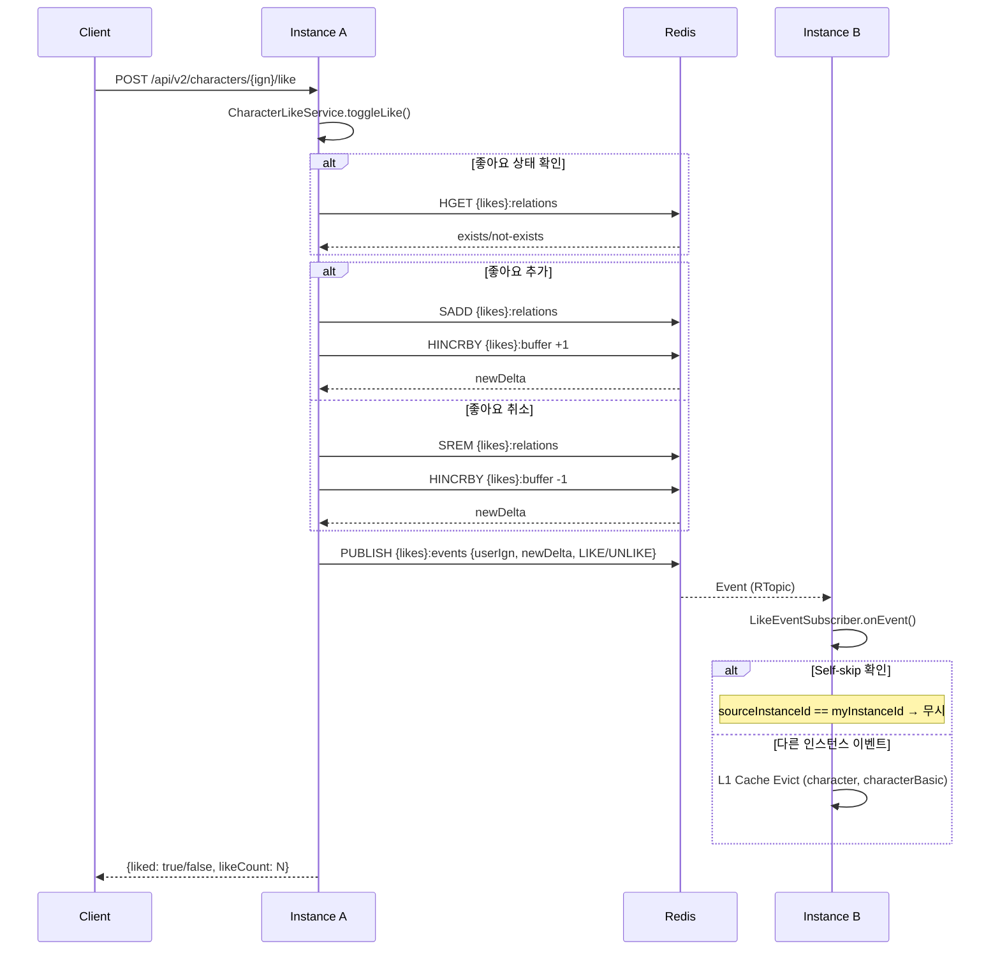
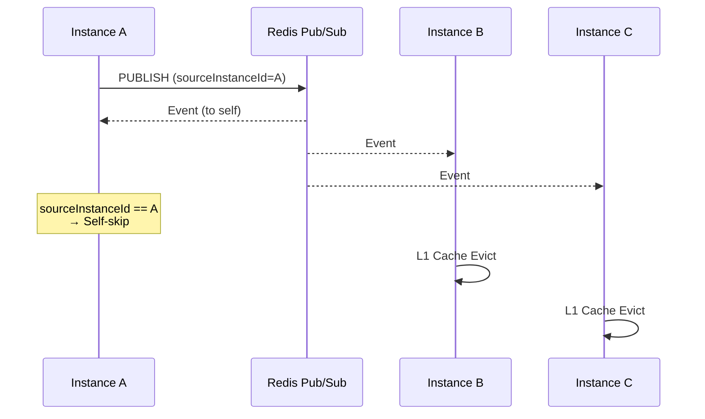
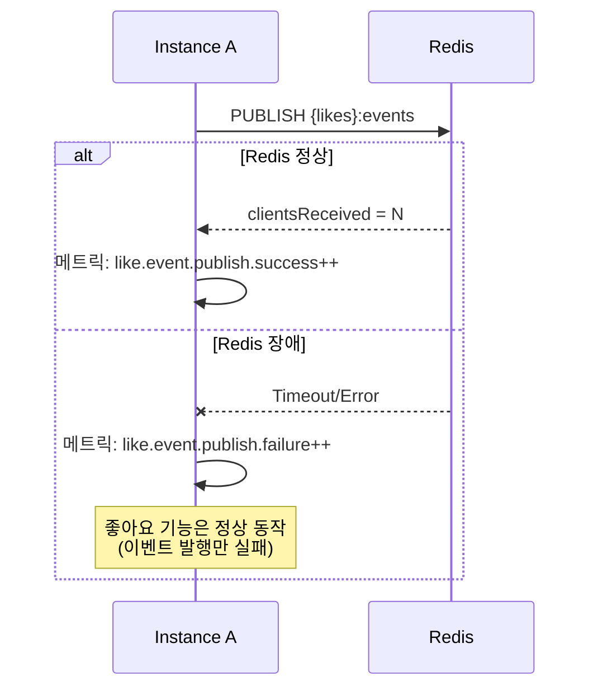

# 좋아요 실시간 동기화 시퀀스 다이어그램 (Issue #278)

> **Last Updated:** 2026-02-05
> **Code Version:** MapleExpectation v1.x
> **Diagram Version:** 1.0
> **Related Issue:** #278

## 개요

Scale-out 환경에서 인스턴스 간 좋아요 수를 실시간으로 동기화합니다.
Redis Pub/Sub를 사용하여 L1(Caffeine) 캐시 무효화 이벤트를 전파합니다.

## Terminology

| 용어 | 정의 |
|------|------|
| **Pub/Sub** | Redis 발행/구독 패턴 |
| **Self-skip** | 발행자가 자신의 이벤트를 무시하는 메커니즘 |
| **L1 Cache Evict** | 로컬 캐시 무효화 |
| **RTopic** | Redisson의 Reactive Topic 구현체 |

## 아키텍처 개요

```
[Instance A] 좋아요 토글
     │
     ├─1─→ HINCRBY {likes}:buffer → newDelta 반환
     │
     └─2─→ PUBLISH {likes}:events {userIgn, newDelta, eventType}
                    │
     ┌──────────────┘
     ▼
[Instance B] RTopic Listener
     │
     └─3─→ L1 Cache Evict (character 캐시)
```

## 좋아요 토글 시퀀스



## Self-skip 메커니즘



## Graceful Degradation



## 캐시 무효화 전략

| 계층 | 무효화 방법 | TTL Fallback |
|------|-------------|--------------|
| L1 (Caffeine) | Pub/Sub 이벤트 | 5분 |
| L2 (Redis) | 공유 캐시 (무효화 불필요) | 30분 |

**규칙:** Pub/Sub 정상 동작 시 즉시 무효화. 유실 시 TTL로 자연 만료.

## 메트릭

| 메트릭 | 타입 | 설명 |
|--------|------|------|
| `like.event.publish{status=success}` | Counter | 발행 성공 |
| `like.event.publish{status=failure}` | Counter | 발행 실패 |
| `like.event.received` | Counter | 수신 수 |

**유실률 모니터링:**
```
(publish - received) / publish > 1% → 알림
```

## 설정

```yaml
# application.yml
like:
  realtime:
    enabled: true  # Pub/Sub 활성화

app:
  instance-id: ${HOSTNAME:${random.uuid}}  # Self-skip용
```

## 관련 파일

- `src/main/java/maple/expectation/service/v2/like/realtime/LikeEventPublisher.java`
- `src/main/java/maple/expectation/service/v2/like/realtime/LikeEventSubscriber.java`
- `src/main/java/maple/expectation/service/v2/like/realtime/impl/RedisLikeEventPublisher.java`
- `src/main/java/maple/expectation/service/v2/like/realtime/impl/RedisLikeEventSubscriber.java`
- `src/main/java/maple/expectation/service/v2/like/realtime/dto/LikeEvent.java`
- `src/main/java/maple/expectation/config/LikeRealtimeSyncConfig.java`
- `src/main/java/maple/expectation/service/v2/auth/CharacterLikeService.java`

## 5-Agent Council 합의

| Agent | 역할 | 결정 |
|-------|------|------|
| Blue (Architect) | 설계 | Strategy 패턴으로 Pub/Sub 구현체 교체 가능 |
| Green (Performance) | 성능 | RTopic은 Redis 네이티브 래퍼, 오버헤드 최소 |
| Yellow (QA) | 테스트 | 단위 테스트 + 통합 테스트 (Testcontainers) |
| Purple (Data) | 일관성 | Hash Tag `{likes}:*`로 클러스터 슬롯 보장 |
| Red (SRE) | 안정성 | Graceful Degradation, 메트릭 모니터링 |

## Evidence Links
- **LikeEventPublisher:** `src/main/java/maple/expectation/service/v2/like/realtime/LikeEventPublisher.java`
- **LikeEventSubscriber:** `src/main/java/maple/expectation/service/v2/like/realtime/LikeEventSubscriber.java`
- **LikeRealtimeSyncConfig:** `src/main/java/maple/expectation/config/LikeRealtimeSyncConfig.java`
- **Tests:** `src/test/java/maple/expectation/service/v2/like/realtime/*Test.java`

## Fail If Wrong

이 다이어그램이 부정확한 경우:
- **Pub/Sub가 동작하지 않음**: Redis 설정 및 RTopic 확인
- **Self-skip 실패**: instance-id 설정 확인
- **L1 Cache 불일치**: evict 이벤트 발행 확인

### Verification Commands
```bash
# Pub/Sub 설정 확인
grep -A 10 "like.realtime" src/main/resources/application.yml

# RTopic 사용 확인
grep -r "RTopic\|getTopic" src/main/java/maple/expectation/service/v2/like/realtime/

# instance-id 확인
grep "instance-id" src/main/resources/application.yml
```
