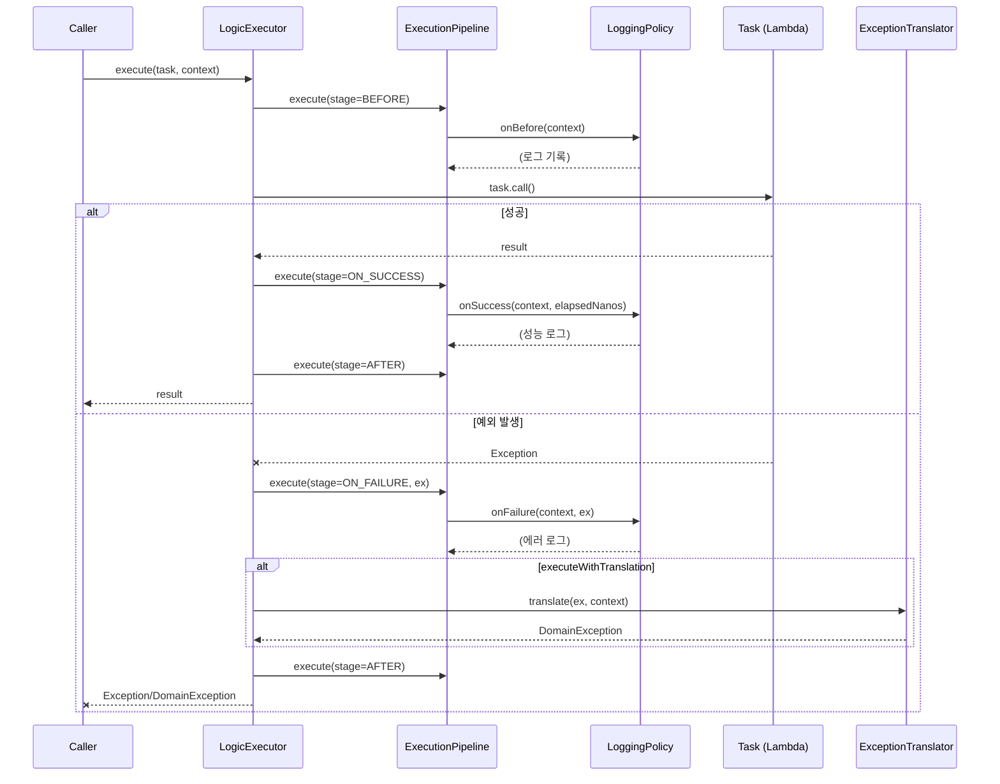

# LogicExecutor Pipeline 시퀀스 다이어그램

> **Last Updated:** 2026-02-05
> **Code Version:** MapleExpectation v1.x
> **Diagram Version:** 1.0

## 개요

LogicExecutor는 비즈니스 로직의 실행 흐름을 추상화하여 **try-catch 제거** 및 **일관된 예외 처리**를 제공합니다.

## Terminology

| 용어 | 정의 |
|------|------|
| **ExecutionPipeline** | BEFORE → ON_SUCCESS/ON_FAILURE → AFTER 단계 |
| **LoggingPolicy** | 성능 로그 및 에러 로그 정책 |
| **ExceptionTranslator** | Checked → Unchecked 예외 변환 |
| **TaskContext** | 실행 컨텍스트 (도메인, 작업, 키) |

## 시퀀스 다이어그램



## 핵심 구성 요소

### 1. ExecutionPipeline

| Stage | 용도 | 실행 조건 |
|-------|------|----------|
| `BEFORE` | 실행 전 준비 | 항상 |
| `ON_SUCCESS` | 성공 후 처리 | task 성공 시 |
| `ON_FAILURE` | 실패 후 처리 | task 예외 시 |
| `AFTER` | 정리 작업 | 항상 (finally) |

### 2. LoggingPolicy

```java
// 느린 작업 감지 (threshold: 200ms)
if (elapsedNanos > SLOW_THRESHOLD) {
    log.info("[Task:SLOW] {}, elapsed={}ms", context, elapsedMs);
}
```

### 3. ExceptionTranslator

| 메서드 | 변환 규칙 |
|--------|----------|
| `forLock()` | InterruptedException → DistributedLockException |
| `forRedisScript()` | RedisException → RedisScriptExecutionException |
| `forCompression()` | IOException → CompressionException |

## 사용 패턴

### 패턴 1: execute (기본)

```java
return executor.execute(
    () -> repository.findById(id),
    TaskContext.of("Domain", "FindById", id)
);
```

### 패턴 2: executeOrDefault (안전한 조회)

```java
return executor.executeOrDefault(
    () -> cache.get(key),
    null,  // 기본값
    TaskContext.of("Cache", "Get", key)
);
```

### 패턴 3: executeWithFinally (자원 해제)

```java
return executor.executeWithFinally(
    () -> performLockedOperation(),
    () -> lock.unlock(),  // 항상 실행
    TaskContext.of("Lock", "Execute", key)
);
```

### 패턴 4: executeWithTranslation (예외 변환)

```java
return executor.executeWithTranslation(
    () -> externalApi.call(),
    ExceptionTranslator.forLock(),
    TaskContext.of("External", "Call", endpoint)
);
```

## trace.log 출력 예시

```
2026-01-14 02:25:27.372 [expectation-4] INFO  TraceAspect : --> [START] GameCharacterService.getCharacterIfExist
2026-01-14 02:25:27.399 [expectation-4] INFO  TraceAspect : <-- [END] GameCharacterService.getCharacterIfExist (27 ms)
```

## 관련 파일

- `src/main/java/maple/expectation/global/executor/DefaultLogicExecutor.java`
- `src/main/java/maple/expectation/global/executor/policy/ExecutionPipeline.java`
- `src/main/java/maple/expectation/global/executor/TaskContext.java`

## Fail If Wrong

이 다이어그램이 부정확한 경우:
- **try-catch가 사용됨**: LogicExecutor 패턴 위반 확인
- **예외가 변환되지 않음**: ExceptionTranslator 사용 확인
- **메트릭이 기록되지 않음**: LoggingPolicy 동작 확인

### Verification Commands
```bash
# try-catch 사용 확인 (비즈니스 로직에서 금지)
grep -r "try {" src/main/java/maple/expectation/service --include="*.java" | grep -v "// Bad"

# ExceptionTranslator 확인
find src/main/java -name "ExceptionTranslator.java"

# TaskContext 사용 확인
grep -r "TaskContext.of" src/main/java/maple/expectation/service --include="*.java" | wc -l
```
