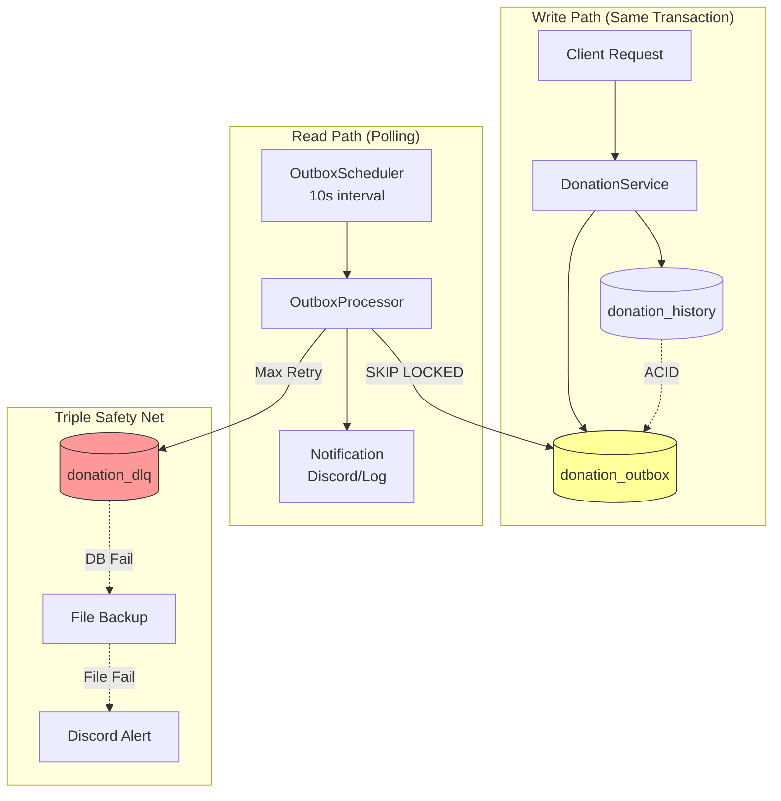
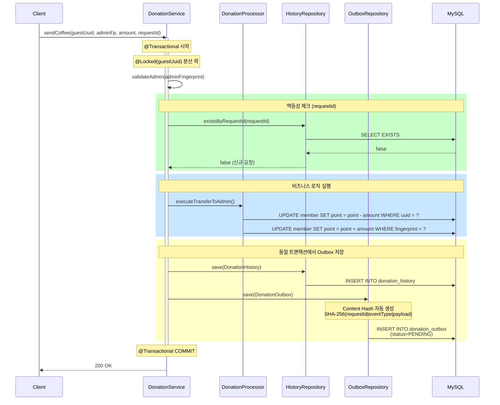
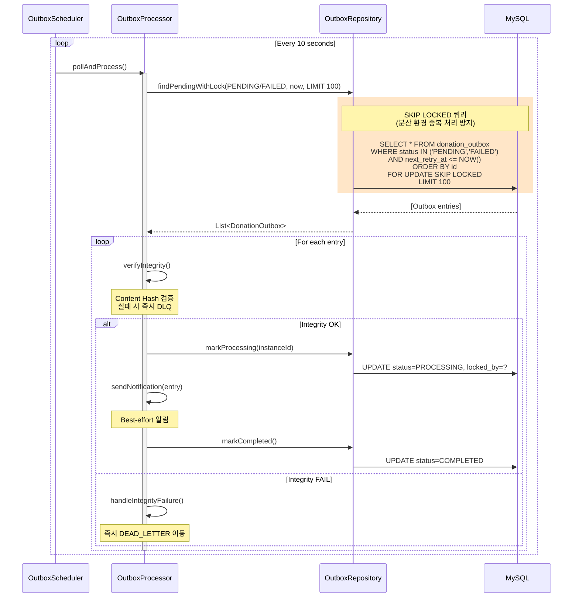
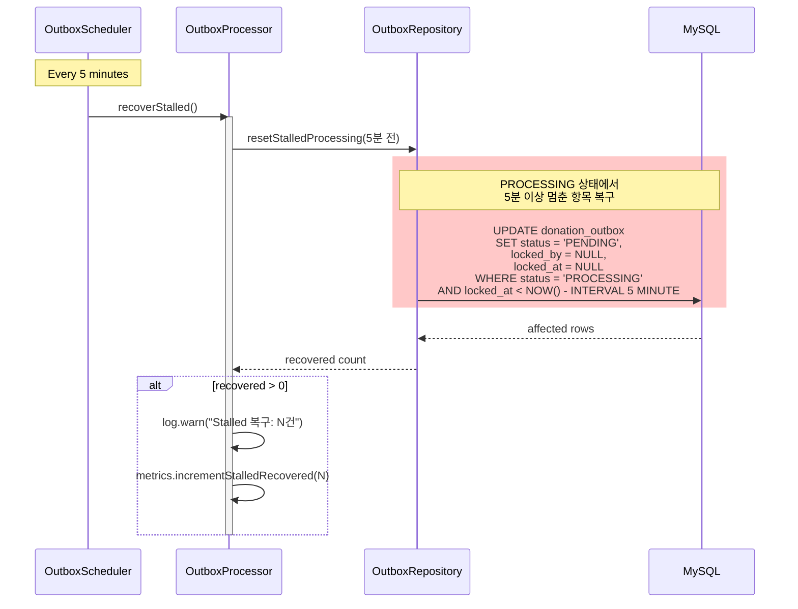
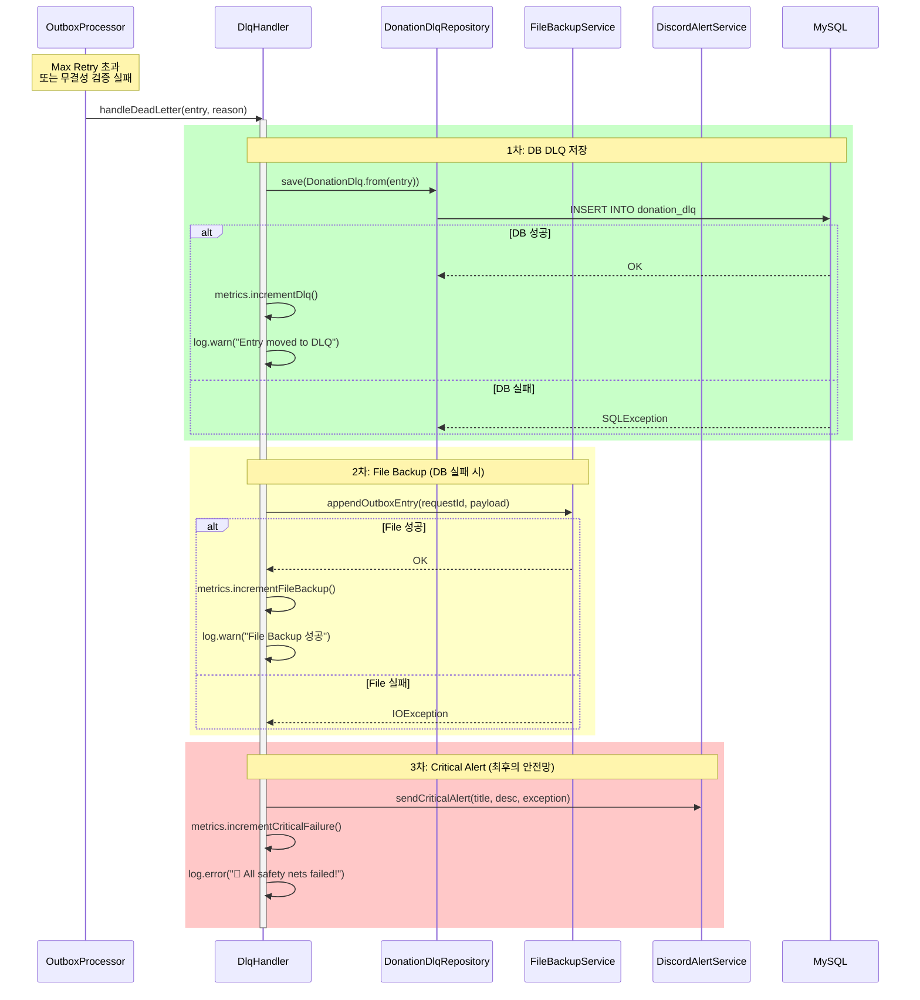
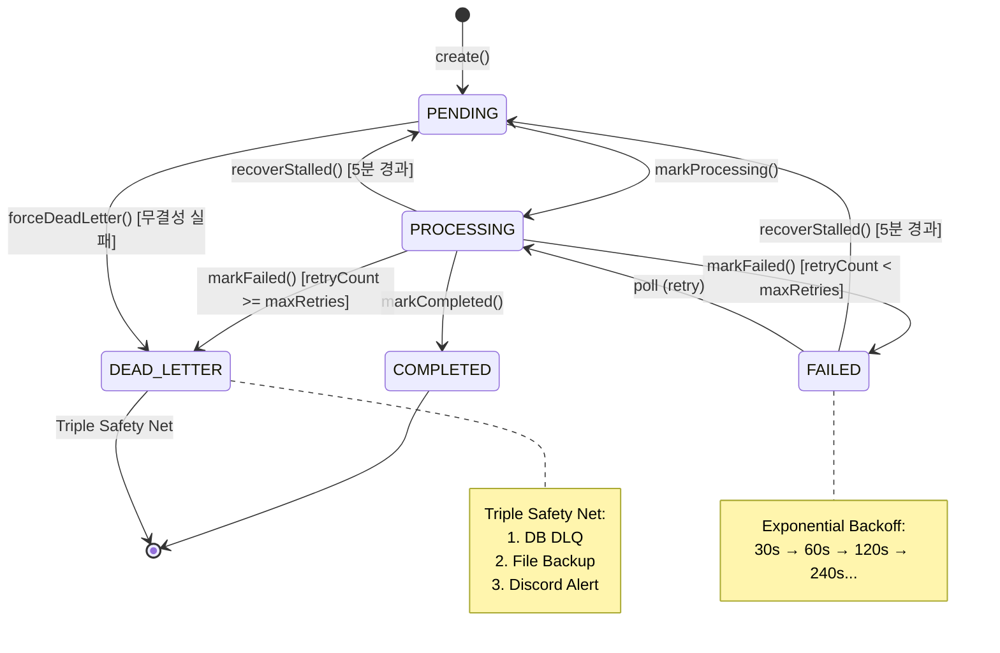

# Transactional Outbox Pattern 시퀀스 다이어그램

> **Issue #80, #81, #127**: 도네이션 처리의 데이터 일관성 및 멱등성 보장
>
> **Last Updated:** 2026-02-05
> **Code Version:** MapleExpectation v1.x
> **Diagram Version:** 1.0

## 1. 개요

Transactional Outbox 패턴은 **분산 시스템에서 데이터 일관성을 보장**하기 위한 패턴입니다.
비즈니스 트랜잭션과 이벤트 발행을 **동일 DB 트랜잭션**에서 원자적으로 처리합니다.

## Terminology

| 용어 | 정의 |
|------|------|
| **At-Least-Once** | 최소 1회 전달 보장 (중복 가능) |
| **멱등성 (Idempotency)** | requestId 기반 중복 처리 방지 |
| **Content Hash** | SHA-256 기반 개별 레코드 무결성 검증 |
| **Exponential Backoff** | 재시도 간격 기하급수적 증가 |
| **Triple Safety Net** | DLQ → File Backup → Discord Alert |

### 핵심 특성

| 특성 | 설명 |
|------|------|
| **At-Least-Once Delivery** | 최소 1회 전달 보장 (중복 가능) |
| **멱등성 (Idempotency)** | requestId 기반 중복 처리 방지 |
| **Content Hash** | 개별 레코드 무결성 검증 (SHA-256) |
| **Exponential Backoff** | 재시도 간격 기하급수적 증가 (30s, 60s, 120s...) |
| **Triple Safety Net** | DLQ → File Backup → Discord Alert |

---

## 2. 아키텍처 개요



---

## 3. Write Path 시퀀스 (도네이션 요청)



---

## 4. Read Path 시퀀스 (Outbox Polling)



---

## 5. Stalled Recovery 시퀀스 (JVM 크래시 대응)



---

## 6. Triple Safety Net 시퀀스 (데이터 영구 손실 방지)



---

## 7. 상태 전이 다이어그램



---

## 8. 데이터베이스 스키마

```sql
-- Outbox 테이블
CREATE TABLE donation_outbox (
    id              BIGINT AUTO_INCREMENT PRIMARY KEY,
    version         BIGINT DEFAULT 0,                    -- Optimistic Locking
    request_id      VARCHAR(50) NOT NULL UNIQUE,         -- 멱등성 키
    event_type      VARCHAR(50) NOT NULL,                -- DONATION_COMPLETED
    payload         TEXT NOT NULL,                       -- JSON payload
    content_hash    VARCHAR(64) NOT NULL,                -- SHA-256 무결성
    status          VARCHAR(20) NOT NULL DEFAULT 'PENDING',
    locked_by       VARCHAR(100),                        -- 처리 중인 인스턴스 ID
    locked_at       DATETIME,
    retry_count     INT DEFAULT 0,
    max_retries     INT DEFAULT 3,
    last_error      VARCHAR(500),
    next_retry_at   DATETIME,
    created_at      DATETIME,
    updated_at      DATETIME,

    INDEX idx_pending_poll (status, next_retry_at, id),
    INDEX idx_locked (locked_by, locked_at)
);

-- Dead Letter Queue 테이블
CREATE TABLE donation_dlq (
    id              BIGINT AUTO_INCREMENT PRIMARY KEY,
    original_id     BIGINT NOT NULL,                     -- outbox.id 참조
    request_id      VARCHAR(50) NOT NULL,
    event_type      VARCHAR(50) NOT NULL,
    payload         TEXT NOT NULL,
    reason          VARCHAR(500),
    created_at      DATETIME,

    INDEX idx_request_id (request_id)
);
```

---

## 9. 관련 이슈/PR

| Issue | 제목 | 핵심 결정 |
|:------|:-----|:---------|
| #80 | Transactional Outbox 패턴 도입 | At-Least-Once + 멱등성 |
| #81 | DLQ Handler Triple Safety Net | DB → File → Discord |
| #127 | 멱등성 키 기반 중복 처리 방지 | requestId unique 제약 |
| #187 | Outbox 패턴 및 멱등성 구현 PR | 통합 구현 |

---

## 10. 모니터링 메트릭

| 메트릭 | 설명 | 임계치 |
|:-------|:-----|:-------|
| `outbox.pending.count` | PENDING 상태 항목 수 | > 1000 |
| `outbox.processed.count` | 성공 처리 수 | - |
| `outbox.failed.count` | 실패 수 | > 10/분 |
| `outbox.dlq.count` | DLQ 이동 수 | > 0 |
| `outbox.integrity.failure.count` | 무결성 검증 실패 | > 0 (즉시 알림) |
| `outbox.stalled.recovered.count` | Stalled 복구 수 | > 0 |

---

## 11. 참고 문서

- [Microservices Patterns - Transactional Outbox](https://microservices.io/patterns/data/transactional-outbox.html)
- [CLAUDE.md 섹션 8-1: Redis Lua Script & Cluster Hash Tag](../../CLAUDE.md)

## Evidence Links
- **DonationOutbox:** `src/main/java/maple/expectation/domain/v2/DonationOutbox.java`
- **OutboxProcessor:** `src/main/java/maple/expectation/service/v2/donation/outbox/OutboxProcessor.java`
- **DlqHandler:** `src/main/java/maple/expectation/service/v2/donation/outbox/DlqHandler.java`
- **Tests:** `src/test/java/maple/expectation/service/v2/donation/outbox/*Test.java`

## Fail If Wrong

이 다이어그램이 부정확한 경우:
- **Outbox 저장 실패 시 데이터 유실**: 트랜잭션 경계 확인
- **중복 처리 발생**: requestId unique 제약 확인
- **SKIP LOCKED 미작동**: 쿼리 구현 확인

### Verification Commands
```bash
# Outbox 스키마 확인
grep -A 30 "CREATE TABLE donation_outbox" src/main/resources/db/migration/*.sql

# SKIP LOCKED 쿼리 확인
grep -B 5 -A 15 "SKIP LOCKED\|skipLocked" src/main/java/maple/expectation/repository/v2/DonationOutboxRepository.java

# requestId unique 확인
grep -i "requestid.*unique" src/main/resources/db/migration/*.sql
```
