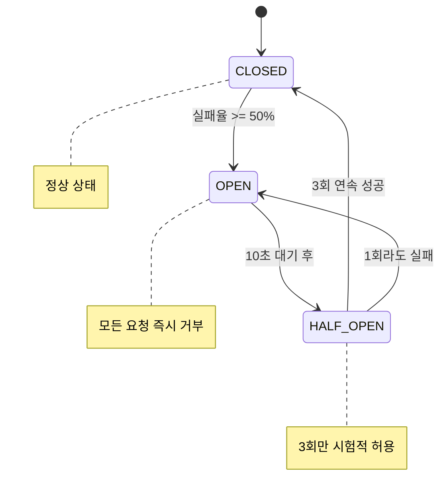
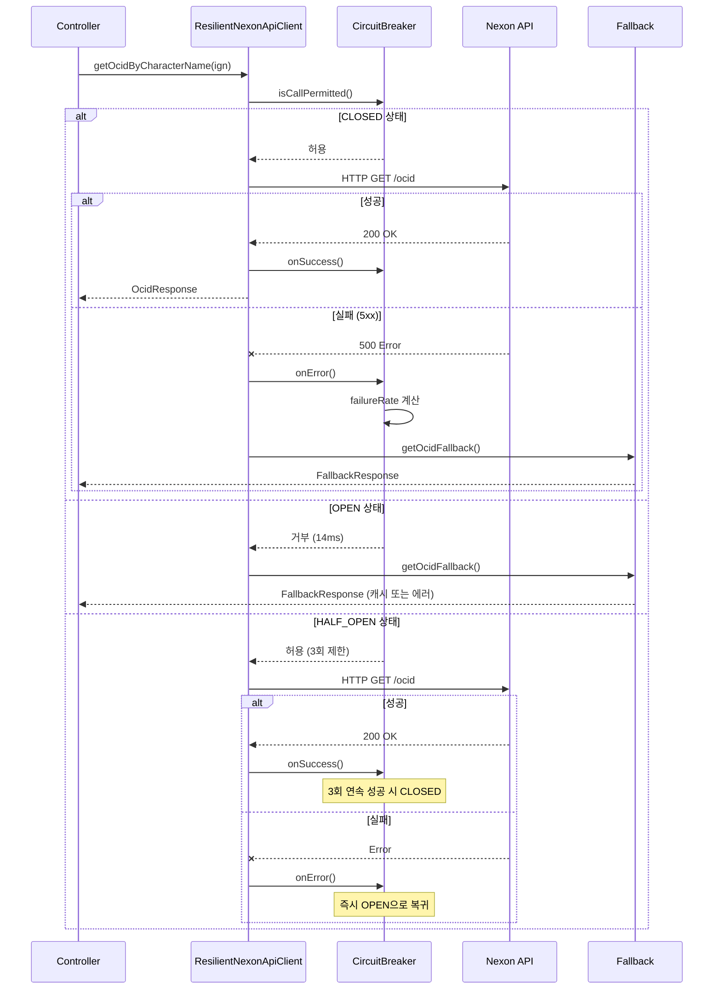

# Resilience4j CircuitBreaker 시퀀스 다이어그램

> **Last Updated:** 2026-02-05
> **Code Version:** MapleExpectation v1.x
> **Diagram Version:** 1.0

## 개요

외부 API 장애가 내부 시스템으로 전파되지 않도록 **서킷브레이커** 패턴을 적용합니다.

## Terminology

| 용어 | 정의 |
|------|------|
| **CLOSED** | 정상 상태 (요청 통과) |
| **OPEN** | 차단 상태 (모든 요청 거부) |
| **HALF_OPEN** | 복구 시도 상태 (3회 제한 시도) |
| **IgnoreMarker** | 실패 카운트에서 제외할 예외 (4xx) |
| **RecordMarker** | 실패 카운트에 포함할 예외 (5xx) |

## 상태 전이 다이어그램



## 요청 처리 시퀀스



## CircuitBreaker 설정

### nexonApi

```yaml
resilience4j:
  circuitbreaker:
    instances:
      nexonApi:
        failureRateThreshold: 50          # 실패율 50% 초과 시 OPEN
        minimumNumberOfCalls: 10          # 최소 10회 호출 후 통계 산출
        waitDurationInOpenState: 10000    # OPEN 상태 10초 유지
        permittedNumberOfCallsInHalfOpenState: 3  # HALF_OPEN에서 3회 허용
        slidingWindowType: COUNT_BASED
        slidingWindowSize: 10
```

### redisLock

```yaml
redisLock:
  failureRateThreshold: 60          # 실패율 60% 초과 시 OPEN
  minimumNumberOfCalls: 5           # 최소 5회 호출 후 통계 산출
  waitDurationInOpenState: 30000    # OPEN 상태 30초 유지
```

## Marker Interface

### CircuitBreakerIgnoreMarker

비즈니스 예외 (4xx)는 서킷브레이커 상태에 영향을 주지 않습니다.

```java
public class CharacterNotFoundException
    extends ClientBaseException
    implements CircuitBreakerIgnoreMarker {
    // 실패 카운트에서 제외
}
```

### CircuitBreakerRecordMarker

시스템 예외 (5xx)는 서킷브레이커 실패로 기록됩니다.

```java
public class NexonApiException
    extends ServerBaseException
    implements CircuitBreakerRecordMarker {
    // 실패 카운트 증가
}
```

## Fallback 전략

### Scenario A: Degrade (캐시 반환)

```java
@CircuitBreaker(name = "nexonApi", fallbackMethod = "getOcidFallback")
public OcidResponse getOcidByCharacterName(String ign) { ... }

private OcidResponse getOcidFallback(String ign, Exception ex) {
    // 1. 캐시에서 조회 시도
    Optional<OcidResponse> cached = cache.get(ign);
    if (cached.isPresent()) {
        return cached.get();
    }
    // 2. 캐시 없으면 예외 재발생
    throw new NexonApiUnavailableException(ex);
}
```

### Scenario B: Fail-fast (즉시 에러)

```java
// 14ms 내 즉시 응답 + Discord 알림
private void notifyCircuitOpen() {
    discordAlertService.sendCriticalAlert(
        "CircuitBreaker OPEN",
        "Nexon API 장애 감지"
    );
}
```

## E2E 테스트 결과

| 시나리오 | 결과 | 증거 |
|---------|------|------|
| RE-S01: CLOSED 정상 호출 | PASS | `state=CLOSED, bufferedCalls=1` |
| RE-E01: IgnoreMarker 예외 | PASS | `failedCalls=0` (5회 비즈니스 예외 후에도) |

## 관련 파일

- `src/main/resources/application.yml` (resilience4j 섹션)
- `src/main/java/maple/expectation/global/resilience/DistributedCircuitBreakerManager.java`
- `src/main/java/maple/expectation/external/client/ResilientNexonApiClient.java`

## Fail If Wrong

이 다이어그램이 부정확한 경우:
- **CircuitBreaker가 열리지 않음**: failureRateThreshold 설정 확인
- **4xx가 실패로 카운트됨**: IgnoreMarker 구현 확인
- **Fallback이 호출되지 않음**: fallbackMethod 이름 확인

### Verification Commands
```bash
# CircuitBreaker 설정 확인
grep -A 20 "circuitbreaker:" src/main/resources/application.yml

# IgnoreMarker 구현 확인
find src/main/java -name "*IgnoreMarker.java"

# ResilientNexonApiClient fallback 확인
grep -A 10 "Fallback" src/main/java/maple/expectation/external/impl/ResilientNexonApiClient.java
```
