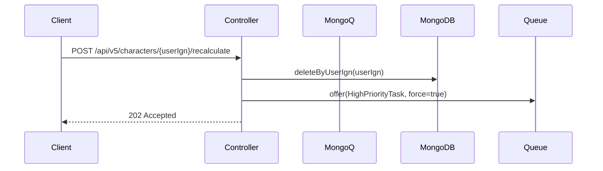
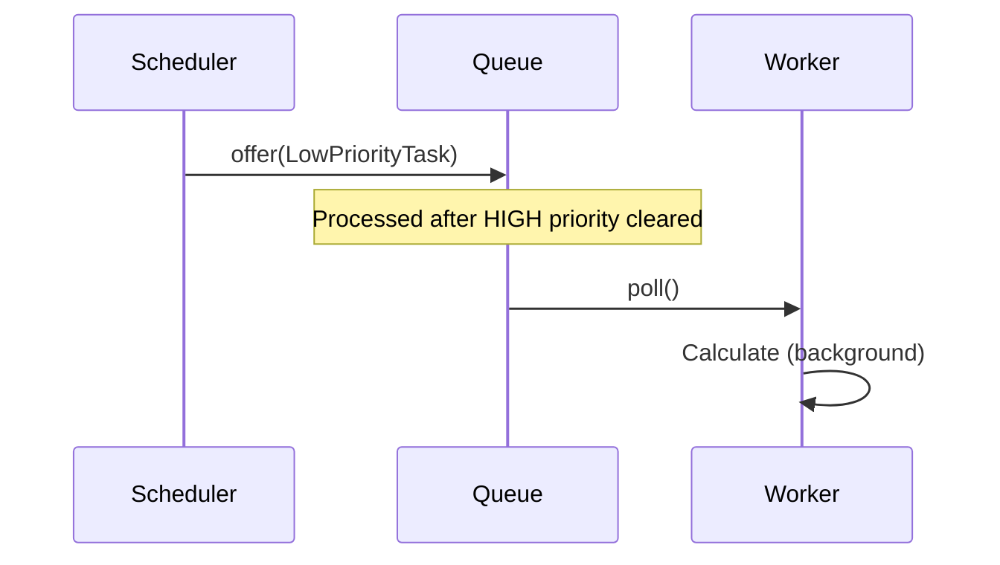

# V5 CQRS Expectation Flow Sequence Diagram

## Overview
V5 implements CQRS pattern with MongoDB read-side and MySQL write-side, connected via Redis Stream events.

## Sequence Diagram

```mermaid
sequenceDiagram
    participant Client
    participant Controller as GameCharacterControllerV5
    participant MongoQ as CharacterViewQueryService
    participant MongoDB as MongoDB
    participant Queue as PriorityCalculationQueue
    participant Worker as ExpectationCalculationWorker
    participant V4Service as EquipmentExpectationServiceV4
    participant Publisher as MongoSyncEventPublisher
    participant Stream as Redis Stream
    participant SyncWorker as MongoDBSyncWorker

    Client->>Controller: GET /api/v5/characters/{userIgn}/expectation

    Note over Controller: Step 1: Query Side Check
    Controller->>MongoQ: findByUserIgn(userIgn)
    MongoQ->>MongoDB: Find by userIgn (indexed)

    alt MongoDB HIT
        MongoDB-->>MongoQ: CharacterValuationView
        MongoQ-->>Controller: Optional<View>
        Controller-->>Client: 200 OK (1-10ms)
        Note over Client: Fast path - document already calculated
    end

    alt MongoDB MISS
        MongoDB-->>MongoQ: Optional.empty()
        MongoQ-->>Controller: Optional.empty()

        Note over Controller: Step 2: Queue to Command Side
        Controller->>Queue: offer(HighPriorityTask)
        Queue-->>Controller: true (accepted)
        Controller-->>Client: 202 Accepted (Location: /pending)

        Note over Queue: Step 3: Background Processing
        Queue->>Worker: poll() [Virtual Thread]
        Worker->>V4Service: calculateExpectation(userIgn)
        V4Service->>V4Service: Load Equipment
        V4Service->>V4Service: Calculate 3 Presets
        V4Service-->>Worker: EquipmentExpectationResponseV4

        Note over Worker: Step 4: Publish Event
        Worker->>Publisher: publishCalculationCompleted()
        Publisher->>Stream: XADD character-sync
        Stream-->>Publisher: messageId

        Note over SyncWorker: Step 5: Async Sync to MongoDB
        Stream->>SyncWorker: XREADGROUP character-sync
        SyncWorker->>SyncWorker: Transform Response → View
        SyncWorker->>MongoDB: Upsert CharacterValuationView
        MongoDB-->>SyncWorker: Saved

        Note over Client: Step 6: Poll for Result
        Client->>Controller: GET /api/v5/characters/{userIgn}/expectation
        Controller->>MongoQ: findByUserIgn(userIgn)
        MongoQ->>MongoDB: Find by userIgn
        MongoDB-->>MongoQ: CharacterValuationView
        MongoQ-->>Controller: View (HIT)
        Controller-->>Client: 200 OK
    end

    alt Queue Full
        Queue-->>Controller: false (rejected)
        Controller-->>Client: 503 Service Unavailable
    end
```



## Key Metrics

| Metric | Description | Target |
|---------|-------------|--------|
| MongoDB Read Latency | Time from query to response | < 10ms (P95) |
| Queue Depth | Number of pending tasks | < 1000 |
| Calculation Time | Time from poll to complete | < 30s |
| Sync Lag | Time from event to MongoDB upsert | < 1s |

## Flow Variants

### 1. Force Recalculation


### 2. Low Priority (Batch)


## CQRS Benefits

1. **Read Scalability**: MongoDB replica nodes handle read traffic
2. **Write Isolation**: MySQL writes unaffected by read load
3. **Eventual Consistency**: Sync lag acceptable for read-heavy workload
4. **Backpressure**: Queue limits prevent resource exhaustion
```