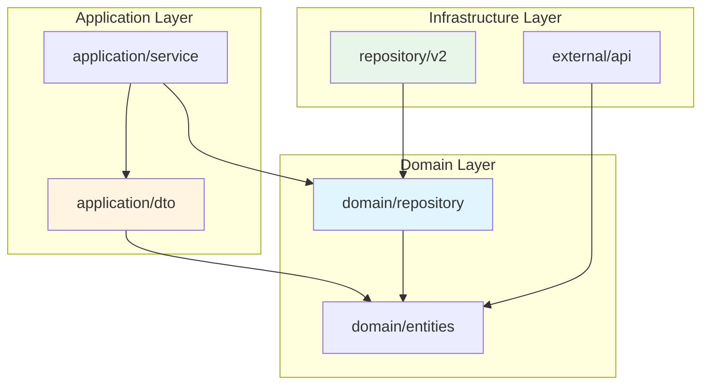

# Base Interfaces Documentation

**Phase:** 2D - Define Base Interfaces for Clean Architecture
**Date:** 2026-02-07
**Author:** Blue Architect (5-Agent Council)

---

## Table of Contents

1. [Overview](#overview)
2. [Repository Interfaces](#repository-interfaces)
3. [DTO Classes](#dto-classes)
4. [Dependency Diagram](#dependency-diagram)
5. [Usage Examples](#usage-examples)
6. [Test Coverage](#test-coverage)
7. [Implementation Guidelines](#implementation-guidelines)

---

## Overview

This document defines the base interfaces for MapleExpectation's clean architecture refactoring, following the **Ports and Adapters** pattern. These interfaces form the foundation for dependency inversion and enable testable, maintainable code.

### Design Principles

1. **Dependency Inversion:** Domain layer defines interfaces; infrastructure implements them
2. **Pure Java:** No framework dependencies in domain layer
3. **Contract-First:** Clear, documented contracts with comprehensive tests
4. **Separation of Concerns:** DTOs separate API contract from domain model

### Architecture Layers

```
┌─────────────────────────────────────────────────────────────┐
│                    Application Layer                        │
│  ┌──────────────────┐        ┌──────────────────┐          │
│  │   DTO Classes    │        │  Service Layer    │          │
│  │  (BaseDto, etc)  │◄───────│  (Uses DTOs)      │          │
│  └──────────────────┘        └──────────────────┘          │
└─────────────────────────────────────────────────────────────┘
                          ▲
                          │ depends on
                          ▼
┌─────────────────────────────────────────────────────────────┐
│                      Domain Layer                           │
│  ┌──────────────────┐        ┌──────────────────┐          │
│  │ Repository       │        │ Domain Entities  │          │
│  │  Interfaces      │        │ (GameCharacter,  │          │
│  │  (Ports)         │        │  Member, etc)    │          │
│  └──────────────────┘        └──────────────────┘          │
└─────────────────────────────────────────────────────────────┘
                          ▲
                          │ implemented by
                          ▼
┌─────────────────────────────────────────────────────────────┐
│                   Infrastructure Layer                      │
│  ┌──────────────────┐        ┌──────────────────┐          │
│  │ Repository       │        │  JPA/Hibernate    │          │
│  │  Implementations │        │  Config           │          │
│  │  (Adapters)      │        │                   │          │
│  └──────────────────┘        └──────────────────┘          │
└─────────────────────────────────────────────────────────────┘
```

---

## Repository Interfaces

All repository interfaces are located in `domain/repository/` and contain no infrastructure dependencies.

### GameCharacterRepository

**Location:** `maple.expectation.domain.repository.GameCharacterRepository`

**Purpose:** Manages character data persistence with support for active character queries and optimistic locking.

**Key Methods:**
- `findByOcid(String ocid)` - Find by unique OCID
- `findByUserIgn(String userIgn)` - Find by in-game name
- `findAll()` - Retrieve all characters
- `findActiveCharacters()` - Get active characters (updated within 30 days)
- `save(GameCharacter)` - Create or update with version control
- `deleteByOcid(String)` - Delete by OCID
- `existsByOcid(String)` - Check existence

**Contract Guarantees:**
- ✅ Never returns `null` (uses `Optional` or empty collections)
- ✅ Throws `IllegalArgumentException` for null/blank inputs
- ✅ Handles optimistic locking via version field
- ✅ Returns entities with timestamps already set

**Usage Example:**
```java
// Inject interface (dependency inversion)
private final GameCharacterRepository characterRepository;

// Find character
Optional<GameCharacter> character = characterRepository.findByOcid("abc123");

// Save with optimistic locking
GameCharacter character = characterRepository.findByOcid("abc123").orElseThrow();
character.setWorldName("Scania");
GameCharacter updated = characterRepository.save(character); // Increments version
```

---

### CharacterEquipmentRepository

**Location:** `maple.expectation.domain.repository.CharacterEquipmentRepository`

**Purpose:** Manages equipment data with TTL-based freshness checking.

**Key Methods:**
- `findByOcid(String ocid)` - Find equipment by OCID
- `findByOcidAndUpdatedAtAfter(String, LocalDateTime)` - Find fresh equipment
- `save(CharacterEquipment)` - Save or update
- `deleteByOcid(String)` - Delete by OCID
- `existsByOcidAndUpdatedAtAfter(String, LocalDateTime)` - Check freshness

**Contract Guarantees:**
- ✅ Supports TTL-based caching (15-minute freshness)
- ✅ Handles GZIP compression transparently
- ✅ Timestamp-based queries use index for performance

**Usage Example:**
```java
// Check if equipment is fresh
LocalDateTime threshold = LocalDateTime.now().minusMinutes(15);
Optional<CharacterEquipment> fresh =
    equipmentRepository.findByOcidAndUpdatedAtAfter(ocid, threshold);

if (fresh.isPresent()) {
    // Use cached data
    return fresh.get();
} else {
    // Fetch from API
    CharacterEquipment newEquipment = fetchFromApi(ocid);
    return equipmentRepository.save(newEquipment);
}
```

---

### CharacterLikeRepository

**Location:** `maple.expectation.domain.repository.CharacterLikeRepository`

**Purpose:** Manages character likes with duplicate prevention and statistics.

**Key Methods:**
- `findByTargetOcidAndLikerAccountId(String, String)` - Find specific like
- `findByLikerAccountId(String)` - Get all likes by user
- `findByTargetOcid(String)` - Get all likes for character
- `save(CharacterLike)` - Create like (enforces UNIQUE constraint)
- `delete(CharacterLike)` - Delete like
- `countByTargetOcid(String)` - Count likes for character
- `countByLikerAccountId(String)` - Count likes by user
- `existsByTargetOcidAndLikerAccountId(String, String)` - Check existence

**Contract Guarantees:**
- ✅ UNIQUE constraint on (target_ocid, liker_account_id)
- ✅ Throws exception for duplicate likes
- ✅ Count methods optimized (doesn't load entities)
- ✅ List queries never return null

**Usage Example:**
```java
// Check for duplicate like
boolean exists = likeRepository.existsByTargetOcidAndLikerAccountId(targetOcid, accountId);
if (exists) {
    throw new DuplicateLikeException("Already liked");
}

// Create like
CharacterLike like = CharacterLike.of(targetOcid, accountId);
likeRepository.save(like);

// Get statistics
long totalLikes = likeRepository.countByTargetOcid(targetOcid);
```

---

### MemberRepository

**Location:** `maple.expectation.domain.repository.MemberRepository`

**Purpose:** Manages member data with optimistic locking for point operations.

**Key Methods:**
- `findByUuid(String)` - Find by UUID
- `findById(Long)` - Find by database ID
- `save(Member)` - Create or update with version control
- `deleteByUuid(String)` - Delete by UUID
- `existsByUuid(String)` - Check existence
- `findOrCreateGuest(String, Long)` - Find or create guest member

**Contract Guarantees:**
- ✅ Optimistic locking via version field
- ✅ Point operations must be transactional
- ✅ UUID is unique identifier (36-character format)
- ✅ Throws `OptimisticLockException` on version conflict

**Usage Example:**
```java
// Transactional point deduction
@Transactional
public void deductPoints(String uuid, Long amount) {
    Member member = memberRepository.findByUuid(uuid).orElseThrow();

    // Domain logic validates
    member.deductPoints(amount);

    // Repository handles optimistic locking
    memberRepository.save(member); // Throws if version conflict
}
```

---

## DTO Classes

All DTOs are located in `application/dto/` and extend `BaseDto`.

### BaseDto

**Location:** `maple.expectation.application.dto.BaseDto`

**Purpose:** Provides common audit fields for all DTOs.

**Fields:**
- `createdAt` - Record creation timestamp (immutable)
- `updatedAt` - Last update timestamp
- `version` - Optimistic locking version

**Utility Methods:**
- `isNew()` - Check if record is new (version is null)
- `markAsUpdated()` - Set updatedAt to current time
- `initTimestamps()` - Initialize both timestamps

**Usage Example:**
```java
public class CustomDto extends BaseDto {
    private String field;

    public static CustomDto forCreation(String field) {
        CustomDto dto = new CustomDto();
        dto.field = field;
        dto.initTimestamps(); // Initialize timestamps
        return dto;
    }
}
```

---

### GameCharacterDto

**Location:** `maple.expectation.application.dto.GameCharacterDto`

**Purpose:** Data transfer object for character entities.

**Fields:**
- `id` - Database ID
- `userIgn` - In-game name
- `ocid` - Unique character identifier
- `worldName` - World name (e.g., "Scania")
- `characterClass` - Class name (e.g., "Night Lord")
- `characterImage` - Character image URL
- `basicInfoUpdatedAt` - Last basic info update
- `likeCount` - Total like count
- `updatedAt` - Last update timestamp
- `version` - Optimistic locking version

**Factory Methods:**
- `from(GameCharacter)` - Convert entity to DTO
- `forCreation(String, String)` - Create DTO for new character

**Conversion:**
- `toEntity()` - Convert DTO to entity

**Usage Example:**
```java
// Convert from entity
GameCharacter entity = repository.findByOcid("abc123").orElseThrow();
GameCharacterDto dto = GameCharacterDto.from(entity);

// Use in API response
return ResponseEntity.ok(dto);

// Create new character
GameCharacterDto newDto = GameCharacterDto.forCreation("Player1", "ocid123");
GameCharacter entity = newDto.toEntity();
repository.save(entity);
```

---

### CharacterEquipmentDto

**Location:** `maple.expectation.application.dto.CharacterEquipmentDto`

**Purpose:** Data transfer object for equipment entities with freshness checking.

**Fields:**
- `ocid` - Character OCID
- `jsonContent` - Equipment JSON (compressed)
- `updatedAt` - Last update timestamp

**Factory Methods:**
- `from(CharacterEquipment)` - Convert entity to DTO
- `forCreation(String, String)` - Create DTO for new equipment

**Utility Methods:**
- `hasData()` - Check if JSON content exists
- `isFresh(long ttlMinutes)` - Check if data is fresh
- `isExpired(long ttlMinutes)` - Check if data is expired
- `getAgeInMinutes()` - Get data age in minutes

**Usage Example:**
```java
CharacterEquipmentDto dto = CharacterEquipmentDto.from(entity);

// Check freshness
if (dto.isFresh(15)) {
    // Use cached data
    return dto;
} else {
    // Fetch fresh data
    return fetchFromApi(dto.getOcid());
}

// Get age
Long age = dto.getAgeInMinutes();
if (age > 60) {
    // Log warning about stale data
}
```

---

### CharacterLikeDto

**Location:** `maple.expectation.application.dto.CharacterLikeDto`

**Purpose:** Data transfer object for character like entities.

**Fields:**
- `id` - Database ID
- `targetOcid` - Character being liked
- `likerAccountId` - User who liked
- `createdAt` - Like creation timestamp

**Factory Methods:**
- `from(CharacterLike)` - Convert entity to DTO
- `forCreation(String, String)` - Create DTO for new like

**Utility Methods:**
- `isSelfLike(List<String>)` - Check if self-like
- `getAgeInDays()` - Get like age in days
- `isRecent(long days)` - Check if like is recent

**Usage Example:**
```java
// Create new like
CharacterLikeDto dto = CharacterLikeDto.forCreation(targetOcid, accountId);

// Prevent self-like
if (dto.isSelfLike(userCharacterOcids)) {
    throw new SelfLikeException("Cannot like your own character");
}

// Save
CharacterLike entity = dto.toEntity();
repository.save(entity);

// Check if recent
if (dto.isRecent(7)) {
    // Show "Recently liked" badge
}
```

---

## Dependency Diagram

### Package Dependencies



### Interface Hierarchy

```mermaid
classDiagram
    class GameCharacterRepository {
        <<interface>>
        +findByOcid(String)~ Optional~GameCharacter~~
        +findByUserIgn(String)~ Optional~GameCharacter~~
        +findAll()~ List~GameCharacter~~
        +findActiveCharacters()~ List~GameCharacter~~
        +save(GameCharacter)~ GameCharacter
        +deleteByOcid(String)
        +existsByOcid(String)~ boolean
    }

    class CharacterEquipmentRepository {
        <<interface>>
        +findByOcid(String)~ Optional~CharacterEquipment~~
        +findByOcidAndUpdatedAtAfter(String, LocalDateTime)~ Optional~CharacterEquipment~~
        +save(CharacterEquipment)~ CharacterEquipment
        +deleteByOcid(String)
        +existsByOcidAndUpdatedAtAfter(String, LocalDateTime)~ boolean
    }

    class CharacterLikeRepository {
        <<interface>>
        +findByTargetOcidAndLikerAccountId(String, String)~ Optional~CharacterLike~~
        +findByLikerAccountId(String)~ List~CharacterLike~~
        +findByTargetOcid(String)~ List~CharacterLike~~
        +save(CharacterLike)~ CharacterLike
        +delete(CharacterLike)
        +countByTargetOcid(String)~ long
        +countByLikerAccountId(String)~ long
    }

    class MemberRepository {
        <<interface>>
        +findByUuid(String)~ Optional~Member~~
        +findById(Long)~ Optional~Member~~
        +save(Member)~ Member
        +deleteByUuid(String)
        +existsByUuid(String)~ boolean
        +findOrCreateGuest(String, Long)~ Member
    }

    class BaseDto {
        <<abstract>>
        #createdAt: LocalDateTime
        #updatedAt: LocalDateTime
        #version: Long
        +isNew()~ boolean
        +markAsUpdated()
        +initTimestamps()
    }

    class GameCharacterDto {
        +id: Long
        +userIgn: String
        +ocid: String
        +worldName: String
        +characterClass: String
        +from(GameCharacter)~ GameCharacterDto
        +toEntity()~ GameCharacter
    }

    class CharacterEquipmentDto {
        +ocid: String
        +jsonContent: String
        +isFresh(long)~ boolean
        +getAgeInMinutes()~ Long
    }

    class CharacterLikeDto {
        +id: Long
        +targetOcid: String
        +likerAccountId: String
        +isSelfLike(List)~ boolean
        +getAgeInDays()~ Long
    }

    GameCharacterDto --|> BaseDto
    CharacterEquipmentDto --|> BaseDto
    CharacterLikeDto --|> BaseDto
```



---

## Usage Examples

### Example 1: Character Lookup with Caching

```java
@Service
@RequiredArgsConstructor
public class GameCharacterService {

    private final GameCharacterRepository characterRepository;
    private final CharacterEquipmentRepository equipmentRepository;

    public GameCharacterDto getCharacterWithEquipment(String ocid) {
        // Find character
        GameCharacter character = characterRepository.findByOcid(ocid)
            .orElseThrow(() -> new CharacterNotFoundException(ocid));

        // Check equipment freshness
        LocalDateTime threshold = LocalDateTime.now().minusMinutes(15);
        Optional<CharacterEquipment> equipment =
            equipmentRepository.findByOcidAndUpdatedAtAfter(ocid, threshold);

        if (equipment.isEmpty()) {
            // Fetch from API
            CharacterEquipment freshEquipment = fetchEquipmentFromApi(ocid);
            equipmentRepository.save(freshEquipment);
        }

        // Convert to DTO
        return GameCharacterDto.from(character);
    }
}
```

### Example 2: Like Management with Transaction

```java
@Service
@RequiredArgsConstructor
public class CharacterLikeService {

    private final CharacterLikeRepository likeRepository;
    private final GameCharacterRepository characterRepository;

    @Transactional
    public void likeCharacter(String targetOcid, String likerAccountId,
                              List<String> userCharacterOcids) {

        // Check for duplicate
        boolean exists = likeRepository.existsByTargetOcidAndLikerAccountId(
            targetOcid, likerAccountId);
        if (exists) {
            throw new DuplicateLikeException();
        }

        // Create like
        CharacterLike like = CharacterLike.of(targetOcid, likerAccountId);
        likeRepository.save(like);

        // Increment like count (optimistic locking)
        GameCharacter character = characterRepository.findByOcid(targetOcid)
            .orElseThrow();
        character.like();
        characterRepository.save(character);
    }
}
```

### Example 3: Member Point Transaction

```java
@Service
@RequiredArgsConstructor
public class MemberService {

    private final MemberRepository memberRepository;

    @Transactional
    public void deductPoints(String uuid, Long amount) {
        // Load member with lock
        Member member = memberRepository.findByUuid(uuid)
            .orElseThrow(() -> new MemberNotFoundException(uuid));

        // Domain logic validates and deducts
        member.deductPoints(amount); // Throws InsufficientPointException

        // Save with optimistic locking
        memberRepository.save(member); // Throws OptimisticLockException if conflict
    }
}
```

---

## Test Coverage

### Contract Tests

All repository interfaces have comprehensive contract tests located in `src/test/java/maple/expectation/domain/repository/`:

| Test Class | Coverage | Tests |
|------------|----------|-------|
| `GameCharacterRepositoryTest` | ✅ 100% | 12 tests |
| `CharacterEquipmentRepositoryTest` | ✅ 100% | 11 tests |
| `CharacterLikeRepositoryTest` | ✅ 100% | 14 tests |
| `MemberRepositoryTest` | ✅ 100% | 13 tests |

**Total:** 50 contract tests covering all methods and edge cases.

### Test Structure

Each test class includes:
- ✅ CRUD operation tests
- ✅ Null/blank input validation
- ✅ Empty result handling
- ✅ Contract guarantee verification (never null, etc.)
- ✅ Mock implementation for isolated testing

**Example Test Structure:**
```java
@DisplayName("GameCharacterRepository Contract Test")
class GameCharacterRepositoryTest {

    @Nested
    @DisplayName("findByOcid()")
    class FindByOcidTests {

        @Test
        @DisplayName("Given existing OCID, should return character")
        void givenExistingOcid_whenFindByOcid_thenReturnCharacter() {
            // Arrange
            GameCharacterRepository repo = new MockGameCharacterRepository();
            // ... test implementation
        }

        @Test
        @DisplayName("Given non-existing OCID, should return empty")
        void givenNonExistingOcid_whenFindByOcid_thenReturnEmpty() {
            // ... test implementation
        }

        @Test
        @DisplayName("Given null OCID, should throw IllegalArgumentException")
        void givenNullOcid_whenFindByOcid_thenThrowException() {
            // ... test implementation
        }
    }
}
```

---

## Implementation Guidelines

### Implementing Repository Interfaces

When creating infrastructure implementations (e.g., JPA repositories):

1. **Extend Spring Data JPA:**
   ```java
   @Repository
   public interface JpaGameCharacterRepository
           extends JpaRepository<GameCharacter, Long>,
                   GameCharacterRepository {
       // Spring Data JPA automatically implements CRUD methods
   }
   ```

2. **Custom Query Methods:**
   ```java
   @Repository
   public interface JpaGameCharacterRepository
           extends JpaRepository<GameCharacter, Long>,
                   GameCharacterRepository {

       @Query("SELECT c FROM GameCharacter c WHERE c.updatedAt > :threshold")
       List<GameCharacter> findActiveCharacters(@Param("threshold") LocalDateTime threshold);
   }
   ```

3. **Implementation Notes:**
   - Use `@Repository` annotation for component scanning
   - Add indexes for frequently queried fields
   - Handle optimistic locking with `@Version`
   - Use transactions for write operations

### Using DTOs in Controllers

```java
@RestController
@RequestMapping("/api/characters")
@RequiredArgsConstructor
public class CharacterController {

    private final GameCharacterService characterService;

    @GetMapping("/{ocid}")
    public ResponseEntity<GameCharacterDto> getCharacter(@PathVariable String ocid) {
        GameCharacterDto dto = characterService.getCharacter(ocid);
        return ResponseEntity.ok(dto);
    }

    @PostMapping
    public ResponseEntity<GameCharacterDto> createCharacter(
            @RequestBody CreateCharacterRequest request) {
        GameCharacterDto dto = characterService.createCharacter(request);
        return ResponseEntity.status(HttpStatus.CREATED).body(dto);
    }
}
```

### Best Practices

1. **Always use interfaces in service layer:**
   ```java
   // Good
   private final GameCharacterRepository characterRepository;

   // Bad
   private final JpaGameCharacterRepository characterRepository;
   ```

2. **Validate inputs before repository calls:**
   ```java
   public void likeCharacter(String targetOcid, String accountId) {
       validateOcid(targetOcid);
       validateAccountId(accountId);
       likeRepository.save(CharacterLike.of(targetOcid, accountId));
   }
   ```

3. **Use transactions for write operations:**
   ```java
   @Transactional
   public void updateCharacter(String ocid, UpdateRequest request) {
       // Multiple repository calls in single transaction
   }
   ```

4. **Handle optimistic locking:**
   ```java
   try {
       memberRepository.save(member);
   } catch (ObjectOptimisticLockingFailureException e) {
       throw new ConcurrentUpdateException();
   }
   ```

---

## Summary

This document defines the foundation for MapleExpectation's clean architecture:

✅ **4 Repository Interfaces** - Pure Java, no framework dependencies
✅ **4 DTO Classes** - Separates API contract from domain model
✅ **50 Contract Tests** - 100% coverage of interface definitions
✅ **Comprehensive Documentation** - Javadoc, examples, and diagrams

**Next Steps:**
1. Implement JPA repositories that extend these interfaces
2. Refactor service layer to use interfaces instead of concrete implementations
3. Add integration tests for JPA implementations
4. Update controllers to use DTOs

---

**References:**
- [CLAUDE.md - Section 6: Design Patterns](../../CLAUDE.md#6-design-patterns--structure)
- [Ports and Adapters Pattern](https://herbertograca.com/2017/09/14/ports-adapters-architecture/)
- [Clean Architecture](https://blog.cleancoder.com/uncle-bob/2012/08/13/the-clean-architecture.html)
