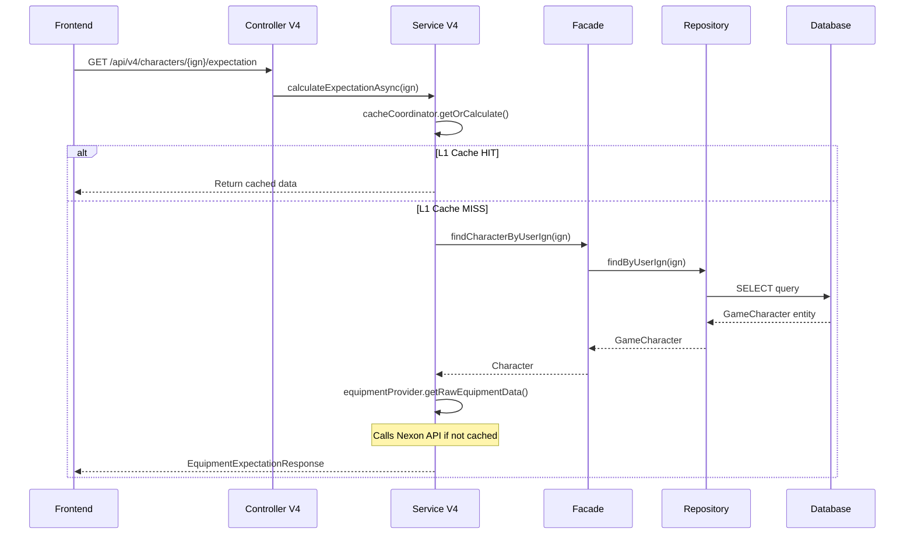

# Comprehensive Analysis Report - Discord & DB Connection Issues

**Date:** 2025-02-13
**Status:** ANALYSIS COMPLETE

---

## Issue 1: Discord Webhook Notifications Not Working ✅ RESOLVED

### Root Cause
Environment variable name mismatch between `.env.example` and `application.yml`

### Fix Applied
1. `.env.example` - Changed `DISCORD_WEBHOOK_URL` to `ALERT_DISCORD_WEBHOOK_URL`
2. Added `AlertConfigurationValidator` - Startup validation with clear error messages
3. Documentation created in `docs/05_Reports/discord-webhook-root-cause-analysis.md`

### How to Apply Fix
```bash
# Set the environment variable
export ALERT_DISCORD_WEBHOOK_URL=https://discord.com/api/webhooks/1469107054252920991/JO4aD55XHLalj2XRMGoCQdMFHFjrVZinMfq-PDpB2W5XbNEjESGQ_2gE9yywFT7VFOK_

# Or add to .env file
echo "ALERT_DISCORD_WEBHOOK_URL=https://discord.com/api/webhooks/YOUR_WEBHOOK_URL" >> .env
```

---

## Issue 2: Character Endpoint Not Working (DB Connection?)

### User Report
URL: `https://www.maple-ex.my/character/아델`
Problem: "Backend call is not working"

### Analysis

#### Endpoint Path Investigation

**V4 Backend Endpoint:**
```
GET /api/v4/characters/{userIgn}/expectation
```

**User's URL:**
```
https://www.maple-ex.my/character/아델
```

**Possible Issues:**

1. **Path Mismatch** - The frontend may be calling wrong endpoint
   - Frontend: `/character/{ign}`
   - Backend: `/api/v4/characters/{ign}/expectation`

2. **Database Connection** - Could be connectivity issues

#### V4 Expectation Flow (Traced)



#### Database Connection Configuration

From `application.yml`:
```yaml
spring:
  datasource:
    url: ${DB_URL}
    username: ${DB_USER}
    password: ${DB_PASSWORD}
    hikari:
      connection-timeout: 3000      # 3 seconds
      maximum-pool-size: 50        # prod: 50, local: 100
      minimum-idle: 50
```

### Verification Steps

To diagnose the issue:

1. **Check Backend Health:**
   ```bash
   curl http://localhost:8080/actuator/health
   ```

2. **Check Database Connectivity:**
   ```bash
   # From within the container
   docker exec -it maple-mysql mysql -u root -p
   ```

3. **Check Application Logs:**
   ```bash
   docker logs maple-app
   ```

4. **Verify Endpoint Path:**
   - Frontend should call: `/api/v4/characters/{ign}/expectation`
   - NOT: `/character/{ign}`

---

## Component Summary

### Alert System Architecture

| Component | Package | Status |
|-----------|----------|--------|
| StatelessAlertService | `maple.expectation.alert` | ✅ Fixed (env var) |
| DiscordAlertChannel | `maple.expectation.alert.channel` | ✅ Fixed (env var) |
| DiscordNotifier | `maple.expectation.monitoring.copilot` | ✅ Fixed (env var) |
| AlertConfigurationValidator | `maple.expectation.config` | ✅ New (validation) |

### Database Access Flow

| Service | Repository | Database | Cache |
|----------|------------|-----------|-------|
| GameCharacterFacade | GameCharacterRepository | MySQL → Redis (L1/L2) |
| EquipmentExpectationServiceV4 | N/A (uses Facade) | L1/L2 Cache Coordinator |
| LikeSyncService | RedisBufferRepository | Redis → MySQL (sync) |

---

## Recommended Actions

### Immediate (P0)

1. **Set Discord Webhook URL:**
   ```bash
   export ALERT_DISCORD_WEBHOOK_URL=https://discord.com/api/webhooks/...
   ```

2. **Verify Database Connection:**
   - Check `DB_URL`, `DB_USER`, `DB_PASSWORD` environment variables
   - Verify MySQL container is running: `docker ps | grep mysql`

3. **Check Application Logs:**
   ```bash
   docker logs maple-app --tail 100
   ```

### Follow-up (P1)

1. **Frontend-Backend API Contract:**
   - Verify frontend is calling correct endpoint path
   - Consider adding API gateway/proxy configuration

2. **Database Connection Pool Monitoring:**
   - Add HikariCP metrics to Grafana dashboard
   - Monitor `hikaricp.connections.active` gauge

3. **Error Logging Enhancement:**
   - Add structured logging for database connection failures
   - Include timeout and retry information

---

## Files Changed

| File | Change |
|-------|--------|
| `.env.example` | Fixed `DISCORD_WEBHOOK_URL` → `ALERT_DISCORD_WEBHOOK_URL` |
| `AlertConfigurationValidator.java` | New startup validation class |
| `discord-webhook-root-cause-analysis.md` | Root cause documentation |
| `discord-webhook-fix-summary.md` | Fix instructions |

---

## Related Documents

- [ADR-0345: Stateless Alert System](../adr/ADR-0345-stateless-alert-system.md)
- [CLAUDE.md](../CLAUDE.md)
- [Discord Webhook Root Cause Analysis](./discord-webhook-root-cause-analysis.md)
