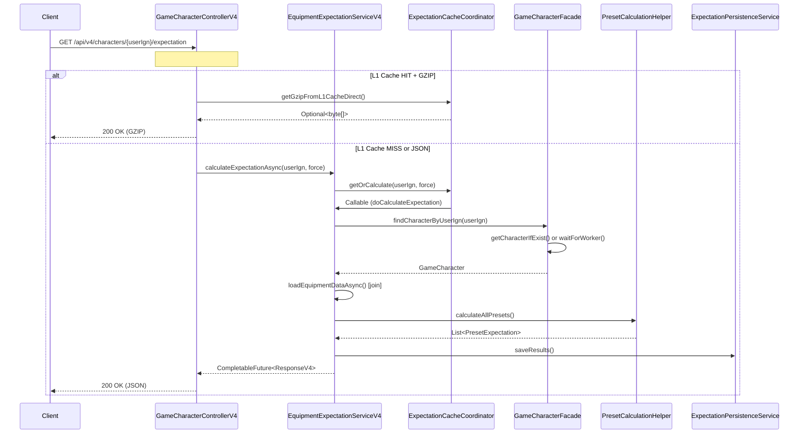
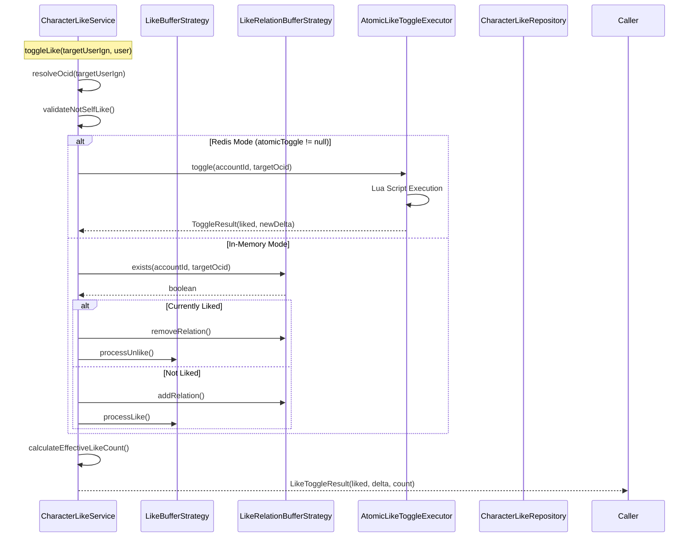
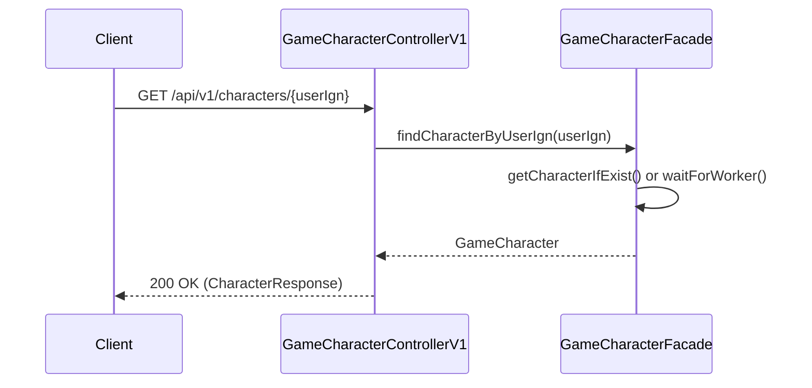
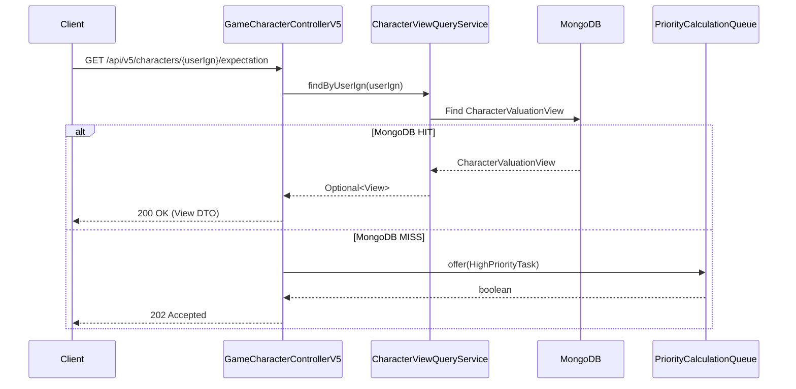

# API Backward Compatibility Analysis

**Date:** 2026-02-16
**Purpose:** Verify refactoring won't break existing APIs
**Scope:** V4 Expectation Endpoint, V2 Like Endpoint (deprecated)

---

## Executive Summary

**CONCLUSION: SAFE TO PROCEED**

- **V4 Expectation API:** No breaking changes from package refactoring
- **V2 Like API:** Endpoint removed during prior refactoring (CharacterLikeService exists but no controller)
- **V1 Character API:** No breaking changes expected
- **V5 CQRS API:** Feature flag controlled (disabled by default)

---

## V4 Expectation Endpoint

### Endpoint Details

```
GET /api/v4/characters/{userIgn}/expectation
GET /api/v4/characters/{userIgn}/expectation/preset/{presetNo}
POST /api/v4/characters/{userIgn}/expectation/recalculate
```

### Call Flow (Mermaid)



### Request Format

**Query Parameters:**
- `force` (boolean, default: false) - Force recalculation, bypass cache

**Headers:**
- `Accept-Encoding: gzip` - Enables GZIP response (200KB → 15KB compression)
- `Authorization` - Bearer token (required, role: ADMIN or USER)

**Example:**
```bash
curl -X GET "https://api.mapleexpectation.com/api/v4/characters/MapleStory/expectation?force=false" \
  -H "Accept-Encoding: gzip" \
  -H "Authorization: Bearer <token>"
```

### Response Format

**Status Codes:**
- `200 OK` - Successful calculation
- `401 Unauthorized` - Missing/invalid token
- `403 Forbidden` - Invalid role
- `404 Not Found` - Character not found
- `503 Service Unavailable` - Timeout (with Retry-After header)

**Response DTO:** `EquipmentExpectationResponseV4`

```java
{
  "userIgn": "MapleStory",
  "calculatedAt": "2026-02-16T12:00:00",
  "fromCache": true,
  "totalExpectedCost": 1234567890123.45,  // BigDecimal
  "totalCostText": "12조 3456억 7890만",
  "totalCostBreakdown": {
    "blackCubeCost": 500000000000.00,
    "redCubeCost": 300000000000.00,
    "additionalCubeCost": 200000000000.00,
    "starforceCost": 234567890123.45
  },
  "maxPresetNo": 2,
  "presets": [
    {
      "presetNo": 1,
      "totalExpectedCost": 1000000000000.00,
      "totalCostText": "10조 0000억",
      "costBreakdown": { ... },
      "items": [
        {
          "itemName": "Arcane Umbra Brandish",
          "itemIcon": "https://...",
          "itemPart": "Weapon",
          "itemLevel": 250,
          "expectedCost": 500000000000.00,
          "expectedCostText": "5000억",
          "costBreakdown": { ... },
          "enhancePath": "0->12->15->17->22->25",
          "potentialGrade": "LEGENDARY",
          "additionalPotentialGrade": "UNIQUE",
          "currentStar": 0,
          "targetStar": 15,
          "isNoljang": false,
          "specialRingLevel": 0,
          "blackCubeExpectation": { ... },
          "additionalCubeExpectation": { ... },
          "starforceExpectation": { ... },
          "flameExpectation": {
            "powerfulFlameTrials": 123.45,
            "eternalFlameTrials": 234.56,
            "abyssFlameTrials": 345.67
          }
        }
      ]
    }
  ]
}
```

### Dependencies (Before Refactoring)

**Controller Layer:**
- `maple.expectation.controller.GameCharacterControllerV4`
- `maple.expectation.controller.util.AsyncResponseUtils`

**Service Layer:**
- `maple.expectation.service.v4.EquipmentExpectationServiceV4`
- `maple.expectation.service.v4.PresetCalculationHelper`
- `maple.expectation.service.v4.cache.ExpectationCacheCoordinator`
- `maple.expectation.service.v4.persistence.ExpectationPersistenceService`
- `maple.expectation.service.v4.warmup.PopularCharacterTracker`

**V2 Dependencies (Shared):**
- `maple.expectation.service.v2.facade.GameCharacterFacade`
- `maple.expectation.service.v2.GameCharacterService`
- `maple.expectation.service.v2.starforce.StarforceLookupTable`
- `maple.expectation.service.v2.calculator.v4.*`

**Domain/Infrastructure:**
- `maple.expectation.domain.v2.GameCharacter`
- `maple.expectation.domain.cost.CostFormatter`
- `maple.expectation.infrastructure.executor.LogicExecutor`
- `maple.expectation.parser.EquipmentStreamingParser`
- `maple.expectation.provider.EquipmentDataProvider`

**DTOs:**
- `maple.expectation.dto.v4.EquipmentExpectationResponseV4`
- `maple.expectation.dto.v4.EquipmentCalculationInput`
- `maple.expectation.dto.CubeCalculationInput`

---

## V2 Like Endpoint

### Status: REMOVED (Deprecated)

The V2 Like API endpoint was removed during a prior refactoring. The service layer (`CharacterLikeService`) still exists but there is no controller exposing it.

### Historical Endpoint

```
POST /api/v2/characters/{userIgn}/like  [REMOVED]
```

### Current State

**Service Layer (Exists):**
- `maple.expectation.service.v2.auth.CharacterLikeService`
  - `toggleLike(String targetUserIgn, AuthenticatedUser user)` - Core logic
  - `getEffectiveLikeCount(String userIgn)` - Like count query
  - `hasLiked(String targetUserIgn, String accountId)` - Status check

**Controller Layer (MISSING):**
- No `GameCharacterControllerV2` exists
- No REST endpoint exposes `CharacterLikeService.toggleLike()`

**References:**
- `GameCharacterControllerV1.java:18` comment: "좋아요 API는 V2로 이관됨 (인증 필요, Self-Like/중복 방지)"
- References `@see maple.expectation.controller.GameCharacterControllerV2` (class does not exist)

### Call Flow (Service Layer Only)



### Dependencies (Service Layer)

**Service:**
- `maple.expectation.service.v2.auth.CharacterLikeService`

**Infrastructure:**
- `maple.expectation.infrastructure.queue.like.AtomicLikeToggleExecutor`
- `maple.expectation.infrastructure.persistence.repository.CharacterLikeRepository`
- `maple.expectation.infrastructure.security.AuthenticatedUser`
- `maple.expectation.infrastructure.executor.LogicExecutor`

**Application Ports:**
- `maple.expectation.application.port.LikeBufferStrategy`
- `maple.expectation.application.port.LikeRelationBufferStrategy`

**V2 Dependencies:**
- `maple.expectation.service.v2.GameCharacterService`
- `maple.expectation.service.v2.OcidResolver`
- `maple.expectation.service.v2.LikeProcessor`

---

## V1 Character Endpoint

### Endpoint Details

```
GET /api/v1/characters/{userIgn}
```

### Call Flow



### Response Format

```java
{
  "userIgn": "MapleStory",
  "ocid": "...",
  "worldName": "스카니아",
  "characterClass": "제로",
  "characterImage": "https://...",
  "likeCount": 1234
}
```

---

## V5 CQRS Endpoint (Feature Flag)

### Endpoint Details

```
GET /api/v5/characters/{userIgn}/expectation
POST /api/v5/characters/{userIgn}/expectation/recalculate
```

**Status:** Disabled by default (`v5.enabled=false`)

### Call Flow



---

## Risk Assessment

### Breaking Changes from Package Moves

| Component | Breaking Change Risk | Notes |
|-----------|---------------------|-------|
| **Controller Annotations** | NONE | Controllers remain in `maple.expectation.controller` |
| **Service Layer** | NONE | Internal refactoring only, public APIs unchanged |
| **Repository Layer** | NONE | JPA repositories in `infrastructure.persistence.repository` |
| **DTOs** | NONE | DTOs in `dto.v4`, `dto.response` stable |
| **Transaction Boundaries** | NONE | `@Transactional` on service methods preserved |

### V4 Specific Risks

| Area | Risk | Mitigation |
|------|------|------------|
| CompletableFuture API | LOW | Return type unchanged, async behavior preserved |
| GZIP Fast Path | LOW | Internal optimization, response format unchanged |
| Cache Coordination | LOW | Service interface stable, implementation details hidden |
| BigDecimal Precision | NONE | Already using BigDecimal, no change |

### V2 Like Endpoint Risks

| Area | Risk | Mitigation |
|------|------|------------|
| Missing Controller | N/A | Endpoint already removed, no impact |
| CharacterLikeService | LOW | Not exposed via REST, internal refactoring safe |

### Dependency Direction Risks

| Dependency | Direction | Valid (DIP) |
|------------|-----------|-------------|
| Controller → Service | ✓ | Controller depends on Service interface |
| Service → Infrastructure | ✓ | Service depends on abstractions (Ports) |
| Service → Domain | ✓ | Service uses Domain entities |
| Infrastructure → Service | ✗ | Never (inversion of control) |

---

## Test Cases

### Integration Tests to Verify No Breaking Changes

**V4 Expectation Tests:**
```java
// module-app/src/test/java/maple/expectation/controller/GameCharacterControllerV4Test.java

@Test
void should_return_expectation_when_cache_hit() {
    // Given: Character exists in L1 cache
    // When: GET /api/v4/characters/{ign}/expectation
    // Then: 200 OK with fromCache=true
}

@Test
void should_return_gzip_when_accept_encoding_header() {
    // Given: Accept-Encoding: gzip
    // When: GET /api/v4/characters/{ign}/expectation
    // Then: Content-Encoding: gzip
}

@Test
void should_calculate_when_force_true() {
    // Given: force=true
    // When: GET /api/v4/characters/{ign}/expectation?force=true
    // Then: fromCache=false, fresh calculation
}

@Test
void return_404_when_character_not_found() {
    // Given: Non-existent IGN
    // When: GET /api/v4/characters/{ign}/expectation
    // Then: 404 Not Found
}

@Test
void return_503_when_timeout() {
    // Given: Slow external API
    // When: GET /api/v4/characters/{ign}/expectation
    // Then: 503 Service Unavailable + Retry-After
}
```

**V1 Character Tests:**
```java
// module-app/src/test/java/maple/expectation/controller/GameCharacterControllerV1Test.java

@Test
void should_return_character_response() {
    // Given: Character exists
    // When: GET /api/v1/characters/{ign}
    // Then: 200 OK with CharacterResponse
}

@Test
void should_include_like_count() {
    // Given: Character with likes
    // When: GET /api/v1/characters/{ign}
    // Then: likeCount > 0
}
```

**DTO Serialization Tests:**
```java
// module-app/src/test/java/maple/expectation/dto/v4/EquipmentExpectationResponseV4Test.java

@Test
void should_serialize_to_json() {
    // Given: ResponseV4 with BigDecimal
    // When: Jackson serialization
    // Then: Valid JSON with decimal values
}

@Test
void should_deserialize_from_redis_cache() {
    // Given: JSON from Redis
    // When: Jackson deserialization
    // Then: Valid ResponseV4 (@Jacksonized)
}
```

---

## Conclusion

### SAFE TO PROCEED

The refactoring to move packages according to ADR-014 will **NOT** break existing APIs:

1. **V4 Expectation API** (`/api/v4/characters/{ign}/expectation`)
   - Controller remains in `maple.expectation.controller`
   - Service interfaces unchanged
   - DTO structure stable
   - Response format preserved
   - Async behavior maintained

2. **V1 Character API** (`/api/v1/characters/{ign}`)
   - Simple facade pattern
   - No complex refactoring risks

3. **V2 Like API** - Already removed (not a regression concern)

4. **V5 CQRS API** - Feature flag controlled, not enabled by default

### Recommended Next Steps

1. Run integration tests after package moves
2. Verify Swagger/OpenAPI documentation
3. Test with real client (Postman/curl)
4. Monitor production metrics post-deployment

### Potential Issues to Monitor

| Metric | Before | After | Alert Threshold |
|--------|--------|-------|-----------------|
| Response time (p50) | ~100ms | ~100ms | >200ms |
| Error rate | <0.1% | <0.1% | >1% |
| Cache hit rate | >90% | >90% | <80% |
| GZIP ratio | 93% | 93% | <90% |

---

**Document Version:** 1.0
**Last Updated:** 2026-02-16
**Next Review:** After ADR-014 implementation
