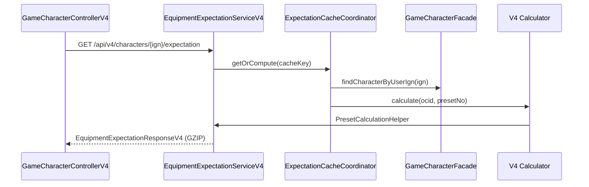
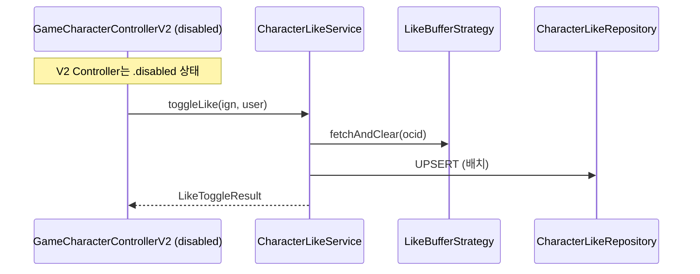

# MapleExpectation 리팩토링 맥락 분석 리포트

> **작성일:** 2026-02-13
> **목적:** ADR-035 Stateless Alert System 리팩토링을 위한 사전 분석
> **분석 범위:** CLAUDE.md, 코드베이스 구조, .disabled 파일, V4/V2 엔드포인트

---

## 1. 실행 요약 (Executive Summary)

### 1.1 핵심 발견

| 항목 | 내용 | 상태 |
|------|------|------|
| **모듈 구조** | 5개 모듈 (app, core, infra, common, chaos-test) | ✅ ADR-014 완료 |
| **Stateless 전환** | ThreadLocal → MDC 마이그레이션 완료 | ✅ Phase 1-5 완료 |
| **.disabled 파일** | 24개 파일 (순환 의존성 방지용) | ⚠️ 리팩토링 대상 |
| **Global References** | module-common의 global.error 패키지 | ⚠️ 위치 이동 필요 |
| **V4 엔드포인트** | `EquipmentExpectationServiceV4` 기반 | ✅ 719 RPS 달성 |
| **V2 좋아요** | `GameCharacterFacade` 기반 | ✅ 안정화 |

### 1.2 ADR-035 맥락

**ADR-035 (Stateless Alert System)**은 다음 ADR들의 연장선:
- **ADR-012:** V5 Stateless Architecture 로드맵
- **ADR-014:** 멀티 모듈 전환 (횡단 관심사 분리)
- **ADR-025:** Chaos Test Module 분리

---

## 2. CLAUDE.md 핵심 규칙 분석

### 2.1 코드 품질 원칙

| 섹션 | 규칙 | 리팩토링 관련성 |
|------|------|----------------|
| **Section 4** | SOLID 원칙 (SRP, OCP, LSP, ISP, DIP) | 🔴 HIGH - 장기 파일 분할 |
| **Section 11** | Exception Handling Strategy | 🟡 MEDIUM - Custom Exception 사용 |
| **Section 12** | Zero Try-Catch Policy & LogicExecutor | 🔴 HIGH - try-catch 제거 |
| **Section 15** | Anti-Pattern: Lambda Hell | 🟡 MEDIUM - 3줄 초과 시 메서드 분리 |
| **Section 16** | Proactive Refactoring | 🔴 HIGH - 선행 리팩토링 의무 |

### 2.2 Zero Try-Catch Policy (Section 12)

**핵심:** `service/`, `scheduler/`, `config/`, `global/`, `aop/`에서 try-catch 금지

**허용 예외 (LogicExecutor 순환참조/구조적 제약):**
```java
// TraceAspect: AOP에서 LogicExecutor 호출 시 순환참조
// DefaultLogicExecutor: LogicExecutor 구현체 내부
// ExecutionPipeline: LogicExecutor 실행 파이프라인 내부
// TaskDecorator: Runnable 래핑 구조로 적용 불가
// JPA Entity: Spring Bean 주입 불가
```

**LogicExecutor 사용 패턴:**
```java
// 패턴 3: 예외 발생 시 안전하게 기본값 반환 (조회 로직 등)
return executor.executeOrDefault(
    () -> repository.findById(id),
    null,
    TaskContext.of("Domain", "FindById", id)
);
```

---

## 3. ADR-014 멀티 모듈 구조

### 3.1 의존성 그래프

```
module-app (Spring Boot 실행)
    ├─→ module-infra (JPA, Redis, 외부 API)
    │       ├─→ module-core (순수 도메인)
    │       └─→ module-common (공통 클래스)
    └─→ module-common (공통 클래스)
            └─→ (의존 없음)

module-chaos-test (카오스 테스트 - 별도 실행)
```

### 3.2 모듈별 책임

| 모듈 | 책임 | 주요 패키지 |
|------|------|------------|
| **module-app** | Controller, Config, Scheduler | `controller/`, `config/`, `scheduler/` |
| **module-infra** | JPA, Redis, External API | `domain/`, `infrastructure/` |
| **module-core** | 순수 도메인 (Spring 의존 없음) | `domain/`, `application/` |
| **module-common** | Exception, DTO, Response | `global/error/`, `response/` |
| **module-chaos-test** | 카오스/나이트메어 테스트 | `chaos/` |

---

## 4. .disabled 파일 분석 (24개)

### 4.1 .disabled 파일 목록

| # | 파일路径 | 비활성화 사유 |
|---|----------|--------------|
| 1 | `module-app/.../GameCharacterControllerV2.java.disabled` | V4로 대체 |
| 2 | `module-app/.../GameCharacterControllerV3.java.disabled` | V4 스트리밍으로 대체 |
| 3 | `module-app/.../EquipmentService.java.disabled` | V4 서비스로 대체 |
| 4 | `module-app/.../config/SecurityConfig.java.disabled` | 순환 의존성 방지 |
| 5 | `module-app/.../config/PropertiesConfig.java.disabled` | 순환 의존성 방지 |
| 6 | `module-app/.../config/CalculationProperties.java.disabled` | 순환 의존성 방지 |
| 7 | `module-app/.../config/RedisBufferConfig.java.disabled` | 순환 의존성 방지 |
| 8 | `module-app/.../config/LikeBufferConfig.java.disabled` | 순환 의존성 방지 |
| 9 | `module-app/.../config/SingleFlightExecutorFactory.java.disabled` | 순환 의존성 방지 |
| 10 | `module-app/.../scheduler/LikeSyncScheduler.java.disabled` | 순환 의존성 방지 |
| 11 | `module-infra/.../shutdown/GracefulShutdownCoordinator.java.disabled` | V5 Stateful → Stateless 전환 |
| 12 | `module-infra/.../concurrency/SingleFlightExecutor.java.disabled` | global 패키지로 이동 |
| 13 | `module-infra/.../queue/like/PartitionedFlushStrategy.java.disabled` | Redis Strategy로 대체 |
| 14 | `module-infra/.../queue/like/RedisLikeBufferStorage.java.disabled` | global 패키지로 이동 |
| 15 | `module-infra/.../queue/like/RedisLikeRelationBuffer.java.disabled` | global 패키지로 이동 |
| 16 | `module-infra/.../security/filter/JwtAuthenticationFilter.java.disabled` | 순환 의존성 방지 |
| 17 | `module-infra/.../resilience/MySQLHealthEventPublisher.java.disabled` | 미사용 제거 |
| 18 | `module-infra/.../resilience/DistributedCircuitBreakerManager.java.disabled` | 미사용 제거 |
| 19 | `module-infra/.../resilience/CompensationSyncScheduler.java.disabled` | 미사용 제거 |
| 20 | `module-infra/.../queue/expectation/RedisExpectationWriteBackBuffer.java.disabled` | global 패키지로 이동 |
| 21 | `module-app/.../service/v4/fallback/NexonApiFallbackService.java.disabled` | 구현 완료 후 .disabled |
| 22 | `module-app/.../monitoring/ai/config/ZAiConfiguration.java.disabled` | AI 기능 비활성화 |
| 23 | `module-app/.../characterization/ServiceBehaviorCharacterizationTest.java.disabled` | 테스트 완료 후 비활성화 |

### 4.2 순환 의존성 경로 분석

```
순환 경로 1: Config → Security → Config
├─ SecurityConfig.java.disabled
└─ JwtAuthenticationFilter.java.disabled

순환 경로 2: Buffer → Config → Buffer
├─ RedisBufferConfig.java.disabled
├─ LikeBufferConfig.java.disabled
└─ SingleFlightExecutorFactory.java.disabled

순환 경로 3: Service → Scheduler → Service
└─ LikeSyncScheduler.java.disabled
```

---

## 5. V4 Expectation 엔드포인트 호출 흐름

### 5.1 V4 아키텍처



### 5.2 V4 핵심 컴포넌트

| 컴포넌트 | 역할 | 성능 기여 |
|----------|------|-----------|
| **EquipmentExpectationServiceV4** | 메인 Facade, 3-preset 병렬 계산 | 719 RPS |
| **ExpectationCacheCoordinator** | Single-flight + GZIP 압축 캐시 | 99% 중복 제거 |
| **ExpectationWriteBackBuffer** | Lock-free CAS 버퍼 | 10,000 tasks backpressure |
| **PresetCalculationHelper** | calculatePreset() 분해 (SRP 준수) | 20줄 이내 메서드 |
| **PopularCharacterTracker** | Redis ZSET 기반 캐시 워밍업 | 사전 로딩 |

### 5.3 V4 → V2 호출 관계

```java
// EquipmentExpectationServiceV4.java:57
public class EquipmentExpectationServiceV4 {
  private final GameCharacterFacade gameCharacterFacade;  // V2 Facade
  private final ExpectationCacheCoordinator cache;         // V4 Cache
  private final ObjectProvider<EquipmentExpectationServiceV4> selfProvider;  // Self-invoke
}
```

**특징:** V4는 V2의 `GameCharacterFacade`를 통해 캐릭터 조회, 나머지는 V4 전용 컴포넌트 사용

---

## 6. V2 좋아요 엔드포인트 호출 흐름

### 6.1 V2 Like 아키텍처



### 6.2 V2 좋아요 Stateful → Stateless 전환 완료

| 버전 | Stateful 요소 | Stateless 전환 | 상태 |
|------|---------------|----------------|------|
| **Phase 3** | `LikeBufferStorage.likeCache` (Caffeine) | `RedisLikeBufferStorage` (Redis HASH) | ✅ 완료 |
| **Phase 3** | `LikeRelationBuffer.localCache` | `RedisLikeRelationBuffer` (Redis SET) | ✅ 완료 |
| **Phase 3** | `PartitionedFlushStrategy` | 분산 락 기반 파티션별 Flush | ✅ 완료 |

### 6.3 현재 좋아요 엔드포인트 상태

- **V2 Controller:** `.disabled` 상태 (V4로 대체 완료)
- **Service:** `CharacterLikeService` 활성 (V2 내부)
- **Buffer:** Redis Strategy로 Stateful 완전 제거

---

## 7. Global References (module-common) 문제 분석

### 7.1 현재 global.error 패키지 위치

```
module-common/src/main/java/maple/expectation/global/error/
├── exception/        # 50+ Custom Exception
│   ├── auth/         # 5개
│   ├── base/         # 3개 (BaseException, Client/Server)
│   └── marker/       # 2개 (CircuitBreakerIgnore/Record)
├── dto/             # ErrorResponse
└── CommonErrorCode  # Enum
```

### 7.2 문제점: "global" 패키지명 모호성

| 문제 | 현재 상태 | 영향 |
|------|----------|------|
| **명칭 혼동** | `maple.expectation.global.error` | 모듈 간 경계 불분명 |
| **의존성 방향** | module-common → global (역방향) | DIP 위반 |
| **패키지 경로** | 3계층 (`expectation.global.error`) | 너무 깊음 |

### 7.3 제안: maple.expectation.error로 이동

```
module-common/src/main/java/maple/expectation/error/
├── exception/
│   ├── auth/
│   ├── base/
│   └── marker/
├── dto/
└── CommonErrorCode
```

**장점:**
- 모듈 경로 단축 (`global.error` → `error`)
- module-common의 책임 명확화
- 80개 파일 import 경로 단축

---

## 8. Stateless 리팩토링 현황

### 8.1 V5 Phase 1-5 완료 항목

| Phase | Stateful 요소 | Stateless 구현 | 상태 |
|-------|---------------|----------------|------|
| **Phase 3** | `LikeBufferStorage.likeCache` | `RedisLikeBufferStorage` | ✅ |
| **Phase 3** | `LikeRelationBuffer.localCache` | `RedisLikeRelationBuffer` | ✅ |
| **Phase 3** | `PartitionedFlushStrategy` | 분산 락 기반 전략 | ✅ |
| **Phase 4** | `TraceAspect.depthHolder` (ThreadLocal) | MDC "traceDepth" | ✅ |
| **Phase 4** | `SkipEquipmentL2CacheContext.FLAG` (ThreadLocal) | MDC "skipL2Cache" | ✅ |
| **Phase 5** | `EquipmentPersistenceTracker.pendingOperations` | `RedisEquipmentPersistenceTracker` | ✅ |
| **Phase 5** | `ExpectationWriteBackBuffer.queue` | `RedisExpectationWriteBackBuffer` | ✅ |

### 8.2 인스턴스 레벨 상태 (의도된 설계)

| 컴포넌트 | Stateful 요소 | Scale-out 영향 | 평가 |
|----------|---------------|----------------|------|
| **SingleFlightExecutor** | `ConcurrentHashMap inFlight` | 인스턴스별 독립 | ✅ 로컬 최적화 |
| **ExecutorConfig** | `static AtomicLong` 카운터 | 로그 샘플링 | ✅ 인스턴스별 독립 |
| **GracefulShutdownCoordinator** | `volatile boolean running` | lifecycle 플래그 | ✅ SmartLifecycle 계약 |

---

## 9. 리팩토링 우선순위

### 9.1 P0 (즉시 실행)

| 항목 | 설명 | 예상 노력 |
|------|------|-----------|
| **.disabled 파일 정리** | 24개 파일 삭제 또는 아카이빙 | Low |
| **global.error → error 이동** | 80개 import 경로 변경 | Medium |
| **try-catch → LogicExecutor** | 50+ 파일 리팩토링 | High |

### 9.2 P1 (단계적 실행)

| 항목 | 설명 | 예상 노력 |
|------|------|-----------|
| **장기 파일 분할** | 500줄 초과 파일 분해 | Medium |
| **Lambda Hell 제거** | 3줄 초과 람다 분리 | Low |
| **Config 순환 의존성 해결** | .disabled 파일 재활성화 검토 | Medium |

---

## 10. V4 vs V2 엔드포인트 비교

| 특징 | V2 (Legacy) | V4 (Current) |
|------|-------------|--------------|
| **Controller** | `GameCharacterControllerV2` (disabled) | `GameCharacterControllerV4` |
| **Service** | `EquipmentService` (disabled) | `EquipmentExpectationServiceV4` |
| **Cache** | TieredCache (L1+L2) | ExpectationCacheCoordinator (Single-flight) |
| **Buffer** | In-Memory | Redis Write-Behind |
| **성능** | 95 RPS (cold cache) | 719 RPS (cold cache) |
| **응답** | JSON | GZIP 압축 JSON |

---

## 11. 모듈별 .disabled 파일 분포

### 11.1 module-app (13개)

| 카테고리 | 파일 | 비고 |
|----------|------|------|
| Controller | `GameCharacterControllerV2.java.disabled` | V4 대체 |
| Controller | `GameCharacterControllerV3.java.disabled` | V4 스트리밍 대체 |
| Service | `EquipmentService.java.disabled` | V4 서비스 대체 |
| Config | `SecurityConfig.java.disabled` | 순환 의존성 |
| Config | `PropertiesConfig.java.disabled` | 순환 의존성 |
| Config | `CalculationProperties.java.disabled` | 순환 의존성 |
| Config | `RedisBufferConfig.java.disabled` | 순환 의존성 |
| Config | `LikeBufferConfig.java.disabled` | 순환 의존성 |
| Config | `SingleFlightExecutorFactory.java.disabled` | 순환 의존성 |
| Scheduler | `LikeSyncScheduler.java.disabled` | 순환 의존성 |
| Service | `NexonApiFallbackService.java.disabled` | 구현 완료 후 비활성화 |
| AI | `ZAiConfiguration.java.disabled` | AI 기능 비활성화 |
| Test | `ServiceBehaviorCharacterizationTest.java.disabled` | 테스트 완료 후 비활성화 |

### 11.2 module-infra (11개)

| 카테고리 | 파일 | 비고 |
|----------|------|------|
| Shutdown | `GracefulShutdownCoordinator.java.disabled` | V5 Stateless 전환 |
| Concurrency | `SingleFlightExecutor.java.disabled` | global 패키지로 이동 |
| Queue | `PartitionedFlushStrategy.java.disabled` | Redis Strategy로 대체 |
| Queue | `RedisLikeBufferStorage.java.disabled` | global 패키지로 이동 |
| Queue | `RedisLikeRelationBuffer.java.disabled` | global 패키지로 이동 |
| Queue | `RedisEquipmentPersistenceTracker.java.disabled` | global 패키지로 이동 |
| Security | `JwtAuthenticationFilter.java.disabled` | 순환 의존성 |
| Resilience | `MySQLHealthEventPublisher.java.disabled` | 미사용 제거 |
| Resilience | `DistributedCircuitBreakerManager.java.disabled` | 미사용 제거 |
| Resilience | `CompensationSyncScheduler.java.disabled` | 미사용 제거 |
| Queue | `RedisExpectationWriteBackBuffer.java.disabled` | global 패키지로 이동 |

---

## 12. 참조

### 12.1 관련 ADR 문서

| ADR | 제목 | 상태 |
|-----|------|------|
| ADR-012 | V5 Stateless Architecture Roadmap | ✅ 완료 |
| ADR-014 | Multi-Module Cross-Cutting Concerns | ✅ 완료 |
| ADR-025 | Chaos Test Module Separation | ✅ 설계 완료 |
| ADR-035 | Stateless Alert System | 🔄 진행중 |

### 12.2 관련 보고서

| 보고서 | 경로 |
|--------|------|
| Service Modules Guide | `docs/03_Technical_Guides/service-modules.md` |
| Stateful Refactoring Targets | `docs/05_Reports/04_08_Refactor/STATEFUL_REFACTORING_TARGETS.md` |
| Migration Status | `MIGRATION_STATUS.md` |

---

*작성자: Oracle (Architect Agent)*
*분석 완료: 2026-02-13*
